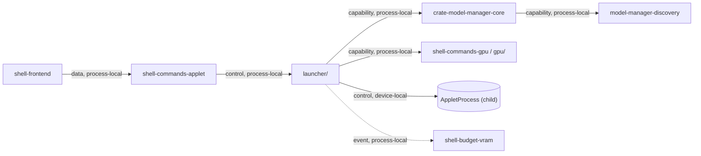
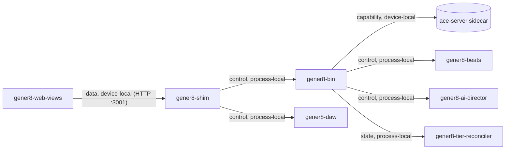
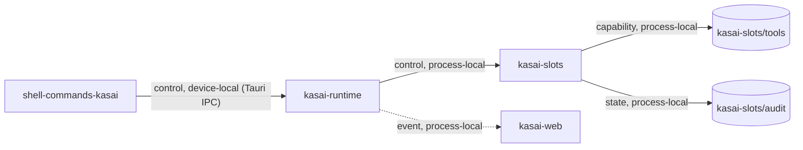
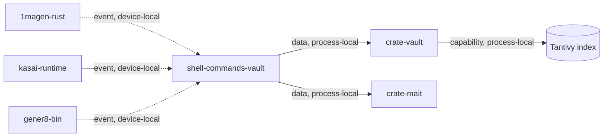

# Everywear: Module Architecture Pass v1.0

**Date:** 2026-05-21 SGT
**Author:** Claude (Consigliere) for Sean Uddin / Somo Kasane
**Status:** ACTIVE GATE — execute migration-touch modularisation before further S3 applet migration
**Scope:** Whole repo (Rust + TS + CSS + docs)
**Protocol:** `context-protocol.skill` (65k-token module-unit budget; 60k working target)
**Source of truth:** disk state as of 2026-05-21 06:00 SGT
**Supersedes:** nothing; complements `OODA_AUDIT_2026-05-19.md`, `WIKI.md`, `MIGRATION_ARCHITECTURE.md`

---

## 0. Why This Document Exists

Everywear has reached the size where a single agent (especially a local Kasai model with a constrained KV-cache) can no longer load a working unit in full, reason about it, and edit atomically. Five files are over the hard 16k-token code ceiling. Several more are in the warning band. The wiki itself is over budget. The result is the exact failure mode the context-protocol skill exists to prevent: agents working on fragments, hallucinating signatures, drifting from docs.

This document maps the repo into self-contained module units that each fit the 60k-token budget when loaded with their wiki section, adjacent interfaces, tests, and reasonable conversation overhead. Where a file exceeds budget, this document proposes the split. Where a directory is already at the right grain, it is left alone.

Nothing in this document changes runtime behaviour. The proposed scaffold edits are purely structural: extract files, add `mod.rs` / `index.ts` re-exports so the existing call sites compile unchanged.

### 0.1 Current Directive 2026-05-22 — Modularisation Gate Before Further Migration

Further S3 Studio / Gener8 / Studio Pro applet migration is blocked on a
targeted modularisation gate. Do not migrate new S3 web surfaces into Everywear
by copying large files first. Any agent continuing migration work must:

1. Split the current migration-touch hard failures first:
   - `applets/gener8/web/src/components/VideoGeneratorModal.tsx`
   - `applets/vid/web/src/components/VideoGeneratorModal.tsx`
   - `platform/everywear-os/src-tauri/src/lib.rs`
   - `applets/gener8/src-tauri/src/shim.rs`
2. Hoist shared Gener8/Vid/S3 web code into workspace packages before adding
   more S3-derived features:
   - `packages/video-modal/` for modal, render worker, render types, shared video UI
   - `packages/visualizer/` for visualizer primitives
   - `packages/lyrics/` or `packages/shared/` for lyrics utilities and shared event/types
3. Keep the rest of the repo moving opportunistically. Files below the hard
   16k-token code ceiling do not block migration unless the next migration step
   touches them.
4. Every migrated surface must update or create its `docs/wiki/...` Module
   Contract page in the same pass.

The working rule is **modularise the migration path now, then continue
migration**. Do not freeze the whole repo for a grand cleanup, but do not add
more S3 applet behaviour on top of known oversized files.

---

## 1. Budget Contract Recap

Per `skills/context-protocol/SKILL.md`:

| Slot              | Budget    |
|-------------------|-----------|
| System prompt     | ~4k       |
| Wiki section      | ~2k       |
| Pipe interfaces   | ~3k       |
| **Code**          | **~16k**  |
| Tests             | ~6k       |
| Conversation      | ~34k      |
| **Total**         | **~65k**  |

Token estimates in this document use:
- **Code (Rust/TS/JS):** `tokens ≈ bytes / 3`
- **CSS:** `tokens ≈ bytes / 4`
- **Markdown prose:** `tokens ≈ bytes / 4`

These are conservative ceilings; real tokenisers come in slightly lower.

---

## 2. Ledger Summary

### 2.1 Files over the 16k-token CODE ceiling

| File | Bytes | Lines | Tokens | Severity |
|------|-------|-------|--------|----------|
| `applets/gener8/web/src/components/VideoGeneratorModal.tsx` | 203,881 | 4,410 | ~67,960 | 4.2× over |
| `applets/vid/web/src/components/VideoGeneratorModal.tsx` | 201,772 | 4,364 | ~67,257 | 4.2× over (duplicate, drifts at byte 756) |
| `platform/everywear-os/src-tauri/src/lib.rs` | 83,964 | 2,312 | ~27,988 | 1.75× over |
| `applets/gener8/src-tauri/src/shim.rs` | 61,192 | 1,768 | ~20,397 | 1.27× over |

### 2.2 Files over the 16k-token DOC ceiling

| File | Bytes | Lines | Tokens |
|------|-------|-------|--------|
| `WIKI.md` | 113,998 | 2,734 | ~28,499 |

### 2.3 Files in the 8k-16k warning band (split before they grow further)

| File | Tokens | Notes |
|------|--------|-------|
| `MIGRATION_ARCHITECTURE.md` | ~15,407 | historical doc; move to `docs/migration/` |
| `applets/{gener8,vid}/web/src/workers/videoRenderWorker.ts` | ~14,007 each | duplicate; de-duplicate to shared package |
| `platform/everywear-os/src/shell/ShellLayout.tsx` | ~12,170 | window chrome + applet router in one file |
| `platform/everywear-os/src/styles/shell.css` | ~11,879 | 25+ sectioned blocks; split per concern |
| `crates/model-manager/src/local_discovery.rs` | ~11,484 | scan + gguf parser + safetensors parser fused |
| `applets/kasai/src-tauri/src/slot_manager.rs` | ~11,235 | SlotManager + 5 ToolExecutor impls + audit fused |
| `platform/everywear-os/src-tauri/src/launcher.rs` | ~10,810 | 7 well-marked sections, ripe for split |
| `platform/everywear-os/src-tauri/src/gpu.rs` | ~8,715 | 3-tier detection (CUDA/Vulkan/CPU) in one file |
| `crates/vault/src/index.rs` | ~8,453 | Tantivy index; borderline, leave for now |

### 2.4 Workspace totals (verified by disk scan, not wiki claim)

| Layer                       | Files | Tokens (est) |
|----------------------------|-------|--------------|
| Rust shell backend         | 22    | ~120,000     |
| Rust applet backends       | 49    | ~196,000     |
| Rust shared crates         | 26    | ~119,000     |
| TS/TSX (all frontends + pkgs) | 70 | ~330,000     |
| CSS                        | 16    | ~36,000      |
| Markdown (root docs only)  | 9     | ~73,000      |
| **Total source**           | ~192  | ~874,000     |

At 60k tokens per module unit, that is **14-16 viable module units** for the whole codebase, which is the target for a Steam-OS-scale platform.

---

## 3. Module Unit Map

A **module unit** is what a single agent loads simultaneously to do work on one concern. Each row below is a self-contained unit fitting the budget. Wiki section column refers to the proposed per-module wiki page under `docs/wiki/` (see §5).

### 3.1 Platform Shell — `platform/everywear-os/`

| Unit | Members | Code tok | Wiki page |
|------|---------|----------|-----------|
| **shell-core** | `lib.rs` (slim, post-split), `setup.rs`, `manifest_parser.rs`, `applet_resolver.rs` | ~12k | `wiki/shell/core.md` |
| **shell-commands-system** | `commands/system.rs`, `commands/crash.rs` (NEW) | ~3k | `wiki/shell/commands-system.md` |
| **shell-commands-gpu** | `commands/gpu.rs` (NEW), `gpu/` directory | ~12k | `wiki/shell/gpu.md` |
| **shell-commands-profile-wallet** | `commands/profile.rs`, `commands/wallet.rs`, `profile.rs`, `wallet.rs` | ~6k | `wiki/shell/profile.md` |
| **shell-commands-discourse** | `commands/discourse.rs` (NEW), `discourse.rs` | ~8k | `wiki/shell/discourse.md` |
| **shell-commands-kasai** | `commands/kasai.rs` (NEW) | ~5k | `wiki/shell/kasai-bridge.md` |
| **shell-commands-applet** | `commands/applet.rs` (NEW), `launcher/` directory, `registry.rs`, `engine_router.rs`, `engine_registry.rs` | ~14k | `wiki/shell/applet-launch.md` |
| **shell-commands-vault** | `vault_commands.rs`, `mait_bridge.rs` | ~8k | `wiki/shell/vault.md` |
| **shell-commands-model** | `model_commands.rs`, `assessment.rs` | ~6k | `wiki/shell/model.md` |
| **shell-budget-vram** | `budget.rs`, `vram_scheduler.rs`, `video_encoder.rs`, `migration.rs`, `auth.rs` | ~15k | `wiki/shell/vram-budget.md` |
| **shell-frontend** | `src/main.tsx`, `src/shell/` (post-split ShellLayout), `src/lib/transport.ts`, `src/styles/shell/` (post-split CSS) | ~15k | `wiki/shell/frontend.md` |
| **shell-frontend-panels** | `src/panels/*.tsx`, `src/components/*.tsx` | ~14k | `wiki/shell/panels.md` |

### 3.2 Applet: Gener8 — `applets/gener8/`

| Unit | Members | Code tok | Wiki page |
|------|---------|----------|-----------|
| **gener8-bin** | `main.rs`, `ipc_handler.rs`, `engine_client.rs`, `ace_server.rs`, `settings.rs`, `storage.rs` | ~15k | `wiki/gener8/binary.md` |
| **gener8-shim** | `shim/` directory (post-split) | ~14k* | `wiki/gener8/shim.md` |
| **gener8-daw** | `daw_engine/` | ~15k | `wiki/gener8/daw.md` |
| **gener8-ai-director** | `ai_director/` | ~7k | `wiki/gener8/director.md` |
| **gener8-beats** | `beats/` | ~6k | `wiki/gener8/beats.md` |
| **gener8-tier-reconciler** | `tier_reconciler/`, `whisper_align.rs`, `video_encoder.rs`, `library.rs` | ~13k | `wiki/gener8/tier.md` |
| **gener8-web-views** | `web/src/views/`, `web/src/context/`, `web/src/types.ts`, `web/src/lib/lrcParser.ts` | ~16k | `wiki/gener8/web-views.md` |
| **gener8-web-modal** | imports from shared `packages/video-modal/` (new) | ~3k | `wiki/gener8/modal.md` |

\* shim post-split: each route group fits ~3k tok.

### 3.3 Applet: Vid — `applets/vid/`

| Unit | Members | Code tok | Wiki page |
|------|---------|----------|-----------|
| **vid-web** | `web/src/views/`, `web/src/context/`, `web/src/lib/`, types | ~10k | `wiki/vid/web.md` |
| **vid-web-modal** | imports from shared `packages/video-modal/` | ~3k | `wiki/vid/modal.md` |

### 3.4 Applet: Kasai — `applets/kasai/`

| Unit | Members | Code tok | Wiki page |
|------|---------|----------|-----------|
| **kasai-runtime** | `runtime.rs`, `runtime_ipc.rs`, `inference.rs`, `audit.rs`, `types.rs` | ~13k | `wiki/kasai/runtime.md` |
| **kasai-slots** | `slot_manager/` (post-split) | ~12k | `wiki/kasai/slots.md` |
| **kasai-web** | `src/shell/`, `src/lib/`, `src/styles/kasai.css` | ~16k | `wiki/kasai/web.md` |

### 3.5 Applet: 1magen — `applets/1magen/`

| Unit | Members | Code tok |
|------|---------|----------|
| **1magen-rust** | all `src-tauri/src/*.rs` | ~12k |
| **1magen-web** | all `src/**/*.{ts,tsx,css}` | ~13k |

### 3.6 Applet: 3nvizen — `applets/3nvizen/`

| Unit | Members | Code tok |
|------|---------|----------|
| **3nvizen-rust** | `src-tauri/src/*.rs` (+ sidecar scripts not loaded into agent) | ~8k |
| **3nvizen-web** | `src/**/*.{ts,tsx,css}` | ~13k |

### 3.7 Shared Rust Crates — `crates/`

| Unit | Code tok | Notes |
|------|----------|-------|
| **crate-everywear-paths** | ~1.6k | tiny |
| **crate-applet-ipc** | ~10k | shell.rs + protocol.rs + envelope.rs + applet.rs |
| **crate-beats-engine** | ~7k | engine + cache |
| **crate-video-encoder** | ~2.5k | sidecar manager |
| **crate-data-migration** | ~7k | single file; borderline, leave |
| **crate-model-manager-core** | ~28k → split into 2 units below | |
| ↳ model-manager-core | ~17k | manifest, requirements, vram, download, resolution, lib, discovery |
| ↳ model-manager-discovery | ~11k → split into 4 files inside | local_discovery + gguf + safetensors + compat |
| **crate-vault** | ~16k | index, schema |
| **crate-mait** | ~5k | manifest, shard |

### 3.8 Shared TS Packages — `packages/`

| Unit | Code tok |
|------|----------|
| **pkg-ewds** | ~13k (TSX + CSS + tokens) |
| **pkg-transport** | ~5k |
| **pkg-shared** | ~4k |
| **pkg-video-modal** (NEW) | ~14k after de-dup + split of VideoGeneratorModal |

### 3.9 Engines & Marketing

Out of agent scope: native binary build instructions live under `engines/`; marketing assets under `marketing/`. No source-level module units.

---

## 4. Required Splits — File-by-File Plan

### 4.1 `platform/everywear-os/src-tauri/src/lib.rs` (28k → ≤16k)

**Current:** one file holds 44 `#[tauri::command]` handlers, AppState definition, panic-crash plumbing, mod tree, and `run()` entry. Loading any single command forces an agent to swallow the whole file.

**Proposed split:**

```
src/
  lib.rs                      ~3k  ── mod tree, run(), state init, command registration
  state.rs                    NEW  ~2k  ── AppState struct, Kasai* types, ChatStatus, SystemInfoReport
  crash.rs                    NEW  ~1.5k  ── pending_crash_report_path, install_panic_crash_report_hook, take_pending_crash_report cmd
  commands/
    mod.rs                    NEW  ~0.3k  ── re-export modules
    system.rs                 NEW  ~1k   ── get_system_info
    gpu.rs                    NEW  ~2k   ── get_gpu_status, poll_vram, get_compute_backend, get_vram_tier, list_model_assessments
    profile.rs                NEW  ~1k   ── get_profile, update_profile, set/get_preference
    wallet.rs                 NEW  ~1k   ── wallet_generate/info/transactions/disconnect
    discourse.rs              NEW  ~3k   ── discourse_oauth_url, complete_oauth, user, latest, get_topics, read_post, create_post, refresh, disconnect, notifications
    kasai.rs                  NEW  ~3k   ── kasai_* commands (chat, slot status, big/small)
    applet.rs                 NEW  ~5k   ── launch/purge/route_engine_job/applet_event etc.
    setup.rs                  NEW  ~1k   ── first_run setup cmd
```

**Behaviour preservation:** `lib.rs` re-exports all commands so the existing `tauri::generate_handler!` invocation lists each command by its short name unchanged. AppState moves to `state.rs`; all `tauri::State<'_, AppState>` types resolve identically.

**Acceptance:** `cargo check -p everywear-os` passes with zero new errors; the Tauri command surface (43 commands) is unchanged from the frontend's view.

### 4.2 `applets/gener8/src-tauri/src/shim.rs` (20k → ≤16k)

**Current:** Axum HTTP shim with 50+ route handlers in one file, plus `ShimState`, `boot()`, VRAM polling, and several small DTOs.

**Proposed split:**

```
src/
  shim/
    mod.rs                    ~3k  ── ShimState, boot(), library_path, playlists_path, router assembly
    vram.rs                   ~2k  ── VramSample, VramCache, read_nvidia_vram, vram_status route
    engine.rs                 ~2k  ── health, engine_props, engine_models, model_defaults, engine_stats
    inference.rs              ~2k  ── init_model, unload_models, reload_models, generate, generate_status, generate_history
    audio.rs                  ~2k  ── upload_audio, format_lyrics, analyze_audio, sanitize_upload_stem
    library.rs                ~2k  ── list_songs, create_song, get/update/delete_song, serve_audio
    playlists.rs              ~1k  ── list/create/get/update/delete_playlist
    daw.rs                    ~3k  ── daw_init/destroy/play/pause/stop/seek/loop/tempo/metronome/position + all *Request DTOs
    director.rs               ~1k  ── director_analyze/plan/lm_load/lm_unload/lm_status
    video.rs                  ~2k  ── save_video, list_videos, serve_video, export_srt, list_stems
    settings.rs               ~0.5k ── read/write_settings
    shell.rs                  ~1k  ── shell_open, shell_reveal, launcher_reveal_in_folder, tier_gated_studio
```

**Behaviour preservation:** All routes wire into the same Axum `Router` inside `shim/mod.rs::boot()`. Route paths and handler bodies unchanged.

**Acceptance:** `cargo check -p gener8` passes; running the shim on `:3001` answers the same set of routes with identical responses.

### 4.3 `applets/{gener8,vid}/web/src/components/VideoGeneratorModal.tsx` (2 × 68k → shared 14k unit)

**Current:** two near-identical 4400-line components (drift at byte 756, likely small toast-signature differences). Each file is 4× over the code budget. Every change to the modal has to be made twice.

**Proposed plan — two phases:**

**Phase A: split per applet, in-place.** Both modal files get the same internal split, so a later move to a shared package is a straight `mv`.

```
web/src/components/VideoGeneratorModal/
  index.tsx                   ~4k   ── default export, props, hooks composition only
  types.ts                    ~2k   ── all interfaces (VisualizerConfig, EffectConfig, TextLayer, PexelsPhoto/Video, etc.)
  presets.ts                  ~2k   ── PresetType, preset configurations
  hooks/
    useVisualizerState.ts     ~3k   ── visualizer + effects + intensity state
    useTextLayers.ts          ~2k   ── text layer add/remove/edit
    usePexelsBrowser.ts       ~3k   ── photo/video search, pagination
    useRenderPipeline.ts      ~4k   ── connects to videoRenderWorker, progress, export
    useAudioInput.ts          ~2k   ── upload + URL audio sourcing
  components/
    Wordmark.tsx              ~1k   ── DJWordmark, ColumnsIcon
    VisualizerControls.tsx    ~6k
    EffectsPanel.tsx          ~5k
    TextLayerEditor.tsx       ~4k
    PexelsBrowser.tsx         ~5k
    AudioInputPanel.tsx       ~3k
    RenderControls.tsx        ~4k
    PreviewCanvas.tsx         ~4k
```

**Phase B (post-Phase-A, deferred unless Sean greenlights):** lift the whole `VideoGeneratorModal/` directory into a new `packages/video-modal/` workspace package consumed by both applets. The diff between the two files (~250 lines at most based on file sizes) folds into the package, with applet-specific bits exposed via props.

**Decision needed (flagged in §7):** Phase B is a real product call (one source of truth vs. divergence between Vid and Gener8). The scaffold pass executes Phase A only and parks Phase B for Sean.

**Acceptance:** `npm run build --workspace applets/{gener8,vid}/web` still passes; visual QA at `localhost:5173/?preview=1` shows identical render.

### 4.4 `applets/kasai/src-tauri/src/slot_manager.rs` (11k → ≤7k per file)

**Proposed split:**

```
src/
  slot_manager/
    mod.rs                    ~5k  ── ModelSpec, SwapMode, SlotEvent, Slot enum, SlotManager (the orchestrator)
    tools.rs                  ~4k  ── ToolExecutor trait, NoOpToolExecutor, ShellCallTool, FileSystemTool, WebFetchTool, KasaiToolExecutor
    audit.rs                  ~2k  ── TurnOutcome, SmallToolLog, ToolInvocation, tool_audit_from_big, unix_ms
```

**Acceptance:** `cargo check -p kasai-applet` passes; Kasai backend behaviour unchanged.

### 4.5 `platform/everywear-os/src-tauri/src/launcher.rs` (10.8k → 4 files ≤4k each)

**Proposed split (existing section banners are the seams):**

```
src/
  launcher/
    mod.rs                    ~2k  ── re-exports, ModelPaths, AppletProcess, launch_applet_process
    payloads.rs               ~1k  ── SwitchConfirmPayload, ModelDownloadInfo, SwitchProgressPayload, SwitchStage
    requirements.rs           ~1k  ── check_requirements
    purge.rs                  ~2k  ── execute_purge
    manifest.rs               ~1.5k── manifest_info_from_groups
    upgrade_packs.rs          ~2k  ── provision_upgrade_packs
    provision.rs              ~3k  ── provision_models, provision_sidecar, ACE binary discovery, symlinks, ace_silence_stub
    paths.rs                  ~1k  ── resolve_model_paths, resolve_ipc_model_paths, model_role_for_ipc, expand_path
    allocations.rs            ~0.5k── record_allocations, resolve_binary_path
```

**Acceptance:** all current call sites in `lib.rs`/`commands/applet.rs` import unchanged via `launcher::launch_applet_process` etc.

### 4.6 `crates/model-manager/src/local_discovery.rs` (11.5k → 4 files)

**Proposed split:**

```
src/
  local_discovery/
    mod.rs                    ~5k  ── DiscoveredModel, ModelSourceTool, ModelFormat, Compatibility, LocalModelScanner, default_scan_targets, push_target, dirs_home, scan_dir_inner, matches_patterns, looks_like_gguf, discovered_from_path
    gguf.rs                   ~3k  ── read_gguf_metadata_impl, MetadataValue, metadata_u64, read_metadata_value, skip_array, skip, read_u8/16/32/64, read_string, gguf_file_type_label
    safetensors.rs            ~1k  ── read_safetensors_metadata_impl, infer_safetensors_architecture
    compatibility.rs          ~3k  ── check_gguf_compatibility, check_tensor_model_compatibility, architecture_matches, normalize_arch, infer_architecture_from_name, infer_quant_from_name, bytes_to_gb, filename_pattern_matches
```

**Acceptance:** `cargo check -p model-manager` passes; existing imports `use model_manager::local_discovery::*` resolve unchanged.

### 4.7 `platform/everywear-os/src-tauri/src/gpu.rs` (8.7k → 3 files ≤4k each)

Borderline today, but the 3-tier detection (CUDA / Vulkan / CPU) is a textbook capability-pipe pattern and should split before more probes are added.

```
src/
  gpu/
    mod.rs                    ~3k  ── SystemGpuState, VramTier, ComputeBackend, detect() orchestration, poll_vram()
    cuda.rs                   ~3k  ── NVML init, cuBLAS discovery, compute capability matrix, CUDA toolkit detection
    vulkan.rs                 ~1k  ── vulkaninfo CLI parsing
    cpu.rs                    ~1k  ── OpenBLAS detection, system RAM probe
```

**Acceptance:** `cargo check -p everywear-os` passes; `get_gpu_status` returns the same `SystemGpuState` shape.

### 4.8 `platform/everywear-os/src/shell/ShellLayout.tsx` (12k → 4 files ≤4k each)

**Proposed split (visual concerns into siblings, keep state hooks colocated):**

```
src/shell/
  ShellLayout.tsx             ~4k   ── top-level layout, theme wiring, AuthGate composition
  WindowManager.tsx           ~4k   ── window mount/unmount, focus, minimize/maximize/close, traffic lights
  DesktopCanvas.tsx           ~3k   ── desktop background per theme, center inference HUD, clock
  Taskbar.tsx                 ~3k   ── theme chips, profile mini, bell, clock, taskbar slots
  hooks/
    useWindowManager.ts       ~2k   ── existing or extracted from ShellLayout
    useInferenceHUD.ts        ~1.5k ── HUD state derivation
```

**Acceptance:** Vite build passes; visual QA at `localhost:5173/?preview=1` unchanged across all four themes.

### 4.9 `platform/everywear-os/src/styles/shell.css` (12k → 12 files ≤1.5k each)

Already cleanly sectioned with `═══` banner comments. Lift each section into its own file under `src/styles/shell/`, and `shell.css` becomes one-line `@import` aggregator.

```
src/styles/shell/
  custom-titlebar.css
  traffic-lights.css
  icon-grid.css
  desktop-canvas.css
  vault-sections.css
  taskbar.css
  led-status.css
  skin-switcher.css
  taskbar-profile.css
  notification-bell.css
  clock.css
  tauri-applet-banner.css
  profile-panel.css
  section-card.css
  buttons.css
  gpu-status.css
  backend-badges.css
  settings.css
  auth-gate.css
  headless-applet-view.css
  applet-view-router.css
src/styles/shell.css              ── thin aggregator: @import "./shell/*.css"
```

**Acceptance:** Same DOM, identical rendering under all four themes.

### 4.10 `WIKI.md` (28k → 14 pages ≤3k each)

Wiki sections are already numbered §1-§14 plus the addendum block. Each becomes a separate page; `WIKI.md` becomes the index + global pipe diagram.

```
docs/wiki/
  README.md                   ~1k   ── index, links, global pipe diagram (Mermaid)
  01-quickstart.md            ~2k
  02-monorepo-map.md          ~3k
  03-shell-commands.md        ~3k
  04-1magen.md                ~2k
  05-ipc.md                   ~2k
  06-vram.md                  ~2k
  07-crates.md                ~3k
  08-ewds.md                  ~2k
  09-frontend.md              ~3k
  10-database.md              ~1k
  11-state.md                 ~2k
  12-build-deploy.md          ~1k
  13-style.md                 ~1k
  14-status.md                ~1k
  addenda/
    2026-05-18-ooda.md
    2026-05-19-shell-desktop-pass.md
WIKI.md                       ~1k   ── thin index that links to docs/wiki/* with abstract per section
```

Per-module wiki pages from §3 (`docs/wiki/shell/`, `docs/wiki/gener8/`, etc.) live under the same tree and follow the Module Contract Template.

### 4.11 `MIGRATION_ARCHITECTURE.md` (15k → archive)

Move to `docs/archive/migration/MIGRATION_ARCHITECTURE_2026-05-08.md` and add a stub at root noting the relocation. This doc captures one-time work, not current-state architecture.

### 4.12 Duplicate `videoRenderWorker.ts` (2 × 14k)

Identical files in `applets/{gener8,vid}/web/src/workers/`. Move to `packages/video-modal/src/workers/` and have both applets import. Eliminates 14k tokens of duplication.

---

## 5. Wiki Reorganisation

The split adopted in §4.10 doubles as the module wiki structure. Every module unit in §3 maps to one page under `docs/wiki/`. Each page follows the **Module Contract Template** from `skills/context-protocol/SKILL.md`:

```markdown
### [module-name] (path/to/file.ext)

**Purpose**: one sentence
**Budget**: [token count] tokens ([line count] lines)
**Pipes in**: [list with category and source module]
**Pipes out**: [list with category and destination module]
**Public API**: [exported functions/types with signatures]
**State**: [owned mutable state, if any]
**Tests**: [path, what's covered]
**Last verified**: [date, by whom/which agent]
```

The scaffold pass fills the template skeleton for every module; bodies populate iteratively as Sean and agents work through the modules.

---

## 6. Pipe Diagrams

Per the protocol, every cross-module relationship is one of five types (Data / Event / State / Control / Capability) with locality annotation. Below are the four pipe diagrams that span the most modules. Per-applet diagrams will live in each applet's wiki page.

### 6.1 Shell → Applet Launch (Control + Capability)



### 6.2 Gener8 Backend → Shim → Frontend (Data)



### 6.3 Kasai Orchestration (Control + State)



### 6.4 Cross-Applet Vault (Data + Capability)



**Online-dep count: 0.** No proposed module has an online dependency, matching the platform's privacy-first thesis. The only network-reachable surfaces are HuggingFace model pulls (initiated by `crate-model-manager-core` on user demand) and Supabase Auth / Discourse (gated by `shell-commands-discourse`, `shell-budget-vram::auth`). Both are user-initiated, not background.

---

## 7. Open Decisions Flagged for Sean

1. **Phase B of the VideoGeneratorModal de-dup.** Once Phase A splits both files identically, do we lift to `packages/video-modal/` immediately, or wait until Vid and Gener8 diverge enough that the shared package becomes painful? Recommendation: extract to package now. The two files have already drifted at byte 756; every day they live apart compounds.

2. **CONCIERGE.RS.** Wiki references a `concierge.rs` that does not exist on disk. Recommendation per OODA_AUDIT_2026-05-19: fold into `setup.rs`. This proposal assumes that. Confirm or veto.

3. **MIGRATION_ARCHITECTURE.md archival.** It captures one-time S3-legacy migration work. Recommendation: move to `docs/archive/`. Veto if it is still active reference.

4. **`shell-budget-vram` unit composition.** I've grouped `budget.rs + vram_scheduler.rs + video_encoder.rs + migration.rs + auth.rs` as one unit (~15k tok). They share lifecycle ownership but are functionally distinct. Alternative: keep `video_encoder.rs`, `migration.rs`, `auth.rs` each as separate small units. Recommendation: keep grouped; the lifecycle commonality is real and an agent editing one usually needs context on the others.

5. **External applets (s3studio, mymories, strands-game).** Today these are licence-only placeholders. The module map ignores them. Confirm we keep them out of the proposal until they have real code, or pre-allocate empty module slots.

---

## 8. Execution Order

Scaffold pass (~half a day) in dependency order. Each step is independent and individually `cargo check`-able / `npm build`-able.

1. **WIKI.md split** → `docs/wiki/*` skeletons created from existing wiki sections. Lowest risk; no code touched. Frees the wiki for per-module population.
2. **shell.css split** → CSS-only edit, no logic change. Verify visual QA on all four themes.
3. **lib.rs → commands/ split** → largest semantic-preserving move. Run `cargo check -p everywear-os` after each command group extraction.
4. **launcher.rs → launcher/ split** → adjacent to step 3; share dirty worktree.
5. **shim.rs → shim/ split** → contained inside Gener8 applet. Run `cargo check -p gener8` after.
6. **slot_manager.rs → slot_manager/ split** → contained inside Kasai applet.
7. **local_discovery.rs → local_discovery/ split** → contained inside model-manager crate.
8. **gpu.rs → gpu/ split** → adjacent to step 3.
9. **ShellLayout.tsx → multi-file split** → visual QA loop.
10. **VideoGeneratorModal Phase A** (both applets, same internal split). Phase B held for Sean's call (§7.1).
11. **videoRenderWorker.ts de-dup → packages/video-modal/workers/** (if Phase B greenlit).
12. **MIGRATION_ARCHITECTURE.md → docs/archive/**.
13. **Module Contract Template skeletons** populated for every unit in §3.

Each step ends with: vault append, wiki section update for affected modules, `cargo check` or `npm build` on touched workspaces.

---

## 9. Acceptance Criteria

This pass succeeds when:

- Every source file under `crates/`, `applets/*/src*`, `platform/*/src*`, `packages/*/src` measures ≤ 16k tokens.
- Every module unit in §3 has a wiki page under `docs/wiki/` filled per the Module Contract Template, even if some fields are `TBD`.
- `WIKI.md` at root is ≤ 3k tokens (index + global pipe diagram only).
- `cargo check` passes on every workspace member that was passing before this pass. No new errors introduced.
- `npm run build` passes on every workspace that was passing before this pass.
- A new agent loading any single module unit (wiki page + code + tests + adjacent interfaces) consumes ≤ 60k tokens.
- The MyMory vault has a 2026-05-21 entry under `strands/` and the root vault summarising this restructure with file paths.

---

## 10. What This Pass Does Not Do

- **No semantic refactors.** Code is moved, not rewritten. If a function is wrong today, it is still wrong (and in the same place) after this pass.
- **No new tests.** Missing tests are flagged in each module's wiki page; the pass does not write them.
- **No fixes for the open OODA P0/P1 items** (Kasai ToolExecutor real dispatch, 3nvizen LTX adapter wiring, multi-applet process table). Those land on top of the restructured base.
- **No build-stabilisation work.** If `cargo check` fails on a crate before the split, it fails after, in the same way. The split makes the fix easier; it does not perform the fix.
- **No Phase B of the VideoGeneratorModal de-dup** until Sean confirms (§7.1).

---

## 11. References

- Protocol: `skills/context-protocol/SKILL.md`
- Current state: `CONTEXT.md`, `OODA_AUDIT_2026-05-19.md`
- Current wiki: `WIKI.md` (114 KB, to be split)
- Historical: `ARCHITECTURE.md` (deprecated), `EVERYWEAR_ARCHITECTURE_2026-05-15.md`, `MIGRATION_ARCHITECTURE.md`
- Vault: `mymory-vault://strands/2026-05-21_module_architecture_pass.md` (to be filed at end of pass)

---

## 12. Addendum 2026-05-21T08:50+08 — Phase 2: Cratification

**Location:** `C:\Users\MAG MSI\Project Everywear\ARCHITECTURE_MODULES_2026-05-21.md` §12
**Added at Sean's instruction:** once the §4 splits land and module boundaries are proven, promote the larger Phase-1 module units into proper workspace **crates** under `crates/` rather than leaving them as `mod` submodules of an applet binary.

### 12.1 Why cratify

A `mod` submodule shares one `Cargo.toml`, one compile unit, and one dependency set with its parent applet. A crate is a hard wall. The returns:

1. **Compile-time isolation.** `cargo check -p gener8-daw` finishes in seconds. Today a one-line edit in `daw_engine/playback.rs` forces a Gener8 full rebuild touching axum, ace_server, library, tier_reconciler.
2. **Context budget isolation.** A crate is the smallest unit Cargo will compile, and the natural unit for an agent to load. After cratification the working bite shrinks from "module-in-applet" (often 30k+ tok of sibling code in scope) to "crate-only" (≤16k tok by construction).
3. **Physical pipe enforcement.** What is not `pub` in the crate's `lib.rs` is unreachable from outside. Module boundaries stop being convention and become mechanical.
4. **Dependency hygiene.** Crates with their own `Cargo.toml` declare exactly what they need. `gener8-shim` pulls axum + tokio; `gener8-daw` pulls cpal + symphonia; `kasai-slots` pulls nothing that the shim does. Today every Gener8 dep is fused into one binary `Cargo.toml`.
5. **Replaceable surfaces.** A crate can be swapped for a stub or mocked behind a trait. Useful for tests, useful for future "headless shell" variants.

### 12.2 What earns a crate (Phase 2 promotions)

| Phase-1 module unit | New crate name | Justification |
|---|---|---|
| `gener8-shim` | `gener8-shim` | Axum-only deps; isolates HTTP surface from inference logic. |
| `gener8-daw` | `gener8-daw` | cpal + symphonia deps; pure audio engine, no Gener8 specifics. |
| `gener8-ai-director` | `everywear-director` | LLM orchestration logic; reusable by Kasai and 3nvizen scene planning later. |
| `gener8-tier-reconciler` | `everywear-entitlement` | Pure tier/entitlement logic; Shell, Gener8, and Kasai all need it. |
| `kasai-slots` | `kasai-slots` | Big/Small swap orchestrator; llama-cpp-2 dep does not need to live in the applet binary. |
| `kasai-slots/tools` | `kasai-tools` | ToolExecutor trait + implementations; reusable across agents. |
| `kasai-runtime` (the parts not slots/tools) | `kasai-runtime` | Inference loop, audit; thin once tools and slots are out. |
| `shell-budget-vram::launcher/` | `everywear-launcher` | The 7-step launch pipeline; pure logic over `applet-ipc` and `model-manager`. |
| `shell-commands-gpu / gpu/` | `everywear-gpu` | 3-tier detection (CUDA/Vulkan/CPU). Applets can call directly for capability gating instead of round-tripping through the shell. |
| `shell-budget-vram::discourse.rs` | `everywear-discourse` | OAuth2 + REST client; reusable as a sidecar service if Discourse expands. |
| `shell-budget-vram::wallet.rs` | `everywear-wallet` | Ed25519 + Strands Chain client; the chain side will grow. |
| `shell-budget-vram::auth.rs` | `everywear-auth` | Supabase JWT validation; will become its own concern as tier asymmetry deepens. |

That's 12 new crates on top of the 8 already in `crates/`. End state: 20 workspace crates, each ≤16k tokens of code, each independently buildable, each with its own Module Contract wiki page.

### 12.3 What does NOT earn a crate

| Phase-1 unit | Why it stays as `mod` |
|---|---|
| `shell-commands-*` (system, profile, wallet, discourse, kasai, applet, vault, model) | These are `#[tauri::command]` glue. They are intrinsically bound to the shell's `AppState` and Tauri's `tauri::State<'_, AppState>` type. Cratifying them adds boilerplate without benefit. They stay as `mod commands::*` inside the shell binary, calling into the cratified business logic below. |
| `gener8-bin` | The binary itself: `main.rs`, `ipc_handler.rs`, `engine_client.rs`, `ace_server.rs`, `settings.rs`, `storage.rs`. By definition the binary is one compile unit. |
| `gener8-beats` | Already redundant with `crates/beats-engine`. The right move is to fold `gener8/beats/` callers into `beats-engine` directly, not cratify it twice. (Open question for Sean.) |
| TS/CSS modules | TypeScript has no `Cargo.toml` equivalent at the right grain. npm workspaces already give per-package isolation. |

### 12.4 Execution order for Phase 2

Cratification is post-Phase-1. Sequence:

1. Land all Phase-1 splits (§8 step list).
2. Get `cargo check --workspace` green on the split codebase. **No cratification before this.** Moving files inside an applet is one diff; moving them to a new crate is a `Cargo.toml` + workspace-member + dependency-graph change, and you only want to do that on a known-good base.
3. Promote crates in this order (lowest dep-graph first):
   - `everywear-gpu` (depends on nothing)
   - `everywear-discourse`, `everywear-wallet`, `everywear-auth` (depend on nothing or just `everywear-paths`)
   - `kasai-tools` (depends on nothing in our tree)
   - `everywear-entitlement` (depends on `applet-ipc`)
   - `everywear-launcher` (depends on `model-manager`, `applet-ipc`)
   - `kasai-slots` (depends on `model-manager`, `kasai-tools`)
   - `kasai-runtime` (depends on `kasai-slots`, `applet-ipc`, `mait`)
   - `everywear-director` (depends on `llama-cpp-2` or trait abstraction)
   - `gener8-daw` (depends on `cpal`, `symphonia`)
   - `gener8-shim` (depends on `axum`, all the above)
4. After each crate moves: `cargo check -p <new-crate>` then `cargo check --workspace`. One crate per commit.
5. Update each crate's `docs/wiki/<crate>.md` to the Module Contract Template — at this point the wiki is the agent's working context.

### 12.5 Acceptance criteria (Phase 2)

- `cargo metadata --format-version 1 | jq '.packages | length'` reports 20 workspace crates.
- `cargo check -p <any-crate>` completes in <30s on a warm cache.
- No crate has a `dependencies` block in its `Cargo.toml` that lists a dep it does not use.
- Every crate has a `docs/wiki/<crate>.md` page filled per the Module Contract Template.
- The shell binary's `platform/everywear-os/src-tauri/Cargo.toml` shrinks dramatically: it depends on the cratified business logic instead of containing it.

### 12.6 Open question for Sean (added in Addendum)

`crates/beats-engine` already exists and `applets/gener8/src-tauri/src/beats/` looks redundant. Two paths:

- **(a)** Fold all Gener8 beats logic into `crates/beats-engine`; Gener8 imports it directly. Clean but may break in-flight Gener8 work.
- **(b)** Leave Gener8's `beats/` as a thin wrapper over `crates/beats-engine`. Two files for the same concern; less disruptive.

Recommendation: (a), executed during Phase 2 when we're cratifying anyway.

---

## 13. Addendum 2026-05-21T09:15+08 — Phase 2.5: Shared-Surface Hoisting & Central Installation

**Location:** `C:\Users\MAG MSI\Project Everywear\ARCHITECTURE_MODULES_2026-05-21.md` §13
**Added at Sean's instruction:** anything shared across multiple applets should be promoted to a shared surface and (where it makes sense) centrally located on the user's machine instead of duplicated per-applet binary.

### 13.1 The principle

Any code or runtime asset used by **two or more applets** must be exactly one of:

- **(a) A workspace crate** under `crates/` (compile-time hoist, Rust).
- **(b) A workspace package** under `packages/` (compile-time hoist, TS/CSS).
- **(c) A central runtime install** under `~/.everywear/` (install-time hoist, native binaries, model files, sidecar venvs, dylibs).

Per-applet duplication is permitted only for code that is genuinely applet-specific (UI surface, applet-only state, transport bindings to applet-only commands). Anything else is debt.

This is already partially the architecture: `model-manager` is a crate, `~/.everywear/models/` is a shared model cache, `engines/sd-server` ships at platform level. §13 systematises the rule and inventories what is still duplicated.

### 13.2 Two-axis decision framework

| Axis | When to use |
|---|---|
| **Compile-time hoist** (crate / package) | Pure logic, type definitions, traits, parsers, encoders, validators. Anything that runs inside an applet's process and benefits from static linking. |
| **Install-time hoist** (`~/.everywear/...`) | Heavyweight runtime assets the OS/installer manages: native inference servers, Python environments, model files, large binary blobs. Shell brokers access; applets request via IPC. |

A given concern can use both. Example: `model-manager` is a **crate** (compile-time) that reads from `~/.everywear/models/` (install-time). The crate compiles into every applet that needs model resolution; the actual `.gguf` files are one copy on disk.

### 13.3 Inventory of cross-applet TS duplication (confirmed by sha256)

Verified 2026-05-21T08:55+08 with byte-level diff:

| File | Bytes (per copy) | Locations | Action |
|------|-----------------|-----------|--------|
| `workers/videoRenderWorker.ts` | 42,021 | gener8 + vid | → `packages/video-modal/src/workers/` |
| `lib/silhouetteEngine.ts` | 11,368 | gener8 + vid | → `packages/visualizer/src/` (NEW) |
| `lib/lrcParser.ts` | 4,210 | gener8 + vid | → `packages/lyrics/src/` (NEW) or `packages/shared/src/lib/` |
| `context/intentBus.ts` | 1,991 | gener8 + vid | → `packages/shared/src/context/` |
| `types.ts` | 2,988 | gener8 + vid | → `packages/shared/src/types/` |
| `components/VideoGeneratorModal.tsx` | 203,881 (drift at byte 756, 68 lines of diff) | gener8 + vid | → `packages/video-modal/src/` after Phase-1 internal split (§4.3) |

**Aggregate duplication eliminated:** ~62 kB per applet × 2 applets = ~124 kB of redundant source, plus the modal's ~200 kB once de-duplicated. That is meaningful even before counting the ongoing cost of every change being made twice.

### 13.4 Inventory of potential Rust cross-applet sharing

Less duplication on the Rust side because `crates/applet-ipc`, `crates/model-manager`, and `crates/everywear-paths` already absorb the obvious common patterns. Remaining candidates after Phase 2:

| Concern | Current state | Phase 2.5 action |
|---|---|---|
| Tauri IPC startup boilerplate | 1magen `runtime_ipc.rs` (21k), 3nvizen `runtime_ipc.rs` (18k), kasai `runtime_ipc.rs` (12k). Substantial code, partly applet-specific, partly common envelope handling. | Extract common envelope/handshake/heartbeat into `crates/everywear-applet-runtime`. Per-applet `runtime_ipc.rs` shrinks to the applet-specific command dispatch. |
| Engine FFI wrappers | 1magen `engine.rs` (2.3k, diffusion-rs FFI), kasai `runtime.rs` (6.8k, llama-cpp-2 FFI). Different engines but same lifecycle shape (load / generate / unload / health). | Define `crates/everywear-engine-trait` with `trait Engine { fn load; fn generate; fn unload; fn health }`. Each applet implements it for its engine. Tests get easier; future engine additions get a contract. |
| Progress event emission | Every applet emits progress events to its frontend. Each does it slightly differently. | Standardise via `crates/applet-ipc` extension (`ProgressEvent` envelope) instead of new crate. |

### 13.5 Inventory of runtime-shared install candidates

Current `~/.everywear/` tree (per `crates/everywear-paths` + observed runtime):

```
~/.everywear/
  models/             ← already central; one .gguf, many applet refs (symlinks)
  engines/            ← already central; sd-server, ace-server, llama-server binaries
  vault/              ← already central; Tantivy index, owned by shell
  cache/              ← partial; per-applet caches exist
```

**Proposed extensions for Phase 2.5:**

```
~/.everywear/
  sidecars/
    ltx/.venv/        ← NEW: Python 3.11 venv for LTX, currently bundled at
                        applets/3nvizen/src-tauri/sidecar/ltx-runtime/.venv (23 MB).
                        Move to platform-level so other video applets reuse it.
    whisper/          ← NEW: any future whisper.cpp sidecar
    diffusers/        ← NEW: any future diffusers Python sidecar
  lib/                ← NEW (optional): shared native dylibs if we adopt dynamic linking
                        for diffusion-rs / llama-cpp-2. Today they statically link;
                        keep this slot open for the future.
  thumbnails/         ← NEW: shared thumbnail cache (Gener8 + Vid + 1magen
                        regenerate previews independently today)
  fonts/              ← NEW: shared font cache for video render workers
```

The shell already brokers `models/` and `engines/` via Tauri commands; the same pattern extends to `sidecars/` (the shell starts the LTX sidecar, hands out the port to whoever requests it) and `thumbnails/` (one cache, applets read via IPC).

**Biggest single win:** the 23 MB LTX venv moves from per-applet to platform-level. Every future video applet (3nvizen, eventually a Wan 2.2 applet, maybe Vid's render path) shares one Python install. Installer footprint drops, model swap is instant, and the venv becomes a system concern instead of an applet concern.

### 13.6 New workspace packages and crates from §13

Phase 2.5 adds to the Phase 2 promotion list (§12.2):

**New TS packages:**

| Package | Source | Consumers | Notes |
|---|---|---|---|
| `packages/video-modal/` | de-duplicated VideoGeneratorModal + workers | gener8, vid | Already proposed in §4.3 Phase B. §13 confirms it. |
| `packages/visualizer/` | `silhouetteEngine.ts` + future visualizer primitives | gener8, vid | Tiny package today; right home for any future visualizer DSL. |
| `packages/lyrics/` | `lrcParser.ts` + future synced-lyrics utilities | gener8, vid, future S3 Studio | Could fold into `packages/shared/` if we want fewer packages. Recommendation: own package, the lyrics surface will grow. |
| Extend `packages/shared/` | `intentBus.ts`, `types.ts` | gener8, vid, kasai (intent bus is exactly the right cross-applet primitive) | These two are already pkg-shaped — they're cross-cutting types and event bus, not their own concern. |

**New Rust crates:**

| Crate | Phase | Notes |
|---|---|---|
| `crates/everywear-applet-runtime` | 2.5 | Common Tauri IPC envelope/handshake/heartbeat. Optional; only build if Sean wants it. |
| `crates/everywear-engine-trait` | 2.5 | `trait Engine` with load/generate/unload/health. Useful as the cratification of engines proceeds (gener8-daw, kasai-slots, future). |

### 13.7 Decision criteria — cratify or runtime-share?

When something is shared, the test:

1. **Is it pure logic with no large runtime artefact?** → crate or package (compile-time).
2. **Is it a heavyweight runtime artefact** (native binary, Python venv, model file, large dylib)? → install-time central, brokered by shell.
3. **Is it both?** → the logic cratifies, the artefact centralises. (model-manager + ~/.everywear/models/ is the template.)

When uncertain, default to compile-time hoist. Bringing a heavyweight asset under shell brokerage is a real architecture change (new IPC surface, new lifecycle, new install-time concern). Don't do it speculatively.

### 13.8 Open decision for Sean

The LTX Python venv at `applets/3nvizen/src-tauri/sidecar/ltx-runtime/.venv` (23 MB) is the obvious first candidate for runtime centralisation. Three paths:

- **(a)** Leave per-applet today; revisit when a second LTX-using applet appears.
- **(b)** Move to `~/.everywear/sidecars/ltx/.venv/` now. Shell starts the LTX server, 3nvizen requests the port via IPC.
- **(c)** Move now AND add `crates/everywear-applet-runtime` so the IPC pattern is shared too.

Recommendation: **(b)** now, **(c)** when a second sidecar-using applet appears. Premature `applet-runtime` crate is over-engineering until there are two consumers.

### 13.9 Updated end state after Phases 1 + 2 + 2.5

```
crates/                       ← 20 crates (8 today + 12 from Phase 2 + 0-2 from Phase 2.5)
packages/                     ← 6-7 packages (3 today + video-modal + visualizer + lyrics)
~/.everywear/                 ← models, engines, vault, sidecars, lib, thumbnails, fonts, cache
applets/                      ← thin UI + applet-specific bindings + manifest
platform/everywear-os/        ← thin shell binary + #[tauri::command] glue
```

The applet becomes what the original ARCHITECTURE.md vision called for: "a UI + manifest, nothing more". Every applet edit touches one place. Every shared concern touches one crate, one package, or one install directory.

---

*Filed: 2026-05-21 SGT*
*Location: `C:\Users\MAG MSI\Project Everywear\ARCHITECTURE_MODULES_2026-05-21.md`*
*Addendum: 2026-05-21T08:50+08 Phase 2 cratification plan (§12).*
*Addendum: 2026-05-21T09:15+08 Phase 2.5 shared-surface hoisting & central installation (§13) per Sean's instruction.*
*Next pass: after scaffold execution completes and `cargo check` / `npm build` are green.*
