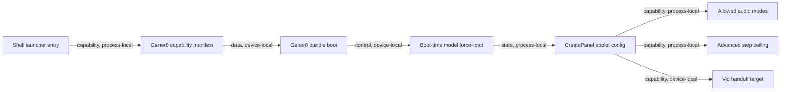

# Everywear OS: Developer Wiki

Version: 1.1.77
Last updated: 2026-06-11 (Swarm fixrun visual QA integration)
Maintainer: Sean Uddin / Somo Kasane

> Current-state note, 2026-06-11 v1.1.77: Swarm fixrun integration and
> visual QA landed. Shell-native applets now rely on shell chrome instead of
> nested router headers; 1magen uses a compact shell-hosted strip while its
> BinaryLocal runtime bridge remains explicitly pending. My Mait routes
> through `KasaiApp`, Avatar Studio is labeled as Avatar Studio, and
> `FrontendInline` applets without `frontend_port` open through the shell URL
> instead of failing. Gener8 suite lifecycle now surfaces persistent status in
> shell chrome, the bug report modal uses the recent diagnostic ring, and
> `ShellLayout.tsx` unloads shared Gener8 applets through the Rust
> `unload_inline_applet_models` command instead of a browser fetch to port
> 3001. DAW engine health no longer advertises the phantom `gener8-shim`
> endpoint; it reports `daw-shell-bridge` as an internal shell capability.
> Native DAW no longer throws the pending bridge error in Tauri: Gener8
> `dawApi.ts`, legacy Studio `DawPage.tsx`, and the transport bar route
> through the `daw_bridge_request` command. The Rust bridge owns in-memory
> project state, stem URL/local-directory import into tracks/regions,
> transport, edits, save/load, and waveform peak responses. Visual QA
> receipts live in
> `screenshots/2026-06-11-fixrun-visual-qa/`. Verification passed across
> shared, 1magen, Kasai, Character Studio, Vid, Gener8 web, Everywear OS,
> cargo check, model-manager targeted tests, and debug NSIS installer prep.
> Boundary: the bridge accepts stems and makes DAW timeline/transport
> operable, but it does not invent a semantic stem-separation model; actual
> extraction still depends on the shell-managed Pro Model producing stem URLs.

> Current-state note, 2026-06-10 v1.1.76: Lane 3 diagnostic starvation fix
> landed for shell bug reports. `@everywear/shared` now keeps a recent
> 200-entry diagnostic ring independent of the five-second backend flush;
> `BugReportModal` reads that ring so reports retain the launch/error chain
> even after buffered entries have been persisted. `ShellLayout.tsx` enriches
> every report seed with active window, open applets, launching applet,
> inference phase, engine-health snapshot, and the last lifecycle events from
> `applet-switch-progress`, `provision-manifest`, and `download-progress`.
> Verification passed: `npm run build --workspace @everywear/shared`,
> `npm run build --workspace everywear-os`, `npm run build --workspace
> onemagen`, `cargo check -p everywear-os`, and `git diff --check`.
> Boundary: this fixes report usefulness, not the 1magen BinaryLocal runtime
> bridge or generation path.

> Current-state note, 2026-06-10 v1.1.75: Phase 2 H6 entitlement bypass
> audit generated
> `screenshots/2026-06-10-proof-pass/h6-entitlement-bypass-audit.json`.
> No entitlement behavior changed. The owner/admin QA bypass lives in
> `platform/everywear-os/src/shell/AuthContext.tsx`: admin/support roles or
> Sean-owned handles/emails are promoted locally to `creator_studio`, merged
> with creator-studio flags, and pushed to the Tauri shell before launcher
> gates consume `authUser.entitlements`. SQL entitlement RPCs remain
> owner-bound by `auth.uid()`. Close this before paid release with persisted
> `admin_override` entitlements or a dev-build-only QA switch.

> Current-state note, 2026-06-10 v1.1.74: Phase 2 H5 fresh-machine trap
> sweep generated
> `screenshots/2026-06-10-proof-pass/h5-fresh-machine-manifest.json`.
> Installer blockers are now explicit: no `src-tauri/resources/node.exe`, no
> packaged `resources/sidecar/video-encoder/dist/index.js`, and ACE-Step still
> has Sean-machine absolute path fallbacks in the Gener8 sidecar contract and
> discovery code. H5 did not build the installer by design; it records the
> beta-machine bootstrap manifest and checklist.

> Current-state note, 2026-06-10 v1.1.73: Phase 2 H4 lock discipline
> scan generated
> `screenshots/2026-06-10-proof-pass/h4-lock-discipline-scan.json`.
> Canonical rule is now documented: commands should snapshot one mutex at a
> time and drop guards before taking unrelated locks or awaiting IPC, HTTP,
> provisioning, process launch, or filesystem-heavy work. Small snapshot
> violations were removed from `commands/platform.rs` and
> `commands/registry.rs`. The big structural debt remains
> `request_applet_switch` in `lib.rs`, which holds the VRAM budget guard
> across purge/provision/launch phases and must be refactored as its own
> launcher slice, not patched casually.

> Current-state note, 2026-06-10 v1.1.72: Phase 2 H3 port/URL literal
> sweep generated
> `screenshots/2026-06-10-proof-pass/h3-port-url-literal-sweep.json`.
> Allowed literals are applet vite/dev config, Tauri devUrl/CSP, applet IPC
> random-port wiring, frontend-port assembly, and local hostname checks.
> Runtime consumer debt remains concentrated in legacy Gener8 shim `3001`,
> video encoder artifact fetch `9877`, 3nvizen LTX fallback `8787`, Layer U
> SON service `3117`, and donor Character Studio API `8081`. H3 was a
> comment-and-log pass only, no endpoint migration.

> Current-state note, 2026-06-10 v1.1.71: Phase 2 H2 event contract audit
> generated `screenshots/2026-06-10-proof-pass/h2-event-contract-postfix.json`
> and closed the real orphan emitter. Rust already forwarded
> `kasai://reasoning-trace` from the Kasai IPC bridge, but no UI listener
> existed. `applets/kasai/src/shell/KasaiCore.tsx` now listens for that event,
> normalizes malformed payloads defensively, and renders the trace as assistant
> reasoning. Verification passed: `npm run build --workspace kasai-applet` and
> `npm run build --workspace everywear-os`. Remaining orphan listeners are
> browser/custom-event hooks requiring product-origin decisions, not broken Rust
> emitters: `everywear:applet-status`, `everywear:launch-applet`, and `s3:skin`.

> Current-state note, 2026-06-10 v1.1.70: Phase 2 H1 silent-failure sweep
> landed the first truthfulness fixes. `ShellLayout.tsx` no longer swallows
> `closeAppletWebview` failures; it logs and shows an applet-lifecycle error
> toast. `packages/video-modal` no longer silently ignores
> `release_video_encoder` failures; it logs a targeted GPU encoder release
> warning. `StemStudio.tsx` no longer uses a browser `alert()` for invalid
> uploaded audio; it routes the failure into the existing inline
> `extractError` surface. Verification passed: `npm run build --workspace
> @everywear/video-modal`, `npm run build --workspace @everywear/gener8-web`,
> and `npm run build --workspace everywear-os`. Remaining H1 findings are
> recorded in `BUGHUNT_FINDINGS_2026-06-10.md`: legacy Gener8 alert/confirm
> cleanup, swallowed DAW mutations, and best-effort catch comments.

## Phase 2 H2 Event Contract Registry

Source artifact: `screenshots/2026-06-10-proof-pass/h2-event-contract-postfix.json`

| Event | Emitters | Listeners | Contract status |
| --- | --- | --- | --- |
| `agent-event` | Kasai mock/browser transport | `KasaiCore.tsx` | Paired. |
| `applet-switch-progress` | Rust shell launcher/lib lifecycle paths | `LifecycleHud.tsx`, `ShellLayout.tsx` | Paired. |
| `applet-webview-opened` / `applet-webview-closed` | Rust shell applet lifecycle paths | `ShellLayout.tsx` | Paired. |
| `download-progress` | Rust download/provisioning paths | Lifecycle HUD and applet consumers | Paired. Payload has legacy/v2 compatibility debt, but is not orphaned. |
| `educ8-download-progress` | Educ8 inline download path | Educ8 inline UI | Paired. Legacy event intentionally kept while mirrored to `download-progress`. |
| `engine-health` | `engine_health.rs` | `ShellLayout.tsx` | Paired. |
| `kasai://slot-event` | Rust Kasai IPC bridge | `SlotStatusPanel.tsx` | Paired. |
| `kasai://tool-call/update` / `kasai://tool-call/complete` | Rust Kasai command bridge | `KasaiCore.tsx` and tool UI | Paired. |
| `provision-manifest` | Rust launcher/provisioning paths | `LifecycleHud.tsx` | Paired. |
| `kasai://reasoning-trace` | Rust Kasai IPC bridge | `KasaiCore.tsx` | Fixed in H2. Was orphan emitter; now rendered as assistant reasoning. |
| `everywear:applet-status` | No in-repo emitter found | `ShellLayout.tsx` | Open product-origin decision. Browser custom-event hook, not Rust event bus. |
| `everywear:launch-applet` | No in-repo emitter found | `ShellLayout.tsx` | Open product-origin decision. Browser custom-event hook, not Rust event bus. |
| `s3:skin` | No in-repo emitter found | `character-studio/src/lib/skinSync.js` | Open product-origin decision. Decide whether donor S3 skin sync still belongs. |
| `SIGTERM` | OS/process signal | Node sidecar handlers | Excluded from Tauri event contract. |

## Phase 2 H3 Endpoint Literal Debt Registry

Source artifact: `screenshots/2026-06-10-proof-pass/h3-port-url-literal-sweep.json`

Allowed categories: applet vite/dev config, Tauri `devUrl`/CSP, applet IPC random-port wiring, frontend-port assembly from registry metadata, local auth hostname checks, docs, generated schemas, and marketing harnesses.

| Endpoint | Current owner | Out-of-owner runtime consumers | H3 status |
| --- | --- | --- | --- |
| `3001` Gener8 shim | `engine_health.rs` owns expected-down health row. | `ShellLayout.tsx`, Vid song store, Gener8 web API/DAW/banner paths. | Tier 1 logged. This is the dangerous one: P3 already proved direct 3001 dependency breaks native save paths. |
| `9877` video encoder | `engine_health.rs` health row plus video encoder sidecar. | `vault_commands.rs` downloads encoded MP4 by literal URL. | Tier 1 logged. Consolidate with shell-owned encoder lifecycle fix. |
| `8787` LTX sidecar | `engine_health.rs` health row for shell. | 3nvizen standalone TS/Rust fallback transport. | Tier 2 logged. Standalone compatibility is legitimate, but shell-mounted UI should keep using shell health state. |
| `3117` Project SON / Layer U | Layer U `sonBridge.ts`. | Layer U only. | Tier 2 logged. Decide whether SON becomes an engine-health endpoint or remains Layer U owned. |
| `8081` Character Studio donor API | Legacy donor Character Studio contract files. | Character Studio donor components. | Tier 2 logged. Needs Character Studio donor cleanup, not generic endpoint migration. |

## Phase 2 H4 Rust Lock Discipline

Source artifact: `screenshots/2026-06-10-proof-pass/h4-lock-discipline-scan.json`

Canonical rule: prefer no nested locks. For read-only command snapshots, copy or clone the needed values from one mutex, drop the guard, then take the next mutex. Never hold a `tokio::Mutex` guard across IPC calls, HTTP calls, model provisioning, process launch, sidecar startup, filesystem-heavy work, or another unrelated state-family mutation.

If a multi-lock path cannot be avoided, use this order and keep the guarded section non-async beyond mutex acquisition:

1. Entitlement inputs: `licence_tier`, `entitlement_flags`
2. Applet metadata: `registry`
3. Machine state: `gpu`
4. VRAM and model selection: `budget`, then `model_mgr`, then `model_resolver`
5. Runtime ownership: `active_applet`, then `applet_processes`
6. Engine runtime: `engine_registry`, then `vram_scheduler`
7. App-local logs/services: `kasai_tool_calls`, `video_encoder`
8. User state: `profile`, `wallet`, `discourse`, `user_session`

Known debt: `request_applet_switch` currently spans entitlement check, model requirement check, purge, provisioning, sidecar provisioning, allocation recording, active-applet mutation, process launch, and cleanup in one command. It still holds `budget_lock` across async purge/provision/launch-adjacent work. Treat this as a dedicated launcher refactor: split planning from mutation, return immutable launch plans, then reacquire budget only for final allocation or rollback.

## Phase 2 H5 Fresh Machine Manifest

Source artifact: `screenshots/2026-06-10-proof-pass/h5-fresh-machine-manifest.json`

Installer blockers:

| Item | Required for beta machine | Current state |
| --- | --- | --- |
| Portable Node runtime | `platform/everywear-os/src-tauri/resources/node.exe` or a Node-free compiled encoder binary | Missing. Debug can fall back to PATH, release cannot assume it. |
| Video encoder sidecar bundle | `resources/sidecar/video-encoder/dist/index.js` in packaged app | Missing. Local ignored `sidecar/video-encoder/dist/index.js` exists only because this machine built it. |
| ACE-Step server bundle | `~/.everywear/bin/ace-server/ace-server.exe` plus `ggml*.dll`, `neural-codec.exe`, `mp3-codec.exe` | Still relies on Sean-machine absolute dev paths as fallback. |
| FFmpeg | Bundled ffmpeg or explicit first-run bootstrap with `FFMPEG_PATH` | Currently PATH/standard-path/Scoop discovery. |
| 3nvizen LTX sidecar | Decided Python runtime bundle or managed bootstrap | Packaging strategy still open. |

First-run beta machine checklist:

- Resources directory exists and is packaged with portable runtime assets.
- Video encoder health passes without repo cwd, local `dist/`, or PATH Node.
- ACE server boots from `~/.everywear/bin/ace-server`, not `C:\Users\MAG MSI\Project Ace\...`.
- ACE model ladder resolves from `~/.everywear/models`.
- FFmpeg/NVENC health reports actionable failure if unavailable.
- 3nvizen LTX install/bootstrap has a visible health gate.
- No release path depends on `target\debug` or the source checkout cwd.

## Phase 2 H6 Entitlement Bypass Registry

Source artifact: `screenshots/2026-06-10-proof-pass/h6-entitlement-bypass-audit.json`

| Bypass/guard | Location | Scope | Release decision |
| --- | --- | --- | --- |
| Owner/admin local effective-state bypass | `platform/everywear-os/src/shell/AuthContext.tsx` | `isAdminOrOwnerAccount()` matches `admin`/`support` profile roles, owner handles `seanie`, `seanie.sean`, `somo`, `somokasane`, or owner emails. `applyAdminTestBypass()` promotes the effective tier to `creator_studio`, merges creator flags, and sets `admin_override: true`. | Close before paid release. Do not let owner QA stand in for real paid-entitlement smoke. |
| Creator-studio flag expansion | `expandTierToFlags('creator_studio')` | Unlocks Gener8 base/audio, 1magen/image, Vid/Vid Pro, 3nvizen/video, Gener8 Pro, Creator Studio, DAW Pro, AI Director/planner, Creator Pro, plus default free surfaces. | Persist these via entitlement rows for admin accounts, or keep only behind dev-build QA. |
| Shell and launcher consumers | `ShellLayout.tsx`, `LauncherGrid.tsx` | Launcher badges and applet launch blocking consume `authUser.entitlements ?? authUser.tiers`, so promoted local flags alter visible lock state and launch permission. | Paid-release tests must include at least one non-bypass account with real provider or entitlement rows. |
| Browser preview bypass | `isLocalPreviewBypass()` in `AuthContext.tsx` | Non-Tauri localhost/127/::1 only, requires `?preview=1`, creates a creator-studio preview user. | Acceptable as dev preview only if production builds cannot hit it; otherwise env-gate. |
| SQL owner-bound guard | Supabase entitlement migrations | `active_tier(p_user)` and `entitlement_flags(p_user)` are self-user constrained, and `user_entitlements` RLS is own-user select. | No SQL RLS bypass found. The defect risk is client/shell masking, not server leakage. |

> Current-state note, 2026-06-10 v1.1.69: P4 BinaryLocal VRAM release proof
> passed against My Mait / kasai. Baseline budget had no allocations and
> `active_applet = null`. Each of three `request_applet_switch("kasai")`
> launches recorded the same two ledger rows: primary
> `kasai-orchestrator-qwen3-6-35b-a3b-q4km` at 20500MB and encoder
> `kasai-agent-qwen3-5-9b-q4km` at 5400MB, with `active_applet = kasai`.
> Killing the exact `everywear-kasai.exe` child process emitted
> `applet-webview-closed { applet_id: "kasai" }`, removed the process, cleared
> `active_applet`, and returned `get_vram_budget().allocations` to empty each
> time. No reservation stacking reproduced over three launch/kill cycles.
> Receipts live under `screenshots/2026-06-10-proof-pass/` as
> `p4-vram-baseline.json`, `p4-kasai-launch-1.json`,
> `p4-kasai-kill-1.json`, and `p4-kasai-kill-cycles-2-3.json` with paired
> screenshots.

> Current-state note, 2026-06-10 v1.1.68: Vid GPU export save path is now
> shell-owned after native proof exposed the post-encode failure. The encoder
> sidecar completed a 960x540 NVENC MP4, but `VideoGeneratorModal` failed with
> `Failed to fetch` because the post-encode save still depended on the legacy
> Gener8 shim API at port 3001 while shell engine health correctly reports
> `gener8-shim` down. `platform/everywear-os/src-tauri/src/vault_commands.rs`
> now exposes `vault_register_video_from_encoder`: it validates an encoder
> session id, pulls `http://127.0.0.1:9877/download/{session}`, stages the MP4
> to temp, and feeds it through the existing Vault video registration path.
> `packages/video-modal/src/components/VideoGeneratorModal.tsx` uses that
> native command for `save-from-encoder`, skips duplicate wrapper registration
> when the shell already registered the item, and leaves the old shim save API
> only as fallback. Verification passed: `npm run build --workspace
> @everywear/video-modal`, `npm run build --workspace everywear-os`,
> `cargo check -p everywear-os`, `cargo build -p everywear-os`, native Vid GPU
> render through CDP, UI success toast, MP4 at `Documents\Everywear
> Vault\Videos`, and `vault_search(mediaFilter=videos)` indexing the new
> 960x540 / 24fps item. Remaining P3 debt: shell `request_video_encoder`
> still returned a port without producing a listener in the earlier proof; the
> passing save-path replay used the already-running manual encoder on 9877.

> Current-state note, 2026-06-10 v1.1.67: punch-list Lane A landed.
> `platform/everywear-os/src/shell/ShellLayout.tsx` now listens once to the
> Rust `engine-health` event, stores the latest payload, republishes it through
> the shared browser context in `packages/shared/src/engineHealth.ts`, and
> merges endpoint state into the shell runtime labels plus the desktop
> Inference card. Frontend-port polling remains for applet frontend reachability;
> engine ports still belong only in `engine_health.rs` until manifest-driven
> registration lands. `applets/3nvizen` now reads the `ltx-sidecar` endpoint
> when shell-mounted and keeps its direct 8787 polling only for standalone
> mode. `packages/video-modal` still acquires/releases the shell-owned encoder
> but uses the `video-encoder` endpoint as the shell truth for availability,
> leaving direct 9877 probing as standalone fallback. DAW Pro Model copy now
> consumes the `gener8-shim` honest-down endpoint and includes the last checked
> time instead of guessing from a failed fetch. Verification owed: `cargo check
> -p everywear-os`, `npm run build --workspace everywear-os`, and the Lane A
> native devtools smoke.

> Current-state note, 2026-06-10 v1.1.66: punch-list wave 2 landed
> (sandbox TS-verified; native cargo verify owed, includes a NEW dependency
> `zip = 2.4` in src-tauri Cargo.toml). Three changes: (1) Engine health
> slice 1: new module `platform/everywear-os/src-tauri/src/engine_health.rs`
> sweeps the known engine ports (ace 8080 /props, LTX 8787 /health,
> video-encoder 9877 /health, and the phantom DAW Gener8 shim on 3001,
> reported honestly as down) every 10s with a 2s timeout and emits one
> `engine-health` event; spawned from a new `.setup()` hook in lib.rs.
> Consumers migrate in slice 2; the static seed moves to manifest-driven
> registration in slice 3. Do not add engine ports anywhere else.
> (2) Sidecar URL provisioning Phase 2: `provision_sidecar` is now async
> and `provision_sidecar_from_url` in launcher.rs implements resumable
> archive download (model-manager machinery), zip-slip-safe extraction,
> executable SHA256 verification against `[engine.sidecar].sha256`
> (warn-and-install when the manifest omits it), staging under
> `~/.everywear/bin/.staging/`, and a clear-then-rename swap into
> `~/.everywear/bin/<name>/`. Progress rides the contract-v2 events, so
> engine downloads render in the Lifecycle HUD. The launcher.rs:563 TODO
> stub is gone. (3) Download path consolidation: educ8 keeps its legacy
> `educ8-download-progress` event for its inline UI and now mirrors every
> update onto the shared `download-progress` bus (session educ8-<pack>),
> so the HUD sees Educ8 resource downloads; 1magen is left alone by design
> (separate binary, events stay in its own webview, already shares the
> model-manager crate). LifecycleHud gained an all-rows-done auto-settle
> (1.5s quiet + 4s hide) so standalone sessions without a Ready stage do
> not pin the HUD open.

> Current-state note, 2026-06-10 v1.1.65: punch-list wave 1 landed
> (sandbox TS-verified across everywear-os, video-modal, 3nvizen; native
> cargo/build verify owed). Four fixes: (1) Vid render silent no-op:
> `packages/video-modal/src/components/VideoGeneratorModal.tsx` gained an
> `exportError` surface rendered with role="alert" under the render CTA;
> the silent `startRecording` guard (!canvasRef || !song), the
> `loadFFmpeg` failure, the `renderOffline` guard, and the render catch
> all report there. alert() was unreliable in the Tauri WebView, which is
> why every failure was invisible. (2) VRAM reservation stacking:
> `launcher.rs` now kills the orphan child process when IPC accept fails,
> and the applet event pump close path in `lib.rs` releases the budget,
> clears active_applet, removes the process entry, and emits
> applet-webview-closed (release is idempotent with graceful close).
> (3) 3nvizen registry drift: `registry.rs` status NotBuilt -> Active
> (frontend exists on 3004; entitlement/tier gates unchanged), so native
> list_applets and the browser fallback now agree. (4) Announcer
> truthfulness: shell stage emissions audited truthful; the lying surface
> was the educational launch toast, now gated off for runtime-owned-model
> applets (1magen, 3nvizen) via RUNTIME_OWNED_MODEL_APPLET_IDS in
> `ShellLayout.tsx`; LifecycleHud reports actual stages. Also: 3nvizen
> gained data-tour anchors (3nvizen.root/.prompt/.duration/.aspect/.seed/
> .generate/.engine-status/.preview) following the vid/daw convention, and
> the video-modal split plan is filed at
> `CODEX_PROMPTPACK_VIDEO_MODAL_SPLIT_2026-06-10.md` (corrected premise:
> the live monolith is packages/video-modal at 3,465 lines; the gener8
> copy is already a 74-line wrapper). Export smoke gate applies before the
> split's step 6.

> Current-state note, 2026-06-10 v1.1.64: model provisioning progress
> contract v2 and the shell Lifecycle HUD are implemented (sandbox
> TS-verified; native build verify owed). `launcher.rs` now emits
> `provision-manifest` (session_id, applet_id, models[key,name,size_bytes],
> total_bytes) before each provisioning phase, and `download-progress`
> gained session_id, applet_id, model_index, model_count while keeping the
> legacy fields via serde flatten, so 1magen's existing listener is
> unaffected. `request_applet_switch` mints one uuid switch_session shared
> by the base and upgrade-pack phases. New shell module
> `platform/everywear-os/src/components/LifecycleHud.tsx` is mounted in
> `ShellLayout` beside ToastHost (styles appended to `styles/shell.css`),
> docked bottom-left above the taskbar; ToastHost keeps bottom-right. It
> renders a stage strip from `applet-switch-progress`, per-model rows with
> bytes plus client-side EMA rate and ETA, an aggregate bar, a collapse
> pill, 4s auto-hide on Ready, and a sticky dismissible Failed state.
> Toast policy is demoted: `applet-switch-progress` toasts only on Failed;
> the per-percent `download-progress` toast listener is removed, which also
> removes its refreshRuntimeReadouts-per-percent IPC churn (the 3s readout
> poll during launches covers freshness). Verification: `tsc --noEmit -p
> platform/everywear-os` passed in the session sandbox; `cargo check -p
> everywear-os`, `npm run build --workspace everywear-os`, and a native
> download replay are OWED on the dev machine. Tooling note: host-side
> file edits that grow a file were truncated by the Cowork mount this
> session; the final files were written via the sandbox layer and verified
> by byte size and tsc. Also documenting the previously unwikied 2026-06-10
> commit: the video-encoder sidecar was relocated to
> `platform/everywear-os/src-tauri/sidecar/video-encoder` with
> monorepo-root dev path candidates added in `video_encoder.rs`; `dist/`
> is gitignored, so fresh clones must build the sidecar before the native
> encoder path works.

> Current-state note, 2026-06-10 v1.1.63: first-run tour host first slice
> is implemented and native-smoked. Added
> `platform/everywear-os/src/tour/tourManifests.ts` and
> `platform/everywear-os/src/tour/FirstRunTourHost.tsx`; `ShellLayout.tsx`
> only mounts `<FirstRunTourHost />`. The host uses existing EWDS
> `.ew-tour-*` primitives, verified manifest selectors/copy, halo geometry,
> missing-target fallback, Start/Back/Next/Skip/Done controls, keyboard
> navigation, native `getPreference` / `setPreference` persistence, and
> browser localStorage fallback. `npm run build --workspace everywear-os`
> and `cargo build -p everywear-os` passed. Native debug replay confirmed
> `.ew-tour-host`, `.ew-tour-card`, `.ew-tour-halo`, step `1/8 Home Node`,
> enabled Skip and Start Tour, disabled Back, no bug modal, Start Tour ->
> `2/8 Companion`, and Back -> `1/8 Home Node`. Evidence:
> `screenshots/2026-06-09-everywear-full-tour/native-first-run-tour-host-2026-06-10.*`
> and `native-first-run-tour-navigation-2026-06-10.*`.

> Current-state note, 2026-06-10 v1.1.62: first-run tour architecture is
> locked. `ShellLayout.tsx` is 1,894 lines, below hard ceiling but already a
> central shell module, so the tour engine must live in
> `platform/everywear-os/src/tour/` and not inside `ShellLayout`. Phase one
> adds `FirstRunTourHost.tsx` for overlay state, geometry, navigation, and
> preference persistence, plus `tourManifests.ts` for verified selectors and
> copy. `ShellLayout` only mounts the host. Persistence uses existing
> `getPreference` / `setPreference` with `tour.firstRun.completed` and
> `tour.firstRun.step`, with browser `localStorage` fallback. Selectors are
> restricted to verified anchors: desktop applet ids, S3 folder aria label,
> system buttons, Gener8/DAW/Vid `data-tour` anchors, and text/class selectors
> only for 3nvizen until anchors are added. Product copy must not promise
> unverified generation/export paths.

> Current-state note, 2026-06-10 v1.1.61: 3nvizen remains tourable only as
> an offline/setup surface. Native Everywear OS ran from
> `target\debug\everywear-os.exe` with WebView CDP on `127.0.0.1:9223`;
> desktop applet id `3nvizen` opened successfully and showed `OFFLINE`,
> LTX sidecar offline banner, Engine Offline badge, Text to Video, Image to
> Video, Audio to Video, Retake Soon, prompt field, duration/aspect/seed
> controls, IC-LoRA placeholder, spatial upscaler placeholder, audio source
> dropzone, disabled Generate button, generated-video empty preview, no
> failed-load text, and no bug modal. `http://127.0.0.1:8787/health`
> refused connection, matching the visible sidecar state. Applet-local
> `data-tour` anchor count is `0`, so tour automation needs anchors added
> before this lane is robust. Evidence:
> `screenshots/2026-06-09-everywear-full-tour/native-3nvizen-offline-setup-sheet-2026-06-10.png`
> and `native-3nvizen-offline-setup-sheet-2026-06-10.json`. The first-run
> tour can teach 3nvizen as a local-video setup surface only; no generation,
> model download/load, output playback, save-to-Vault, retake, IC-LoRA, or
> upscaling promise is verified.

> Current-state note, 2026-06-10 v1.1.60: Vid Studio Pro is tourable with
> a real seeded Gener8 song and preview canvas, but render/export still does
> not pass functional QA. Native Everywear OS ran from
> `target\debug\everywear-os.exe` with WebView CDP on `127.0.0.1:9223`;
> S3 Studio folder -> Vid Studio Pro opened successfully. The song sidebar
> loaded 121 rows and selected `Codex QA Gener8 Smoke 2026-06-10 0114`;
> Visualiser rendered a `960x540` preview canvas and no bug modal or
> failed-load text appeared. Verified `data-tour` anchors include
> `vid.applet-root`, `vid.song-list`, `vid.subtab.visualiser`,
> `vid.tab.presets`, `vid.tab.style`, `vid.tab.text`, `vid.tab.effects`,
> `vid.tab.render`, `vid.preview`, and `vid.render-cta`. Render tab exposed
> enabled CTA `RENDER 540P (16:9) (WASM)` with `WASM encoder ready`, while
> native encoder health failed on `127.0.0.1:9877`. Programmatic and trusted
> CDP clicks on the enabled render CTA did not start export, did not create an
> MP4/WebM file, and did not register a Vault video. Evidence:
> `screenshots/2026-06-09-everywear-full-tour/native-vid-seeded-song-*.png`
> and matching JSON manifests. The first-run tour can teach Vid as a
> selected-song visualiser and render-tab orientation surface, but must not
> promise render/export, encoder success, MP4 download, or Vault video
> registration yet.

> Current-state note, 2026-06-10 v1.1.59: DAW remains visually tourable
> and applet-anchor ready, but functional stem work is still blocked by the
> missing Gener8 shim on `localhost:3001`. Native Everywear OS ran from
> `target\debug\everywear-os.exe` with WebView CDP on `127.0.0.1:9223`;
> S3 Studio folder -> DAW opened successfully. The surface showed DAW `READY`,
> Stems, Timeline, MixLens, Lego, Complete, S3 DAW header, Load a Track,
> Upload Audio File, From Library, transport bar, no failed-load text, and no
> bug modal. Verified `data-tour` anchors include `daw.root`,
> `daw.tab.stems`, `daw.tab.timeline`, `daw.tab.analysis`, `daw.tab.lego`,
> `daw.tab.complete`, `daw.stems-panel`, `daw.load`, `daw.upload`, and
> `daw.library`. DAW still reports: `Could not verify the Pro Model because
> the local Gener8 engine is offline on localhost:3001.` Evidence:
> `screenshots/2026-06-09-everywear-full-tour/native-daw-functional-blocker-2026-06-10.png`
> and `native-daw-functional-blocker-2026-06-10.json`. The first-run tour can
> teach DAW as the Creator Studio stem/timeline entry surface and From Library
> starting point, but must not promise Pro Model verification, stem extraction,
> playback, export, or Vault registration until the shim is live.

> Current-state note, 2026-06-10 v1.1.58: Gener8 4ever now has a native
> new-song create -> Vault -> playback receipt. Native Everywear OS ran from
> `target\debug\everywear-os.exe` with WebView CDP on `127.0.0.1:9223`.
> S3 Studio folder -> Gener8 4ever opened as `LIVE`; local `ace-server.exe`
> ran from `C:\Users\MAG MSI\.everywear\bin\ace-server\ace-server.exe` on
> `127.0.0.1:8080`, and `/props` returned ACE model inventory. The Create
> panel accepted title `Codex QA Gener8 Smoke 2026-06-10 0114` and style
> `short cinematic synth pulse, clean local QA smoke, warm bass, subtle drums,
> thirty second instrumental`; clicking Create produced a new My Workspace row
> and detail panel. Vault output exists at `C:\Users\MAG MSI\Documents\Everywear
> Vault\Audio\Codex QA Gener8 Smoke 2026-06-10 0114-704107cff46f1960-288e4410.mp3`,
> length `480000` bytes, with `vault_id=vault-20eee1aed6eec467`,
> `source_app=gener8`, `library_scope=songs`, and `storage=vault_move`.
> Playback requested the Vault MP3 through `asset.localhost`, returned `206`
> `audio/mpeg`, loaded metadata, rendered waveform, and advanced the bottom
> player to `0:06 / 0:30`. Evidence:
> `screenshots/2026-06-09-everywear-full-tour/native-gener8-4ever-create-smoke-final-2026-06-10.png`,
> `native-gener8-4ever-create-smoke-final-2026-06-10.json`,
> `native-gener8-4ever-new-track-playback-2026-06-10.png`, and
> `native-gener8-4ever-new-track-playback-2026-06-10.json`. Boundary: this
> proves the native 4ever song path only. Pro Reference/Cover, delete
> persistence, search/filter correctness, pagination, stale-index cleanup,
> DAW handoff, Vid handoff/render, and broad library mutation flows remain
> separate gates.

> Current-state note, 2026-06-10 v1.1.57: 1magen runtime guard now has a
> native visual fix and evidence. The wiki contract remains: `1magen` is
> `BinaryLocal`, and the real `onemagen` runtime owns generation commands.
> `applets/1magen/src/shell/ImagenCore.tsx` now derives runtime-blocked and
> runtime-checking action state, labels the disabled hero CTA as `Runtime
> Handoff Pending`, blocks provisioning while runtime commands are absent,
> and hides model recommendation/download labels during runtime-blocked state.
> `applets/1magen/src/styles/imagen.css` styles the blocked primary action
> and runtime handoff note. Verification: `npm run build --workspace
> onemagen`, `npm run build --workspace everywear-os`, `cargo build -p
> everywear-os`, rebuilt native launch with WebView CDP. Evidence:
> `screenshots/2026-06-09-everywear-full-tour/native-1magen-runtime-guard-layout-final-2026-06-10.png`
> and `native-1magen-runtime-guard-layout-final-2026-06-10.json`. Boundary:
> this is an applet-level setup-safe visual guard, not a generation bridge
> fix. The shell model lifecycle toast still needs applet-aware gating because
> it announces `Checking requirements...` and `Downloading 3 models...` before
> the 1magen BinaryLocal handoff is actually connected.

> Current-state note, 2026-06-10 v1.1.56: S3 Library / Everywear Vault now
> has native seven-theme evidence. Native Everywear OS ran from
> `target\debug\everywear-os.exe` with WebView CDP on `127.0.0.1:9223`.
> For Light, Classic, Refined, Terminal, Graphite, Anodized, and Carbon, the
> pass selected the theme through Settings, opened S3 Studio folder, opened
> Gener8 4ever, then selected the Library route through `button[title="Library"]`.
> WebView checks confirmed Gener8 4ever, Library route, populated Vault rows,
> `Moving to the Sun` entries, no failed-load text, and no bug modal in every
> theme. Pixel spot-checks on Light and Carbon confirmed readable rows,
> filters, search/sort, scroll rail, and model lifecycle toast with no obvious
> overlap or contrast failure. Evidence:
> `screenshots/2026-06-09-everywear-full-tour/native-s3-library-theme-light.png`,
> `native-s3-library-theme-classic.png`, `native-s3-library-theme-refined.png`,
> `native-s3-library-theme-terminal.png`, `native-s3-library-theme-graphite.png`,
> `native-s3-library-theme-anodized.png`, `native-s3-library-theme-carbon.png`,
> and `native-s3-library-theme-sweep.json`. Boundary: this proves Library/Vault
> visibility and theme readability across all seven themes. Playback remains
> proven by the earlier seeded `Moving to the Sun (3)` native playback slice;
> delete persistence, search/filter correctness, pagination behavior,
> stale-index cleanup, and save-to-Vault from a new generation remain separate
> functional QA gates.

> Current-state note, 2026-06-09 v1.1.55: Avatar Studio `Export to Kasai`
> now verifies as a native Everywear OS handoff into My Mait. Native replay
> opened Avatar Studio -> Create Character -> Drophunter -> Export -> Export
> to Kasai. Before patching, the frontend export path could show the control
> but produced no durable `Anon.vrm`, no `strands-avatar.json`, no visible
> success state, and no My Mait import. `my_mait.rs` now exposes
> `export_character_studio_avatar`; `lib.rs` registers it; Character Studio
> `download-utils.js` calls the native command in Tauri before browser
> fallback; `ExportMenu.jsx` and its CSS show explicit export status.
> Verification passed: `npm run build --workspace @everywear/character-studio`,
> `npm run build --workspace everywear-os`, `cargo build -p everywear-os`,
> then fresh native CDP replay. Evidence:
> `screenshots/2026-06-09-everywear-full-tour/native-avatar-studio-kasai-export-postfix-03-after-export.png`,
> `native-avatar-studio-kasai-export-postfix-state.json`,
> `native-avatar-studio-kasai-export-picker-cancel.json`,
> `avatar-kasai-export-postfix/Anon.vrm`, and
> `avatar-kasai-export-postfix/strands-avatar.json`. Verified: `Anon.vrm` is
> 10,254,144 bytes with GLB magic `glTF`, version 2, and matching declared
> length; the sidecar uses schema `strands-avatar-v1` and includes `vrmFile`,
> `vrm_path`, `model_path`, and `assets.vrm`; My Mait settings returned active
> companion id `f8b0ccc1-dc69-48bd-8b63-33b4c5601e25`; picker cancel returns
> visible status `Export cancelled`. Boundary: Vault registration beyond the
> MAIT companion store, companion presence rendering, randomized trait
> persistence, full trait matrix coverage, and shared exporter cleanup for the
> non-blocking `Cannot read properties of undefined (reading 'direction')`
> remain open.

> Current-state note, 2026-06-09 v1.1.54: Avatar Studio BatchManifest now
> verifies optional Lora and sprite data ZIP export in native Everywear OS.
> Native replay opened Avatar Studio -> Batch Download -> Manifest, dropped a
> Drophunter manifest JSON, enabled VRM, Lora data, and sprite data, then
> clicked the bottom Download action. Before patching, the route wrote a VRM
> but produced no ZIP because `loraDataGenerator.js` and
> `spriteAtlasGenerator.js` fetched raw relative manifest URLs and received the
> shell HTML fallback. Both generators now pass manifest URLs through
> `getAssetUrl(...)`, matching the local Character Studio asset-base contract.
> Verification passed: `npm run build --workspace @everywear/character-studio`,
> `npm run build --workspace everywear-os`, `cargo build -p everywear-os`,
> then fresh native CDP replay. Evidence:
> `screenshots/2026-06-09-everywear-full-tour/native-avatar-studio-batchmanifest-lora-sprite-postfix-02-after-download.png`,
> `native-avatar-studio-batchmanifest-lora-sprite-postfix-manifest.json`,
> `avatar-batchmanifest-lora-sprite-postfix/drophunter-lora-sprite-postfix.vrm`,
> and
> `avatar-batchmanifest-lora-sprite-postfix/drophunter-lora-sprite-postfix.zip`.
> Verified: VRM is 11,092,840 bytes with GLB magic `glTF`, version 2, and
> matching declared length; ZIP is 11,361,795 bytes with `PK` magic and
> contains 46 Lora PNG files, 46 Lora TXT prompt files, and 40 sprite PNG
> frames. Boundary: Export to Kasai directory picker, `strands-avatar.json`
> sidecar, Vault registration, My Mait handoff, randomized trait persistence,
> full trait matrix, and shared exporter cleanup for non-blocking `Cannot read
> properties of undefined (reading 'direction')` remain open.

> Current-state note, 2026-06-09 v1.1.53: Avatar Studio BatchManifest and
> multi-file `Download All` now verify in native Everywear OS. Native replay
> opened Avatar Studio -> Batch Download -> Manifest, dropped Drophunter and
> Neurohacker manifest JSON files, and clicked `Download All`. Before patching,
> the route exported valid VRMs but displayed a broken `Selection Thumbnail`
> because dropped manifest JSON kept a raw relative `thumbnail` path.
> `BatchManifest.jsx` now passes dropped manifest thumbnails through
> `getAssetUrl(...)` before displaying them. Verification passed:
> `npm run build --workspace @everywear/character-studio`,
> `npm run build --workspace everywear-os`, `cargo build -p everywear-os`,
> then fresh native CDP replay. Evidence:
> `screenshots/2026-06-09-everywear-full-tour/native-avatar-studio-batchmanifest-downloadall-postfix-02-after-download.png`,
> `native-avatar-studio-batchmanifest-downloadall-postfix-manifest.json`, and
> `avatar-batchmanifest-downloadall-postfix/*.vrm`. Verified: Drophunter
> thumbnail loads at `190x190`; `drophunter-manifest-all-postfix.vrm` is
> 10,776,676 bytes and `neurohacker-manifest-all-postfix.vrm` is 13,708,792
> bytes; both have GLB magic `glTF`, version 2, and matching declared length.
> Boundary: Export to Kasai directory picker, `strands-avatar.json` sidecar,
> Vault registration, My Mait handoff, randomized trait persistence, and full
> trait matrix remain unverified. Shared exporter cleanup remains:
> BatchManifest export also emitted non-blocking `Cannot read
> properties of undefined (reading 'direction')` despite producing valid VRM
> containers.

> Current-state note, 2026-06-09 v1.1.52: Avatar Studio Optimizer now verifies
> a real native export/download after loading a bundled VRM. Native replay
> opened Avatar Studio -> Optimize Character, dropped
> `applets/character-studio/public/character-assets/drophunter/body/drophunter.vrm`,
> loaded `DROPHUNTER` model information, and clicked the bottom Download
> action. No source patch was required for this slice. Evidence:
> `screenshots/2026-06-09-everywear-full-tour/native-avatar-studio-optimizer-export-final-after-download.png`,
> `native-avatar-studio-optimizer-export-final-manifest.json`, and
> `avatar-optimizer-downloads-final/drophunter_merged.vrm`. The exported file
> is 6,750,672 bytes with GLB magic `glTF`, version 2, and matching declared
> length. Verified: `SkinnedMeshes: 3`, `Triangles: 9816`, `Bones: 198`,
> Download after model load, no KTX warning, no bug modal, no failed-load text,
> and no `data:image` or `blob:` CSP export violation. Boundary: Export to
> Kasai directory picker, `strands-avatar.json` sidecar, Vault registration,
> My Mait handoff, randomized trait persistence, and full trait matrix remain
> unverified. Shared exporter cleanup remains:
> Optimizer export also
> emitted non-blocking `Cannot read properties of undefined (reading
> 'direction')` despite producing a valid VRM container.

> Current-state note, 2026-06-09 v1.1.51: Avatar Studio Batch Download now
> verifies a single JSON selection export in native Everywear OS. Native replay
> opened Avatar Studio -> Batch Download -> Drophunter, dropped
> `screenshots/2026-06-09-everywear-full-tour/avatar-batch-drophunter-selection-final.json`,
> and clicked the bottom Download action. Before patching, Batch routes leaked
> raw `CALLTOACTION.BACK` copy, and an earlier replay clicked the Download
> option checkbox label instead of the export action. `BatchDownload.jsx` and
> `BatchManifest.jsx` now use plain `Back` copy. Verification passed:
> `npm run build --workspace @everywear/character-studio`,
> `npm run build --workspace everywear-os`, `cargo build -p everywear-os`,
> then native CDP replay. Evidence:
> `screenshots/2026-06-09-everywear-full-tour/native-avatar-studio-batch-final-after-download.png`,
> `native-avatar-studio-batch-final-manifest.json`, and
> `avatar-batch-downloads-final/drophunter-batch-smoke.vrm`. The exported file
> is 9,389,472 bytes with GLB magic `glTF`, version 2, and matching declared
> length. Boundary: Export to Kasai directory picker, `strands-avatar.json`
> sidecar, Vault registration, My Mait handoff, randomized trait persistence,
> and full trait matrix remain unverified.

> Current-state note, 2026-06-09 v1.1.50: Avatar Studio Create now verifies
> direct VRM export/download in native Everywear OS. Native replay opened
> Avatar Studio -> Create Character -> Drophunter -> Appearance -> Export ->
> VRM 0. Before patching, the Save screen leaked raw i18n keys
> `pageTitles.saveCharacter` and `CALLTOACTION.BACK`, and export emitted
> native CSP errors fetching `data:image/svg+xml` under `connect-src`.
> `Save.jsx` now uses plain Save/Back copy, and `tauri.conf.json` adds
> `data:` to `connect-src` for in-memory export assets. Verification passed:
> `npm run build --workspace @everywear/character-studio`,
> `npm run build --workspace everywear-os`, `cargo build -p everywear-os`,
> then fresh native CDP replay. Evidence:
> `screenshots/2026-06-09-everywear-full-tour/native-avatar-studio-create-export-postfix-save-screen.png`,
> `native-avatar-studio-create-export-postfix-vrm0-manifest.json`, and
> `avatar-create-export-downloads-postfix/Anon.vrm`. The exported file is
> 10,564,076 bytes with GLB magic `glTF`, version 2, and matching declared
> length. Boundary: Export to Kasai directory picker, `strands-avatar.json`
> sidecar, Vault registration, My Mait handoff, randomized trait persistence,
> full trait matrix, Batch completion, and optimized output inspection remain
> unverified. Residual exporter cleanup: non-blocking page exception
> `Cannot read properties of undefined (reading 'direction')` still appears
> during VRM export even though the output container is valid.

> Current-state note, 2026-06-09 v1.1.49: Avatar Studio Create Character
> now shows the loaded Drophunter avatar in native Everywear OS. Native replay
> opened Avatar Studio -> Create Character -> Drophunter -> Appearance -> Body.
> Before the patch, class choice and trait controls rendered, but the central
> viewport stayed black because the legacy `Background` fallback layer sat over
> the live WebGL canvas in WebView2. `Background.module.css` now disables that
> fallback in the embedded applet, and the local ignored Drophunter asset
> manifest now points the body thumbnail at existing
> `_textureCollections/skin/drophunter.png` instead of missing
> `_textureCollections/body/drophunter.png`. Verification passed:
> `npm run build --workspace @everywear/character-studio`,
> `npm run build --workspace everywear-os`, `cargo clean -p everywear-os`,
> `cargo build -p everywear-os`, then fresh native CDP replay. Evidence:
> `screenshots/2026-06-09-everywear-full-tour/native-avatar-studio-create-postfix-final-body-selected.png`
> and `native-avatar-studio-create-postfix-final-manifest.json`. Verified:
> class choice, Appearance, visible avatar canvas, Body category, Body trait
> picker, loaded thumbnail, no raw keys, no character asset failures, no KTX
> support warning, and no bug modal. Boundary: export/download/save, Vault
> registration, My Mait handoff, randomized trait persistence, full trait
> matrix, Batch completion, and optimized output inspection remain unverified.

> Current-state note, 2026-06-09 v1.1.48: Avatar Studio Optimizer now accepts
> a real bundled VRM in the native shell. Native replay dropped
> `applets/character-studio/public/character-assets/drophunter/body/drophunter.vrm`
> into Optimize Character. Before the CSP patch, the UI reached `DROPHUNTER`
> but native WebView blocked `fetch(blob:http://tauri.localhost/...)` under
> `connect-src`, leaving a false-positive state with Download visible and zero
> geometry counts. `platform/everywear-os/src-tauri/tauri.conf.json` now adds
> `blob:` to `connect-src`. Verification passed: `npm run build --workspace
> everywear-os`, `cargo clean -p everywear-os`, `cargo build -p everywear-os`,
> then native CDP replay. Evidence:
> `screenshots/2026-06-09-everywear-full-tour/native-avatar-studio-optimizer-vrm-drop-after-csp.png`
> and `native-avatar-studio-optimizer-vrm-drop-after-csp-manifest.json`.
> Verified counts: `SkinnedMeshes: 3`, `Triangles: 9816`, `Bones: 198`,
> `MTOON opaque: 6`; no premature Download before import, Download appears
> after model load, no Download All for a single VRM, no blob/KTX CSP violation,
> and no bug modal. Boundary: export/download, compressed output inspection,
> Vault registration, My Mait handoff, Create completion, and Batch completion
> are still unverified.

> Current-state note, 2026-06-09 v1.1.47: Avatar Studio local KTX2 helper
> transport is fixed in the native shell. The Windows WebView2 asset-protocol
> rule now applies to local script helpers too: `tauri.conf.json` adds
> `asset: http://asset.localhost https://asset.localhost` to `script-src`.
> Verification passed: `npm run build --workspace everywear-os`, `cargo clean
> -p everywear-os`, `cargo build -p everywear-os`, then native CDP replay into
> Avatar Studio -> Optimize Character. `ktx2/libktx.js` returned `200` from
> `http://asset.localhost/...`, with no KTX request failure, no KTX-specific
> CSP console violation, and no `Failed to load KTX2 support` / `Compressed
> textures may not decode` warning. Evidence:
> `screenshots/2026-06-09-everywear-full-tour/native-avatar-studio-ktx2-csp-final.png`
> and `native-avatar-studio-ktx2-csp-final-manifest.json`. Boundary: this
> proves KTX2 helper script transport, not real compressed-texture decode on an
> imported/optimized VRM. Separate CSP debt remains for Google Fonts and
> `http://ipc.localhost/get_current_session_id`.

> Current-state note, 2026-06-09 v1.1.46: Avatar Studio deep-card native
> QA is now covered for the landing cards. Native WebView replay opened Create
> Character, Batch Download, and Optimize Character from
> `button.ew-desktop-icon[data-applet-id="character-studio"]` and the
> `avatar-*` card anchors. `Create.jsx` and `Claim.jsx` now show plain route
> labels instead of raw i18n keys, `Optimizer.jsx` hides Download actions
> until a VRM is loaded, and `MergeOptions.jsx` / `MergeOptions.module.css`
> anchor the optimizer options panel below the Avatar app chrome. Verification
> passed: `npm run build --workspace @everywear/character-studio`,
> `npm run build --workspace everywear-os`, `cargo clean -p everywear-os`,
> `cargo build -p everywear-os`, and native CDP replay against fresh
> `index-CE5t7bP7.js`. Evidence lives at
> `screenshots/2026-06-09-everywear-full-tour/native-avatar-studio-deep-*.png`,
> `native-avatar-studio-deep-flow-postfix-manifest.json`,
> `native-avatar-studio-optimizer-final.png`, and
> `native-avatar-studio-optimizer-final-manifest.json`. Boundary: no actual
> download/export/save/Vault/My Mait handoff was triggered. Native console
> still reports CSP blocking local KTX2 support from
> `asset.localhost/.../ktx2/libktx.js`, so compressed texture decode remains
> a separate runtime-risk lane.

> Current-state note, 2026-06-09 v1.1.45: native shell home desktop
> visual/theme coverage now has per-theme evidence. Light, Classic, Refined,
> Terminal, Graphite, Anodized, and Carbon all returned to a clean home
> desktop through the native Tauri runtime with no open windows/modals, seven
> applet buttons, S3 Studio folder closed, Settings and Vault system buttons,
> center clock/status/readout cards, GPU label, Light/Dark toggle, profile
> chip, report bell, and no failed-load text. Screenshots and manifest live at
> `screenshots/2026-06-09-everywear-full-tour/native-home-theme-*.png` and
> `native-home-theme-sweep.json`. Boundary: this proves shell home visibility
> and launch anchors across themes, not fresh auth, restart persistence,
> weather/geolocation success, report submission, or actual applet launch
> behavior.

> Current-state note, 2026-06-09 v1.1.44: native bug-report modal visual/theme
> coverage now has per-theme evidence. The taskbar bell opened the manual
> Report a Problem modal in Light, Classic, Refined, Terminal, Graphite,
> Anodized, and Carbon. No code patch was required. Screenshots and manifest
> live at `screenshots/2026-06-09-everywear-full-tour/native-bug-report-theme-*.png`
> and `native-bug-report-theme-sweep.json`. Boundary: this proves modal
> visibility, textarea, log-category controls, target choices, copy/send
> actions, and theme readability, not clipboard write, mail client launch,
> local file save, Kasai diagnostic handoff, backend submission, or report
> persistence.

> Current-state note, 2026-06-09 v1.1.43: native Settings panel visual/theme
> coverage now has per-theme evidence. The shell Settings tile was opened in
> Light, Classic, Refined, Terminal, Graphite, Anodized, and Carbon, with
> Appearance top controls and lower Traffic Lights / Surface Treatment / About
> states captured. No code patch was required; `.ew-settings` is the correct
> scroll container. Screenshots and manifest live at
> `screenshots/2026-06-09-everywear-full-tour/native-settings-theme-*.png`,
> `native-settings-theme-*-lower.png`, and `native-settings-theme-sweep.json`.
> Boundary: this proves Settings visibility, control presence, scroll behavior,
> and theme readability, not restart persistence, external link opening, or
> keyboard traversal.

> Current-state note, 2026-06-09 v1.1.42: native Profile panel visual/theme
> coverage now has per-theme evidence. The taskbar Profile control was opened
> in Light, Classic, Refined, Terminal, Graphite, Anodized, and Carbon, with
> top identity, lower subscription/session, and Edit Profile states captured.
> No code patch was required; `.ew-profile-panel` is the correct scroll
> container. Screenshots and manifest live at
> `screenshots/2026-06-09-everywear-full-tour/native-profile-theme-*.png`,
> `native-profile-theme-*-lower.png`, `native-profile-theme-*-edit.png`, and
> `native-profile-theme-sweep.json`. Boundary: this proves Profile visibility,
> edit controls, scroll behavior, and theme readability for Sean's authenticated
> Creator Studio session, not fresh auth/signup, profile-save persistence, or
> sign-out recovery.

> Current-state note, 2026-06-09 v1.1.41: the native S3 Studio folder
> first-open tray now shows all five child tools across Light, Classic,
> Refined, Terminal, Graphite, Anodized, and Carbon. The tray was widened
> from its previous `430px` cap and now uses `--ew-surface-overlay` as its
> solid skin-aware background layer, avoiding EWDS-v2 gradient-token
> color-mix invalidation and Carbon label bleed-through. Verification passed:
> `npm run build --workspace everywear-os`; `cargo build -p everywear-os`;
> native relaunch from `target\debug\everywear-os.exe`; screenshots and
> manifest at `screenshots/2026-06-09-everywear-full-tour/native-s3-folder-theme-*.png`
> and `native-s3-folder-theme-sweep.json`.

> Current-state note, 2026-06-09 v1.1.40: native Vid Studio Pro visual/theme
> coverage now has per-theme evidence, and the Light theme empty-state
> contrast defect is fixed. `applets/gener8/web/src/shell/VidApp.tsx` now
> uses EWDS text tokens for the visualiser empty-state icon, title, and hint
> instead of hardcoded `text-white/*`, matching the token-safe `VidView.tsx`
> route. Verification passed: `npm run build --workspace @everywear/gener8-web`,
> `npm run build --workspace @everywear/vid-web`, `npm run build --workspace
> everywear-os`, `cargo build -p everywear-os`, native relaunch, then CDP
> capture across Light, Classic, Refined, Terminal, Graphite, Anodized, and
> Carbon. WebView checks confirmed Vid Studio Pro window, Visualiser tab, AI
> Video Soon, Storyboard Soon, Your Songs list, readable empty prompt, no
> failed-load text, and no bug modal. Evidence:
> `screenshots/2026-06-09-everywear-full-tour/native-vid-studio-pro-theme-light.png`,
> `native-vid-studio-pro-theme-classic.png`,
> `native-vid-studio-pro-theme-refined.png`,
> `native-vid-studio-pro-theme-terminal.png`,
> `native-vid-studio-pro-theme-graphite.png`,
> `native-vid-studio-pro-theme-anodized.png`,
> `native-vid-studio-pro-theme-carbon.png`, plus
> `native-vid-studio-pro-theme-sweep.json`. Boundary: this proves the
> Visualiser empty/select-a-song entry surface and coming-soon tabs are
> readable across themes, not video render/export, encoder health, playback,
> or Vault video registration.

> Current-state note, 2026-06-09 v1.1.39: native Gener8 Pro visual/theme
> coverage now has per-theme evidence. For each theme, the native shell was
> reloaded, the S3 folder button was awaited, `button[data-applet-id="gener8-pro"]`
> was clicked, and the active Pro window was captured. Swept Light, Classic,
> Refined, Terminal, Graphite, Anodized, and Carbon. WebView checks confirmed
> Gener8 Pro window, S3 brand, Title, Lyrics, Style of Music, Vocal Language,
> Reference, Cover, Create, My Workspace, model lifecycle toast, no failed-load
> text, and no bug modal. Evidence:
> `screenshots/2026-06-09-everywear-full-tour/native-gener8-pro-theme-light.png`,
> `native-gener8-pro-theme-classic.png`,
> `native-gener8-pro-theme-refined.png`,
> `native-gener8-pro-theme-terminal.png`,
> `native-gener8-pro-theme-graphite.png`,
> `native-gener8-pro-theme-anodized.png`,
> `native-gener8-pro-theme-carbon.png`, plus
> `native-gener8-pro-theme-sweep.json`. Boundary: this proves native
> Reference/Cover entry visibility and model lifecycle messaging, not
> Reference/Cover generation, Pro model download completion, route/API health,
> playback, or save-to-Vault behavior.

> Current-state note, 2026-06-09 v1.1.38: native Gener8 4ever visual/input
> coverage now has per-theme evidence. Opened through the native S3 folder
> after confirming child route tiles for Gener8 4ever, Gener8 Pro, Vid, AI
> Director, and DAW, then captured Light, Classic, Refined, Terminal,
> Graphite, Anodized, and Carbon. WebView checks confirmed active Gener8
> 4ever window, S3 brand, Title, Lyrics, Style of Music, Vocal Language,
> Creative Controls, Create, My Workspace, no failed-load text, and no bug
> modal. Evidence:
> `screenshots/2026-06-09-everywear-full-tour/native-gener8-4ever-theme-light.png`,
> `native-gener8-4ever-theme-classic.png`,
> `native-gener8-4ever-theme-refined.png`,
> `native-gener8-4ever-theme-terminal.png`,
> `native-gener8-4ever-theme-graphite.png`,
> `native-gener8-4ever-theme-anodized.png`,
> `native-gener8-4ever-theme-carbon.png`, plus
> `native-gener8-4ever-theme-sweep.json`. Boundary: this proves native
> theme/readability and input-surface presence, not song generation,
> route/API health, save-to-Vault behavior, or deep workspace accessibility.
> The manifest reported many icon-only workspace controls, so a focused
> accessibility audit remains owed before deep control claims.

> Current-state note, 2026-06-09 v1.1.37: native Vault visual coverage now
> has per-theme evidence for Sean's populated QA vault. Opened through
> `button.ew-desktop-icon--system[aria-label="Open Vault"]` in rebuilt native
> Everywear OS, then captured Light, Classic, Refined, Terminal, Graphite,
> Anodized, and Carbon. WebView checks confirmed active Vault window,
> `.ew-vault-panel`, Media and Logs tabs, active Media tab, summary
> `649 items|0 images|638 audio|11 videos|96 stems|3.0 GB`, real record rows,
> 12 filter buttons, delete controls with ARIA labels, no failed-load text,
> and no bug modal. Evidence:
> `screenshots/2026-06-09-everywear-full-tour/native-vault-theme-light.png`,
> `native-vault-theme-classic.png`, `native-vault-theme-refined.png`,
> `native-vault-theme-terminal.png`, `native-vault-theme-graphite.png`,
> `native-vault-theme-anodized.png`, `native-vault-theme-carbon.png`, plus
> `native-vault-theme-sweep.json`. Boundary: this proves populated Vault
> readability, not a clean first-user empty-state tour.

> Current-state note, 2026-06-09 v1.1.36: Avatar Studio native landing
> coverage now has per-theme evidence and first-run anchors. `Landing.jsx`
> gives the three image-card buttons stable tour IDs and accessible labels:
> `avatar-create-character`, `avatar-batch-download`, and
> `avatar-optimize-character`, each with `aria-label`, `title`,
> `type="button"`, and matching image `alt`. Verification passed:
> `npm run build --workspace @everywear/character-studio`, `npm run build
> --workspace everywear-os`, `cargo build -p everywear-os`, then native
> WebView launch via `button.ew-desktop-icon[data-applet-id="character-studio"]`.
> Manifest fetch returned `200 application/json`; every theme pass confirmed
> Avatar window present, 3 loaded card images, 3 tour-card buttons, 1 canvas,
> no failed-load text, and no bug modal. Evidence:
> `screenshots/2026-06-09-everywear-full-tour/native-avatar-studio-theme-light.png`,
> `native-avatar-studio-theme-classic.png`,
> `native-avatar-studio-theme-refined.png`,
> `native-avatar-studio-theme-terminal.png`,
> `native-avatar-studio-theme-graphite.png`,
> `native-avatar-studio-theme-anodized.png`,
> `native-avatar-studio-theme-carbon.png`, plus
> `native-avatar-studio-theme-sweep.json`. Remaining Avatar debt: click
> through Create, Batch Download, Optimize, save path, and My Mait handoff.

> Current-state note, 2026-06-09 v1.1.36: native 1magen generation QA exposed
> a runtime-command mismatch in the integrated shell route. The wiki contract
> remains: `1magen` is `BinaryLocal` and the applet process owns
> `list_models`, `download_model`, `load_model`, `generate_image`, and
> `save_image`. Current native Everywear OS opens the shell-integrated
> `ImagenCore` fallback while the `onemagen` runtime handoff is still not
> connected; the shell only exposes read-only compatibility commands for
> `get_status`, `get_recommended_stack`, and `get_default_output_dir`.
> `applets/1magen/src/shell/ImagenCore.tsx` now probes `list_models` and
> fails closed when the active Tauri process lacks the real engine commands:
> it shows `Runtime handoff pending`, disables `Generate Image`, and avoids
> the previous `Command download_model not found` dead click. Verification:
> `npm run build --workspace onemagen`, `npm run build --workspace
> everywear-os`, `cargo clean -p everywear-os`, `cargo build -p
> everywear-os`, native launch with WebView CDP. Evidence:
> `screenshots/2026-06-09-everywear-full-tour/native-1magen-generate-gated-final.png`
> and `native-1magen-generate-gated-final-manifest.json`. Boundary: this is a
> user-facing guardrail, not a generation fix. Actual model provisioning,
> image generation, file save, and Vault image registration still require the
> BinaryLocal runtime bridge to connect the real `onemagen` commands.

> Current-state note, 2026-06-09 v1.1.35: 1magen native visual coverage now
> has per-theme evidence for the styled workbench. Captured in rebuilt native
> Everywear OS across Light, Classic, Refined, Terminal, Graphite, Anodized,
> and Carbon. Per-theme WebView checks confirmed `.imagen-workbench`,
> `.imagen-controls`, `.imagen-output`, `bodyDisplay=grid`, no failed-load
> text, and no bug modal. Evidence files:
> `screenshots/2026-06-09-everywear-full-tour/native-1magen-theme-light.png`,
> `native-1magen-theme-classic.png`, `native-1magen-theme-refined.png`,
> `native-1magen-theme-terminal.png`, `native-1magen-theme-graphite.png`,
> `native-1magen-theme-anodized.png`, `native-1magen-theme-carbon.png`, plus
> `native-1magen-theme-sweep.json`. This proves visual/theming readiness for
> first-run teaching, not functional generation readiness.

> Current-state note, 2026-06-09 v1.1.34: 1magen native shell styling is
> fixed. Root cause: `ImagenCore` is lazy-mounted directly by the shell, but
> its CSS was previously reachable only through standalone `main.tsx`; moving
> the CSS import into `ImagenCore` produced a separate lazy CSS asset that
> native WebView could fetch after failure but Vite could still reject during
> preload (`Unable to preload CSS for /assets/ImagenCore-*.css`). Final fix:
> standalone `applets/1magen/src/main.tsx` keeps `./styles/imagen.css`, while
> `platform/everywear-os/src/main.tsx` imports
> `@applets/1magen/src/styles/imagen.css` into the shell's initial CSS bundle.
> `imagen.css` now scopes background, text color, and overflow to
> `.imagen-workbench`, not global `body`. Verification passed:
> `npm run build --workspace onemagen`, `npm run build --workspace
> everywear-os`, `cargo build -p everywear-os`, then native WebView CDP click
> on `button.ew-desktop-icon[data-applet-id="1magen"]`. Result:
> `.imagen-workbench`, `.imagen-controls`, and `.imagen-output` present,
> `bodyDisplay=grid`, no preload failure, no bug modal, no launch hang.
> Screenshot:
> `screenshots/2026-06-09-everywear-full-tour/native-postfix-1magen-styled-shell.png`.
> Boundary: generation/provisioning, output save path, and Vault registration
> remain unproven.

> Current-state note, 2026-06-09 v1.1.33: Strands Nation native blank embed
> is no longer treated as an Everywear iframe bug. Current live headers from
> `https://strandsnation.xyz` include `X-Frame-Options: DENY` and CSP
> `frame-ancestors 'none'`, so the site forbids embedded viewing. For
> `strands-game`, `HeadlessAppletView.tsx` now renders an explicit external
> launch point instead of mounting a doomed iframe: title, reason, URL, `Open
> in browser`, and `Check again`. Verified in rebuilt native WebView by
> clicking `button.ew-desktop-icon[data-applet-id="strands-game"]`:
> `hasExternalBlockedPane=true`, `hasIframe=false`, `reportModal=false`.
> Screenshot:
> `screenshots/2026-06-09-everywear-full-tour/native-postfix-strands-nation-external-state.png`.
> This supersedes older internal-iframe expectations until the live Strands
> site allows Everywear framing or Everywear ships a true internal browser
> path.

> Current-state note, 2026-06-09 v1.1.32: Launcher semantic controls fixed
> in the native shell. `AppletIcon.tsx` now renders desktop applet tiles as
> `button.ew-desktop-icon[data-applet-id]` with ARIA labels/titles while
> preserving the existing visual classes and launch behavior. `ShellLayout.tsx`
> now renders Settings and Vault system tiles as buttons too; the S3 Studio
> folder was already a button. `shell.css` owns the button reset, focus-visible
> outline, and icon pulse keyframes. Verified in the rebuilt native WebView:
> seven applet buttons, S3 folder, Settings, and Vault present; zero non-button
> applet/system launcher holdouts; mouse click on
> `button.ew-desktop-icon[data-applet-id="character-studio"]` opened Avatar
> Studio with no bug modal. Screenshots:
> `screenshots/2026-06-09-everywear-full-tour/native-postfix-launcher-semantic-home.png`
> and `native-postfix-launcher-semantic-buttons.png`. `ShellLayout.tsx` and
> `shell.css` remain soft split debt but below the hard ceiling; this was a
> narrow semantic patch, not a shell refactor.

> Current-state note, 2026-06-09 v1.1.31: Avatar Studio native local
> manifest loading is fixed for the debug/native shell. Root cause: the shell
> command could return the repo-local `applets/character-studio/public` asset
> root, but `assetProtocol.scope` only allowed app-data and resource paths, so
> `convertFileSrc(root)/manifest.json` 403'd through `asset.localhost`.
> `platform/everywear-os/src-tauri/tauri.conf.json` now narrowly scopes the
> repo public tree for dev/debug while preserving the packaged local paths
> `$HOME/.everywear/data/character-studio/**`, `$RESOURCE/character-studio/**`,
> and `$RESOURCE/cs-assets/**`. Verified by native WebView click on
> `[data-applet-id="character-studio"]` and direct manifest fetch returning
> `200 application/json`. Screenshot:
> `screenshots/2026-06-09-everywear-full-tour/native-postfix-avatar-studio-local-assets.png`.
> Remaining Avatar Studio debt is product/tutorial polish, not native manifest
> transport: local asset-pack status, created Blank save path, My Mait handoff,
> and Create/Batch/Optimize path verification.

> Current-state note, 2026-06-07 v1.1.29: Visual bugfix handoff repair pass
> (source: 2026-06-07 Codex Computer Use audit handoff; Claude Cowork repair).
> 1) Applet taxonomy: 1magen and 3nvizen are desktop-level applets, removed
> from the S3 Studio folder (`LauncherGrid.tsx` buildDesktopLayout,
> `ShellLayout.tsx` S3_FOLDER_* constants). New `S3_SUITE_APPLET_IDS` set in
> `ShellLayout.tsx` enforces one active S3 suite applet window: launching a
> suite applet silently closes any other open suite applet
> (`closeOpenApplets` gained an `onlyIds` filter); handoff context survives
> via intentBus/Vault.
> 2) Vault black screen: root cause was `VaultPanel` mounting Gener8's
> `LibraryView` without `ShellAudioProvider` (useShellAudio threw) and with
> no error boundary. `VaultPanel` now wraps `ShellAudioProvider` +
> `AppletErrorBoundary` (newly exported from `AppletViewRouter.tsx`) with a
> remount-key Retry. User vault path semantics unchanged
> (`everywear_paths::vault_root()` → Documents\Everywear Vault).
> 3) Vid NVENC routing: nothing ever called `request_video_encoder`, so the
> shell sidecar never booted and Vid always fell back to WASM.
> `VideoGeneratorModal` now acquires the encoder on open, retry-polls
> /health (10x), releases on close, resets render state when the WASM
> loader fails (the old silent return stuck the panel at "Rendering frames
> 0%"), and shows a visible note when native export is unavailable. CSP
> gained `https://unpkg.com` in connect-src (WASM core fetch was blocked),
> `ws://127.0.0.1:*` (encoder WebSocket), and script-src/worker-src blob: +
> wasm-unsafe-eval.
> 4) My Mait local contract: `kasai_forward_chat` (shell commands/kasai.rs)
> now injects a system prompt built from shell GPU state, loaded slots, and
> Everywear Vault status into the ExecuteJob payload; the kasai runtime's
> single-model path also reads job["system"] when a messages array exists.
> Chat can no longer claim to be a cloud service while the side rail shows
> local models. MyMaitSettings is now mounted inside KasaiCore (gear button
> + clickable model cards, full-pane settings view).
> 5) Strands Nation: CSP frame-src now allows https://strandsnation.xyz so
> the embedded HeadlessAppletView iframe can load the live site; remote-URL
> windows get an open-in-browser control.
> 6) Status truthfulness: `windowRuntimeLabel` accepts iconHealth and shows
> OFFLINE/CHECKING instead of READY; portless inline applets can self-report
> via the new `everywear:applet-status` window event (Layer U dispatches it
> from snapshot.online and gained a Retry control in its offline pane).
> 7) Polish: folder tray icons widened to 96px with two-line labels (AI
> Director truncation); BugReportModal gained a local-only "Save to this
> computer" target backed by new shell command `save_bug_report` (writes to
> ~/.everywear/reports/); new shell command `get_default_output_dir`
> registered for inline-mounted 1magen UI compatibility.
> 8) Educ8 donor-copy purge: user-facing Loom/My Maits/NOMAD language
> replaced with product language; internal migration panels gated behind
> SHOW_DEV_STATUS=false in Educ8Core.tsx. Avatar Studio: UI chrome assets
> now bundle via import.meta.glob in assetBase.js (CDN prefix
> assets.everywear.id/character-studio is unpopulated and returns 404);
> manifest fetch failures now surface a visible error + Retry instead of a
> black screen. AVATAR ASSET CORRECTION, 2026-06-07: do not build Avatar
> Studio around runtime R2/CDN streaming. Character 3D assets must be locally
> bundled/provisioned by the Everywear shell as an install pack with size,
> checksum, receipt, and offline verification. REMAINING DEBT: local Avatar
> Studio asset provisioning; full EWDS ports of 1magen/Layer U/Avatar Studio; Educ8 download
> workflow rebuild; ShellLayout.tsx (~2600 lines) and
> VideoGeneratorModal.tsx (~3500 lines) remain over context budget, split
> owed.

> This is the developer onboarding reference. For high-level vision and
> architectural rationale, see [ARCHITECTURE.md](./ARCHITECTURE.md).
> This document maps what is actually on disk, file by file.

> Current-state note, 2026-05-18 v1.1: All body sections have been updated to
> match verified disk state. The OODA Refresh addendum below and the body
> sections should now agree. For the shortest live handoff, read
> [PROJECT_STATE.md](./PROJECT_STATE.md) first, then use [CONTEXT.md](./CONTEXT.md)
> as execution history.

> Current-state note, 2026-06-01 v1.1.21: OODA reconciliation folded the stale
> applet and registry body sections forward. `PROJECT_STATE.md` is the live
> surgical state. `CONTEXT.md` is useful history, but older lines that mention
> `gener8-pro vidTarget = vid_pro` or Creator Studio owning basic `vid` are
> stale. The current split uses one shared Gener8 bundle, two launcher entries
> (`gener8-4ever`, `gener8-pro`), and the single `vid` applet as the handoff
> target for both.

> Current-state note, 2026-06-05 v1.1.22: Character Studio is no longer
> scaffold-only. `applets/character-studio` is a vendored Avatar Studio
> frontend with package metadata, `applet.toml` display name `Avatar Studio`,
> a large `src/` implementation, and a large `public/` asset base. The shell
> mounts it through `AppletViewRouter.tsx`, which sets
> `window.__EVERYWEAR_ASSET_BASE__`; `src/lib/assetBase.js` then resolves dev
> and shell asset roots. Current status is vendored / smoke-pending. CSS asset
> refs for `ui/*.png`, token-box SVGs, and the frame mask now resolve through
> Vite-relative paths into the vendored public asset base; live visual QA is
> still owed.

> Current-state note, 2026-06-05 v1.1.24: DAW stem extraction Pro Model
> readiness is source-fixed at the route/alias layer. The public UI/shim pack id
> is `pro_base`; the manifest compatibility key remains `better_models` for
> shell upgrade-pack provisioning and Creator Studio inheritance. `shim.rs`
> aliases `pro_base` to `better_models`, exposes `/api/engine/pack-status` and
> `/api/engine/install-pack`, selects the VRAM-fit xl-base quant from
> `applets/gener8/applet.toml`, and keeps Gener8 Pro / Creator Studio
> entitlement checks intact. Runtime route smoke and real model-download proof
> still require the Gener8 shim running on `127.0.0.1:3001`.

> Current-state note, 2026-06-05 v1.1.25: VideoGeneratorModal Phase B package
> parity landed. Gener8 and Vid now both consume `@everywear/video-modal`
> through applet-local wrappers. Gener8 preserves its old app behavior by
> injecting responsive state, `vid_pro` entitlement gating, trial/watermark
> flags, API base, toast bridge, GPU `save-from-encoder` mode, and rich Vault
> metadata. Source builds are green; live export side-effect parity remains
> owed.

> Current-state note, 2026-06-05 v1.1.26: Applet install assessment doctrine
> LOCKED (Sean authority, originated in 3nvizen install tests; full text in
> [CONTEXT_APPEND_APPLET_INSTALL_DOCTRINE_2026-06-05.md](./CONTEXT_APPEND_APPLET_INSTALL_DOCTRINE_2026-06-05.md)).
> Canonical flow: shell assessment first, shell-owned install/provision with
> visible UI and install receipt second, runtime launch third. Install pulls
> models for all tier-appropriate applets up front; tier activation triggers
> install readiness for newly entitled applets; launch activates from
> resolved local paths and never downloads. Applets must not pull models
> through ad hoc UI endpoints; sidecars stay dumb. The 2026-06-05 `shim.rs`
> pack-status/install-pack routes (v1.1.24 note) are flagged as a stopgap
> doctrine violation pending migration to shell/model-manager authority.
> Launcher dot vocabulary locked: green = provisioned + healthy, amber =
> entitled + installing/pack missing, gray = not entitled. KNOWN DRIFT at
> this note's filing: both registries hold kasai as pure FrontendInline with
> no launch_binary, contradicting the locked BinaryLocal hybrid contract in
> the launcher table below and breaking launch-time activation
> (KASAI_NOT_ACTIVE); gener8-4ever carries a stray inert
> launch_binary = everywear-kasai. Restore owed, then desktop acceptance.

> Current-state note, 2026-06-06 v1.1.27: Launcher registry table reconciled
> against `platform/everywear-os/src-tauri/src/registry.rs` and
> `platform/everywear-os/src/lib/transport.ts`. Current registry truth:
> `kasai` is `BinaryLocal` with `launch_binary = everywear-kasai` and no
> frontend port; `gener8-4ever` has no launch binary; `1magen` is
> `BinaryLocal` using `onemagen` on port 3002; `s3studio` is a free external
> URL with no required entitlements; wire id `loom` now displays Educ8 and
> points at the renamed `applets/educ8` compile-time package. Desktop
> acceptance and native build receipts are still owed.

> Current-state note, 2026-06-06 v1.1.28: Video modal stabilization pass
> landed. Worker ownership: `@everywear/video-modal` imports
> `packages/video-modal/src/workers/videoRenderWorker.ts`; the orphan
> `applets/gener8/web/src/workers/videoRenderWorker.ts` is deprecated in
> place and must not be deleted until shell-launched video export parity is
> proven. First modal split: `videoModalTypes.ts`, `videoModalDefaults.ts`,
> and `videoModalPresets.tsx` now own shared types, default render/config
> state, and preset metadata. `VideoGeneratorModal.tsx` is reduced to 3,115
> lines but remains watch-list debt; render/export hooks, media controls,
> text/subtitle controls, and settings panels remain owed.

> Current-state note, 2026-05-26 v1.1.1: Gener8/Vault repair work is tracked
> in [docs/wiki/gener8/vault-library.md](./docs/wiki/gener8/vault-library.md).
> The May 24 and May 26 vault notes did not update this root wiki or
> `docs/wiki/README.md`; this addendum corrects that trail.

> Current-state note, 2026-05-27 v1.1.2: Kasai is the Everywear planning
> brain for keyword-to-narrated-short workflows. The shell and standalone
> 1magen now consume the shared `@everywear/ewds` theme provider; their local
> `ThemeContext` forks were removed.

> Current-state note, 2026-05-27 v1.1.3: Gener8 now reads the prebuilt Vault
> index directly on workspace/Vault open. The live providers no longer trigger
> `run_gener8_vault_audio_import`, and the Reference/Cover picker no longer
> calls stale `/api/reference-tracks` web routes that return app HTML.

> Current-state note, 2026-05-27 v1.1.4: Overnight Gener8 acceptance produced
> Codex-marked plain, Reference, and Cover test outputs from the supplied
> "Moving To The Sun" source. The ACE server accepted all three paths. The
> three outputs are registered and searchable in Vault as `gener8_song` assets.
> UI shell navigation still needs repair: Vault/Vid Studio window controls can
> trap the user away from Home, so the overnight audio acceptance used the local
> engine API after native UI interaction became blocked.

> Current-state note, 2026-05-28 v1.1.5: My Mait in Everywear now mounts the
> standalone Agent Hub visual contract (`ah-*`) through an Everywear-adapted
> `KasaiCore.tsx` plus `agent-hub.css`. The old `kc-*` stylesheet was deleted
> after verification because it was spurious dead code. Shell chrome, provider
> state, applet lifecycle, and transport remain Everywear-owned.

> Current-state note, 2026-05-28 v1.1.6: Identity, Vault, entitlement, Steam
> linking, and engine-port migration contracts now have a neutral Everywear
> Supabase migration and detailed design map. See
> [docs/vault/2026-05-28_everywear-identity-vault-entitlement-migration-map.md](./docs/vault/2026-05-28_everywear-identity-vault-entitlement-migration-map.md)
> and
> [supabase/migrations/20260528140643_everywear_identity_entitlement_vault_contract.sql](./supabase/migrations/20260528140643_everywear_identity_entitlement_vault_contract.sql).

> Current-state note, 2026-05-28 v1.1.7: Phase 2 runtime slice wires the S3 /
> Gener8 family into owner-bound Everywear Vault records and shell-level
> entitlement gates. Gener8 songs, cover outputs, reference audio, cover-source
> audio, visualizer videos, 1magen images, and 3nvizen videos now register with
> source app, library scope, vault id, original path, vault path, SHA-256,
> storage mode, and shell-derived entitlement context where available. Shell
> launch gates now lock 1magen and basic Vid Studio below Gener8 4ever,
> Vid Pro features below Gener8 Pro, and 3nvizen below Creator Studio.

> Current-state note, 2026-05-28 v1.1.8: Product-facing language is My Maits
> and My Maits Lite. My Maits Lite is a hidden headless runtime used by Loom
> as the free teacher agent. It is not a standalone launcher, SKU, or chat
> surface. AI Director's planner contract targets SAPI for LM Studio, Ollama,
> or external API providers. This checkpoint was superseded by v1.1.11, where
> the provider-routed SAPI adapter landed. The internal My Maits link is still
> planned but not plumbed.

> Current-state note, 2026-05-28 v1.1.9: Phase 3 contract correction wired the
> My Maits Lite and AI Director boundary through schema seed data, applet
> manifests, shared transport contracts, shell entitlement expansion, and S3
> family planner UI. `mymaits_lite_runtime` is a hidden Loom teacher-agent
> entitlement. `ai_director.planner` is Creator Studio's SAPI-targeted planning
> entitlement. This checkpoint was superseded by v1.1.11, where the Gener8
> shim gained provider-routed SAPI planning with explicit fallback reporting.
> The internal My Maits provider is represented only as planned future
> plumbing, not as a live gate or launch SKU.

> Current-state note, 2026-05-28 v1.1.10: Phase 3.5 headless audit found and
> fixed shifted shell registry gates. Gener8 is gated at `gener8` /
> `gener8.audio`; Vid Studio launch is included at Gener8 4ever through
> `vid`; Vid Pro features unlock at Gener8 Pro through `vid_pro` and are
> inherited by Creator Studio. AI
> Director is gated at Creator Studio / `ai_director.planner`; Loom remains
> free with `loom` / `loom.teacher_agent`. The audit also confirmed that the
> frontend can consume entitlement flags, but Tauri-side launch checks still
> reason primarily over the compatibility tier ladder. Neutral native
> entitlement enforcement remains a follow-up before provider-specific add-ons
> can bypass tier rank cleanly.

> Current-state note, 2026-05-28 v1.1.11: Open blocker repair pass converted
> 3nvizen from package-missing to frontend-buildable by adding workspace npm
> metadata, TS config, Vite config, and a standalone dev entry. This proves
> only that the frontend source builds; 3nvizen remains live-runtime unproven
> until the LTX sidecar boots and produces a video. AI Director now has a real
> provider-routed SAPI adapter for LM Studio, Ollama, and external
> OpenAI-compatible APIs; the shim reports `planner.mode = sapi` when a
> provider succeeds and `planner.mode = fallback` when no provider is available.
> Tauri native launch gating now stores neutral entitlement flags from the
> frontend and checks those before tier rank. Supabase CLI is available and the
> Everywear workdir links to project `ykqdsihnzroglepoxwcj`; Docker is only a
> blocker for local `db reset`, not linked remote verification. Everywear's
> 30-day signed-in-device rule is shell/client cookie policy only. Gener8's
> local `VideoGeneratorModal` remains a large
> unverified fork; Vid uses `@everywear/video-modal`, so visual parity must be
> proven in the live QA pass before making Vid claims.
>
> Current-state note, 2026-05-28 v1.1.12: Everywear Supabase workdir is linked
> to live project `ykqdsihnzroglepoxwcj`. The neutral identity, entitlement,
> and Vault contract migration was applied remotely as
> `20260528140643_everywear_identity_entitlement_vault_contract.sql` through the
> Supabase connector and verified against remote catalog/plan/Vault tables.
> The old S3 donor migration history has been copied into Everywear, with
> explicit no-op placeholders for six remote-only May 6 history entries that
> were present in Supabase but missing from local donor files. The 30-day
> signed-in-device rule remains shell/client cookie policy only.
>
> Current-state note, 2026-05-28 v1.1.13: Headless release binary build passed
> for the active Rust/Tauri executables: `everywear-os.exe`, `gener8.exe`,
> `onemagen.exe`, `everywear-3nvizen.exe`, and `everywear-kasai.exe` now exist
> under `C:\Users\MAG MSI\Project Everywear\target\release`. This is a binary
> build receipt only; no installer bundle directory was produced and no live UI,
> sidecar, model-load, or visual QA was run.
>
> Current-state note, 2026-05-28 v1.1.14: Sean manually click-launched the
> release `onemagen.exe` from `target\release` and reported that it spun up.
> Later process enumeration found no active Everywear applet process, so this is
> recorded as operator-observed launch proof, not a sustained runtime/process
> health check. `everywear-3nvizen.exe`, `everywear-kasai.exe`, and `gener8.exe`
> still need equivalent click-launch/runtime receipts.
>
> Current-state note, 2026-05-28 v1.1.15: Live Everywear release QA showed the
> user remained signed in as `seanie@everywear.id`, but S3-family launch gates
> blocked `1magen`, `gener8`, `vid`, `ai-director`, and `3nvizen`. Root cause is
> likely entitlement bridge drift: the neutral `active_tier()` /
> `entitlement_flags()` path reads `user_entitlements`, while Sean's admin
> bypass appears to live in the older S3-style subscription/admin override path.
> A local owner/admin test bypass was added in shell auth so Sean can run the
> bedtime marketing/QA pass. This bypass is a release blocker and must be
> replaced by a real Supabase entitlement backfill/admin override bridge before
> any external release.
>
> Live QA notes from 2026-05-28 SGT: My Mait launched and looked/behaved good.
> S3 family gates were locked despite admin bypass. EWDS-v2 cyberpunk/barcode
> settings treatment was not visible enough in the settings slider. Loom still
> presents Project NOMAD migration wording and queued items with no download,
> accept, or ZIM modularisation flow; desired title direction is "The Loom,
> Weaving Agentic Education into your Home." Character Studio was placeholder
> only at this 2026-05-28 QA point; this was superseded on 2026-06-05 when the
> vendored Avatar Studio source and public asset base landed in
> `applets/character-studio`. Minting/NFT/crypto language must not be visible
> in Character Studio or public Everywear surfaces. Vault media player failed on
> playback and video library should use larger tiled cards. Strands Nation must
> open inside an Everywear iframe/internal browser at `strandsnation.xyz`, not
> launch external Chrome. Base Everywear should eventually expose first-class
> desktop Music Player and Browser apps so users can leave Everywear running as
> their home OS layer.
>
> Current-state note, 2026-05-29 v1.1.16: S3-family lock root cause refined:
> the shell can receive registry entries as presentation `Locked` while auth is
> still hydrating, then reject launch before checking owner entitlement flags.
> `ShellLayout.tsx` now refreshes the applet registry after auth/entitlement
> state changes and checks entitlement flags before treating `Locked` as a hard
> block. Source patch only; rebuild/relaunch remains pending Sean go-ahead.
> The EWDS-v2 visual issue is tracked separately as a design-contract miss from
> `DESIGN WORK DONT GIT\design_handoff_everywear_ewds_v2`: industrial chrome
> barcodes, serials, JP labels, registration marks, traffic-light side,
> chrome-density, bevel degree, and rounded/cut-corner controls must visibly
> survive into Settings and applet chrome.
>
> Current-state note, 2026-05-29 v1.1.17: The Gener8 shell route compile break
> from the Pro audio extraction pass was repaired. `Gener8Core.tsx` now imports
> the Everywear Vault `LibraryView` through its default export, matching
> `applets/gener8/web/src/views/LibraryView.tsx`. `npm run build --workspace
> everywear-os` and `cargo build -p everywear-os` both passed after the repair,
> producing a fresh debug Everywear OS executable at
> `C:\Users\MAG MSI\Project Everywear\target\debug\everywear-os.exe` with
> timestamp 2026-05-29 13:02:55 SGT. Live runtime QA remains separate.

## Current State Addendum 2026-05-28: Identity, Vault, Entitlement, and Engine Migration Contract

Project location: `C:\Users\MAG MSI\Project Everywear`.

### Observe

- The S3 Supabase donor root is
  `C:\Users\MAG MSI\Project S3StudioGener8\S3 STUDIO\supabase`.
- S3 donor migrations provide proven auth/profile, handle gate, subscription,
  avatar storage, webhook dedupe, and Lemon Squeezy webhook patterns.
- S3 donor `songs`, `playlists`, and `playlist_songs` are product-library
  metadata and should become Everywear Vault asset records, not account-root
  schema.
- Current Everywear code still carries a linear compatibility tier ladder:
  `demo < gener8 < gener8_pro < creator_studio`.
- `engine_router.rs` has an entitlement manifest scaffold, but no real
  `bundles/entitlements.toml` authority exists yet.
- Inline applet launch paths still bypass parts of the binary applet
  `request_applet_switch` / VRAM bridge, so the shell-owned VRAM doctrine is
  aspirational for some current applets until contract wiring lands.

### Decide

- `everywear.id` remains the canonical user identity.
- Steam is a linked external identity and commerce provider, never the root
  account.
- S3 Supabase auth/payment is the source pattern library and migration source,
  not the final product root.
- Entitlements are product-agnostic rows: `products`, `plans`,
  `plan_entitlements`, `provider_subscriptions`, `user_entitlements`, and
  provider event ledgers.
- S3 Studio / Gener8 family is the first shippable paid production line.
- `1magen` is included from Gener8 4ever onwards.
- Basic Vid Studio (`vid`) is included from Gener8 4ever onwards.
- Vid Pro features (`vid_pro`) unlock at Gener8 Pro and are inherited by
  Creator Studio.
- `3nvizen` is included from Creator Studio onwards.
- Loom and Character Studio are free Everywear applets by the current product
  canon.
- My Maits Lite is a hidden headless runtime used by Loom as the free teacher
  agent. It is not a standalone launcher or chat surface.
- AI Director must route planner reasoning through SAPI for LM Studio, Ollama,
  or external API providers. Gener8 now has a provider-routed SAPI adapter
  with deterministic fallback reporting. The internal My Maits link is still
  planned but not plumbed, so that path must not be represented as a completed
  runtime integration.
- My Maits is the standalone agent hub/add-on with microtransaction support.
- Strands the Game and MyMaiDs / My Maids are platform-launched games, not
  near-term applet ports.
- Everywear Vault bootstrap uses Project Mymory-compatible schema, taxonomy,
  and default structure only. It must never seed Sean's live Project Mymory
  dogfood entries into new user vaults.
- Vault records bind to `owner_user_id` plus `vault_id`; SHA-256 is for content
  identity, dedupe, and tamper evidence, not access control.

### Implementation State

| Area | Current State | Notes |
|---|---|---|
| Supabase project link | Live | `C:\Users\MAG MSI\Project Everywear` is linked to Supabase project `ykqdsihnzroglepoxwcj`. |
| Supabase migration history | Reconciled | S3 donor `0001..0017` copied into Everywear; six remote-only May 6 versions are represented by documented no-op placeholders. |
| Neutral schema | Applied live | `20260528140643_everywear_identity_entitlement_vault_contract.sql` creates identity, external identity, catalog, entitlement, device, Steam event, Vault, and Vault ACL tables. |
| Entitlement catalog | Applied live | Catalog rows include `tier_floor`, `runtime_class`, `sku_policy`, and `catalog_status`; catalog seed is product metadata only, not user data. |
| Compatibility RPC | Added | `active_tier(uuid)` and `entitlement_flags(uuid)` preserve current shell bridge while capability wiring migrates. |
| Vault bootstrap contract | Added | `vaults`, `vault_records`, and `vault_acl` enforce owner-bound records and schema-only bootstrap. |
| Migration design doc | Added | `docs/vault/2026-05-28_everywear-identity-vault-entitlement-migration-map.md` contains migration map, Steam flow, dependency graph, worker split, and verification commands. |
| S3 / Gener8 Vault runtime | Wired | Shell-owned Gener8 output registration and applet save paths now attach source app id, library scope, vault id, original path, vault path, SHA-256, storage mode, and entitlement context. |
| Reference / Cover assets | Wired | Gener8 reference uploads register as `reference`; cover source uploads register as `cover_source`; generated covers register as `cover_output`. |
| 1magen launch gate | Wired | Shell registry and browser fallback require `gener8` / `1magen.image` before inline mount; applet manifest records shell/runtime enforcement. |
| 3nvizen launch gate | Wired | Shell registry and browser fallback require `creator_studio` plus `3nvizen` / `3nvizen.video`; applet manifest records shell/runtime enforcement. |
| 3nvizen frontend package | Added | `@everywear/3nvizen` now has npm workspace metadata and build config. Frontend build passes; live sidecar/generation remains unproven. |
| Gener8 / Vid / AI Director / Loom gates | Corrected in Phase 3.5 | Headless audit fixed shifted registry entries: Gener8 no longer carries AI Director's gate, AI Director is no longer ungated, Vid no longer carries Loom's teacher gate, and Loom exposes free teacher-agent entitlements. |
| Native entitlement flags | Wired | Tauri auth now stores neutral entitlement flags pushed from the frontend and launch checks use them before compatibility tier rank. |
| My Maits / My Maits Lite contract | Wired for Phase 3 | My Maits Lite is embedded/headless for Loom Teacher Agent. AI Director has a provider-routed SAPI adapter with fallback mode when no provider is available. |

### Verification State

- Passed: `npm run build --workspace everywear-os`.
- Passed: `npm run build --workspace onemagen`.
- Passed: `npm run build --workspace @everywear/gener8-web`.
- Passed: `npm run build --workspace @everywear/3nvizen`.
- Passed: `npm run build --workspace @everywear/video-modal`.
- Passed: `npm run build --workspace @everywear/vid-web`.
- Passed: `npm run build --workspace @everywear/transport`.
- Passed: `npm run build --workspace @everywear/loom`.
- Passed: `npm run build --workspace kasai-applet`.
- Passed: `cargo check -p ew-vault`.
- Passed: `cargo check -p everywear-os`.
- Passed: `cargo check -p everywear-kasai` (existing warnings only).
- Passed: `cargo check -p onemagen`.
- Passed: `cargo check -p everywear-3nvizen`.
- Passed with existing warnings: `cargo check -p gener8`.
- Passed after Phase 3.5 audit patches: `npm run build --workspace everywear-os`,
  `npm run build --workspace @everywear/gener8-web`, and
  `cargo check -p everywear-os`.
- Passed: `git diff --check` (line-ending warnings only for existing CRLF/LF
  normalization on two Gener8 web files).
- Passed: `supabase migration list --workdir . --linked`; local and remote
  migration history now match through `20260528140643`.
- Passed: live Supabase connector verification for `products`,
  `plan_entitlements`, `vaults`, `vault_records`, `vault_acl`,
  `active_tier()`, and `entitlement_flags()`.
- Passed: `cargo build --release -p everywear-os -p gener8 -p onemagen -p
  everywear-3nvizen -p everywear-kasai`; release `.exe` outputs exist for all
  five active Rust/Tauri binary targets in `target\release`.
- Operator-observed: Sean manually click-launched
  `target\release\onemagen.exe` and reported that it spun up. This proves basic
  click-launch only; sustained process health and generation remain unproven.
- Blocked/unstable: `supabase db push --workdir . --dry-run` timed out after
  migration history was reconciled. No pending migration remained after the
  live connector apply.
- Blocked for local reset only: Docker CLI/engine is not available on this
  host (`docker info` reports `docker` is not recognized).
- Live-unproven: `applets/3nvizen` now has a frontend npm build path, but no
  LTX sidecar boot/generation/Vault-registration proof has run yet.
- Visual QA owed: `@everywear/video-modal` is now the shared Gener8/Vid source
  path. Live modal/export side-effect parity still needs a seeded-song or human
  smoke before stronger Vid production claims.

## Current State Addendum 2026-05-28: My Mait Agent Hub Surface Port

### Observe

- Standalone source of truth is `C:\Users\MAG MSI\Project Mymaits\Kasai-Local`.
- Standalone My Mait uses `src/shell/AgentHubCore.tsx` plus
  `src/styles/agent-hub.css` as the live applet surface.
- Standalone `src/styles/kasai.css` explicitly marks itself deleted dead code,
  superseded by `agent-hub.css + tokens.css`.
- Everywear had been mounting `applets/kasai/src/shell/KasaiCore.tsx` plus
  `applets/kasai/src/styles/kasai.css`, so the applet was visually on the wrong
  surface contract even after EWDS-v2 token work.

### Decide

- Everywear My Mait uses the Agent Hub `ah-*` layout contract adapted to the
  Everywear platform boundary.
- Do not copy standalone Tauri window controls, standalone dialog imports,
  companion toggles, standalone settings chrome, or standalone-only commands
  into the Everywear mount.
- Keep Everywear's existing transport, K1-K6 tool-call card path, slot status
  panel, applet lifecycle, and shell-owned provider state.
- Delete the obsolete `kc-*` stylesheet once the `ah-*` path is verified.

### Verification State

- `npm run build --workspace applets/kasai` passed on 2026-05-28 SGT.
- `npm run build --workspace everywear-os` passed on 2026-05-28 SGT.
- No EWDS package files were touched in this port repair, so `npm run
  build:ewds` was not required for this slice.
- Everywear OS preview at `http://127.0.0.1:5173/?preview=1` opened My Mait
  through the desktop icon under Graphite/Cyan, Anodized/Cyan, and Carbon/Cyan.
- Browser policy blocked direct `localStorage.setItem(...)` injection, so the
  same provider state was forced through Settings and verified through
  `body[data-skin][data-mode][data-accent]`.
- DOM verification confirmed `ah-root=true`, `kc-root=false`, side panel,
  skill cards, node card, recessed chat well, message wells, composer,
  textarea, right panel, and slot cards present under v2 skins.
- Accent provider verification confirmed Cyan, Amber, Acid, Crimson, and Bone
  update My Mait's send control and node LED through shared EWDS variables.

### Updated Implementation Status

| Area | Current State | Notes |
|---|---|---|
| My Mait frontend | Agent Hub surface ported | `applets/kasai/src/shell/KasaiCore.tsx` now renders `ah-*` Agent Hub structure adapted for Everywear. |
| My Mait CSS | Correct import path | `applets/kasai/src/styles/agent-hub.css` is the live CSS import for standalone entry and platform lazy mount. |
| Old `kc-*` path | Deleted | `applets/kasai/src/styles/kasai.css` was removed after the Agent Hub port verified cleanly. |
| Platform boundary | Preserved | No standalone Tauri chrome, window controls, or standalone-only commands were imported. |

## Current State Addendum 2026-05-27: Crate Inventory Sync + ew-vault → vault Rename

### Observe

- Workspace has 8 crates in `Cargo.toml` members; previous WIKI sections 2.4 and 7 only documented 4 (`applet-ipc`, `model-manager`, `vault`, `mait`).
- Three populated, real-code crates were undocumented: `beats-engine`, `data-migration`, `video-encoder`.
- Applet `loom` (Vite frontend at port 3008, Project NOMAD migration cockpit) was missing from the Section 2.3 applets inventory table.
- Vault crate naming is inconsistent across docs: WIKI uses `vault`, ARCHITECTURE.md still uses the older `ew-vault` in 4 places. Disk and `Cargo.toml` say `vault`.

### Decide

- Document all three undocumented crates with their current, real scope:
  - `beats-engine` is the shared beat-detection crate extracted from Gener8. Open modularisation decision from 2026-05-21 still hanging: fold `applets/gener8/src-tauri/src/beats/` into the crate, or leave the applet's `beats/` as a thin wrapper.
  - `data-migration` is a **local-only** Phase 5 importer for legacy standalone `S3-Gener8` user data into Everywear paths. Declared in workspace, intentionally NOT wired into any shell or applet runtime deps. Not a ship-path feature; do not graduate it.
  - `video-encoder` is the Vid Studio sidecar process manager (default port 9877), ported in from standalone Gener8. Real Rust API for locate/boot/probe/stop of the bundled Node+FFmpeg encoder. Used by Gener8 today; planned shared use across video-producing applets (`vid`, `3nvizen`, potentially `loom`).
- Canonical name for the Everywear Vault crate is `vault`, not `ew-vault`. Rename in ARCHITECTURE.md to match WIKI and disk.
- `vault` crate stays a **detailed stub** for now: Tantivy real, LanceDB pending, typed Vault sections per the 2026-05-24T22:04 canon (Songs, Stems, Riffs, Samples, References, Cover Sources, Local Audio, Style Patches, Visual Patches, Trait Shards, Skill Shards, conversations, logs, contexts). Replaces Gener8's local library and is cross-applet by design.
- Add `loom` row to Section 2.3 applets table.

### Verification State

- No code changes in this addendum; only documentation. No new `cargo`/`npm` runs required.
- Crate facts verified by reading `crates/beats-engine/src/lib.rs`, `crates/data-migration/src/lib.rs`, `crates/video-encoder/src/lib.rs`, and `Cargo.toml` workspace members on 2026-05-27.

### Updated Implementation Status

| Area | Current State | Notes |
|---|---|---|
| beats-engine | Real shared crate | Extracted from Gener8. Used by `applets/gener8/src-tauri`. Open: fold gener8 `beats/` in or keep wrapper. |
| data-migration | Local-only importer | Phase 5 legacy S3-Gener8 → Everywear paths. Not wired into shell/applet runtimes. |
| video-encoder | Real sidecar manager | Default port 9877, used by Gener8. Vid Studio port-in target. |
| vault crate | Detailed stub | Cross-applet Everywear Vault. Tantivy real; LanceDB pending. Replaces Gener8 local library. |
| loom applet | Scaffolded | The Loom: Everywear Knowledge Engine, Project NOMAD Rust migration cockpit. React frontend on port 3008. |

## Current State Addendum 2026-05-27: Kasai Short Creation + EWDS Provider

### Observe

- MoneyPrinterTurbo was evaluated as a capability pattern, not a dependency to
  clone. Everywear already owns the relevant visual stack: AI Director,
  `1magen`, `3nvizen`, and shared video/export surfaces.
- Kasai now owns a `keyword_short_creation` / `narrated_short_plan` capability
  contract inside `applets/kasai/src-tauri/src/short_creator.rs`.
- `KasaiRuntime::execute_job` detects short-creation jobs before the normal
  inference-ready check and returns a deterministic JSON plan.
- The generated plan contains narrator hook/script/subtitle mode, search
  queries, evidence notes, shot timings, per-shot narration, keyframe prompts,
  video prompts, continuity notes, and render handoff steps for `1magen` and
  `3nvizen`.
- EWDS theme state is no longer forked between shell, EWDS, and 1magen.
  `@everywear/ewds` now owns skin, accent, mode, derived `theme`, light mode,
  widget surface, and setter/toggle APIs.

### Decide

- Kasai stays in Project Everywear as the orchestrator. The old standalone
  `Kasai-Local` repo remains a donor/reference tree, not the active product
  target.
- The narrated-short workflow should evolve from deterministic contract to
  live retrieval and shell job submission, rather than growing a separate
  renderer/media pipeline.
- AI Director remains the deeper shot/continuity layer for music/beat-aware
  planning; Kasai's keyword short planner covers lightweight topical shorts.

### Verification State

- `cargo test -p everywear-kasai short_creator -- --nocapture` passed.
- `cargo check -p everywear-kasai` passed.
- `npm run build:ewds` passed.
- `npm run build` in `platform/everywear-os` passed.
- `npm run build` in `applets/1magen` passed.
- Vite shell smoke on `http://127.0.0.1:5173/` returned HTTP 200.

### Updated Implementation Status

| Area | Current State | Notes |
|---|---|---|
| Kasai backend | Real runtime plus short planner | `keyword_short_creation` returns structured narrator/search/shot handoff JSON. |
| Kasai frontend | Real EWDS agent hub | Older missing `ToolCallCard` build notes are stale unless fresh checks reproduce them. |
| Shell frontend | Real | Uses shared `@everywear/ewds` provider. |
| 1magen | End-to-end code exists | Standalone app now uses shared `@everywear/ewds` provider. |
| EWDS | Canonical theme provider | Owns light mode and widget surface state used by shell. |

## Current State Addendum 2026-05-26: Gener8 Vault Repair

### Observe

- `WIKI.md` and `docs/wiki/README.md` were last updated on May 22 before this
  addendum. Newer May 24 and May 26 vault notes existed, but were not mirrored
  into the module wiki.
- The active Vault stats shown in the Everywear OS debug UI reported 1,221
  audio items, 144 stems, 0 images, and 0 videos.
- The newest migration receipt on disk was
  `~/.everywear/.migration/phase5-gener8-vault-audio-20260526T084107Z.json`.
- The Gener8 browser registry copy exposed the underlying music model name in
  its app banner. That violates the user-facing naming rule in `CONTEXT.md`.

### Decide

- User-facing applet descriptions and Gener8 UI strings must use product names
  such as "local music engine", "Gener8 Music Engine", "Add Layer", and
  "Pro Model". They must not expose underlying model names.
- The Gener8 Library is a Vault view over `asset_kind = gener8_song`, not a
  separate local-only song list.
- Uploaded reference audio and cover source audio must register into Vault with
  typed asset kinds so the Vault tabs are populated.
- Generated videos saved by the Gener8 video modal must register through
  `vault_register_video`.
- Placeholder legacy titles such as `track_#`, `Gener8 output`, and UUID stems
  should display the file stem from the Vault path when a better stored title is
  not available.

### Verification State

- Build verification for this repair pass is recorded in the final handoff for
  the pass that edits this addendum.
- Follow-up repair on 2026-05-26 fixed the import contract itself: existing
  indexed legacy audio is reindexed instead of skipped, legacy videos under
  `~/Videos/Strands Sound Studio` are imported to Vault, generated audio/video
  Vault registration keeps readable source filenames instead of replacing them
  with UUID-only filenames, and the Vault import runs once per repair key
  rather than on every Vault mount.
- Second follow-up on 2026-05-26 fixed stale duplicate audio index rows by
  deleting older same-file audio documents before writing repaired metadata.
  The local S3 library repair now runs from the Gener8 song store as a
  one-time bridge, so the workspace can hydrate from the same S3 body of work
  without requiring the user to open Vault first. The Tauri CSP now permits
  `asset:` image/audio sources for Vault-backed playback.
- Third follow-up on 2026-05-26 replaced per-track Tantivy commits with batch
  audio reindexing, added local maintenance examples for offline import/stats,
  fixed `AudioKind` Vault search so Gener8 Songs/References/Cover Sources tabs
  query audio, and rebuilt this user's audio/video Vault index from the
  materialized media files before app launch.
- Fourth follow-up on 2026-05-27 removed the frontend open-time legacy import
  triggers from `SongStoreContext` and `VaultProvider`. The imported Vault is
  now treated as prebuilt local state for this machine.
- The Reference/Cover modal now loads Vault audio through `vault_search`
  directly, excludes stems from source picking, uses Tauri `asset:` URLs only
  for preview playback, and passes raw Vault file paths into generation.
- The Reference/Cover upload path now uses `generateApi.uploadAudio` and Vault
  registration instead of posting to the old `/api/reference-tracks` route.
- The model selector's swap response now reflects the selected model in UI
  state; generation already passes `synth_model` so the engine receives the
  selected model on the job request.
- Verification on 2026-05-27: `npm run build --workspace applets/gener8/web`,
  `cargo run -p everywear-os --example vault_stats`, and
  `cargo tauri build --debug` passed. Debug exe:
  `C:\Users\MAG MSI\Project Everywear\target\debug\everywear-os.exe`
  timestamp `2026-05-27 00:19:20`.
- Overnight acceptance on 2026-05-27 generated three Codex-marked test files
  using the local ACE server: plain text-to-music, Reference with
  `G:\Studio Spaceman\Imael Angel - I'm Moving To The Sun (Dj Kenzo Remix).mp3`,
  and Cover with the same source. The files were copied into
  `C:\Users\MAG MSI\Documents\Everywear Vault\Audio` and indexed with
  `platform/everywear-os/src-tauri/examples/vault_register_audio_files.rs`.
  `cargo run -p everywear-os --example vault_stats` now reports `all=626`,
  `audio=615`, `gener8_song=93`, `reference=105`, `cover_source=66`,
  `stem=96`, and `video=11`, with the three Codex files appearing at the top
  of `gener8_song`.
- Finding from the same pass: copying MP3 files directly into the Vault audio
  root is not enough to make them searchable. The existing legacy importer did
  not register those root files, so a direct registration example was added for
  one-off local recovery.
- Finding from the same pass: the Cover engine path completed, but ignored the
  requested short test duration and emitted a full-length output matching the
  source-length cover workflow.

## Current State Addendum 2026-05-18: OODA Refresh

This addendum supersedes older status rows that describe applets as empty
placeholders or shared crates as pure stubs.

### Observe

- The repo is in a large dirty worktree with substantial tracked and untracked
  implementation work. Preserve user edits.
- `vid` now has `applets/vid/applet.toml` and is registered as a frontend-only
  applet. It uses no backend binary and reserves no VRAM.
- `3nvizen` now has a React workbench scaffold under `applets/3nvizen/src/`,
  including `ThreevizenCore`, mode controls, params, preview, and health status.
  It still lacks applet-local npm package metadata in this repo.
- `kasai` now has a React/EWDS three-pane agent UI scaffold under
  `applets/kasai/src/`.
- `crates/vault` now has a Tantivy text index (`VaultIndex`,
  `AppletDocument`, applet-scoped search). LanceDB/vector search is still
  pending.
- `crates/mait` now has `MaitManifest`, `AestheticShard`, Strands Avatar v1
  import, and file-backed manifest CRUD.
- Gener8 CreateView now posts to the local shim at
  `http://localhost:3001/api/generate` and polls job status.
- Gener8 DAW playback now uses `cpal`; `playback.rs` is no longer a bool-only
  stub.
- Shell Discourse integration now includes OAuth completion, user lookup,
  latest posts, topics, post read/create, refresh, disconnect, transport
  wrappers, and panel wiring.

### Orient

The backend and product surfaces have moved faster than the older wiki. Treat
the current architecture as:

- Shell owns GPU, VRAM, auth/tier sync, model provisioning, applet launch, HMAC
  IPC, Discourse, migration, and the shared video encoder sidecar.
- Applets own actual model loading/generation inside their process or sidecar.
- Frontend-only applets are first-class: shell can embed/navigate a studio
  webview when `frontend_port` exists and `launch_binary` is absent.
- EWDS package adoption is now centralized for the shell, Gener8, Kasai, and
  standalone 1magen theme-provider path.

### Decide

The next project phase should be build stabilization, not more surface area.
Priority order:

1. Apply the 2026-05-22 modularisation gate from
   `ARCHITECTURE_MODULES_2026-05-21.md`: split or hoist migration-touch
   oversized files before further S3 applet migration.
2. Hoist the shared Gener8/Vid/S3 video surface into `packages/video-modal/`
   before applying more upstream S3 `VideoGeneratorModal` changes.
3. Split shell `lib.rs` into `state.rs`, `crash.rs`, and `commands/*` before
   adding more shell migration commands.
4. Split Gener8 `shim.rs` by route group before adding more S3 shim endpoints.
5. Continue Kasai short creation by wiring live retrieval/Director LM execution
   and shell job submission for `1magen`/`3nvizen`.
6. Re-run Rust checks one crate at a time after clearing stale Cargo processes.
7. Only then continue multi-applet process-table, Kasai tools, and 3nvizen LTX
   sidecar implementation.

S3 Studio web informs the behaviour of S3-derived applets, not Everywear OS as a
platform shell. The Everywear desktop may borrow S3 visual language, but shell
routing, lifecycle, auth, entitlement, hardware, and applet boundaries remain
Everywear-owned.

### Verification State

- `npm run build --workspace applets/vid/web` fails on malformed JSX/unclosed
  `div` tags in `src/components/VideoGeneratorModal.tsx`.
- `npm run build --workspace applets/gener8/web` fails on strict TypeScript
  errors, mostly in copied video modal code plus unused imports/vars.
- `npm run build --workspace applets/kasai` fails because
  `src/shell/ToolCallCard` is missing and some `Message` union objects omit the
  required `type` field.
- Broad and narrow Cargo checks timed out during this OODA pass, leaving build
  processes that had to be stopped. No fresh Rust green status is recorded.

### Updated Implementation Status

| Area | Current State | Notes |
|---|---|---|
| Shell backend | Real, large, not freshly green | Single active binary applet process remains the major architecture limit. |
| Shell frontend | Real | Uses shared `@everywear/ewds` theme provider. |
| 1magen | End-to-end code exists | Standalone path uses shared `@everywear/ewds` theme provider. |
| Gener8 backend | Real headless applet | Shim, ACE, DAW, beats, tier reconciler, cpal playback. |
| Gener8 frontend | Partly wired | Create posts to shim; old copied-modal build failures are stale unless reproduced. |
| Vid | Registered frontend-only applet | Build currently fails on malformed JSX. |
| Kasai backend | Real runtime/orchestrator code | Short-creation planner exists; ToolExecutor result return path remains incomplete. |
| Kasai frontend | New scaffold | Portable EWDS agent hub exists; old component/type failure notes are stale unless reproduced. |
| 3nvizen backend | IPC bridge plus sidecar scaffold | Needs real LTX adapter. |
| 3nvizen frontend | New scaffold | Needs package/build metadata and endpoint verification. |
| vault crate | Tantivy text search exists | Vector/LanceDB layer pending. |
| mait crate | Manifest/shard/store code exists | Character Studio/Kasai integration pending. |
| Discourse | No longer pure stub | Needs real token/endpoint verification against forum. |

---

## Table of Contents

1. [Quick Start](#1-quick-start)
2. [Monorepo File Map](#2-monorepo-file-map)
3. [Platform Shell: Tauri Command Reference](#3-platform-shell-tauri-command-reference)
4. [1magen Applet: Tauri Command Reference](#4-1magen-applet-tauri-command-reference)
5. [IPC / Transport Layer](#5-ipc--transport-layer)
6. [VRAM Lifecycle and Purge Policy](#6-vram-lifecycle-and-purge-policy)
7. [Rust Crates API Reference](#7-rust-crates-api-reference)
8. [EWDS Design System Reference](#8-ewds-design-system-reference)
9. [Frontend Architecture](#9-frontend-architecture)
10. [Database Schema](#10-database-schema)
11. [State Management Patterns](#11-state-management-patterns)
12. [Build, Run, Deploy](#12-build-run-deploy)
13. [Code Style and Contributing](#13-code-style-and-contributing)
14. [Implementation Status](#14-implementation-status)

---

## 1. Quick Start

### Prerequisites

| Tool | Version | Notes |
|------|---------|-------|
| Rust | stable (edition 2021) | `rustup default stable` |
| Node.js | 18+ | npm workspaces used |
| CUDA Toolkit | 12.x | Required for GPU inference; cuBLAS must be discoverable |
| Tauri CLI | 2.x | `cargo install tauri-cli` or `npm install -g @tauri-apps/cli` |
| Visual Studio Build Tools | 2022 | Windows: C++ desktop workload for Rust linking |
| Ninja | latest | Required by diffusion-rs-sys cmake build. `winget install Ninja-build.Ninja` |

Optional: Vulkan SDK (AMD/Intel fallback), NVML headers (already bundled via nvml-wrapper crate).

**Important:** `CUDA_PATH` must be set in the environment for `cargo build`. On Windows it's typically set as a Machine env var by the CUDA installer (`C:\Program Files\NVIDIA GPU Computing Toolkit\CUDA\v12.x`), but new terminal sessions may not inherit it. Verify with `echo %CUDA_PATH%` before building.

**First build:** `diffusion-rs-sys` compiles `stable-diffusion.cpp` with CUDA kernels via cmake/ninja. First build takes 10-20 minutes. Subsequent builds are cached.

**Dist placeholders:** Tauri's `generate_context!()` macro checks that `frontendDist` exists at compile time. Before running `cargo build` without a prior `npm run build`, create placeholder dist dirs:
```bash
mkdir -p platform/everywear-os/dist && echo "<html></html>" > platform/everywear-os/dist/index.html
mkdir -p applets/1magen/dist && echo "<html></html>" > applets/1magen/dist/index.html
```

### Clone and Install

```bash
git clone <repo-url> "Project Everywear"
cd "Project Everywear"
npm install              # installs all workspace packages
```

### Run the Platform Shell (dev)

```bash
cd platform/everywear-os
npm run tauri dev
```

This starts Vite on port 5173 and launches the Tauri window (1400x900, custom titlebar, decorations off).

### Run the 1magen Applet (dev)

```bash
cd applets/1magen
npm run tauri dev
```

Vite on port 5173, Tauri window 1280x860 with native decorations.

### Build for Production

```bash
cd platform/everywear-os
npm run tauri build       # outputs to src-tauri/target/release/bundle/
```

Release profile: LTO enabled, symbols stripped, opt-level "z", single codegen unit, panic=abort.

---

## 2. Monorepo File Map

Every file in the repo (excluding node_modules, .git, target, dist) with its purpose.

### Root

| File | Purpose |
|------|---------|
| `Cargo.toml` | Rust workspace root. Members: 7 shared crates + shell + 4 applet backends (1magen, gener8, kasai, 3nvizen). Workspace-wide deps and release profile. |
| `package.json` | npm workspace root. Workspaces: packages/*, platform/everywear-os, all applets. Scripts: dev:shell, dev:1magen, build:ewds, lint, clean. |
| `.gitignore` | Standard Rust + Node ignores |
| `ARCHITECTURE.md` | Vision, design rationale, architectural overview |
| `WIKI.md` | This file. Developer onboarding reference. |

### platform/everywear-os/ (The Shell)

```
platform/everywear-os/
  index.html                    Vite entry HTML
  package.json                  everywear-os package (react, @tauri-apps/api)
  vite.config.ts                React plugin, port 5173, target esnext
  tsconfig.json                 ES2020, react-jsx, strict
  tsconfig.node.json            Node types for vite config
  src/
    main.tsx                    Entry: <ThemeProvider><ShellLayout /></ThemeProvider>
    shell/
      ShellLayout.tsx           Main frame: custom titlebar, sidebar, content router
      ThemeContext.tsx           Skin/mode/accent state provider (localStorage persisted)
    panels/
      LauncherGrid.tsx          Applet launcher grid (card per applet)
      GpuPanel.tsx              GPU monitoring (VRAM bars, temp, backend info)
      ProfilePanel.tsx          User identity (editable name, alias, email, bio)
      WalletPanel.tsx           Strands Chain wallet (generate, balance, txns)
      DiscoursePanel.tsx        Forum integration (OAuth, posts feed)
      SettingsPanel.tsx         Appearance settings (skin picker, mode toggle)
    lib/
      transport.ts              Typed IPC wrappers for all 61 Tauri commands
    styles/
      shell.css                 Shell-specific layout and component styles
      everywear/
        tokens.css              EWDS v1.0 design tokens (3 skins, dark/light)
  src-tauri/
    build.rs                    Standard tauri_build::build()
    Cargo.toml                  everywear-os crate (ed25519-dalek, rusqlite, nvml-wrapper)
    tauri.conf.json             id.everywear.os, 1400x900, decorations: false, CSP rules
    src/
      main.rs                   Calls everywear_os_lib::run()
      lib.rs                    App init, 61 Tauri commands registered, all state managers (15+ AppState fields)
      gpu.rs                    3-tier GPU detection (CUDA/Vulkan/CPU), NVML polling, VramTier
      profile.rs                SQLite-backed user profile + preferences
      wallet.rs                 Ed25519 keypair, Strands Chain testnet, mock balances
      discourse.rs              REAL (612 lines): OAuth2 PKCE flow, topic listing, post read/create, latest posts, notifications, user lookup, token refresh. 2 integration tests.
      registry.rs               Hardcoded launcher inventory. Current shape mixes physical applets, virtual applets, and external links; see registry section.
      budget.rs                 REAL: VRAM budget ledger, 4 PurgePolicy variants, select_model_group with reclaimable VRAM accounting, NVML cross-check
      launcher.rs               REAL: 7-step applet launch pipeline (gate, budget, purge via IPC+NVML verify, provision, upgrade packs, sidecar provision, HMAC handoff)
      concierge.rs              [DOES NOT EXIST] Wiki-referenced but never created. Decision needed: implement or remove references.
      manifest_parser.rs        applet.toml parser + model group selection (AppletManifest, ModelGroup, select_model_group)
      applet_resolver.rs        Three-tier applet binary resolution (installer manifest, env override, dev layout)
```

### applets/1magen/ (Image Generation)

```
applets/1magen/
  index.html                    Vite entry
  package.json                  onemagen package (react, tauri plugins)
  vite.config.ts                React plugin, port 5173, chrome105 target
  tsconfig.json                 ES2021, react-jsx, strict
  tsconfig.node.json            Node types
  src/
    main.tsx                    Entry: <ImagenApp />
    shell/
      ImagenApp.tsx             Wraps ImagenCore in ThemeProvider (standalone mode)
      ImagenCore.tsx            Main UI: prompt, resolution, generate/edit, gallery
      ThemeContext.tsx           Skin/accent provider (same pattern as shell)
    components/
      EditCanvas.tsx            Drag-and-drop image input (base64 FileReader)
      Gallery.tsx               Horizontal thumbnail strip with selection
      PromptInput.tsx           Textarea with Ctrl+Enter shortcut
      ResolutionPicker.tsx      3x2 grid: 1024x1024, 1024x768, 768x1024, 1280x720, 720x1280, 512x512
    lib/
      transport.ts              Typed IPC wrappers for all 8 Tauri commands
    styles/
      imagen.css                App-specific layout (Google Fonts imports, sidebar, canvas)
      everywear/
        tokens.css              EWDS v1.0 (duplicated from shell; to be replaced by @everywear/ewds)
  src-tauri/
    build.rs                    Standard tauri_build::build()
    Cargo.toml                  onemagen crate (diffusion-rs cuda, image, sha2)
    tauri.conf.json             xyz.metafintek.onemagen, 1280x860, decorations: true, HF CSP
    src/
      main.rs                   Calls onemagen_lib::run()
      lib.rs                    App init, 8 Tauri commands, AppState (engine + models)
      engine.rs                 diffusion-rs FFI wrapper (txt2img, img2img, load/unload)
      model_manager.rs          GGUF discovery, HF download with progress, SHA256 verify
```

### applets/ (Physical Applet Packages)

> Updated 2026-06-01 by OODA reconciliation. The visible launcher is now ahead
> of the physical `applets/` package map: `ai-director`, `daw`, `layeru-osint`,
> `s3studio`, and `strands-game` are virtual or external launcher entries, not
> physical `applets/<id>/` packages. Do not infer a missing directory is a lost
> port without checking the registry/router contract.

| Directory | Contents | Status |
|-----------|----------|--------|
| `applets/gener8/` | Rust headless binary + React web frontend. Owns the shared Gener8 bundle, DAW, Vid route, AI Director route, beats, shim, ACE sidecar, tier reconciler, video encoder, cpal playback. `gener8-4ever` and `gener8-pro` are registry-driven launcher entries over this bundle. | **Active; TS no-emit passed 2026-06-01** |
| `applets/vid/` | Frontend-only applet metadata and wrapper surface. Live launcher route currently mounts the shared Gener8 bundle at `/vid`; `applets/vid/web` is retained as applet package surface. | **Active; TS no-emit passed 2026-06-01** |
| `applets/3nvizen/` | Rust IPC backend + React workbench scaffold + package/build metadata. Frontend package exists and TS no-emit passes. Native Rust registry still marks the applet `NotBuilt` until binary/runtime availability is reconciled. | **Frontend-buildable; native availability pending** |
| `applets/kasai/` | Rust inference/slot backend + React Agent Hub My Mait surface. Manifest still uses old "My Maits" / Lite / Full labels and needs product-name reconciliation. | **Active scaffold; TS no-emit passed 2026-06-01** |
| `applets/character-studio/` | Vendored Avatar Studio frontend package. `package.json` declares the full dependency footprint, `applet.toml` registers display name `Avatar Studio`, `src/` contains the React/pages/components/library implementation, `public/` contains the asset base, and `src/lib/assetBase.js` cooperates with the shell asset-base shim. CSS asset refs now build through Vite-resolved paths into `public/`. | **Vendored; smoke-pending** |
| `applets/loom/` | React/Vite frontend-only applet at port 3008. The Loom: Everywear Knowledge Engine, free teacher-agent surface. `applet.toml` registered; engine type `none`. | **Frontend scaffold** |

### crates/ (Shared Rust)

```
crates/
  model-manager/
    Cargo.toml                  deps: serde, tokio, reqwest, sha2, dirs, futures-util
    src/
      lib.rs                    Re-exports ModelInfo, ModelManifest, ModelType, download, verify
      manifest.rs               ModelInfo, ModelManifest, ModelGroup, LicenceTier, UpgradePack, VRAM-gated quant ladder
      discovery.rs              REAL: 6-path GGUF location scanner with family matching
      download.rs               REAL: HF streaming download with resume (.part), Range headers, SHA256
      verify.rs                 REAL: SHA256 file verification with streaming hash
      flags.rs                  REAL: LlamaFlags (GPU layers, KV quant, flash attention, MoE/dense presets)
  vault/
    Cargo.toml                  deps: serde, tokio, tantivy, chrono, uuid
    src/
      lib.rs                    Re-exports VaultIndex, VaultItem, AppletDocument
      index.rs                  REAL: Tantivy-backed VaultIndex, TopDocs, QueryParser, applet-scoped search
      schema.rs                 REAL: AppletDocument schema definition
      search.rs                 REAL: Scoped search with result types. LanceDB/vector layer still pending.
  mait/
    Cargo.toml                  deps: serde, serde_json, uuid, tracing
    src/
      lib.rs                    Re-exports MaitManifest, AestheticShard, MaitStore, deserialize_strands_avatar_v1
      shard.rs                  REAL: AestheticShard structs with serde, file I/O, uuid, MaitStore file-backed CRUD
      agent.rs                  REAL: Strands Avatar v1 import, MaitManifest definition
  everywear-paths/
    Cargo.toml                  deps: dirs
    src/
      lib.rs                    root(), models_dir(), data_dir(), staging_dir(), bin_dir(), config_dir(), logs_dir(), migration_dir(), ensure_dirs()
  beats-engine/
    Cargo.toml                  deps: anyhow, aubio-rs, lru, serde, serde_json, sha2, symphonia
    src/
      lib.rs                    Re-exports BeatsCache, analyse, BeatMap. UI-agnostic public surface.
      engine.rs                 REAL: aubio-rs + symphonia beat detection (`analyse` → `BeatMap`).
      cache.rs                  REAL: LRU-backed BeatsCache for repeated analyse calls on the same audio.
  data-migration/
    Cargo.toml                  deps: everywear-paths, sha2, serde, serde_json, tokio (fs), anyhow, tracing, chrono
    src/
      lib.rs                    LOCAL-ONLY: Phase 5 importer. Hardcoded APPLET_ID="gener8", LEGACY_APP_DIR="S3-Gener8". Migrates legacy S3-Gener8 user data into Everywear paths. NOT wired into shell or applet runtime deps; do not graduate to ship-path.
  video-encoder/
    Cargo.toml                  deps: anyhow, reqwest, serde, serde_json, tokio, tracing, which
    src/
      lib.rs                    REAL: VideoEncoderManager (default port 9877). Boot/probe/stop the bundled Node+FFmpeg encoder sidecar. Used by Gener8; planned cross-applet (vid, 3nvizen, loom).
```

### packages/ (Shared TypeScript)

```
packages/
  ewds/
    package.json                @everywear/ewds v1.0.0
    src/
      index.ts                  Exports ThemeProvider, useTheme, Skin, Accent, Mode types
  shared/
    package.json                @everywear/shared v0.1.0
    tsconfig.json               lib includes ES2021, DOM, DOM.Iterable
    src/
      index.ts                  Exports types, constants, LockedFeatureCard, logger
      constants.ts              Shared constants
      types.ts                  ModelInfo, ModelType, GpuInfo, ProgressEvent
      logger.ts                 Logging utility module
      LockedFeatureCard.tsx      Reusable locked-feature UI component
  transport/
    package.json                @everywear/transport v0.1.0
    src/
      index.ts                  Exports createTransport, Transport, TransportConfig, vault bridge
      transport.ts              Typed Transport interface and factory
      vault.ts                  Vault IPC wrappers (11 functions)
      logging.ts                Logging types and helpers
```

Note (updated 2026-05-27): shared and transport are no longer pure stubs. shared
exports a logger, constants, types, and a LockedFeatureCard component, with DOM
libs declared in tsconfig because the logger and component legitimately use
browser APIs. transport exports a typed Transport interface, factory, vault IPC
bridge (11 functions), and logging types. ewds tailwind preset is now `.mjs`
served through the exports map. Per-app `lib/transport.ts` files still carry
app-specific invoke wrappers; the shared transport package provides the
cross-cutting layer.

### engines/ (Native Binaries)

```
engines/
  sd-server/README.md          stable-diffusion.cpp build notes
  ace-server/README.md          ACE-Step build notes
  llama-server/README.md        llama.cpp build notes
```

README-only. Compiled binaries are gitignored and built separately.

---

## 3. Platform Shell: Tauri Command Reference

The shell registers 61 commands in `platform/everywear-os/src-tauri/src/lib.rs`. All commands receive `State<AppState>` and return `Result<T, String>`.

### GPU Commands (gpu.rs)

| Command | Params | Returns | Description |
|---------|--------|---------|-------------|
| `get_gpu_status` | none | `SystemGpuState` | Full GPU state: all GPUs, VRAM, backend, tier |
| `poll_vram` | `gpu_index: u32` | `{ used_mb, free_mb }` | Live VRAM usage for a single GPU |
| `get_compute_backend` | none | `ComputeBackend` | Current backend (Cuda/Vulkan/Cpu) with details |
| `get_vram_tier` | none | `VramTier` | Classification: Ultra/Standard/Constrained/Minimal/CpuFallback |

#### Key Types (gpu.rs)

```rust
enum ComputeBackend {
    Cuda {
        device_name: String,
        vram_mb: u32,
        cuda: CudaStatus,           // driver, toolkit, cuBLAS path, compute cap
        needs_provisioning: bool,
    },
    Vulkan {
        device_name: String,
        vram_mb: u32,
        vulkan: VulkanStatus,       // api_version, device_name, vram_mb
    },
    Cpu {
        has_blas: bool,
        ram_mb: u64,
    },
}

enum VramTier {
    Ultra,          // 24GB+
    Standard,       // 16-23GB
    Constrained,    // 12-15GB
    Minimal,        // 8-11GB
    CpuFallback,    // <8GB or no GPU
}

struct SystemGpuState {
    gpus: Vec<GpuInfo>,             // per-GPU: name, VRAM total/used/free, util, temp
    nvml_available: bool,
    total_vram_mb: u64,
    total_free_mb: u64,
    primary_gpu: Option<String>,
    backend: ComputeBackend,
    vram_tier: VramTier,
}

struct GpuInfo {
    index: u32,
    name: String,
    vram_total_mb: u64,
    vram_used_mb: u64,
    vram_free_mb: u64,
    utilization_gpu: u32,           // percentage
    utilization_memory: u32,
    temperature_c: u32,
    driver_version: String,
    cuda_version: String,
    compute_capability: String,     // e.g. "8.6"
}
```

Detection priority: CUDA via NVML direct binding, then nvidia-smi CLI fallback, then Vulkan via vulkaninfo CLI, then CPU with OpenBLAS check.

cuBLAS discovery order: bundled app dir, CUDA_PATH env, system install paths (Windows: `C:\Program Files\NVIDIA*`, Linux: `/usr/local/cuda*`).

Minimum compute capability: SM 5.0 (Maxwell, GTX 750 Ti+). Flash attention requires SM 7.0+ (Volta).

### Profile Commands (profile.rs)

| Command | Params | Returns | Description |
|---------|--------|---------|-------------|
| `get_profile` | none | `UserProfile` | Get or create default profile |
| `update_profile` | `update: ProfileUpdate` | `UserProfile` | Update display name, alias, email, bio |
| `set_preference` | `key: String, value: String` | `()` | Set a key-value preference |
| `get_preference` | `key: String` | `Option<String>` | Get a preference value |

#### Key Types (profile.rs)

```rust
struct UserProfile {
    id: String,                     // UUID v4
    display_name: String,
    alias: Option<String>,
    email: Option<String>,
    avatar_path: Option<String>,
    bio: Option<String>,
    created_at: String,             // ISO 8601
    updated_at: String,
    discourse_username: Option<String>,
    discourse_session_valid: bool,
    wallet_address: Option<String>,
    wallet_connected: bool,
}

struct ProfileUpdate {
    display_name: Option<String>,
    alias: Option<String>,
    email: Option<String>,
    avatar_path: Option<String>,
    bio: Option<String>,
}
```

Storage: SQLite at `{app_data_dir}/everywear/profile.db`. Auto-creates tables on first launch. Default profile: display_name "Everywear User", alias "user".

### Wallet Commands (wallet.rs)

| Command | Params | Returns | Description |
|---------|--------|---------|-------------|
| `wallet_generate` | none | `WalletInfo` | Generate Ed25519 keypair |
| `wallet_info` | none | `Option<WalletInfo>` | Get wallet state (STUB: mock balances) |
| `wallet_transactions` | `limit: Option<usize>` | `Vec<Transaction>` | Transaction history (STUB: empty) |
| `wallet_disconnect` | none | `()` | Clear keypair from memory |

#### Key Types (wallet.rs)

```rust
struct WalletInfo {
    address: String,                // format: str1{first 40 hex of pubkey}
    public_key_hex: String,
    balance: WalletBalance,
    connected: bool,
    chain_id: String,               // "strands-testnet-1"
    network: String,                // "Strands Chain Testnet"
}

struct WalletBalance {
    strands: f64,                   // STUB: 1000.0
    founders_passes: u32,           // STUB: 1
    tokens: Vec<TokenBalance>,      // STUB: [500 BLANK]
}

struct Transaction {
    hash: String,
    from: String,
    to: String,
    amount: f64,
    token: String,
    timestamp: String,
    status: TxStatus,               // Pending | Confirmed | Failed
    block: Option<u64>,
}
```

Crypto: Ed25519 via `ed25519_dalek` crate. Keypair generated with `OsRng`. Address derived from first 40 hex characters of public key, prefixed with `str1`.

### Discourse Commands (discourse.rs, 612 lines)

| Command | Params | Returns | Description |
|---------|--------|---------|-------------|
| `discourse_oauth_url` | none | `String` | OAuth2 PKCE authorization URL for forum.strandsnation.xyz |
| `discourse_complete_oauth` | `code: String` | `DiscourseUser` | Complete OAuth flow, exchange code for tokens |
| `discourse_user` | none | `Option<DiscourseUser>` | Current authenticated user |
| `discourse_latest` | `limit: Option<usize>` | `Vec<DiscoursePost>` | Latest forum posts |
| `discourse_list_topics` | `category: Option<String>` | `Vec<DiscourseTopic>` | List topics, optionally filtered by category |
| `discourse_read_post` | `post_id: u64` | `DiscoursePost` | Read a single post |
| `discourse_create_post` | `topic_id: u64, raw: String` | `DiscoursePost` | Create a reply in a topic |
| `discourse_notifications` | none | `Vec<DiscourseNotification>` | User notifications |
| `discourse_refresh` | none | `DiscourseUser` | Refresh access token |
| `discourse_disconnect` | none | `()` | Clear session and tokens |

Base URL: `https://forum.strandsnation.xyz`. OAuth2 PKCE flow implemented. 2 integration tests. Real token/endpoint verification against live forum still needed.

### Registry Commands (registry.rs)

| Command | Params | Returns | Description |
|---------|--------|---------|-------------|
| `list_applets` | none | `Vec<AppletEntry>` | Launchable applets only (excludes NotBuilt) |
| `get_applet` | `id: String` | `Option<AppletEntry>` | Single applet by ID |
| `launch_applet` | `id: String` | `()` | Launch an applet (placeholder) |

#### Key Types (registry.rs)

```rust
struct AppletEntry {
    id: String,
    name: String,
    description: String,
    version: String,
    icon: String,                   // string identifier (e.g. "1magen", "kasai")
    status: AppletStatus,           // Active | Locked | NotBuilt
    engine_type: String,            // "diffusion" | "audio" | "llm" | "none"
    min_vram_mb: u64,
    tags: Vec<String>,
    launch_url: Option<String>,     // web applets
    launch_binary: Option<String>,  // Tauri applets
}
```

Current launcher inventory (13 registry entries):

| ID | Kind | Physical package | Gate | Status notes |
|----|------|------------------|------|--------------|
| `1magen` | BinaryLocal + frontend workbench | `applets/1magen` | `gener8`, `1magen.image` | Launches `onemagen` with frontend port 3002. |
| `gener8-4ever` | Virtual launcher over shared Gener8 bundle | `applets/gener8` | `gener8`, `gener8.audio` | Song-only manifest, 12-step ceiling, `vidTarget = "vid"`. |
| `gener8-pro` | Virtual launcher over shared Gener8 bundle | `applets/gener8` | `gener8_pro` | Reference/Cover manifest, 75-step ceiling, `vidTarget = "vid"`. |
| `vid` | Virtual launcher over shared Gener8 bundle `/vid` | `applets/vid` package metadata also exists | `gener8`, `vid`; `vid_pro` internal | Single Vid Studio applet. Do not create a `vid_pro` launcher. |
| `ai-director` | Virtual launcher over shared Gener8 bundle `/director` | none | `creator_studio`, `ai_director.planner` | Not a physical applet package yet. Documented as virtual until product decision creates one. |
| `daw` | Virtual launcher over shared Gener8 bundle `/daw` | none | `creator_studio`, `daw_pro` | Not a physical applet package yet. DAW Pro Model blocker is pack route/alias, not entitlement. |
| `s3studio` | External URL | none | free external link in canon | Free external URL surface; no required entitlements. |
| `strands-game` | External URL / iframe target | none | free | External Strands Nation surface. |
| `kasai` | BinaryLocal + inline router fallback | `applets/kasai` | free, VRAM-gated | User-facing name is My Mait; manifest naming still needs cleanup. |
| `layeru-osint` | Shell-local virtual applet | `platform/everywear-os/src/son` | free | Not a physical `applets/` package. |
| `3nvizen` | BinaryLocal + frontend workbench | `applets/3nvizen` | `creator_studio`, `3nvizen.video` | Browser fallback says Active; Rust registry says NotBuilt and native `list_applets` filters it out. Reconcile before launcher QA. |
| `character-studio` | FrontendInline | `applets/character-studio` | free | Vendored Avatar Studio frontend; shell sets the asset-base shim before lazy import. Runtime visual QA still owed. |
| `loom` | FrontendInline | `applets/educ8` | free | Wire id remains `loom`; user-facing brand and compile-time package are Educ8. |

### Platform Status Command

| Command | Params | Returns | Description |
|---------|--------|---------|-------------|
| `platform_status` | none | `serde_json::Value` | Combined status JSON (GPU + profile + wallet + registry) |

---

## 4. 1magen Applet: Tauri Command Reference

The 1magen applet registers 10 commands in `applets/1magen/src-tauri/src/lib.rs`.

| Command | Params | Returns | Description |
|---------|--------|---------|-------------|
| `get_status` | none | `serde_json::Value` | Engine loaded state, model name |
| `list_models` | none | `Vec<ModelInfo>` | All known models with download status |
| `get_recommended_stack` | none | `Vec<ModelInfo>` | Recommended model stack for current VRAM tier |
| `download_model` | `model_key: String` | `()` | Download from HuggingFace with progress events |
| `load_model` | `model_key: String` | `()` | Load model into GPU via diffusion-rs FFI |
| `unload_model` | none | `()` | Release model from GPU |
| `generate_image` | `prompt, negative_prompt?, width?, height?, steps?, cfg_scale?, seed?` | `GenerationResult` | txt2img via diffusion-rs |
| `edit_image` | `image_path, prompt, strength?, steps?, seed?` | `GenerationResult` | img2img via diffusion-rs |
| `save_image` | `image_base64, path` | `String` | Decode base64 and write PNG to disk |
| `get_default_output_dir` | none | `String` | Default output directory (Pictures/Everywear) |

#### Key Types (engine.rs, model_manager.rs)

```rust
struct GenerationResult {
    image_base64: String,           // PNG encoded as base64
    seed: i64,
    elapsed_secs: f64,
}

struct Txt2ImgRequest {
    prompt: String,
    negative_prompt: String,
    width: u32,
    height: u32,
    steps: u32,
    cfg_scale: f32,
    seed: i64,
}

struct ModelInfo {
    key: String,                    // e.g. "z-image-turbo-q4km"
    name: String,
    filename: String,
    size_bytes: u64,
    sha256: Option<String>,
    hf_repo: String,                // e.g. "gguf-org/z-image-gguf"
    hf_file: String,
    path: Option<PathBuf>,          // set if downloaded
    downloaded: bool,
    model_type: ModelType,          // TextToImage | ImageEdit | Encoder | Vae
}
```

#### Built-in Model Manifest

| Key | Size | Type | HF Repo |
|-----|------|------|---------|
| z-image-turbo-q4km | 4.5 GB | TextToImage | gguf-org/z-image-gguf |
| z-image-turbo-q8 | 7.2 GB | TextToImage | gguf-org/z-image-gguf |
| qwen3-4b-encoder-q4 | 2.3 GB | Encoder | gguf-org/z-image-gguf |
| pig-flux-vae | 168 MB | Vae | gguf-org/z-image-gguf |

#### GGUF Discovery Paths (scanned before downloading)

1. `~/.lmstudio/models/`
2. `~/.ollama/models/blobs/`
3. `~/.cache/huggingface/hub/`
4. `~/Library/Application Support/nomic.ai/GPT4All/` (macOS)
5. `~/.local/share/nomic.ai/GPT4All/` (Linux)
6. `%LOCALAPPDATA%\nomic.ai\GPT4All\` (Windows)

#### Download Progress Events

During `download_model`, the backend emits Tauri events:

```
Event: "download-progress"
Payload: {
    model_key: String,
    downloaded: u64,
    total: u64,
    pct: u64,              // integer percentage (0-100)
}
```

Frontend can listen via `listen("download-progress", callback)` from `@tauri-apps/api/event`.

---

## 5. IPC / Transport Layer

### Frontend Transport (Tauri invoke wrappers)

Each app has its own `src/lib/transport.ts` that wraps `invoke()` from `@tauri-apps/api/core`. These are direct, typed wrappers with no abstraction layer.

**Shell transport** (`platform/everywear-os/src/lib/transport.ts`): typed wrappers covering all 61 Tauri commands. Exports types mirroring the Rust structs.

**1magen transport** (`applets/1magen/src/lib/transport.ts`): 10 exported functions matching all 10 Rust commands. Exports types: `ModelInfo`, `EngineStatus`, `GenerationResult`.

### Shell-to-Applet Command Channel (`crates/applet-ipc`)

The `applet-ipc` crate provides a bidirectional command channel between the Everywear OS shell and running binary applets. Used for VRAM lifecycle management (unload before purge) and graceful shutdown.

**Transport**: TCP on `127.0.0.1` with OS-assigned port. No named pipes or Unix sockets; TCP works identically on Windows, Linux, and macOS with zero conditional compilation. Localhost-only; no network exposure.

**Protocol**: Newline-delimited JSON. Each message is a `Command` (shell to applet) or `Response` (applet to shell). Strictly sequential: one command, one response. No multiplexing needed for the current command set.

**Commands**:

| Command | Purpose | Expected behaviour |
|---------|---------|-------------------|
| `unload_model` | Release all models from GPU | Applet frees VRAM, responds `ok` |
| `shutdown` | Graceful exit | Applet unloads, flushes state, responds `ok`, exits |
| `ping` | Health check | Applet responds `ok` with status string |

**Flow**:
1. Shell calls `ShellChannel::bind()` to get a listener on a random port
2. Shell sets `EVERYWEAR_CMD_PORT=<port>` on the child process env
3. Shell spawns the applet binary
4. Shell calls `channel.accept(timeout)` (10s) to wait for connection
5. Applet reads `EVERYWEAR_CMD_PORT`, connects back via `AppletListener::connect_from_env()`
6. Applet spawns a background task running `listener.run(handler)` to process commands
7. Shell uses `channel.unload_model(timeout)` / `channel.shutdown(timeout)` as needed

**Applet side**: In `tauri::Builder::setup()`, the applet spawns an async task that calls `AppletListener::connect_from_env()`. If the env var is absent (standalone mode), no IPC is established. The handler closure receives each `Command` and dispatches to the engine (e.g. `engine.unload()` for `UnloadModel`).

### @everywear/transport (Partially Implemented)

The `packages/transport/` package provides a typed Transport interface and factory:

```typescript
import { createTransport } from '@everywear/transport';

const t = createTransport({ mode: 'tauri' }); // or 'websocket'
const result = await t.call('generate_image', { prompt, width, height });
```

The package also exports vault IPC wrappers (11 functions) and logging types.
Per-app `lib/transport.ts` files still carry app-specific invoke wrappers;
the shared package provides the cross-cutting layer.

### Transport Mismatches (1magen) -- RESOLVED

The following mismatches were fixed during the bridge implementation phase:
- `loadModel()`: now sends `model_key` (was `modelPath`)
- `editImage()`: now sends `image_path` (was `image_base64`)
- `getStatus()`: now reads `engine_loaded` field (was `sd_server_running`)

### Command Name Mapping (Rust to TypeScript)

The Tauri convention: Rust function `get_gpu_status` is invoked as `"get_gpu_status"` from JS. No transformation. The TypeScript wrappers use camelCase function names that call snake_case command strings:

```typescript
// transport.ts pattern:
export async function getGpuStatus(): Promise<SystemGpuState> {
    return invoke<SystemGpuState>('get_gpu_status');
}
```

---

## 6. VRAM Lifecycle and Purge Policy

This section defines how the shell manages GPU memory across applet switches. This is the core coordination logic that makes Everywear OS more than a launcher.

### Design Principle

The shell is the single authority over GPU state, model cache, and VRAM budget. Applets never detect GPUs, download models, or manage VRAM directly. They declare what they need via `applet.toml`; the shell provisions it. The applet receives model paths and backend info, loads its own inference engine (diffusion-rs, llama-cpp-2, etc.), and runs inference. On close, the shell reclaims everything.

### My Maits Concierge Subsystem (PLANNED, NOT IMPLEMENTED)

> **WARNING: This entire subsection describes planned architecture. The file
> `concierge.rs` does not exist on disk. No concierge code has been written.
> The type definitions, commands, and asset structure below are design
> specifications, not implemented code. Treat accordingly.**

The shell will bundle a setup wizard (the My Maits concierge) that guides users through onboarding, applet selection, model downloads, and platform usage. This is NOT a separate applet; it's a first-class subsystem of the shell binary.

**The concierge will NOT use an LLM.** It is a scripted state machine with pre-recorded voice lines and Piper TTS for dynamic templated speech. Zero GPU memory cost.

#### Why No LLM

The setup wizard follows a fixed, deterministic flow: detect GPU, explain results, pick a skin, download models, run first generation. None of these steps require reasoning or freeform Q&A. Pre-recorded audio is instant, testable, translatable, and works on every machine including CpuFallback. An LLM would add ~1GB+ VRAM overhead, require a model download before the wizard can even start (chicken-and-egg problem), and introduce latency and non-determinism for zero benefit in a scripted tutorial.

#### Why Bundled

The concierge must be available from first launch, before any applet models are downloaded, before the user understands VRAM tiers, before anything else works. It's the warm body in the room. Making it a separate applet would mean the user's first experience is a cold launcher grid with no guidance.

#### Voice Stack

| Component | Technology | Disk Size | VRAM | Role |
|-----------|-----------|-----------|------|------|
| Pre-recorded lines | .ogg audio files | ~5-10 MB | 0 | Fixed tutorial narration |
| Dynamic TTS | Piper (piper-rs, CPU-only) | ~20 MB | 0 | Templated lines with user-specific data |
| **Total** | | **~25-30 MB disk** | **0 VRAM** | |

Pre-recorded lines cover the fixed tutorial flow (~30-40 lines): greetings, transitions, explanations, celebrations. Generated at build time using Piper with a consistent voice.

Piper TTS handles dynamic lines that reference the user's specific state:
- "I see you have a {gpu_name} with {vram_gb} gigabytes of VRAM"
- "That puts you in the {tier_name} tier, which means {tier_explanation}"
- "Downloading {model_name} now, about {size_mb} megabytes"
- "{applet_name} is ready, let's try your first generation"

Template strings live in a localisable resource file. Piper renders them at runtime on CPU. This gives the wizard a natural, personalised feel without any inference cost.

#### Concierge Scope: Setup Wizard, Not Permanent Companion

The concierge is an onboarding assistant, not a persistent sidebar. It appears during initial setup to walk the user through their first experience, then disappears. The user gets the full My Maits assistant only through the standalone My Maits applet.

This means:
- Concierge loads ONCE: on first launch (or until setup is complete)
- After setup: concierge models are unloaded and the VRAM is fully free
- No ongoing VRAM cost, no cloud fallback complexity, no evict-reload dance
- The concierge panel hides from the sidebar after setup
- User can re-trigger setup wizard from Settings if needed

#### VRAM Budget Impact

**Zero.** The concierge uses no GPU memory. Pre-recorded audio plays from disk. Piper TTS runs on CPU. The full VRAM budget is available for applet model downloads even during setup.

This means the setup wizard works identically on every tier, including CpuFallback. No eviction logic, no cloud fallback, no degraded mode. The wizard is always fully functional.

The full My Maits experience (persistent assistant, RAG, deep reasoning) requires installing the standalone My Maits applet, which goes through normal VRAM gating like any other applet.

#### Concierge Lifecycle

```
FIRST LAUNCH (setup wizard)
============================
1. GPU detection runs (gpu.rs)
2. VramTier determined
3. Shell checks: is setup complete? (flag in preferences DB)
4. If not complete: enter setup mode
5. Initialize Piper TTS (CPU, always available)
6. Concierge panel appears in sidebar
7. My Maits greets user (pre-recorded), walks through:
   a. GPU detection results (Piper TTS: "You have a {gpu} with {vram}GB")
   b. VramTier explanation (pre-recorded per tier)
   c. Skin selection (pre-recorded prompts)
   d. First applet selection (pre-recorded)
   e. Model download (Piper TTS: "{model} downloading, {size}MB")
   f. First generation/inference (pre-recorded celebration)
8. Setup complete: My Maits says goodbye (pre-recorded)
9. Set setup_complete = true in preferences
10. Concierge panel hides from sidebar
11. No GPU cleanup needed (nothing was loaded)

RE-TRIGGER (from Settings)
===========================
1. User clicks "Re-run Setup Wizard" in Settings panel
2. If an applet is running: confirm purge (user must agree)
3. Run setup flow again (no model loading needed)
4. Hides on completion

MY MAITS (separate applet, future)
======================================
1. User installs My Maits applet from launcher
2. Goes through normal VRAM gating (needs ~8GB+ for full LLM)
3. Full AI assistant: persistent, RAG-capable, long-context
4. This is NOT the concierge; this is the power-user AI agent
```

#### Shell Modules (concierge.rs) -- PLANNED, NOT ON DISK

```rust
/// The concierge is a scripted state machine, not an LLM.
/// It plays pre-recorded audio for fixed lines and uses Piper TTS
/// for dynamic templated lines that reference user-specific state.
pub struct ConciergeEngine {
    tts: PiperEngine,                       // piper-rs, CPU-only, always available
    audio_assets: AudioAssetMap,            // pre-recorded .ogg files keyed by step ID
    step_scripts: Vec<SetupStep>,           // ordered tutorial steps
    current_step: usize,
    state: ConciergeState,
    personality: mait::AgentIdentity,       // trait shards for Kasai persona (text display)
}

pub enum ConciergeState {
    Idle,                                   // not active
    Running,                                // setup wizard in progress
    Complete,                               // setup finished
}

/// A single step in the setup wizard flow.
pub struct SetupStep {
    pub id: String,                         // "welcome", "gpu_result", "skin_select", etc.
    pub audio: AudioSource,                 // pre-recorded or dynamic TTS
    pub display_text: String,               // subtitle/caption shown in UI
    pub action: Option<SetupAction>,        // shell action to perform after user confirms
    pub wait_for: WaitCondition,            // what triggers advancing to next step
}

pub enum AudioSource {
    PreRecorded(String),                    // asset key in AudioAssetMap
    DynamicTts(String),                     // template string: "You have a {gpu_name}..."
}

pub enum SetupAction {
    DetectGpu,
    SelectSkin(String),
    StartModelDownload(String),
    LaunchApplet(String),
    SetPreference(String, String),
}

pub enum WaitCondition {
    UserClick,                              // user clicks "Next" / "Continue"
    UserSelect(String),                     // user picks from options (skin, applet)
    DownloadComplete(String),               // model download finishes
    Timer(Duration),                        // auto-advance after delay
}

pub struct PiperEngine {
    // piper-rs bindings (CPU only)
    voice_model_path: PathBuf,
    sample_rate: u32,                       // 22050
}

/// Map of step IDs to pre-recorded audio file paths.
pub type AudioAssetMap = HashMap<String, PathBuf>;

impl ConciergeEngine {
    pub fn new() -> Self;                   // no GPU state needed
    pub fn load_assets(&mut self, assets_dir: &Path) -> Result<()>;
    pub fn start_setup(&mut self);
    pub fn current_step(&self) -> Option<&SetupStep>;
    pub fn advance(&mut self) -> Option<&SetupStep>;
    pub fn is_complete(&self) -> bool;

    // Audio
    pub fn play_current(&self) -> Result<AudioOutput>;
    pub fn speak_template(&self, template: &str, vars: &HashMap<String, String>)
        -> Result<Vec<u8>>;                 // Piper TTS for dynamic lines
}

/// Variables injected into dynamic TTS templates.
/// Built from live shell state at each step.
pub struct TemplateVars {
    pub gpu_name: String,
    pub vram_gb: String,
    pub tier_name: String,
    pub tier_explanation: String,
    pub model_name: String,
    pub model_size_mb: String,
    pub applet_name: String,
}
```

#### New Shell Tauri Commands (Concierge) -- PLANNED, NOT REGISTERED

| Command | Params | Returns | Description |
|---------|--------|---------|-------------|
| `concierge_start` | none | `SetupStep` | Begin setup wizard, return first step |
| `concierge_advance` | none | `Option<SetupStep>` | Move to next step, None if complete |
| `concierge_status` | none | `ConciergeStatus` | Current state, step index |
| `concierge_play_audio` | `step_id: String` | `Vec<u8>` | Get audio bytes for a step |
| `concierge_set_voice` | `voice_id: String` | `()` | Switch Piper voice model |

```rust
pub struct ConciergeStatus {
    pub state: ConciergeState,          // Idle | Running | Complete
    pub current_step_index: usize,
    pub total_steps: usize,
    pub tts_available: bool,
    pub tts_voice: String,
}
```

#### Concierge Assets -- PLANNED, NOT SHIPPED

The concierge ships with pre-recorded audio and a Piper voice model, bundled in the shell binary or downloaded on first launch (~25-30MB total):

```
~/.everywear/concierge/
  voices/
    en_US-amy-low.onnx          # Piper voice model (~20MB)
    en_US-amy-low.onnx.json     # Piper voice config
  audio/
    welcome.ogg                 # "Welcome to Everywear..."
    gpu_detecting.ogg           # "Let me check your hardware..."
    gpu_found_great.ogg         # "Great news!"
    gpu_found_ok.ogg            # "Good news..."
    gpu_not_found.ogg           # "No dedicated GPU detected..."
    tier_ultra.ogg              # "You're in the Ultra tier..."
    tier_standard.ogg           # etc.
    tier_constrained.ogg
    tier_minimal.ogg
    tier_cpu.ogg
    skin_select.ogg             # "Let's pick a look for your desktop..."
    download_starting.ogg       # "Now let's get your first model..."
    download_complete.ogg       # "All downloaded!"
    first_gen_prompt.ogg        # "Time for your first creation..."
    first_gen_celebrate.ogg     # "Look at that!"
    setup_complete.ogg          # "You're all set..."
    goodbye.ogg                 # "I'll be here if you need me..."
  scripts/
    setup_flow.toml             # step definitions, ordering, templates
    templates.toml              # dynamic TTS template strings (localisable)
```

```toml
# scripts/templates.toml (localisable)

[en]
gpu_result = "I see you have a {gpu_name} with {vram_gb} gigabytes of VRAM."
tier_explain = "That puts you in the {tier_name} tier, which means {tier_detail}."
download_progress = "Downloading {model_name}, about {size_mb} megabytes."
applet_ready = "{applet_name} is ready. Let's try your first generation."

[id]
gpu_result = "Saya melihat kamu punya {gpu_name} dengan {vram_gb} gigabyte VRAM."
# ... Bahasa Indonesia translations
```

#### Personality (mait Integration)

Even without an LLM, the concierge has personality. The mait trait shards define the tone of the pre-recorded lines and the text captions displayed in the UI:

```
Tone shards:     friendly, warm, patient, occasionally witty
Domain shards:   everywear-platform, gpu-hardware, ai-models, onboarding
```

Pre-recorded audio is voiced with this personality baked in. The voice actor (or Piper at build time) delivers lines in character. Display text in the UI uses the mait personality for subtitle formatting.

The concierge always knows the user's hardware situation through template variable injection: Piper TTS speaks the dynamic lines with real GPU names, VRAM numbers, and tier explanations.

#### Dependencies (New)

| Crate | Version | Purpose |
|-------|---------|---------|
| piper-rs | latest | Piper TTS bindings (CPU-only) |
| rodio | latest | Audio playback for .ogg files |

Two dependencies instead of three. No llama-cpp-2, no whisper-rs. The concierge adds minimal binary size and zero GPU complexity to the shell.

### Applet Manifest Schema (applet.toml) -- Extended

```toml
[applet]
id = "1magen"
name = "1magen"
version = "0.1.0"
description = "Local AI image generation and editing"
icon = "icons/1magen.png"
transport = "tauri"               # "tauri" | "web" | "hybrid"

[engine]
type = "diffusion"                # "diffusion" | "llm" | "audio" | "custom"
backend = "ffi"                   # "ffi" (in-process) | "server" (sidecar)
server_binary = ""                # only if backend = "server"

# Model groups: ordered by preference (first viable group wins)
# Shell walks groups top-down, picks the first where ALL required
# models fit within the VRAM budget.

[[model_groups]]
label = "High Quality"
min_vram_mb = 10240

  [[model_groups.models]]
  key = "z-image-turbo-q8"
  role = "primary"
  required = true
  vram_mb = 7200

  [[model_groups.models]]
  key = "qwen3-4b-encoder-q4"
  role = "encoder"
  required = true
  vram_mb = 2400

  [[model_groups.models]]
  key = "pig-flux-vae"
  role = "vae"
  required = true
  vram_mb = 200

[[model_groups]]
label = "Standard"
min_vram_mb = 7400

  [[model_groups.models]]
  key = "z-image-turbo-q4km"
  role = "primary"
  required = true
  vram_mb = 4800

  [[model_groups.models]]
  key = "qwen3-4b-encoder-q4"
  role = "encoder"
  required = true
  vram_mb = 2400

  [[model_groups.models]]
  key = "pig-flux-vae"
  role = "vae"
  required = true
  vram_mb = 200

[requirements]
cuda_compute = "7.0"
```

The `model_groups` array replaces the flat `[[models]]` list from the original ARCHITECTURE.md spec. Each group is a complete, self-contained model set. The shell selects the best group that fits the current VRAM budget. This is how an 8GB card gracefully falls back to Q4 quantization while a 24GB card gets Q8.

#### Download Metadata Fields (Extended)

`ModelRequirement` entries can optionally carry download metadata so the shell can provision models directly from applet.toml without a separate Rust-side manifest builder:

```toml
[[model_groups.models]]
key = "acestep-dit-q8"
role = "Primary"
required = true
vram_mb = 8192
filename = "acestep-v15-xl-base-Q8_0.gguf"          # local filename on disk
hf_repo = "Serveurperso/ACE-Step-1.5-GGUF"          # HuggingFace repo
hf_file = "acestep-v15-xl-sftturbo50-Q8_0.gguf"     # remote filename on HF
size_bytes = 5_310_000_000                            # expected file size
```

All four fields are optional. When present, the shell's `manifest_info_from_groups()` converts them into `ModelInfo` entries and adds them to the `ModelManager` before the provision step. When absent, the model is assumed to already be in the manager's manifest (e.g. shared models registered by another applet or a per-applet Rust manifest builder).

#### ACE-Step Model Tiers (LOCKED)

Gener8 ships two DiT model families, gated by licence tier:

**xl-turbo** (base install, all tiers): 8-step fast generation. Covers text2music natively. Cover/reference available but quality-limited due to turbo distillation. Filenames: `acestep-v15-xl-turbo-{Q}.gguf` (no rename needed, same name on HF and disk).

| Quant | VRAM floor | Size | HF + local filename |
|---|---|---|---|
| Q4_K_M | 6 GB | ~2.5 GB | `acestep-v15-xl-turbo-Q4_K_M.gguf` |
| Q5_K_M | 8 GB | ~3.3 GB | `acestep-v15-xl-turbo-Q5_K_M.gguf` |
| Q6_K | 12 GB | ~3.9 GB | `acestep-v15-xl-turbo-Q6_K.gguf` |
| Q8_0 | 16 GB | ~5.0 GB | `acestep-v15-xl-turbo-Q8_0.gguf` |

**xl-base / sftturbo50** (Pro upgrade pack, Gener8 Pro and Creator Studio): Full-quality 50-step model (50/50 SFT+Turbo distillation). Enables proper cover/reference/extract/lego/complete quality. Public UI/shim calls use `pack_id=pro_base`; the manifest compatibility key remains `better_models` for shell upgrade-pack provisioning and Creator Studio inheritance. **Mandatory rename on download**: HF hosts as `sftturbo50`, saved as `xl-base` on disk so ace-server's `model-registry.h::registry_classify_gguf` recognises it.

| Quant | VRAM floor | Size | HF filename | Local filename |
|---|---|---|---|---|
| Q4_K_M | 6 GB | ~2.99 GB | `acestep-v15-xl-sftturbo50-Q4_K_M.gguf` | `acestep-v15-xl-base-Q4_K_M.gguf` |
| Q5_K_M | 8 GB | ~3.53 GB | `acestep-v15-xl-sftturbo50-Q5_K_M.gguf` | `acestep-v15-xl-base-Q5_K_M.gguf` |
| Q6_K | 12 GB | ~4.10 GB | `acestep-v15-xl-sftturbo50-Q6_K.gguf` | `acestep-v15-xl-base-Q6_K.gguf` |
| Q8_0 | 16 GB | ~5.31 GB | `acestep-v15-xl-sftturbo50-Q8_0.gguf` | `acestep-v15-xl-base-Q8_0.gguf` |

**Shared models** (all tiers, no rename): LM (`acestep-5Hz-lm-0.6B-Q8_0.gguf`, 710 MB), VAE (`vae-BF16.gguf`, 337 MB), Text Encoder (`Qwen3-Embedding-0.6B-Q8_0.gguf`, 784 MB).

The `applet.toml` model_groups declare only the base install (xl-turbo + shared). Pro/Creator upgrade models are handled by the tier_reconciler's upgrade pack system, not the shell's VRAM pipeline. This convention is established in `Project Ace/S3 STUDIO/s-gener8/src-tauri/src/model_downloader.rs` and the canonical model manifest at `s-gener8/s3-gener8/models/manifest.json`.

### PurgePolicy (Tier-Based Eviction Strategy)

`VramTier` is not just a UI label. It selects the eviction strategy:

```rust
pub enum PurgePolicy {
    /// 8-11GB: One applet at a time. Full purge on every switch.
    /// No background model retention. User warned before switch.
    Exclusive,

    /// 12-15GB: Purge primary model on switch. Keep sub-1GB
    /// auxiliary models (VAE, small encoders) if budget allows.
    PurgePrimary,

    /// 16-23GB: Keep one applet's models warm if total fits.
    /// LRU eviction when budget exceeded.
    WarmSwitch,

    /// 24GB+: Full LRU. Keep everything loaded until budget
    /// forces eviction. Background models deprioritised.
    Lru,
}

impl PurgePolicy {
    pub fn from_tier(tier: VramTier) -> Self {
        match tier {
            VramTier::Minimal      => PurgePolicy::Exclusive,
            VramTier::Constrained  => PurgePolicy::PurgePrimary,
            VramTier::Standard     => PurgePolicy::WarmSwitch,
            VramTier::Ultra        => PurgePolicy::Lru,
            VramTier::CpuFallback  => PurgePolicy::Exclusive,
        }
    }
}
```

### Applet Switch: Deterministic Purge Cycle

When a user clicks a new applet in the launcher, the shell executes this sequence:

```
APPLET SWITCH SEQUENCE
======================

1. GATE CHECK
   - Read incoming applet's applet.toml
   - Walk model_groups top-down
   - For each group: does min_vram_mb fit total GPU VRAM?
   - If no group fits even total VRAM: reject launch, show
     "This applet requires {X} MB VRAM. Your GPU has {Y} MB."
   - Select first viable group as the target model set.

2. BUDGET CHECK (against FREE VRAM)
   - Query NVML for current free VRAM (not total; other
     processes may be using GPU memory)
   - If target model set fits in free VRAM AND policy allows
     warm coexistence (WarmSwitch or Lru): skip to step 5.
   - Otherwise: proceed to purge.

3. USER CONFIRMATION (all tiers when purge is required)
   - Shell emits event: "applet-switch-confirm"
   - UI shows: "Switching to {applet} will unload {current
     model}. This may take a few seconds. Continue?"
   - Wait for user confirmation. If declined: abort switch.
   - Applies to ALL tiers, not just Exclusive/PurgePrimary.
     Even on Ultra tier, if LRU eviction is triggered, user confirms.
     No silent model unloads, ever.

4. PURGE CYCLE
   a. Shell sends unload command to current applet via applet-ipc:
      - Binary applets: `ShellChannel::unload_model(30s timeout)`
        over the TCP command channel (see Section 5)
      - Server applets: POST /unload to sidecar, then kill process
      - If IPC fails or times out: log warning, proceed anyway
   b. Wait for command to return (model released from GPU)
   c. NVML verification loop:
      - Poll gpu::poll_vram() 3 times at 500ms intervals (1.5s total)
      - Check: is reported free VRAM >= expected reclaim amount?
      - If 3rd poll still shows high VRAM: log warning, proceed regardless
        (driver lag is common; the memory IS freed, NVML just hasn't caught up)
      - Final verification: if next engine OOMs on load, purge truly failed
   d. Update VRAM budget tracker: mark previous allocation as freed
   e. PurgePrimary policy: only purge models with role "primary".
      Keep role "encoder", "vae" if their combined VRAM < 1GB.
      Exclusive policy: purge ALL models regardless of role.

5. PROVISION
   a. Check model registry: are all models in target group
      downloaded to ~/.everywear/models/?
   b. For each missing model:
      - Emit "download-required" event to UI
      - Show download progress panel
      - Stream download from HuggingFace with progress events
      - SHA256 verify on completion
      - On hash mismatch: delete file, retry once, fail if
        second attempt also mismatches
   c. All models verified and on disk.

6. HANDOFF
   a. Shell constructs ModelPaths struct:
      { primary: PathBuf, encoder: Option<PathBuf>,
        vae: Option<PathBuf>, lora: Vec<PathBuf> }
   b. Shell updates VRAM budget tracker: reserve target
      group's total vram_mb
   c. Shell resolves binary path via `resolve_binary_path()`:
      search order: applets/<id>/src-tauri/target/release/<bin>,
      applets/<id>/<bin>, sibling of shell exe, then bare PATH
   d. Shell binds IPC listener (random localhost port), passes
      EVERYWEAR_CMD_PORT + EVERYWEAR_MODEL_* env vars to child
   e. Shell spawns applet binary, waits for IPC connection (10s)
   f. Applet connects to IPC, loads models into its own engine
   g. Applet confirms load success back to shell

7. FAILURE HANDLING
   - If applet fails to load models: shell releases VRAM
     reservation, emits error to UI, offers to retry or
     fall back to next model_group in the manifest
   - If download fails: shell cleans up partial file,
     shows error, does NOT launch applet
```

### VRAM Budget Tracker

The shell maintains a runtime ledger of what's loaded:

```rust
pub struct VramBudget {
    pub total_mb: u64,                      // from SystemGpuState
    pub allocations: Vec<VramAllocation>,
}

pub struct VramAllocation {
    pub applet_id: String,
    pub model_key: String,
    pub role: ModelRole,                    // Primary | Encoder | Vae | Lora
    pub vram_mb: u64,
    pub loaded_at: chrono::DateTime<Utc>,   // NOTE: migrates to std::time::Instant when Phase 2.1 merges (v4 ActiveEngine uses Instant for monotonic timing)
}

impl VramBudget {
    pub fn free_mb(&self) -> u64 {
        let allocated: u64 = self.allocations.iter().map(|a| a.vram_mb).sum();
        self.total_mb.saturating_sub(allocated)
    }

    pub fn can_fit(&self, required_mb: u64) -> bool {
        self.free_mb() >= required_mb
    }

    pub fn allocate(&mut self, alloc: VramAllocation) {
        self.allocations.push(alloc);
    }

    pub fn release_applet(&mut self, applet_id: &str) {
        self.allocations.retain(|a| a.applet_id != applet_id);
    }

    pub fn release_primary(&mut self, applet_id: &str) {
        self.allocations.retain(|a| {
            !(a.applet_id == applet_id && a.role == ModelRole::Primary)
        });
    }

    /// Cross-check budget against actual NVML readings.
    /// Called after purge to detect leaks.
    pub fn verify_against_nvml(&self, nvml_free_mb: u64) -> bool {
        let drift = (self.free_mb() as i64 - nvml_free_mb as i64).abs();
        drift < 512 // allow 512MB tolerance for driver overhead
    }
}
```

The budget tracker is the shell's internal model of VRAM state. It's authoritative for allocation decisions but cross-checked against NVML readings after every purge to catch drift.

### Model Group Selection Algorithm

```rust
pub fn select_model_group(
    manifest: &AppletManifest,
    free_vram_mb: u64,
    policy: &PurgePolicy,
    current_allocations: &[VramAllocation],
) -> Option<&ModelGroup> {
    // With Exclusive/PurgePrimary: available = total VRAM (we'll purge first)
    // With WarmSwitch/Lru: available = current free VRAM
    let available = match policy {
        PurgePolicy::Exclusive | PurgePolicy::PurgePrimary => {
            // We'll reclaim current allocations before loading
            let reclaimable: u64 = current_allocations.iter()
                .filter(|a| match policy {
                    PurgePolicy::Exclusive => true,
                    PurgePolicy::PurgePrimary => a.role == ModelRole::Primary,
                    _ => false,
                })
                .map(|a| a.vram_mb)
                .sum();
            free_vram_mb + reclaimable
        }
        PurgePolicy::WarmSwitch | PurgePolicy::Lru => free_vram_mb,
    };

    // Walk groups top-down (highest quality first)
    manifest.model_groups.iter().find(|g| g.min_vram_mb <= available)
}
```

### Shell AppState (Current)

The shell's managed state (see lib.rs, ~1175 lines):

```rust
struct AppState {
    gpu: Arc<Mutex<SystemGpuState>>,
    budget: Arc<Mutex<VramBudget>>,
    model_mgr: Arc<Mutex<ModelManager>>,
    registry: Arc<Mutex<AppletRegistry>>,
    profile: Arc<Mutex<ProfileManager>>,
    wallet: Arc<Mutex<WalletManager>>,
    discourse: Arc<Mutex<DiscourseClient>>,
    engine_registry: Arc<Mutex<EngineRegistry>>,
    vram_scheduler: Arc<Mutex<VramScheduler>>,
    active_applet: Arc<Mutex<Option<String>>>,
    applet_process: Arc<Mutex<Option<AppletProcess>>>,
    // Note: concierge field NOT present (concierge.rs not implemented)
}
```

### New Shell Tauri Commands (VRAM Lifecycle)

| Command | Params | Returns | Description |
|---------|--------|---------|-------------|
| `get_vram_budget` | none | `VramBudget` | Current allocations and free VRAM |
| `check_applet_requirements` | `applet_id: String` | `RequirementsCheck` | Can this applet launch? Which model group? |
| `request_applet_switch` | `applet_id: String` | `SwitchResult` | Full switch sequence (gate, purge, provision, handoff) |
| `get_active_applet` | none | `Option<String>` | Currently running applet ID |
| `cancel_switch` | none | `()` | Abort an in-progress switch |

```rust
pub struct RequirementsCheck {
    pub can_launch: bool,
    pub selected_group: Option<String>,      // label of selected model_group
    pub models_to_download: Vec<ModelInfo>,   // missing models
    pub download_size_bytes: u64,            // total download needed
    pub vram_after_load_mb: u64,             // projected free VRAM after load
    pub requires_purge: bool,                // will current models be unloaded?
    pub purge_targets: Vec<String>,          // model keys that will be evicted
    pub rejection_reason: Option<String>,    // if can_launch is false
}

pub enum SwitchResult {
    Success { applet_id: String, model_group: String },
    DownloadRequired { models: Vec<ModelInfo>, total_bytes: u64 },
    UserConfirmRequired { message: String },
    Failed { reason: String },
}
```

### Events Emitted During Switch

| Event | Payload | When |
|-------|---------|------|
| `applet-switch-confirm` | `{ from, to, purge_targets }` | Before purge (Exclusive/PurgePrimary) |
| `applet-switch-progress` | `{ phase, detail }` | Each phase of the switch sequence |
| `model-unloading` | `{ model_key, applet_id }` | Purge started for a model |
| `model-unloaded` | `{ model_key, reclaimed_mb }` | Purge complete, NVML verified |
| `download-progress` | `{ model_key, downloaded, total, pct }` | During model download |
| `model-loading` | `{ model_key, applet_id }` | Incoming applet loading a model |
| `applet-ready` | `{ applet_id, model_group }` | Switch complete, applet running |
| `switch-failed` | `{ reason, phase }` | Switch failed at any phase |

---

## 7. Rust Crates API Reference

### applet-ipc (crates/applet-ipc/)

TCP command channel between shell and binary applets. Two protocol modes: legacy (v1, raw Command/Response) and envelope (v2, IpcEnvelope with HMAC auth, events, async job results).

**Modules:**
- `protocol`: Wire types (`Command`, `Response`, `CommandKind`, `ResponseStatus`, `ModelPath`). CommandKind includes legacy (UnloadModel, Shutdown, Ping) and migration-era variants (AdvertiseCapabilities, ExecuteJob, SubmitJob, SubmitPlan, JobComplete, JobFailed, TierSync, AuthContext, etc.)
- `envelope`: `IpcEnvelope`, `IpcSource`, `IpcKind`. Correlation IDs, sequence numbers, optional HMAC. Feature-gated `compute_hmac()` / `verify_hmac()`.
- `shell`: `ShellChannel` (bind, accept, send, unload_model, shutdown)
- `applet`: `AppletListener` (connect_from_env, run with async handler)

**Env vars:** `EVERYWEAR_CMD_PORT` (IPC port), `EVERYWEAR_IPC_SECRET` (HMAC shared secret)

**Feature flags:** `hmac` (enables HMAC-SHA256 signing/verification in envelope mode)

### model-manager (crates/model-manager/)

Shared model lifecycle for all applets. The shell uses this crate for discovery, download, verify, cache, and model tracking. 1magen imports it directly via Cargo dep; the Z-Image manifest is defined in `applets/1magen/src-tauri/src/z_image_manifest.rs` using shared types.

#### Module: manifest

Parses `applet.toml` model declarations and resolves model groups.

```rust
pub struct ModelInfo {
    pub key: String,
    pub name: String,
    pub filename: String,
    pub size_bytes: u64,
    pub sha256: String,
    pub hf_repo: String,
    pub hf_file: String,
    pub model_type: ModelType,
}

pub struct ModelGroup {
    pub label: String,
    pub min_vram_mb: u64,
    pub models: Vec<ModelRequirement>,
}

pub struct ModelRequirement {
    pub key: String,
    pub role: ModelRole,
    pub required: bool,
    pub vram_mb: u64,
}

pub struct AppletManifest {
    pub applet: AppletMeta,
    pub engine: EngineMeta,
    pub model_groups: Vec<ModelGroup>,
    pub requirements: HardwareRequirements,
}

pub enum ModelType {
    TextToImage,
    ImageEdit,
    Encoder,
    Vae,
    Llm,
    Audio,
}

pub enum ModelRole {
    Primary,
    Encoder,
    Vae,
    Lora,
}
```

#### Module: discovery

Scans filesystem for existing model files before downloading.

```rust
/// Scan all known model cache locations for GGUF/safetensors files.
/// Returns a map of filename -> absolute path for every model found.
pub fn scan_all() -> HashMap<String, PathBuf>;

/// Check a specific model against the discovered cache.
/// Returns Some(path) if the model exists locally.
pub fn find_model(key: &str, manifest: &[ModelInfo]) -> Option<PathBuf>;
```

Discovery paths (in priority order):
1. `~/.everywear/models/` (Everywear canonical cache)
2. `~/.lmstudio/models/`
3. `~/.ollama/models/blobs/`
4. `~/.cache/huggingface/hub/`
5. `~/Library/Application Support/nomic.ai/GPT4All/` (macOS)
6. `~/.local/share/nomic.ai/GPT4All/` (Linux)
7. `%LOCALAPPDATA%\nomic.ai\GPT4All\` (Windows)

When a model is found outside `~/.everywear/models/`, the manager creates a symlink into the canonical cache rather than copying. One file on disk, multiple references.

#### Module: download

Streaming download from HuggingFace with progress events.

```rust
/// Download a model from HuggingFace Hub.
/// Emits progress events via the callback.
/// Returns the final path in ~/.everywear/models/.
pub async fn download_model(
    model: &ModelInfo,
    dest_dir: &Path,
    on_progress: impl Fn(DownloadProgress),
) -> Result<PathBuf>;

pub struct DownloadProgress {
    pub model_key: String,
    pub downloaded: u64,
    pub total: u64,
    pub pct: u64,
}
```

Uses `reqwest` with streaming response. Writes to a `.partial` temp file, renames on completion. If a `.partial` file exists from a previous interrupted download, resumes from where it left off via HTTP Range header.

#### Module: verify

SHA256 verification for downloaded model files.

```rust
/// Compute SHA256 hash of a file and compare against expected.
/// Returns Ok(()) if match, Err with details if mismatch.
pub fn verify_model(path: &Path, expected_sha256: &str) -> Result<()>;

/// Compute SHA256 hash of a file (streaming, low memory).
pub fn sha256_file(path: &Path) -> Result<String>;
```

Verification is mandatory. Every model is verified after download and before first load. On hash mismatch: delete the file, re-download once, fail if second attempt also mismatches.

#### Module: cache (NEW)

Manages the `~/.everywear/models/` directory and tracks what's on disk.

```rust
pub struct ModelCache {
    pub cache_dir: PathBuf,
    pub models: HashMap<String, CachedModel>,
}

pub struct CachedModel {
    pub key: String,
    pub path: PathBuf,
    pub size_bytes: u64,
    pub sha256: String,
    pub verified: bool,
    pub last_used: chrono::DateTime<Utc>,
    pub source: CacheSource,
}

pub enum CacheSource {
    Downloaded,                     // fetched from HuggingFace
    Symlinked { original: PathBuf }, // found in LM Studio/Ollama/etc
    Bundled,                        // shipped with app
}

impl ModelCache {
    pub fn scan(&mut self);
    pub fn get(&self, key: &str) -> Option<&CachedModel>;
    pub fn total_size_bytes(&self) -> u64;
    pub fn prune_unused(&mut self, older_than: chrono::Duration) -> Vec<String>;
}
```

#### Module: purge (NEW)

VRAM purge and reclaim logic, driven by PurgePolicy.

```rust
pub struct PurgeRequest {
    pub applet_id: String,
    pub policy: PurgePolicy,
    pub target_free_mb: u64,        // how much VRAM we need freed
}

pub struct PurgeResult {
    pub models_unloaded: Vec<String>,
    pub vram_reclaimed_mb: u64,
    pub nvml_verified: bool,
    pub duration_ms: u64,
}

/// Execute the purge cycle:
/// 1. Send unload command to applet engine
/// 2. Wait for confirmation
/// 3. Poll NVML 3x at 500ms (1.5s cap), proceed regardless if not reclaimed
/// 4. Update budget tracker
pub async fn execute_purge(
    request: PurgeRequest,
    budget: &mut VramBudget,
    nvml_poll: impl Fn(u32) -> Option<(u64, u64)>,
) -> Result<PurgeResult>;

/// NVML verification loop.
/// Polls 3 times at 500ms intervals (1.5s total), then returns regardless.
/// If still high after 3rd poll, proceed optimistically; next engine OOM = true purge failure.
pub async fn verify_vram_reclaimed(
    gpu_index: u32,
    expected_free_mb: u64,
    nvml_poll: impl Fn(u32) -> Option<(u64, u64)>,
) -> bool;
```

### vault (crates/vault/)

Text search engine with applet-scoped indexing. Vector layer planned.

**Modules (implemented):**
- `index` : Tantivy-backed VaultIndex, TopDocs, QueryParser. Applet-scoped document indexing and search.
- `schema` : AppletDocument schema definition for indexable documents.
- `search` : Scoped search with result types.

Dependencies: tantivy 0.22, chrono, uuid. LanceDB dependency commented out in workspace Cargo.toml (uncomment when vector layer ready).

Consumers: Kasai (RAG retrieval), Vault shell surface (media + knowledge browse and search), MyMaits (privileged operator/presentation layer).

**Still pending:** LanceDB/vector search layer, reciprocal rank fusion.

#### Everywear Vault / Project Mymory / MyMaits Boundary (2026-05-28 SGT)

Project location: `C:\Users\MAG MSI\Project Everywear`.

The Everywear base app owns the user-facing Vault infrastructure. Do not bury this substrate inside the MyMaits applet. Everywear must provide the shared local vault, library registration, applet-scoped indexing, file import policy, auth boundary, and pre-launch runtime checks that every applet can consume.

Default structure should be Project Mymory-compatible. `C:\Users\MAG MSI\Project Mymory` remains the canonical knowledge vault and taxonomy source; Everywear Vault should use compatible wings/rooms/metadata for user libraries and applet assets, while remaining a base-platform service rather than a MyMaits-only store.

Virgin deployment rule: Everywear must not bundle, import, seed, or expose Sean's current Project Mymory dogfood entries in a new user vault. Project Mymory is the schema/taxonomy/reference source, not a data payload. A first-run vault starts empty except for required schemas, default folders, applet manifests, and optional sample data that is explicitly marked as sample content.

Applet libraries managed by Everywear Vault include S3 Studio / Gener8, 1magen, 3nvizen, Vid, Character Studio, Loom packs, MyMaits shard assets, and arbitrary user files. Import must be user-selectable per file/folder/source:
- linked/reference mode for symlink, junction, or original-path preservation when disk space matters;
- physical copy/move mode for portable, offline, or cleanup-owned vault storage.

Vault records must preserve provenance: original path, vault path, storage mode, applet scope, asset kind, source applet, content hash when available, and timestamps.

Ownership/security rule: vault content is bound to the signed-in user. Each vault record should carry an owner identity derived from Everywear auth, an installation/vault id, and a content digest such as SHA-256 for stable identity and tamper evidence. SHA alone is not access control; authorization comes from the user session and vault ACL, with hashes used to verify content integrity, dedupe linked/copied files, and detect tampering.

Identity and commerce rule: `everywear.id` is the canonical user identity for the whole product line. Existing S3 Studio Supabase auth/payment work should be mined for proven primitives, but the target model is neutral identity plus product entitlements, not an S3-owned auth root. Steam must be treated as a linked external identity and commerce provider, not the canonical account. Steam purchases, DLC, wallet/microtransaction flows, and license checks map into Everywear entitlements after linking or into a pending Steam-bound entitlement until the user links/creates an `everywear.id` account. Steam refunds, chargebacks, revocations, and region/store constraints must flow back into entitlement state.

MyMaits is the privileged operator and presentation layer for Mait identity, shards, and RAG-backed recall. It should consume Project Mymory / Everywear Vault data, display shard inventory and skill state, and invoke retrieval or tool capabilities through the platform contract. It must not fork a separate vault substrate.

Shard presentation belongs in MyMaits and Character Studio, with iconized hardware-module language from `C:\Users\MAG MSI\Project Mymory\mymaits\shards\2026-05-27_my_maits_look_shards_naming_canon.md`: Look Shards, Trait Shards, Skill Shards, Knowledge Shards, Voice Shards, Presence Shards, Style Patches, and Visual Patches. Service logos stay readable, but they sit inside recessed MyMaits hardware wells rather than generic app tiles.

#### My Mait Everywear Vault Status Correction (2026-06-06 SGT)

Project location: `C:\Users\MAG MSI\Project Everywear`.

My Mait and Agent Hub product surfaces must present `Everywear Vault` as the backing store. The vault is powered by MyMory-compatible records, but it is not Sean's development `C:\Users\MAG MSI\Project Mymory` vault.

The compatibility command `get_mymory_status` remains named for donor Kasai UI portability, but in Everywear it reports `C:\Users\MAG MSI\Documents\Everywear Vault`, its local sections, and any MyMory-compatible graph or schema files inside that vault. It must not report Project Mymory counts, graph paths, schema paths, or handoff paths.

No migration is implied by this correction. Project Mymory remains the canon/taxonomy/reference source. Future full-install smoke can configure linked/reference mode, symlink/junction targets, existing-file ingest, or copy/move import policy explicitly.

### mait (crates/mait/)

Trait-shard personality engine for composable AI agent identities.

**Modules (implemented):**
- `shard` : AestheticShard structs with serde, file I/O, uuid. MaitStore file-backed CRUD for manifest persistence.
- `agent` : MaitManifest definition, Strands Avatar v1 import via `deserialize_strands_avatar_v1`.

Dependencies: serde, serde_json, uuid, tracing.

Consumers: Kasai (agent personality), Character Studio (avatar export bridge), Strands Game (NPC personalities).

**Still pending:** Deeper runtime integration with Kasai/Character Studio. Character Studio exports `strands-avatar-v1` sidecar manifests that mait can import, but the receiving end in Kasai is not yet wired.

### beats-engine (crates/beats-engine/)

Beat detection engine extracted from Gener8. UI-agnostic: callers invoke `analyse` directly and decide whether to expose it through Tauri, HTTP, or another transport.

**Modules (implemented):**
- `engine` : aubio-rs + symphonia-driven beat detection. Public `analyse(...)` returns a `BeatMap` (per-beat timings + tempo metadata).
- `cache` : LRU-backed `BeatsCache` so repeated calls on the same audio asset (by content hash) skip recomputation.

**Public surface:**
- `pub use cache::BeatsCache;`
- `pub use engine::{analyse, BeatMap};`

Dependencies: anyhow, aubio-rs, lru, serde, serde_json, sha2, symphonia.

Consumers: `applets/gener8/src-tauri` (current); planned cross-use by any audio-aware applet.

**Open modularisation question (from `ARCHITECTURE_MODULES_2026-05-21.md` §6.4):** `applets/gener8/src-tauri/src/beats/` is currently parallel to this crate. Two paths — (a) fold all Gener8 beats logic into `crates/beats-engine` directly, or (b) leave the applet's `beats/` as a thin wrapper. Decision pending.

### data-migration (crates/data-migration/)

**LOCAL-ONLY** Phase 5 importer for legacy standalone `S3-Gener8` user data into Everywear paths. Intentionally isolated so high-risk filesystem moves can be tested and audited independently of the shell and applet binaries.

**Constants:**
- `APPLET_ID = "gener8"`
- `LEGACY_APP_DIR = "S3-Gener8"`

**Public surface:**
- `MigrationReceipt` (serde Serialize/Deserialize) — records `source`, `target`, `files_moved`, `dry_run`, `timestamp`, `skipped`, `phase`, `warnings`, `operations`.
- `MigrationOperation` — atomic per-file record for receipt audit.

Dependencies: everywear-paths, sha2, serde, serde_json, tokio (fs), anyhow, tracing, chrono.

**Consumers:** None at runtime. Declared in workspace `Cargo.toml` so it builds in the dev tree; deliberately NOT pulled into any applet or shell `Cargo.toml`. Run as a standalone binary or test target when migrating a local installation.

**Do not graduate this crate to a runtime dep.** If standalone S3-Gener8 data import becomes a shipped feature, it must be re-scoped as a proper applet/command, not by wiring this crate into a release build.

### video-encoder (crates/video-encoder/)

Video encoder sidecar process management ported in from standalone Gener8 (Vid Studio lineage). Applets bundle their own Node/FFmpeg resources; this crate only provides the Rust API for locating, booting, stopping, and probing the encoder.

**Public surface:**
- `pub const DEFAULT_VIDEO_ENCODER_PORT: u16 = 9877;`
- `VideoEncoderManager` — holds an optional child process and port. Methods include `new()`, `with_port(port)`, `is_running()`, `port()`, `stop()`, and start/probe helpers wired via tokio + reqwest.

Dependencies: anyhow, reqwest, serde, serde_json, tokio, tracing, which.

Consumers: `applets/gener8/src-tauri` (current). Planned cross-applet use across `vid`, `3nvizen`, and any other video-producing applet that needs to drive the bundled encoder sidecar.

---

## 8. EWDS Design System Reference

EWDS (Everywear Design System) v1.0. The canonical source is `packages/ewds/`
which exports ThemeProvider, useTheme, types, full CSS (tokens, components,
fonts, icons, global, window-frame), and an ESM Tailwind preset
(`tailwind-preset.mjs`, served via the subpath export
`@everywear/ewds/tailwind-preset`). The package is built and working.

**Adoption status:**
- Gener8 web: correctly imports from `@everywear/ewds` (reference implementation)
- Kasai (applets/kasai): imports from `@everywear/ewds`
- Shell and 1magen: import shared `ThemeProvider`/`useTheme` from `@everywear/ewds`
- Vid: has `@everywear/ewds` as package.json dep, partial token usage, ~15 raw white/opacity values remaining
- Kasai-Local (standalone repo): local duplicate tokens, fully tokenised after 2026-05-18 EWDS pass
- CharacterStudio-Strands: references `/ewds/` static files that don't exist on disk, 170 `var(--ew-*)` usages unresolved

### EWDS-v2 Additive Theme Family

Source handoff: `C:\Users\MAG MSI\Project Everywear\DESIGN WORK DONT GIT\Everywear\design_handoff_everywear_ewds_v2`.

EWDS-v2 adds a honed graphite cyberpunk theme family without replacing the
existing Light, Classic, Refined, or Terminal skins. The v2 skins are:

- `graphite`: default v2 surface, deep honed-metal bevels, photoreal recessed wells.
- `anodized`: flatter machined surface, lower top highlight, finer micro-noise.
- `carbon`: darker woven substrate texture using the same component shapes.

The shared provider remains the source of truth. `@everywear/ewds` owns the skin,
accent, mode, widget surface, v2 chrome density, and wallpaper grain settings;
the shell and applets consume these as CSS custom properties from
`body[data-skin][data-mode][data-accent]`.

Theme selection belongs in Settings. Desktop chrome may expose a compact
Light/Dark mode toggle, but it must not show the full seven-theme strip.

Implementation status 2026-05-28 SGT:

- Shared `@everywear/ewds` now exposes `graphite`, `anodized`, and `carbon`
  as additive skins with v2 accents, chrome density, wallpaper grain, bevel,
  and recessed-surface tokens.
- Everywear OS shell consumes the v2 skins through the shared provider, renders
  EWDS-v2 holographic desktop icons with centered glyphs, and keeps the desktop
  taskbar to a compact Light/Dark mode toggle.
- Full skin selection, accent selection, chrome density, and wallpaper controls
  live in Settings.
- 2026-05-28 SGT port-fidelity correction: do not run generic theme passes
  against lossy applet ports. For each applet, first identify canonical source,
  classify port status, repair wrong/partial ports, then apply EWDS-v2 surface
  inheritance.
- My Mait was corrected separately from the generic applet pass. The live
  Everywear path now uses the standalone Agent Hub surface contract through
  `applets/kasai/src/styles/agent-hub.css`; obsolete `kasai.css` / `kc-*`
  lineage was removed, and `npm run build --workspace applets/kasai` plus
  `npm run build --workspace everywear-os` passed.
- Current applet classification map:
  - `1magen`: built in place, ready for live visual verification after EWDS-v2
    surface patch; applet frontend and `onemagen` Rust check passed.
  - `3nvizen`: in-place React/Rust scaffold; Rust check and frontend npm build
    pass after adding applet-local package metadata. Live LTX sidecar boot,
    video generation, and Vault registration remain unproven.
  - `character-studio`: vendored Avatar Studio package in
    `C:\Users\MAG MSI\Project Everywear\applets\character-studio`. The older
    donor/reference locations remain useful comparison material, but the
    Everywear repo now carries the applet source and public asset base.
  - `gener8`: S3 family route, faithful enough to theme; scoped build passed.
  - `vid`: S3 family route, faithful enough to theme after scoped pass; scoped
    build passed.
  - `ai-director`: S3 family scaffold/partial route, themeable but not full
    Creator Studio orchestration yet.
  - `creator-studio`: absent as a standalone Everywear route in this pass.
  - `loom`: built in place, Project Nomad lineage, scoped build passed.
  - `mymories`: REMOVED 2026-05-29. Was a placeholder applet slot conflating Vault (surface) and MyMory (backend). Per the "Everywear Vault / Project Mymory / MyMaits Boundary" unification, there is no separate Mymories applet; Vault is the user-facing surface, MyMory is the backend, MyMaits is the presentation/operator layer.
  - `strands-game`: paused by product state; external launcher only for now.
  - `Project SON / Layer U`: paused until active Everywear applet integration is
    stable; current Everywear Layer U surface is a compact bridge, not the final
    widget foundation port.
- Marketing screenshot capture is intentionally deferred. The existing
  `marketing/capture-harness` is deterministic synthetic surface coverage, not a
  real engine/runtime integration proof. Regenerate marketing-level images only
  after real ports, runtime contracts, Everywear auth/VRAM assessment, and
  applet-owned purge/switching are stable.
- Next live verification pass: open Everywear platform surfaces under Graphite,
  Anodized, and Carbon for 1magen, 3nvizen, vendored Avatar Studio, S3 family
  routes, Vid, AI Director, and Loom. Treat Strands Game and SON/Layer U as
  paused/placeholder states, not visual failures. Mymories has been removed as
  a separate applet; Vault surface is exercised through any media-producing
  applet (Gener8, 1magen, 3nvizen) and the shell Vault panels.

EWDS-v2 token contract:

- Raised surfaces use stacked bevel shadows, not a single shadow.
- Editable fields and received/transcript regions use recessed wells.
- Clip-path shards require a drop-shadow wrapper because clip-path crops box-shadow.
- Chrome details such as barcodes, serials, JP labels, and registration marks are
  brand voice. Density is user-controllable, but the chrome vocabulary remains present.
- V2 accents are `cyan`, `amber`, `acid`, `crimson`, and `bone`; one accent controls
  the shell at a time. Status colors remain `warn`, `crit`, and `ok`.
- Holographic desktop icons require a physical graphite plinth, projector aperture,
  volumetric cone, projection hairlines, glowing glyph, label, and serial code.

### Desktop Icon Canon

Canonical source: `packages/ewds/src/css/icons.css`, section `EWDS DESKTOP ICON FAMILY`.

Source-of-truth visual references:
- `C:\Users\MAG MSI\Project Ace\S3 STUDIO\s3studio-web\src\shell\AppIcon.tsx`
- `C:\Users\MAG MSI\Project Everywear\marketing\screenshots\real-s3studio\web-jpg\desktop-classic.jpg`
- The accepted 2026-05-19 Everywear desktop preview pass: large readable monograms, folder/system icons in the same family, and Refined/Terminal projection icons.

Rules:
- App identity must be readable at the 56px desktop icon footprint.
- Classic uses the S3 particle jewel language with oversized center monograms, matching the S3 Studio `S³` scale.
- Refined uses cyan holographic projection from an oval plinth: dark base, glow ring, beam below the glyph, line silhouette, and subtle sparkle motion.
- Terminal uses the same projected-plinth construction in amber.
- Light uses a plain high-contrast SVG tile.
- Projection anatomy is plinth -> upward beam -> glyph. The glyph sits on the beam; the beam should never obscure the monogram or silhouette face.
- The Refined/Terminal holo-plinth set is locked as EWDS desktop icon canon as of 2026-05-19.
- S3 Studio folders, Settings, Vault, and future system/folder icons must use the same themed icon renderer as applets.

### Desktop Live Inference HUD

Canonical shell source: `platform/everywear-os/src/shell/ShellLayout.tsx`.

Rules:
- The center desktop HUD is a live system readout, not placeholder copy.
- The Inference card must show loaded/target model context whenever the shell has it.
- During applet launches, the card changes from idle/standby to opening the applet.
- When a model-backed applet switch requires cleanup, the card uses the purging models state before handoff.
- After a model-backed applet is ready, the card reports model loaded with the best available model label: assessment primary model, assessment group, or engine-type fallback.
- Browser preview may use the engine-type fallback because Tauri model assessment and engine lifecycle events are not available there.

### Fonts

| Token | Classic | Refined | Terminal |
|-------|---------|---------|----------|
| `--ew-font-display` | Orbitron | Chakra Petch | IBM Plex Mono |
| `--ew-font-body` | Rajdhani | Rajdhani | IBM Plex Sans |
| `--ew-font-mono` | JetBrains Mono | JetBrains Mono | IBM Plex Mono |

Font weights: `--ew-fw-body: 400`, `--ew-fw-body-strong: 500`, `--ew-fw-display: 700`, `--ew-fw-display-heavy: 900`.

Google Fonts import (in imagen.css): Orbitron, Rajdhani, JetBrains Mono, Chakra Petch, IBM Plex Mono, IBM Plex Sans.

### Spacing Scale

| Token | Value |
|-------|-------|
| `--ew-space-0` | 0 |
| `--ew-space-1` | 4px |
| `--ew-space-2` | 8px |
| `--ew-space-3` | 12px |
| `--ew-space-4` | 16px |
| `--ew-space-5` | 20px |
| `--ew-space-6` | 24px |
| `--ew-space-7` | 32px |
| `--ew-space-8` | 40px |
| `--ew-space-9` | 56px |
| `--ew-space-10` | 80px |

### Radii

| Token | Value |
|-------|-------|
| `--ew-radius-xs` | 2px |
| `--ew-radius` | 4px |
| `--ew-radius-md` | 6px |
| `--ew-radius-lg` | 10px |
| `--ew-radius-xl` | 16px |

Note: Terminal skin sets all radii to 0. Classic and Refined skins do NOT override radii. Refined skin adds bevel cuts in addition to the default radii.

### Bevel Scale (Refined skin)

| Token | Value |
|-------|-------|
| `--ew-bevel-xs` | 6px |
| `--ew-bevel-sm` | 8px |
| `--ew-bevel-md` | 12px |
| `--ew-bevel-lg` | 16px |
| `--ew-bevel-xl` | 24px |

### Corner Cuts

| Token | Purpose |
|-------|---------|
| `--ew-cut-win` | 16px, window-level bevels |
| `--ew-cut-md` | 10px, card-level bevels |
| `--ew-cut-sm` | 8px, button-level bevels |

Refined skin applies NE-SW diagonal cuts via `--ew-corner-tr` and `--ew-corner-bl`. Classic and Terminal use rectangular corners (all cuts set to 0).

### Clip Paths

| Token | Used By |
|-------|---------|
| `--ew-clip-card` | `.ew-section`, `.ew-applet-card` |
| `--ew-clip-card-inner` | Inner card elements |
| `--ew-clip-button` | `.ew-btn`, `.btn-generate` |
| `--ew-clip-button-sm` | Small buttons |

Clip paths are polygon() values creating bevelled rectangle shapes. Classic and Terminal set these to `none` (rectangular). Refined uses the full polygon cuts.

### Motion

| Token | Value | Use |
|-------|-------|-----|
| `--ew-ease` | cubic-bezier(0.16, 1, 0.3, 1) | Default easing |
| `--ew-ease-servo` | cubic-bezier(0.2, 0.8, 0.2, 1) | Mechanical feel |
| `--ew-t-fast` | 120ms | Micro-interactions |
| `--ew-t-med` | 180ms | Standard transitions |
| `--ew-t-slow` | 320ms | Panel transitions |

### Z-Index Scale

| Token | Value | Layer |
|-------|-------|-------|
| `--ew-z-bg` | -1 | Background decorations |
| `--ew-z-content` | 1 | Main content |
| `--ew-z-chrome` | 100 | Shell chrome |
| `--ew-z-nav` | 1000 | Navigation |
| `--ew-z-overlay` | 9000 | Modals, dialogs |
| `--ew-z-toast` | 9500 | Toast notifications |

### Skin Color Palettes (Dark Mode)

#### Classic (data-skin="classic")

| Token | Value | Description |
|-------|-------|-------------|
| `--ew-bg` | #0A0B0D | Near-black background |
| `--ew-surface` | rgba(20, 21, 28, 0.85) | Card/panel surface (with alpha) |
| `--ew-surface-sunken` | rgba(5, 6, 10, 0.6) | Recessed areas |
| `--ew-chrome-bg` | rgba(8, 9, 12, 0.9) | Chrome/titlebar |
| `--ew-primary` | #00C2FF | Cyan accent |
| `--ew-primary-soft` | rgba(0, 194, 255, 0.7) | Subdued primary |
| `--ew-expressive` | #F000B8 | Magenta expressive |
| `--ew-premium` | #8B5CF6 | Purple premium |
| `--ew-warm` | #F9B960 | Warm/gold |
| `--ew-success` | #22C55E | Green |
| `--ew-danger` | #FF4444 | Red |
| `--ew-text` | #E2E8F0 | Primary text |
| `--ew-text-muted` | #A0AEC0 | Secondary text |
| `--ew-border` | rgba(255, 255, 255, 0.06) | Subtle borders |
| `--ew-shadow-glow` | 0 0 20px rgba(0, 194, 255, 0.15) | Cyan glow shadow |

Chroma multiplier: 1.25 (vivid).

#### Refined (data-skin="refined")

All colors use OKLCH notation for perceptual uniformity.

| Token | Value | Description |
|-------|-------|-------------|
| `--ew-primary` | oklch(72% .15 220) | Steel blue |
| `--ew-bg` | oklch(14% .02 240) | Cool dark |
| `--ew-surface` | oklch(18% .03 245 / .88) | Elevated surface (with alpha) |

Chroma multiplier: 0.8 (subdued).

#### Terminal (data-skin="terminal")

| Token | Value | Description |
|-------|-------|-------------|
| `--ew-bg` | #12100E | Warm dark |
| `--ew-surface` | #1A1714 | Warm surface |
| `--ew-primary` | #FF8800 | Amber |
| `--ew-border` | rgba(212, 183, 127, 0.22) | Warm border |

Chroma multiplier: 1.0. No glow effects, no inset shadows.

### Accent Overrides

Three accent colours override `--ew-primary` and related tokens:

| Accent | Hue | Preview |
|--------|-----|---------|
| Signal | 220 (cyan/blue) | Default |
| Amber | 80 (gold/warm) | Warm override |
| Plasma | 310 (magenta/pink) | Vivid override |

Applied via `data-accent` attribute on body. ThemeContext stores the preference in localStorage.

### Legacy Alias Layer

For backward compatibility, tokens.css maps old variable names to EWDS tokens:

| Old | New |
|-----|-----|
| `--c-accent` | `var(--ew-primary)` |
| `--c-bg` | `var(--ew-bg)` |
| `--c-surface` | `var(--ew-surface)` |
| `--font-display` | `var(--ew-font-display)` |
| `--clip-card` | `var(--ew-clip-card)` |

### How to Use EWDS in a New Component

```css
.my-component {
    background: var(--ew-surface);
    color: var(--ew-text);
    border: 1px solid var(--ew-border);
    border-radius: var(--ew-radius-md);
    padding: var(--ew-space-4);
    font-family: var(--ew-font-body);
    clip-path: var(--ew-clip-card);
    transition: all var(--ew-t-med) var(--ew-ease);
}

.my-component:hover {
    border-color: var(--ew-primary-soft);
    box-shadow: var(--ew-shadow-glow);
}
```

Always use `--ew-*` tokens, never hardcode colours or spacing. The skin system handles everything through CSS custom property cascading from `body[data-skin][data-mode]`.

---

## 9. Frontend Architecture

### Shell (platform/everywear-os)

```
Entry: main.tsx
  -> ThemeProvider (skin/mode/accent state, localStorage persisted)
    -> ShellLayout (main frame)
         Custom titlebar (38px, -webkit-app-region: drag)
           [minimize] [maximize] [close] via @tauri-apps/api/window
         Sidebar (260px)
           Avatar circle (initials from profile)
           Nav items: Applets, Profile, Wallet, Community, Hardware, Settings
           GPU status footer (backend + free VRAM)
         Content area (routed by `view` state)
           'launcher'  -> LauncherGrid
           'profile'   -> ProfilePanel
           'wallet'    -> WalletPanel
           'community' -> DiscoursePanel
           'gpu'       -> GpuPanel
           'settings'  -> SettingsPanel
```

Routing is state-based (`useState<View>`), not URL-based. No React Router.

### 1magen (applets/1magen)

```
Entry: main.tsx
  -> ImagenApp
    -> ThemeProvider (skin/accent, same pattern as shell)
      -> ImagenCore (main UI)
           Header bar with status dot
           Sidebar (360px)
             Tab switcher: Generate | Edit
             [Generate tab]
               PromptInput (textarea, Ctrl+Enter)
               ResolutionPicker (3x2 grid)
               Generate button
             [Edit tab]
               EditCanvas (drag-and-drop image loader)
               PromptInput
               Strength slider (0-1)
               Edit button
           Canvas area (flex: 1)
             Selected image display (centered, max-height)
           Gallery strip (bottom, horizontal scroll)
             Thumbnail per generation (click to select)
```

### Component Communication

No global state library (no Redux, Zustand, or Jotai). All state is local `useState` in the top-level layout component, passed down as props. IPC calls are made directly in event handlers.

---

## 10. Database Schema

### Profile Database

Location: `{app_data_dir}/everywear/profile.db` (SQLite via rusqlite, bundled)

```sql
CREATE TABLE IF NOT EXISTS profile (
    id TEXT PRIMARY KEY,
    display_name TEXT NOT NULL,
    alias TEXT,
    email TEXT,
    avatar_path TEXT,
    bio TEXT,
    discourse_username TEXT,
    discourse_session_token TEXT,
    wallet_address TEXT,
    wallet_pubkey BLOB,
    created_at TEXT NOT NULL,       -- ISO 8601
    updated_at TEXT NOT NULL
);

CREATE TABLE IF NOT EXISTS preferences (
    key TEXT PRIMARY KEY,
    value TEXT NOT NULL
);
```

The profile table always has exactly one row (created on first `get_profile` call with UUID v4 ID). Default values (display_name "Everywear User", alias None) are applied in Rust code during insert, not via SQL DEFAULT clauses.

### Model Cache

Location: `~/.everywear/models/` (planned)
Currently 1magen uses its own discovery logic scanning LM Studio, Ollama, HF Hub, GPT4All paths.

No database for model tracking yet; the manifest is hardcoded in `model_manager.rs::default_manifest()`.

---

## 11. State Management Patterns

### Rust Side (AppState)

Both apps use a single `AppState` struct registered with Tauri's managed state:

```rust
// Shell (current, 15+ fields)
struct AppState {
    gpu: Arc<Mutex<SystemGpuState>>,
    budget: Arc<Mutex<VramBudget>>,
    model_mgr: Arc<Mutex<ModelManager>>,
    profile: Arc<Mutex<ProfileManager>>,
    wallet: Arc<Mutex<WalletManager>>,
    registry: Arc<Mutex<AppletRegistry>>,
    discourse: Arc<Mutex<DiscourseClient>>,
    engine_registry: Arc<Mutex<EngineRegistry>>,
    vram_scheduler: Arc<Mutex<VramScheduler>>,
    active_applet: Arc<Mutex<Option<String>>>,
    applet_process: Arc<Mutex<Option<AppletProcess>>>,
    // ... additional fields for IPC, migration, video encoder
}

// 1magen
struct AppState {
    engine: Arc<Mutex<InferenceEngine>>,
    models: Arc<Mutex<ModelManager>>,
}
```

All state is behind `Arc<Mutex<T>>`, accessed via `state.inner().lock().await` in async Tauri commands. No Rust-side event bus between modules; each module is independent.

### TypeScript Side

No state library. Pattern is:

```typescript
const [data, setData] = useState<T | null>(null);

useEffect(() => {
    getDataFromTauri().then(setData);
}, []);
```

GpuPanel uses a 3-second polling interval for live VRAM updates:

```typescript
useEffect(() => {
    const interval = setInterval(() => {
        getGpuStatus().then(setGpu);
    }, 3000);
    return () => clearInterval(interval);
}, []);
```

Theme state (skin, mode, accent) is persisted to localStorage and applied as `data-*` attributes on `<body>`.

---

## 12. Build, Run, Deploy

### Development

| Target | Command | Cwd |
|--------|---------|-----|
| Shell (Tauri dev) | `npm run tauri dev` | `platform/everywear-os/` |
| 1magen (Tauri dev) | `npm run tauri dev` | `applets/1magen/` |
| Shell (Vite only) | `npm run dev` | `platform/everywear-os/` |
| 1magen (Vite only) | `npm run dev` | `applets/1magen/` |

Vite serves on port 5173. Tauri reads `TAURI_DEV_HOST` env for the dev server URL.

### Production Build

```bash
cd platform/everywear-os && npm run tauri build
cd applets/1magen && npm run tauri build
```

Output: `src-tauri/target/release/bundle/` (MSI installer on Windows, .deb/.AppImage on Linux).

Release Cargo profile: LTO=true, strip=true, opt-level="z", codegen-units=1, panic="abort".

### Web Deployments

| App | Domain | Host |
|-----|--------|------|
| S3 Studio | s3studio.xyz | Vercel |
| Strands Game | game.strandsnation.xyz | Vercel |
| Everywear landing | everywear.id | Vercel |

The landing page lives in a separate repo at `Project Strands/everywear/` (single `index.html`).

### Cargo Workspace

The workspace root `Cargo.toml` includes:
- `crates/applet-ipc`
- `crates/beats-engine`
- `crates/data-migration`
- `crates/model-manager`
- `crates/vault`
- `crates/mait`
- `crates/everywear-paths`
- `crates/video-encoder`
- `platform/everywear-os/src-tauri`
- `applets/1magen/src-tauri`
- `applets/3nvizen/src-tauri`
- `applets/kasai/src-tauri`
- `applets/gener8/src-tauri`

Mymories crate slot removed 2026-05-29 per Vault/MyMory unification.

The shell IS in the workspace (unified dependency management).

### npm Workspaces

Root `package.json` declares workspaces:
- `packages/*` (ewds, shared, transport)
- `platform/everywear-os`
- `applets/1magen`
- `applets/3nvizen`
- `applets/kasai`
- `applets/character-studio`
- `applets/gener8/web`
- `applets/vid/web`
- `applets/loom`

`applets/s3studio`, `applets/mymories`, and `applets/strands-game` workspace
entries removed 2026-05-29. s3studio and strands-game retain registry entries
as `ExternalUrl` launchers pointing to s3studio.xyz and game.strandsnation.xyz
respectively. Mymories was removed entirely per the Vault/MyMory unification.

Root scripts:
- `dev:shell` : starts shell dev server
- `dev:1magen` : starts 1magen dev server
- `build:ewds` : builds the EWDS package
- `lint` : ESLint 9 flat-config run via `eslint.config.mjs` at repo
  root (added 2026-05-27). Uses `@typescript-eslint` recommended
  rules. `ban-ts-comment` is `error` with NO carve-out for the
  Gener8 web @ts-nocheck port debt: the red lint output IS the
  visible migration tracker. `no-explicit-any` is `warn`.
  `ts-ignore`/`ts-expect-error` are allowed with description
  length >= 10 chars. devDeps: `@typescript-eslint/parser ^8.0.0`,
  `@typescript-eslint/eslint-plugin ^8.0.0`.
- `clean` : removes dist, target, node_modules

---

## 13. Code Style and Contributing

### Rust

- Edition 2021
- `tracing` for all logging (not `println!`)
- Error handling: `anyhow::Result` in library code, `Result<T, String>` at Tauri command boundary
- Naming: snake_case functions, PascalCase types, SCREAMING_SNAKE constants
- All public types derive `Serialize, Deserialize` for Tauri IPC
- Tests: `#[cfg(test)] mod tests` in the same file (see gpu.rs for examples)

### TypeScript

- Strict mode enabled
- React 18 functional components only (no class components)
- Hooks for all state and effects
- Types exported alongside functions in transport.ts
- No global state library; props-down pattern
- CSS via EWDS tokens exclusively; no inline styles, no Tailwind, no CSS modules

### Git

- Main branch: `main`
- Feature branches: `feat/<name>`
- Commit style: conventional commits (`feat:`, `fix:`, `chore:`, `docs:`)
- No force pushes to main

### File Naming

- Rust: snake_case (`model_manager.rs`)
- TypeScript components: PascalCase (`GpuPanel.tsx`)
- TypeScript utilities: camelCase (`transport.ts`)
- CSS: kebab-case (`shell.css`, `tokens.css`)

---

## 14. Implementation Status

### Fully Implemented

| Component | What Works |
|-----------|------------|
| **gpu.rs** | 3-tier detection (CUDA NVML + CLI, Vulkan CLI, CPU), VRAM polling, VramTier, cuBLAS discovery, compute capability check (CudaComputeCapability struct). 4 unit tests. |
| **profile.rs** | SQLite CRUD, preferences KV store, profile creation on first launch. |
| **wallet.rs** | Ed25519 keypair generation (rand_core feature), address derivation. Balances are mock/stub. |
| **registry.rs** | 6-applet inventory, status filtering. No dynamic manifest loading yet. |
| **1magen engine.rs** | diffusion-rs 0.1.19 FFI: load/unload models, txt2img, img2img, file-based output with base64 encoding. `unsafe impl Send/Sync` for C pointer safety (mutex-guarded). Uses `EULER_SAMPLE_METHOD`, `gen_img` writes to temp dir. |
| **1magen z_image_manifest.rs** | Z-Image model definitions (4 models) using shared `model_manager::ModelInfo` types. |
| **EWDS tokens.css** | 3 skins, full token set, legacy alias layer. |
| **Shell UI** | Full layout, all 6 panels rendering, custom titlebar, theme switching. |
| **1magen UI** | Generate/edit tabs, prompt input, resolution picker, gallery, save dialog. |

### Newly Implemented (Bridge)

| Component | What Works |
|-----------|------------|
| **crates/applet-ipc** | TCP command channel (localhost, random port). Protocol: JSON-lines. Commands: unload_model, shutdown, ping. Shell side (ShellChannel) and applet side (AppletListener). |
| **crates/model-manager** | Full crate: discovery (6 paths), download with progress callbacks, SHA256 verify, manifest parsing (applet.toml with model_groups), ModelManager struct. 1magen now imports directly. |
| **budget.rs** | PurgePolicy (4 variants from VramTier), VramBudget tracker (allocate/release/verify), model group selection algorithm, purge request builder, requirements checker. |
| **launcher.rs** | Full applet switch pipeline: gate check, budget check, purge with IPC unload + NVML verify (3x 500ms poll, 1.5s cap), provision (download missing), binary path resolution (4-tier search), handoff with IPC channel. |
| **applets/1magen/applet.toml** | Manifest with 2 model groups (High Quality Q8, Standard Q4_K_M). |
| **lib.rs (shell)** | Tauri bridge commands: get_vram_budget, get_active_applet, check_applet_requirements, request_applet_switch, submit_engine_job. AppState extended with budget, model_mgr, active_applet, engine_registry, and vram_scheduler. |
| **transport.ts (1magen)** | 3 mismatches fixed: model_key, image_path, engine_loaded. |
| **applet-ipc envelope transport** | ShellChannel now reads envelope events/responses in the background, verifies signed AdvertiseCapabilities with HMAC, and keeps legacy command/response compatibility. |
| **engine registry dispatch** | Shell registers advertised engines, tracks heartbeats, and exposes `submit_engine_job` to validate and send `ExecuteJob` envelopes to the active advertised engine applet. |
| **data-migration crate** | Dedicated migration crate with dry-run mode, SHA256 verification, Windows junction creation, and RFC3339 receipt timestamps. |

### Implemented But Not Build-Verified

| Component | What Exists | What's Missing |
|-----------|-------------|----------------|
| **crates/vault** | Tantivy-backed VaultIndex, AppletDocument, scoped search, tests | LanceDB vector layer |
| **crates/mait** | MaitManifest, AestheticShard, MaitStore file-backed CRUD, Strands Avatar v1 import | Kasai/Character Studio runtime integration |
| **discourse.rs** | Full OAuth2 PKCE flow, topic listing, post read/create, latest posts, notifications, user lookup, token refresh. 612 lines. 2 integration tests. | Real token/endpoint verification against live forum |
| **packages/ewds** | ThemeProvider, useTheme, types, CSS (tokens, components, fonts, icons, global, window-frame), tailwind-preset. **Built and working.** | Shell and 1magen still use local token copies instead of importing |
| **packages/shared** | Logger, constants, types, LockedFeatureCard component | Further shared component extraction |
| **packages/transport** | createTransport, typed Transport interface, vault IPC bridge (11 functions), logging types | Per-app transport.ts files still carry app-specific invoke wrappers |

### Applet Build-State Reconciliation (2026-06-01)

The rows below supersede the older May 18 build-failing snapshot. Keep old
failure notes in historical addenda only; do not treat them as current without
fresh reproduction.

| Applet | Has | Current Status | Needs |
|--------|-----|-------------|-------|
| Gener8 | Shared Gener8 web bundle, headless Rust binary, shim, ACE sidecar, DAW, beats, cpal playback, tier reconciler | TS no-emit passed 2026-06-01. `VideoGeneratorModal` Phase B package parity landed 2026-06-05; local wrapper is no longer a hard-ceiling file. | Continue `@ts-nocheck` triage; split package video modal before major new S3 copy-in. |
| Vid | Frontend-only package metadata and wrapper surface; live launcher route uses shared Gener8 bundle at `/vid` | TS no-emit passed 2026-06-01. The old malformed-JSX failure is stale. | Decide whether the package stays as wrapper/docs surface or becomes a fully physical applet. |
| Kasai | Rust inference/slot backend, React Agent Hub My Mait surface | TS no-emit passed 2026-06-01. Old missing `ToolCallCard` failure is stale. | Clean product naming in manifest: singular My Mait, no Lite/Full. |
| 3nvizen | Rust IPC backend, React workbench scaffold, package/build metadata | TS no-emit passed 2026-06-01. Native Rust registry still marks `NotBuilt`; browser fallback marks Active/Locked from entitlements. | Reconcile native/browser availability, then prove live LTX sidecar boot, generation, and Vault registration. |

### Applet Directories Reconciled 2026-06-05

| Applet | Has | Needs |
|--------|-----|-------|
| character-studio | Vendored Avatar Studio source and public assets under `applets/character-studio`, plus shell asset-base shim wiring and Vite-resolved CSS asset refs. | Live visual QA in Everywear shell. |

`mymories`, `strands-game`, and `s3studio` placeholder applet dirs were removed
2026-05-29. `mymories` is fully retired per the Vault/MyMory unification.
`strands-game` and `s3studio` remain as `ExternalUrl` registry entries pointing
to game.strandsnation.xyz and s3studio.xyz respectively; no local applet is needed.

### Known Duplication to Resolve

1. **tokens.css** : local copies in shell and 1magen. Should import from `@everywear/ewds` (already done by Gener8 and Kasai).
2. **ThemeContext.tsx** : near-identical in shell and 1magen. `@everywear/ewds` exports ThemeProvider; shell and 1magen should use it.
3. **transport.ts** : per-app invoke wrappers duplicated. `@everywear/transport` provides the base layer; app-specific wrappers still needed on top.
4. **model_manager.rs** : RESOLVED. 1magen imports from crates/model-manager/. Z-Image manifest lives in z_image_manifest.rs.
5. **Google Fonts import** : in imagen.css. Should be in a shared location or loaded by EWDS.
6. **VideoGeneratorModal** : Phase B package convergence landed 2026-06-05. Gener8 and Vid both consume `@everywear/video-modal` through applet-local wrappers; remaining risk is the shared package modal watch-list and the orphan Gener8 worker duplicate.

### Gener8 Web @ts-nocheck Migration Debt (Track C, multi-session)

Status: in progress as of 2026-05-27. Seeded.

Context: 70 components in `applets/gener8/web/src/components/` carry
file-wide `// @ts-nocheck` as a port-time blanket pragma from the
S3 Studio -> Everywear migration, not because every file has real
type errors. Inspection of LoadingSpinner.tsx (15 lines, zero typed
surface) and EmptyState.tsx (full typed CTA/EmptyStateProps already
in place) suggests many of the 70 will be one-line pragma removals
with no follow-up type work; the rest are the real port debt.

Triage pattern (one file per confirmed step):
1. Remove the `// @ts-nocheck` line.
2. Run `npm run build --workspace @everywear/gener8-web` (or a
   targeted `tsc --noEmit`).
3. If clean, leave pragma removed and add a one-line migration
   note in the header comment.
4. If errors, STOP. Document the error class. Defer the
   type-bridge work to a deliberate pass; do NOT bulk-fix.

Lint surface: while migration is in progress `npm run lint`
reports approximately one `ban-ts-comment` error per remaining
`@ts-nocheck` file. That red count is the migration tracker.

Seeded files (2026-05-27):
- applets/gener8/web/src/components/LoadingSpinner.tsx (clean removal)
- applets/gener8/web/src/components/EmptyState.tsx (clean removal)

Remaining: 68 files. Batch size and next-file selection are
determined per session.

---

## Appendix A: Tauri Plugin Usage

### Shell (everywear-os)

| Plugin | Purpose |
|--------|---------|
| tauri-plugin-shell | Execute sidecar binaries (engine servers) |
| tauri-plugin-dialog | File open/save dialogs |
| tauri-plugin-fs | Filesystem access (scoped to $APPDATA, $HOME/.everywear) |
| tauri-plugin-process | App lifecycle (exit, restart) |
| tauri-plugin-http | Outbound HTTP (Discourse API, HuggingFace) |
| tauri-plugin-opener | Open URLs in default browser |

### 1magen

| Plugin | Purpose |
|--------|---------|
| tauri-plugin-shell | sd-server sidecar (unused with FFI, kept for future) |
| tauri-plugin-dialog | Save image dialog |
| tauri-plugin-fs | Read/write images (scoped to $HOME/1magen, $PICTURE) |
| tauri-plugin-process | App lifecycle |

## Appendix B: CSP (Content Security Policy)

### Shell

```
default-src 'self';
style-src 'self' 'unsafe-inline';
font-src 'self' data:;
img-src 'self' data: https:;
connect-src 'self' https://forum.strandsnation.xyz https://huggingface.co https://*.huggingface.co;
```

### 1magen

```
default-src 'self';
style-src 'self' 'unsafe-inline';
img-src 'self' data: blob:;
connect-src 'self' http://127.0.0.1:* https://huggingface.co https://*.hf.co;
```

## Appendix C: Filesystem Scopes

### Shell

- `$APPDATA` : app data directory (profile.db lives here)
- `$RESOURCE` : bundled resources
- `$HOME/.everywear` : model cache, config

### 1magen

- `$APPDATA` : app data
- `$RESOURCE` : bundled resources
- `$HOME/1magen` : output images
- `$PICTURE` : system pictures folder (save targets)

---

## 15. Addendum 2026-05-17

This addendum supersedes older `1magen` status notes where they conflict.

### Canonical 1magen Runtime

`1magen` is now canonically a `Z-Image` applet.

That means:

- model family choice is fixed to `Z-Image`
- VRAM detection selects the appropriate weight tier inside that family
- `1magen` is not a mixed-runtime patch surface

Current intended local stack:

- `z_image_turbo-Q8_0.gguf` or `z_image_turbo-Q4_K.gguf`
- `Qwen3-4B-Instruct-2507-Q4_K_M.gguf`
- `diffusion_pytorch_model.safetensors`

### 1magen Working State

The base local path has now been validated end to end:

- automatic provisioning works
- checksum verification works
- model load works
- base text-to-image generation works
- output preview works
- output save works

The applet UI has also been simplified:

- resolution is now a dropdown rather than a large button grid
- the main generate action is larger and easier to reach
- optional source-image mode is exposed directly in the workbench
- `Style Patch (LoRA)` and `Task Shard (Workflow)` now appear as coming-soon surfaces

### Style Patch Rule

Compatibility rule for `1magen` style patches:

- a patch must explicitly work with `Z-Image`
- if a patch is not explicitly `Z-Image` compatible, it is not a valid `1magen` patch

This rule should be treated as product-canonical.

### Style Forge Direction

Future `Style Forge` training should be a separate lane from the lean GGUF runtime used by `1magen`.

Training lane:

- managed Python sidecar
- `uv` environment management
- `safetensors`-based Z-Image assets
- LoRA training via open tooling

Runtime lane:

- applet-first direct generation
- lightweight provisioned local stack

Do not attempt to train style patches against the GGUF runtime weights.

### 3nvizen Snapshot

`3nvizen` is no longer just a conceptual placeholder. It now has:

- an applet manifest
- a segment-chain contract
- a scaffolded `uv` Python sidecar for the LTX runtime

The full applet UI and shell-side server management are still pending.

### Model Storage Reality

The Everywear-wide shared model tree has not yet been implemented.

Right now:

- `1magen` still provisions into its own app-local roaming-data path
- centralization into an Everywear-owned model hierarchy is still a next-step item

### Repo / Push Note

At the time of this addendum, the working directory contents are present but the `.git` metadata is not visible from this workspace, so an authenticated push cannot be performed directly here without first reattaching or reinitializing the repository metadata.

---

## Addendum 2026-05-17 (Session 2): Architecture Decisions

Location: C:\Users\MAG MSI\Project Everywear

### VRAM Lifecycle: Purge-on-Switch as Default

`PurgePolicy::Exclusive` is now the DEFAULT behaviour, not an option among equals.

Rules:
- Every new applet launch purges the prior model from VRAM unconditionally
- Sequential pipeline stages (AI Director workflow) also purge between stages
- "Last frame from 3nvizen populates next 1magen first frame" is a filesystem pointer (`shot[n+1].init_image = shot[n].output_path`), not a cohabitation requirement
- No two inference models are ever warm simultaneously on any VRAM tier
- Sub-8GB users get a soft warning ("Generation queued; one model loads at a time"), not a hard gate

### Orchestration Pattern: Plan-Then-Execute (Locked)

Confirmed from AI Director's existing implementation (`shot_planner.rs` + `director_lm/`):

1. AI Director SAPI planner should generate the full execution graph as a `ShotPlan` (JSON manifest)
2. Planner provider should release VRAM/session resources immediately after plan generation
3. AI Director coordinator (scripted state machine, zero GPU) picks up the manifest
4. Concierge dispatches jobs sequentially to inference applets (1magen, 3nvizen)
5. Inter-stage data references are filesystem paths injected into subsequent job parameters

The planner LLM must never cohabit with diffusion/video models. The entire orchestration flow should resolve before any inference applet loads. Current disk truth: Gener8's AI Director shim uses provider-routed SAPI planning through LM Studio, Ollama, or external OpenAI-compatible APIs when reachable, then falls back to deterministic local shot plans when no provider succeeds. The internal My Maits provider link is planned but not plumbed.

AI Director ShotPlan schema (from `s-gener8/src-tauri/src/ai_director/mod.rs`):
```rust
pub struct ShotPlan {
    pub shots: Vec<Shot>,
    pub style_preset: String,
    pub brief: String,
    pub total_duration_ms: u64,
}

pub struct Shot {
    pub shot_id: String,
    pub start_ms: u64,
    pub end_ms: u64,
    pub visual_prompt: String,
    pub shot_type: String,       // closeup|wide|aerial|performance|abstract|transition
    pub reference_tags: Vec<String>,
}
```

### Multi-Applet Surface Architecture

UI surface and model lifecycle are decoupled:

- Each applet binds its own TCP localhost port (applet-ipc)
- Multiple WebView windows CAN be open simultaneously (cheap: RAM only)
- Model loading is exclusive; model-manager serialises GPU access
- When user hits "Generate" in any applet: check if model warm (cache hit) → if not, purge current → load requested → run inference → return result
- User experience: multiple windows open with cached results displayed, but generation is serial

### EWDS Shared Package Extraction (Planned)

Post-merge target structure:
```
packages/ewds/
├── tokens.css          ← canonical token source
├── components.css      ← .ew-btn, .ew-icon, .ew-label primitives
├── icons.css           ← sizing & skin variants
├── icons.svg           ← sprite (extracted from per-app index.html inlining)
├── fonts.css           ← @font-face declarations
├── tailwind-preset.js  ← shared color scales, font config, accent chain
├── ThemeContext.tsx     ← skin/accent/mode engine (React, single source)
└── index.ts            ← barrel export
```

All applets import from `@everywear/ewds`. Eliminates current duplications:
- Icon SVG sprite (currently inlined per-app)
- tokens.css / components.css (currently copy-synced via sync.ps1)
- ThemeContext.tsx (each shell has its own copy)
- Tailwind color config (duplicated per tailwind.config.js)
- Font declarations (loaded per-app)

Everywear OS shell requires a proper EWDS pass (currently approximation only).

### 1magen: Album Cover Art Capability (New)

Added command: `cover_art` alongside existing `txt2img`

Spec:
- Fixed output: 1024×1024 (square, album format)
- Prompt: derived from song metadata (title, genre, mood) + optional user style direction
- Style Patches applicable (Trading Post, when live)
- Same Z-Image GGUF model already loaded for txt2img; no additional model required
- Tier gate: Gener8 Pro+ (free tier gets watermarked output)
- Implementation: constrained generation parameters (forced square aspect, curated prompt template incorporating song metadata)

### S3 Gener8 → Everywear Migration (In Planning)

Full integration plan documented in `EVERYWEAR_S3_Integration_Plan_v1.docx` (Project Strands/everywear/).

Migration source: `C:\Users\MAG MSI\Project Ace\S3 STUDIO`

Key components to migrate:
| S3 Component | Destination | Transport |
|---|---|---|
| ACE-Step sidecar | applets/gener8/sidecar/ | JSON-RPC stdin/stdout |
| AI Director (shot_planner + director_lm) | applets/ai-director/src-tauri/ | Tauri commands |
| s3studio-web shell | merged into platform/everywear-os/ | shared EWDS package |
| Style Forge | applets/style-forge/ | applet-ipc TCP |
| Album Cover (new) | applets/1magen/ (cover_art command) | existing 1magen IPC |
| 3nvizen (LTX/Wan sidecar) | applets/3nvizen/ (already scaffolded) | uv Python sidecar |
| AI Director SAPI planner | SAPI provider bridge | Provider-routed runtime adapter exists for LM Studio, Ollama, and external OpenAI-compatible API. Internal My Maits provider planned, not plumbed. |

Pricing model filed separately (vault: strands wing, decision category, 2026-05-17). Not reflected in wiki or marketing until financial modelling complete.

---

## Addendum 2026-05-17 (Session 3): Migration Architecture v4 Corrections

Location: C:\Users\MAG MSI\Project Everywear

**SUPERSEDES** the migration table in Session 2 above. The following corrections apply:

### Corrected Migration Table

| S3 Component | Destination | Notes |
|---|---|---|
| ACE-Step sidecar | applets/gener8/ (bundled inside Gener8 binary) | NOT separate applet. Gener8 manages its own sidecar. |
| AI Director | applets/gener8/src/ai_director/ (internal module) | NOT separate binary. Internal to Gener8. |
| Style Forge | applets/gener8/src/style_forge.rs (internal module) | NOT separate binary. Singular UI inside Gener8. |
| DAW Engine | applets/gener8/src/daw_engine/ (internal module) | NOT separate binary. |
| Tier Reconciler | applets/gener8/src/tier_reconciler/ (per-applet) | Stays per-applet. Shell syncs, applet enforces. |
| Dependency Bootstrap | applets/gener8/src/dependency_bootstrap.rs | Stays per-applet. Zendit replaces later. |
| My Maits | applets/kasai/ (legacy internal id) | Full agent hub. My Maits Lite is a headless Loom teacher runtime, not a launcher or chat surface. |
| 1magen | applets/1magen/ (already exists) | Adds runtime discovery + warmup. |
| 3nvizen | applets/3nvizen/ (already scaffolded) | Adds sandboxed Python sidecar. |
| Album Cover | applets/1magen/ (cover_art capability) | Existing 1magen, no change. |

### IPC Protocol: Envelope + Authentication (v4)

The wire protocol now uses `IpcEnvelope` wrapping all messages:
- `id`: UUID v4 correlation
- `seq`: monotonic sequence number per direction
- `source`: Shell | Applet(applet_id)
- `kind`: Command | Response | Event
- `payload`: serde_json::Value
- `hmac`: HMAC-SHA256 for authenticated messages

Authentication: shared secret exchanged at process spawn via `EVERYWEAR_IPC_SECRET` env var. First message from applet must include valid HMAC. TierSync messages always HMAC-signed (prevents local privilege escalation).

### VRAM Scheduler: Wraps Existing Primitives

`VramScheduler` consumes `VramBudget` + `PurgePolicy` (no parallel enums):
```rust
pub struct VramScheduler {
    budget: VramBudget,
    policy: PurgePolicy,  // from_tier(gpu.vram_tier)
    active_engine: Option<ActiveEngine>,
    job_queue: Vec<QueuedJob>,
    heartbeats: HashMap<String, AppletConnection>,
}
```

### Model Loading Boundary (Clarified)

- Shell provisions: downloads, verifies SHA256, provides model paths, allocates VRAM budget
- Applets load: call `load_model()` in their own process/GPU context
- Shell's authority: availability + VRAM allocation. NOT the actual model load call.

### Heartbeat Protocol

- Applet sends heartbeat event every 5 seconds
- Shell tracks per-applet: 3 missed (15s) -> send Ping probe -> wait 5s -> no response -> kill + reclaim VRAM + purge from registry

### Unload Timeout: Scaled + Graceful Escalation

- Timeout scaled by vram_requirement_mb (6GB=30s, 12GB=45s, 16GB+=60s)
- Escalation: UnloadModel cmd -> wait timeout -> CTRL_BREAK -> 10s -> SIGTERM -> 10s -> force kill
- Post-kill: NVML health check (3 polls at 500ms, then proceed)

### Engine-Grouped Render Sequence with Continuation Logic

ShotPlan shots have `InitSource`:
- `KeyframeGenerated`: cut shot, needs 1magen keyframe
- `PreviousShotEndFrame { previous_shot_id }`: continuation, uses end-frame of previous video

Render sequence: all cut-shot keyframes batched on 1magen first (one load), then all video segments on 3nvizen in timeline order (one load). Continuations skip 1magen entirely.

### Job Queue Safety

- Atomic plan submission (SubmitPlan): all-or-nothing enqueue
- Event-driven results (no blocking waits): submit returns job_id, results arrive as events
- Applet disconnect: cancel all owned jobs in queue
- Job timeout by priority (High=300s, Normal=120s, Low=60s, Background=30s)
- Large files via FileRef (staging dir), not base64 in JSON

### Defense-in-Depth Tier Enforcement

- Hub: source of truth (writes tier to user record)
- Shell: sync broker + launch gate (bundle manifests map product tier -> applet entitlements; refuses to spawn unentitled applets)
- Applet: module gates + reconciler (verifies signed TierSync, enforces internally)

### Product Entitlement Launch Taxonomy (2026-05-28 SGT)

Current production reality: the only near-term shippable paid products are the S3 Studio product family once the Everywear ports finish. The neutral Everywear identity schema must support the wider product line, but launch migration should prioritise S3 entitlements instead of overbuilding future game commerce first.

Initial entitlement map:
- S3 Studio / Gener8 product family: first production paid products; carry forward current Supabase buy/auth work into neutral Everywear identity and entitlement tables.
- 1magen: included from the Gener8 4ever bundle onwards, not a separate launch SKU.
- Basic Vid Studio (`vid`): included from the Gener8 4ever bundle onwards.
- Vid Pro (`vid_pro`): internal feature entitlement unlocked by Gener8 Pro and
  inherited by Creator Studio, not a separate launcher app.
- 3nvizen: included from the Creator Studio bundle onwards, not a separate launch SKU.
- Loom: free Everywear applet.
- My Maits Lite: hidden headless runtime used by Loom as a free teacher agent; not a standalone launcher or chat surface.
- AI Director planner: SAPI-targeted through LM Studio, Ollama, or external API providers. Provider-routed adapter exists with fallback reporting. Internal My Maits provider link is planned but unplumbed.
- My Maits: standalone agent hub/add-on with microtransaction support.
- Character Studio: free Everywear applet.
- Strands the Game: platform-launched game, not a near-term applet entitlement.
- MyMaiDs / My Maids game: platform-launched game distinct from the MyMaits companion surface; final spelling/naming must be locked before public product metadata.

Entitlement schema implication: use product-agnostic tables (`products`, `plans`, `user_entitlements`, `external_identities`, `provider_subscriptions`, `devices`, `vaults`) but seed the first production migration from S3 Studio tiers and buyers. Future free applets should still have product records so shell launch, icons, store placement, and capability grants remain consistent.

### Python Sidecar Sandboxing

3nvizen + future Osiris: spawned with dynamic port + auth token, filesystem-fenced (read: models only; write: own data dir only), OS-level enforcement (job objects/seccomp/sandbox-exec), full command-line audit logging.

### New Shared Crates (Phase 0)

- `crates/everywear-paths/`: Single source of truth for all filesystem paths. No direct `dirs::` calls elsewhere in workspace.
- `manifest_parser.rs`: Now on critical path (was `[PLANNED]`). Shell parses applet.toml before launch for VRAM check, model provisioning, entitlement validation.
- `applet_resolver.rs`: 3-tier binary lookup (installer manifest -> env override -> relative fallback).

### Resumable Downloads

model-manager uses HTTP Range headers for resume. Partial `.part` files persist across interrupts. Only restart if partial is corrupted.

### Applet Self-Shutdown Safety Net

Applets detect IPC disconnection from shell -> 10s timer -> unload models -> exit. Prevents orphaned VRAM consumption on shell crash or dev restart.

---

## Addendum 2026-05-29: Modularisation Gate Hoisted from ARCHITECTURE_MODULES_2026-05-21

Source: `ARCHITECTURE_MODULES_2026-05-21.md` (now archived at `docs/_archive/`).
Status: ACTIVE GATE. The directive below was hoisted into WIKI on 2026-05-29 during the
P3 doc tidy so the gate survives the archive move. Full ledger, file-by-file split plans,
pipe diagrams, and execution order remain in the archived source.

### Budget Contract (canonical)

Per `skills/context-protocol/SKILL.md`:

| Slot              | Budget    |
|-------------------|-----------|
| System prompt     | ~4k       |
| Wiki section      | ~2k       |
| Pipe interfaces   | ~3k       |
| **Code**          | **~16k**  |
| Tests             | ~6k       |
| Conversation      | ~34k      |
| **Total**         | **~65k**  |

Token estimates: code (Rust/TS/JS) `tokens ≈ bytes / 3`; CSS and Markdown prose
`tokens ≈ bytes / 4`. Conservative ceilings, real tokenisers come in lower.

### Directive — Modularise the Migration Path First

Further S3 Studio / Gener8 / Studio Pro applet migration is blocked on a targeted
modularisation gate. Do not migrate new S3 web surfaces into Everywear by copying
large files first. Any agent continuing migration work must:

1. Split or quarantine the current migration-touch risk files first:
   - **Phase B converged 2026-06-05**: `applets/gener8/web/src/components/VideoGeneratorModal.tsx` is now a 68-line wrapper around `@everywear/video-modal`. The wrapper injects Gener8 responsive/auth/tier/toast/API/Vault behavior while the shared package owns the modal UI, presets, preview, worker import, FFmpeg/GPU/export orchestration, and render output.
   - **Watch list**: `packages/video-modal/src/components/VideoGeneratorModal.tsx`, `applets/gener8/web/src/components/CreatePanel.tsx`, `applets/gener8/web/src/components/studio/StemStudio.tsx`, `applets/gener8/src-tauri/src/shim.rs`, and shell CSS.
   - `applets/vid/web/src/components/VideoGeneratorModal.tsx` is no longer a hard failure; it is a thin wrapper over `@everywear/video-modal`.
   - `platform/everywear-os/src-tauri/src/lib.rs` is no longer over the hard ceiling after the command split, but remains stability-critical.
2. Hoist shared Gener8/Vid/S3 web code into workspace packages before adding more
   S3-derived features:
   - `packages/video-modal/` for modal, render worker, render types, shared video UI
   - `packages/visualizer/` for visualizer primitives
   - `packages/lyrics/` or `packages/shared/` for lyrics utilities and shared event/types

2026-06-05 Phase B module map:

| Module | Current responsibility | Budget state |
|--------|------------------------|--------------|
| `applets/gener8/web/src/components/VideoGeneratorModal.tsx` | Gener8 adapter wrapper: public props, responsive state, `vid_pro` entitlement bridge, trial/watermark flags, toast bridge, API base, GPU `save-from-encoder`, and rich Vault metadata. | 68 lines, under hard ceiling. |
| `applets/vid/web/src/components/VideoGeneratorModal.tsx` | Vid adapter wrapper: public props, tier bridge, `vaultTag="vid"`, no registration callback. | 21 lines, under hard ceiling. |
| `packages/video-modal/src/components/VideoGeneratorModal.tsx` | Shared modal UI, presets, preview/render loop, package worker import, FFmpeg/GPU/export orchestration, media/search/text/effects controls, and optional applet callbacks. | 3,349 lines, under hard line ceiling but still watch-list before feature additions. |

Phase B deliberately did not change visual behavior, presets, worker protocol,
render output, public props, or Vid launcher flow. Remaining video debt is
package-modal internal splitting plus a dedicated audit of the orphan Gener8
`videoRenderWorker.ts` duplicate before deletion.
3. Keep the rest of the repo moving opportunistically. Files below the hard 16k-token
   code ceiling do not block migration unless the next migration step touches them.
4. Every migrated surface must update or create its `docs/wiki/...` Module Contract
   page in the same pass.

The working rule is **modularise the migration path now, then continue migration**.
Do not freeze the whole repo for a grand cleanup, but do not add more S3 applet
behaviour on top of known oversized files.

### Execution Order (scaffold pass)

1. WIKI.md split → `docs/wiki/*` skeletons created from existing wiki sections.
2. `shell.css` split.
3. `lib.rs` → `commands/` split. `cargo check -p everywear-os` after each command group.
4. `launcher.rs` → `launcher/` split.
5. `shim.rs` → `shim/` split. `cargo check -p gener8` after.
6. `slot_manager.rs` → `slot_manager/` split.
7. `local_discovery.rs` → `local_discovery/` split.
8. `gpu.rs` → `gpu/` split.
9. `ShellLayout.tsx` → multi-file split.
10. `VideoGeneratorModal` Phase B: Gener8 and Vid wrappers consume `@everywear/video-modal`; shared package remains watch-list and must be split before major modal features.
11. `videoRenderWorker.ts` de-dup -> `packages/video-modal/workers/`: package worker is used by the shared modal, but the applet-local Gener8 duplicate remains on disk pending a deletion audit.
12. `MIGRATION_ARCHITECTURE.md` → `docs/_archive/` (DONE 2026-05-29).
13. Module Contract Template skeletons populated for every unit.

Each step ends with: vault append, wiki section update for affected modules, `cargo
check` or `npm build` on touched workspaces.

### Phase 2: Cratification (when Phase 1 splits are proven)

Promote the larger Phase-1 module units into proper workspace **crates** under
`crates/` rather than leaving them as `mod` submodules of an applet binary.
Compile-time isolation, context budget isolation, physical pipe enforcement,
dependency hygiene, replaceable surfaces. Full rationale in the archived source.

### Acceptance Criteria

- Every source file under `crates/`, `applets/*/src*`, `platform/*/src*`,
  `packages/*/src` measures ≤ 16k tokens.
- Every module unit has a wiki page under `docs/wiki/` filled per the Module
  Contract Template, even if some fields are `TBD`.
- Root `WIKI.md` ≤ 3k tokens (index + global pipe diagram only). Current state:
  the WIKI.md split itself remains outstanding.
- `cargo check` passes on every workspace member that was passing before this pass.
- `npm run build` passes on every workspace that was passing before this pass.
- A new agent loading any single module unit consumes ≤ 60k tokens.
- The MyMory vault has a 2026-05-21 entry under `strands/` and the root vault
  summarising this restructure.

### What This Pass Does Not Do

No semantic refactors. Code is moved, not rewritten. No new tests. No fixes for the
open OODA P0/P1 items. No build-stabilisation work. No Phase B of the VideoGeneratorModal
de-dup until Sean confirms.

### Repo Consolidation Target

| Current Location | Monorepo Destination |
|---|---|
| Project Everywear | IS the monorepo (stays) |
| Project Ace\S3 STUDIO | applets/gener8/ + EWDS. Archive after. |
| Project Claude\Kasai-Local | applets/kasai/ |
| Project Mymory | crates/vault/ + crates/library-store/ |
| Project Strands\everywear | packages/everywear-web/ or thin deploy |
| Project SON | Stays separate (too early) |

### Status

`manifest_parser.rs` tag updated: ~~[PLANNED]~~ -> **[CRITICAL PATH, Phase 0.5]**

Full historical migration architecture: archived at `docs/_archive/MIGRATION_ARCHITECTURE.md`.
Current working state: `PROJECT_STATE.md`.

## Addendum 2026-05-18: 3nvizen LTX Design Architecture

Location: `C:\Users\MAG MSI\Project Everywear`

This addendum captures the current `3nvizen` backend direction after inspecting the installed LTX Desktop backend at `G:\LTX\LTX Desktop\resources\backend`, the local low-VRAM LTX workflow notes in the repo, and the current Hugging Face model inventory.

### Design Decision

`3nvizen` is a server-backed video applet. Its canonical backend is a managed Python sidecar using the LTX runtime family, with Everywear shell-owned model provisioning, VRAM planning, entitlement checks, process launch, sandboxing, and lifecycle control.

The important shift: low-VRAM LTX support is not a separate tiny model. It is an execution profile:

- transformer-only weights where possible
- text encoder CPU/offload options
- chunked feed-forward
- preview VAE for fast visual inspection
- two-stage generation: low-resolution draft, latent upscale, final detail pass
- strict geometry rules: width and height divisible by `32`, frame count `8n + 1`
- sequential segment planning to avoid keeping multiple inference engines warm

### Runtime Tiers

| Tier | Target Hardware | Executor Profile | Candidate Weights |
|---|---:|---|---|
| Ultra | 32GB+ VRAM | official safetensors sidecar | `Lightricks/LTX-2.3` dev or distilled |
| Pro | 24GB VRAM | FP8 safetensors, transformer-only where useful | `Lightricks/LTX-2.3-fp8`, `Kijai/LTX2.3_comfy` |
| Standard | 16GB VRAM | FP8/MXFP8 + CPU/offload text encoder + chunked feed-forward | `Kijai/LTX2.3_comfy` transformer-only packs |
| Low VRAM | 12GB VRAM | GGUF Q2/Q3 or INT8/NVFP4 experimental executor | `QuantStack/LTX-2.3-GGUF`, `Winnougan/LTX-2.3-INT8` |
| Experimental | 8GB VRAM | low-res draft, chunked feed-forward, preview VAE, strict segment lengths | ComfyUI-derived low-VRAM profile, not a normal official runtime path |

Safetensors remains the canonical Python sidecar path because it maps to `ltx-core` and `ltx-pipelines`. GGUF and INT8/NVFP4 should be treated as separate executor profiles until the runtime bridge is proven.

### Model Inventory Anchors

- Official LTX 2.3 base: `Lightricks/LTX-2.3`
  - `ltx-2.3-22b-dev.safetensors`
  - `ltx-2.3-22b-distilled-1.1.safetensors`
  - `ltx-2.3-22b-distilled-lora-384-1.1.safetensors`
  - `ltx-2.3-spatial-upscaler-x2-1.1.safetensors`
  - `ltx-2.3-temporal-upscaler-x2-1.0.safetensors`
- Official FP8: `Lightricks/LTX-2.3-fp8`
  - `ltx-2.3-22b-dev-fp8.safetensors`
  - `ltx-2.3-22b-distilled-fp8.safetensors`
- Comfy low-VRAM safetensors: `Kijai/LTX2.3_comfy`
  - transformer-only BF16/FP8/MXFP8 files
  - `LTX23_audio_vae_bf16.safetensors`
  - `LTX23_video_vae_bf16.safetensors`
  - `taeltx2_3.safetensors`
  - `ltx-2.3_text_projection_bf16.safetensors`
- Quantized GGUF: `QuantStack/LTX-2.3-GGUF`
  - Q2, Q3, Q4, Q5, Q6, Q8 ladders for dev, distilled, and distilled 1.1
- Text encoder low-VRAM options: `GitMylo/LTX-2-comfy_gemma_fp8_e4m3fn`
  - `gemma_3_12B_it_fp8_e4m3fn.safetensors`
  - `gemma_3_12B_it_nvfp4_uncalibrated.safetensors`
- Ampere INT8/NVFP4 experiments: `Winnougan/LTX-2.3-INT8`
- Official IC-LoRAs:
  - LipDub: `Lightricks/LTX-2.3-22b-IC-LoRA-LipDub`
  - Union Control: `Lightricks/LTX-2.3-22b-IC-LoRA-Union-Control`
  - Motion Track Control: `Lightricks/LTX-2.3-22b-IC-LoRA-Motion-Track-Control`

### 3nvizen Product Workflows

#### Segment Generation

Baseline Creator Studio render sequence:

1. AI Director should produce a SAPI-routed shot plan with segment prompts, timing, continuity notes, and init sources. Current Gener8 shim attempts provider-routed SAPI first and reports deterministic fallback when no provider is reachable.
2. `1magen` generates cut-shot anchor frames where needed.
3. `3nvizen` generates video segments in timeline order.
4. The last frame of each segment becomes the next continuation init frame.
5. FFmpeg concatenates segment MP4s and muxes final audio.
6. Outputs are written as Mait shard artifacts, not loose app-private blobs.

Local workflow rules:

- Starting frames should show the state before the requested action, not the action already happening.
- Screen direction, eyeline, character position, wardrobe, and lighting are continuity constraints.
- Dialogue and sound cues can live in timeline prompts, but segment duration must match frame-count rules.
- On low VRAM tiers, preview/draft output should be cancellable before the expensive detail pass.

#### LipDub Patch Workflow

LipDub is a first-class patch workflow, not a separate applet and not a mouth-mask overlay.

Pipeline:

1. Whisper-align extracts transcript and timing from the source video/audio.
2. AI Director formats target-language speaker lines through the active SAPI provider.
3. `3nvizen` builds a patch request with source video, source/reference audio, target language, translated script, speaker cues, and emotion cues.
4. LTX LipDub IC-LoRA regenerates lower-face movement and matching expression while preserving identity and scene continuity.
5. The result is stored as a language variant Mait shard for the same source scene.

Known LipDub inputs:

- source video reference
- source audio reference tokens
- translated target script
- target language
- optional emotion cues such as `laughing`, `whispering`, or `shouting`
- optional per-speaker labels for multi-character scenes

### Sidecar Boundary

Shell owns:

- model inventory scan and download
- SHA256 verification where available
- VRAM tier selection
- entitlement checks
- process spawn with dynamic port and auth token
- filesystem sandbox roots
- unload, kill, and reclaim policy

`3nvizen` owns:

- LTX sidecar request translation
- actual model loading inside its process
- segment generation
- frame extraction
- LipDub and IC-LoRA patch orchestration
- progress events back to the shell

### Implementation Notes

The existing `applets/3nvizen/src-tauri/src/runtime_ipc.rs` already advertises `text2video`, `image2video`, `segment_generate`, and `lipdub`, then forwards jobs to a sidecar URL. The current Python sidecar is still a scaffold. The next backend implementation should replace scaffold responses with an adapter over the LTX Desktop-style FastAPI service:

- map `/api/v1/segments/generate` to LTX `GenerateVideoRequest`
- add `/api/v1/segments/extract-last-frame`
- add `/api/v1/models/status` and `/api/v1/models/ensure`
- map `/api/v1/patches/lipdub` to the LipDub IC-LoRA pipeline
- preserve `/health` for shell probes

The applet manifest should evolve from rough model groups to a real VRAM ladder using Everywear's existing model assessment system. Do not hard-code one LTX pack as the applet's only viable model set.

> Current-state note, 2026-05-30 v1.1.17: S3-family launcher LOCKED badge fixed
> at source. The badge previously read only the static `applet.status`; the Rust
> registry (`registry.rs`) only emits `Active`/`NotBuilt` and the browser
> fallback hardcoded `Locked`, so the badge was disconnected from live
> entitlements while `appletLaunchBlocked()` was already entitlement-correct.
> Added `resolveAppletStatus(applet, entitlements)` in `transport.ts` and applied
> it via `gatedApplets` memos in `ShellLayout.tsx` and `LauncherGrid.tsx`; static
> 3nvizen `Locked` normalised to `Active`. Typechecked clean (tsc --noEmit, 0
> errors). Source patch only; binary rebuild (`npm run build --workspace
> everywear-os` + `cargo build --release`) and cold relaunch remain pending
> Sean's morning test. Note: 3nvizen will present `NotBuilt`, not `Locked`,
> until its binary exists. See
> docs/vault/2026-05-30_everywear-launcher-badge-entitlement-gating.md.

> Current-state note, 2026-05-30 v1.1.18: Gener8 split P7-P9 smoke completed
> after the single-`vid` tier contract correction: Gener8 handoff launches Vid
> Studio / Vid Studio Pro by entitlement label, not a second applet; dead
> `CreateView.tsx` is quarantined; S3 folder occlusion is fixed. Auth smoke
> constraint: fresh signups currently receive demo access that behaves like a
> Gener8 Pro-level test grant, so they do not validate true Gener8 4ever/base
> Vid behaviour. Older lower-tier test accounts need a password-reset flow
> because Supabase Auth stores password hashes, not recoverable plaintext.

> Current-state note, 2026-05-30 v1.1.19: Password reset architecture is
> defined in `docs/wiki/shell/password-reset-auth.md`. Version 1 should add a
> `Forgot password?` path in `AuthGate.tsx`, wrap Supabase
> `resetPasswordForEmail` in `AuthContext.tsx`, send users to
> `https://everywear.id/auth/reset-password`, and let the desktop app reuse
> normal email/password sign-in after the web callback updates the password.
> Do not attempt password exposure; Supabase Auth stores hashes. Do not make a
> desktop deep-link reset path the first implementation because this Tauri app
> does not currently register a deep-link plugin.

> Current-state note, 2026-06-05 v1.1.24: DAW stem extraction source blocker
> is fixed at the shim contract. `DawCore` still gates the DAW surface at
> Creator Studio, and `StemStudio` still gates extraction with
> `hasTier('gener8_pro') && !isTrialActive`, preserving Creator inheritance.
> The Gener8 shim now exposes `/api/engine/pack-status` and
> `/api/engine/install-pack`; both accept public `pack_id=pro_base`, alias it to
> manifest upgrade pack `better_models`, resolve the VRAM-selected xl-base
> model, and enforce Gener8 Pro / Creator Studio before status/install.
> Remaining proof is runtime route smoke and real model download with the shim
> running.
>
> Current-state note, 2026-06-06 v1.1.27: S3-family model lifecycle UX now
> surfaces the locked doctrine in the shell. `ShellLayout.tsx` mounts the shared
> EWDS `ToastHost`, announces local model loading for `1magen`, `gener8-pro`,
> `daw`, `3nvizen`, `ai-director`, and `kasai`, warns that closing a model-backed
> applet window unloads local models, polls GPU/model assessments while applets
> are open, and requests `/api/engine/unload-models` for inline Gener8-family
> windows before removing them from the desktop. DAW's previous
> `ensureModel('base')` stub now checks `pack-status?pack_id=pro_base` and pulls
> through `install-pack` when missing, with toast notifications. The layer
> boundary remains: Everywear/model-manager decides the VRAM-fit pack; applet UI
> requests the capability and reports progress. The stopgap shim-owned
> `install-pack` route still needs migration into the full shell model-manager
> authority path when the inline Gener8 surfaces are moved through
> `request_applet_switch`.


---

## Addendum 2026-05-29: Tier-Gated Capability Module Pattern (Gener8 Pro Reference Implementation)

Canonical reference: `applets/gener8/web/src/pro/`. Pattern extracted from the 2026-05-29 Gener8 Pro audio capability split. The bounce bug that previously plagued the in-tree truthiness-gated Reference/Cover UI inside `CreatePanel.tsx` was eliminated as a side effect of adopting this shape.

### When to use

Apply when an applet contains a Pro / tier-gated feature surface whose mount must depend on a value that hydrates after initial render (auth/entitlement flags, license state, neutral `user_entitlements`). Apply when the free-tier UX should never see the gated surface mount-and-unmount during auth hydration. Apply when the free-tier and gated-tier paths use different model resolvers or different payload shapes.

Current direct candidates: Vid Pro (`vid_pro` / Gener8 Pro, inherited by Creator Studio), AI Director planner (`ai_director.planner` / Creator Studio). Both currently use the same truthiness-race pattern the Gener8 split eliminated. Do not refactor either until the shell `platform/everywear-os/src/shell/AuthContext.tsx` has its own `entitlementResolved` flag; gener8's local resolved-flag is applet-scoped only.

### The 7-part shape

1. **New module directory** at the applet level, named for the tier or capability (e.g. `applets/<applet>/web/src/pro/`).
2. **Discriminated payload union** from a builder file. Free-tier payload type cannot carry gated fields at compile time. Gated variants are mutually exclusive where appropriate.
3. **Capability-only model resolver**. Returns the capability/Pro model. Never returns a free-tier model.
4. **Encapsulated state hook**. All gated state lives inside the module. Nothing leaks to the free-tier component tree.
5. **Filtered data picker** where relevant (Vault picker, library picker). Filtered by the asset kinds the gated mode can legitimately consume.
6. **Mount gate** `shouldMountModule(entitlementResolved, canUseFeature)`. The `entitlementResolved` flag flips true exactly once after the first auth resolve attempt (success or failure path). Never flips back during normal session refresh. **Never gate on `canUseFeature` truthiness alone**; that is the race the pattern exists to prevent.
7. **Tests**. Type-tests for discriminated-union mutual exclusion. Runtime tests for state cleanup on mode switch and for picker filter behaviour at runtime.

### Gener8 Pro reference shape (the files exist; treat as the template)

```
applets/gener8/web/src/pro/
├── ProAudioModePanel.tsx         (the gated UI surface)
├── ProVaultPicker.tsx             (filtered data picker)
├── proPayloadBuilder.ts           (discriminated union)
├── proModelResolver.ts            (capability model resolver)
├── useProAudioMode.ts             (encapsulated state hook)
├── entitlementGate.ts             (shouldMountProAudioModule)
└── __tests__/
    ├── proPayloadBuilder.type-test.ts
    ├── useProAudioMode.type-test.ts
    ├── entitlementGate.type-test.ts
    └── ProVaultPicker.type-test.ts
```

Gener8's `CreatePanel.tsx` mounts the module with:

```tsx
{shouldMountProAudioModule(entitlementResolved, hasTier('gener8_pro')) && (
  <ProAudioModePanel ... />
)}
```

### Tier name canon

Use the entitlement key as the code-level identifier. Use the product-facing name in UI copy. Do not invent intermediate names.

| Tier | Code | UI |
|------|------|----|
| Gener8 Pro | `gener8_pro` | "Gener8 Pro" |
| Vid Pro (Gener8 Pro, inherited by Creator Studio) | `vid_pro` | "Vid Pro" |
| AI Director planner (Creator Studio) | `ai_director.planner` | "AI Director" |
| Creator Studio (tier) | `creator_studio` | "Creator Studio" |

### Anti-patterns to refuse

- Truthiness-gated mount of a value that hydrates after first render. Causes mount/unmount churn during auth resolve.
- `setTimeout`, debounce, or arbitrary suppression to "hide" the race. The race is real; suppress at the source via the resolved-flag, not in component effects.
- Optional fields on a single payload type that span free and gated modes. Gives the type system no way to refuse invalid combinations.
- Capability features rendered conditionally inside the free-tier component. Even with correct gating, this couples free-tier complexity to gated state.
- Forking the applet into a free binary and a Pro binary. Drift, doubled maintenance, fractured user experience.

### Pending shell prerequisite

Superseded by P1 on 2026-05-30: the shell-wide `entitlementResolved` flag now
exists at `platform/everywear-os/src/shell/AuthContext.tsx`, and
`get_auth_context` returns `entitlement_resolved` through the shell IPC contract.
The 2026-05-28 local owner bypass remains a separate release blocker, but the
hydration-race prerequisite for Vid Pro, AI Director planner, and the Gener8
two-applet split is now landed.

---

## Addendum 2026-05-30: Gener8 Two-Applet Split Architecture

Location: C:\Users\MAG MSI\Project Everywear

Status: target architecture for the real Gener8 split. This supersedes the
interpretation that the 2026-05-29 Pro audio extraction was the product split.
That extraction remains useful as the internal Pro capability module pattern,
but it did not create separate launcher applets.

Canonical module page: `docs/wiki/gener8/split-architecture.md`.

### Decision

Gener8 splits into two standalone launcher applets that share one Gener8 web
bundle:

- `gener8-4ever`: text-to-song applet. Locked to the song model path. No model
  selector. Audio modes: `song` only. Vault scope: `full`. Create links to
  the single Vid Studio applet through `vidTarget = "vid"`.
- `gener8-pro`: Pro audio applet. Locked to the Pro capability model. No model
  selector. Audio modes: `reference`, `cover`. No `song` mode in the Pro path.
  Create links to the single Vid Studio applet through `vidTarget = "vid"`;
  Vid Pro capabilities are internal to Vid Studio and unlocked by the
  `vid_pro` entitlement at Gener8 Pro.

The split is launcher-level and manifest-driven, not a fork of
`CreatePanel.tsx`. Do not create two near-identical CreatePanel copies.

### Capability Manifest Contract

The shell registry entry becomes the single source of per-applet behaviour for
the shared Gener8 bundle:

```ts
type Gener8LockedModel = 'song' | 'pro';
type Gener8AudioMode = 'song' | 'reference' | 'cover';

interface Gener8CapabilityManifest {
  lockedModel: Gener8LockedModel;
  allowedAudioModes: Gener8AudioMode[];
  stepCeiling: number;
  vaultScope: 'full';
  vidTarget: 'vid';
}
```

Initial launcher entries:

| Applet id | lockedModel | allowedAudioModes | stepCeiling | vaultScope | vidTarget |
|---|---|---|---:|---|---|
| `gener8-4ever` | `song` | `['song']` | `12` | `full` | `vid` |
| `gener8-pro` | `pro` | `['reference', 'cover']` | `75` | `full` | `vid` |

The 4ever ceiling reflects the base `xl-turbo` song path. If the product later
permits a stronger song resolver for 4ever, update this manifest value and the
resolver together. The clamp must key off the locked model plus manifest
ceiling, never off the old in-frame toggle or audio-mode proxy.

### Pipe Diagram



### Required Sequencing

1. Add shell-side `entitlementResolved` before relying on launcher entitlement
   state for the split. The applet-local flag only fixed the old in-tree Pro
   panel bounce. **Done 2026-05-30 in P1**: shell `AuthContext.tsx` now keeps
   a signed-in provisional user behind `isLoading` until tier and entitlement
   flags are resolved; Rust `get_auth_context` returns
   `entitlement_resolved: true`; shared transport and the Gener8 applet auth
   reader understand the flag.
2. Register `gener8-4ever` and `gener8-pro` with manifest fields. Keep a legacy
   `gener8` alias pointing to `gener8-4ever`. **Done 2026-05-30 in P2**:
   browser and Rust registries now expose the two applets, serialize the
   manifest fields, and keep the non-enumerated legacy alias for old launch
   paths.
3. Make the shared Gener8 bundle read the launch manifest at boot, force-load
   the locked model, hide the model selector, and remove user-reachable model
   switching. **Done 2026-05-30 in P3**: `AppletViewRouter` passes the
   registry manifest into `Gener8ShellApp`, `LaunchManifestProvider` exposes
   it to `Gener8Core`, and `CreatePanel` force-loads the manifest-resolved
   locked model while hiding the selector/swap controls for launcher-locked
   applets.
4. Drive audio-mode rails, Vault scope, Vid target, and advanced-step clamp
   from the manifest.
5. Quarantine `applets/gener8/web/src/views/CreateView.tsx`. It is dead code and
   still carries a static clamp that must not become the basis for either
   applet.

### Drift Notes

- `BROWSER_APPLET_REGISTRY` and the Rust shell registry now expose
  `gener8-4ever` and `gener8-pro`; the legacy `gener8` id is alias-only.
- `CreatePanel.tsx` currently owns live create behaviour and still contains the
  model selector and user-reachable model switch path.
- `views/CreateView.tsx` is not the active surface. Treat it as pending archive
  cleanup, not as a reusable split base.
- `useProAudioMode.ts` still has a `song` branch. The Pro applet must remove
  that branch when P5 lands.

### P1 Verification

P1 changed:

- `platform/everywear-os/src/shell/AuthContext.tsx`
- `platform/everywear-os/src/lib/transport.ts`
- `platform/everywear-os/src-tauri/src/auth.rs`
- `packages/transport/src/auth.ts`
- `applets/gener8/web/src/context/AuthContext.tsx`

Verification passed on 2026-05-30:

- `npm run build --workspace everywear-os`
- `npm run build --workspace @everywear/transport`
- `npm run build --workspace @everywear/gener8-web`
- `cargo check -p everywear-os` with existing warning debt only

---

## Addendum 2026-05-30: Windows Asset-Protocol Media Loading (3-part requirement) — Major Player Bug Resolved

This was a multi-hour, multi-session break: the Gener8 in-window audio player selected a song (bottom bar populated, waveform drawn) but never played; duration stuck at `0:00`, no sound. Root cause was infrastructural, not in any React file. Recorded here so the infra is understood and never costs a day again.

### The core fact

On **Windows (WebView2)**, Tauri v2 does NOT serve `convertFileSrc()` over the `asset://` scheme. It serves it over the origin **`http://asset.localhost/<percent-encoded-absolute-path>`**. (macOS/Linux use `asset://localhost/...`; Windows/Android use the `http://<scheme>.localhost` form.) Everything that gates a URL must therefore allow the Windows origin, not just the `asset:` scheme.

### Three things must ALL be true for vault media to load (miss any one → silent, `0:00`)

1. **Cargo feature.** `tauri = { version = "2", features = [..., "protocol-asset"] }` in `platform/everywear-os/src-tauri/Cargo.toml`. Without it the build refuses / the protocol does not exist.
2. **Asset-protocol scope.** `app.security.assetProtocol = { "enable": true, "scope": ["$HOME/Documents/Everywear Vault/**", "$DOCUMENT/Everywear Vault/**", ...] }` in `tauri.conf.json`. This is SEPARATE from `fs:scope` in `capabilities/default.json` — `fs:scope` governs the fs plugin read/write API, NOT `convertFileSrc`. Without the asset-protocol scope, the protocol 403s.
3. **CSP origin.** The CSP `media-src` (and `img-src` for asset-served images, `connect-src` for any fetch/range probe) must include `http://asset.localhost https://asset.localhost`. Listing only `asset:` is the macOS/Linux form and is NOT sufficient on Windows. Without the origin, the WebView blocks the media load before `loadedmetadata` fires → duration `0:00` → silence.

Current good values (`tauri.conf.json` CSP): `media-src 'self' asset: http://asset.localhost https://asset.localhost data: blob: http://127.0.0.1:*` (and the same origins added to `img-src` and `connect-src` where applicable). For local applet helper scripts such as Avatar Studio `ktx2/libktx.js`, `script-src` must also include `asset: http://asset.localhost https://asset.localhost`; do not use broad external script origins as a shortcut. For local file/object URL model loaders such as Avatar Studio VRM import, `connect-src` must include `blob:` because GLTF/VRM loaders fetch `blob:http://tauri.localhost/...`. For in-memory export assets such as SVG/data textures used during Avatar Studio VRM export, `connect-src` must include `data:` because exporter helpers fetch `data:image/svg+xml,...` URLs while building the output container.

### Why it was hard to find

- `asset:` was already in the CSP and looked sufficient; on Windows `asset:` scheme != `http://asset.localhost` origin. The scope fix (#2) was necessary but masked #3 — fixing the protocol while the CSP still blocked the resulting URL meant "nothing changed" after a correct-looking fix.
- CSP and the Cargo feature are baked into the Rust shell at build time. **A passing `npm run build` proves nothing** about media loading; only `cargo build -p everywear-os` + relaunch exercises #1 and #3. A playback/asset bug that survives a green web rebuild is below the web layer — stop patching React, check Tauri config and rebuild the shell.
- The dev `everywear-os.exe` is unpackaged, so screen-automation tools cannot target its window to read the WebView console; and the observability pipeline is itself stubbed (see CONTEXT P3ii). Live `[audio-diag]` instrumentation in `ShellAudioPlayer.tsx` prints the actual `audio.src` to the WebView devtools console (F12) — the single datum that ends guessing is whether `audio.src` is `http://asset.localhost/...` (then it is CSP/scope) or a raw path (then it is the vault adapter).

### Reusable rule

Any new media element (audio, video, image), local helper script, or local object-URL model loader that points at a vault/app-data/resource file via `convertFileSrc` or `URL.createObjectURL()` on Windows must have its URL origin (`http://asset.localhost`) or `blob:` scheme present in the relevant CSP directive, the path inside `assetProtocol.scope` when asset-served, and the `protocol-asset` feature on. This rule also lives in `docs/wiki/gener8/vault-library.md`.

---

## Addendum 2026-05-30: Applet Gate Manifest + My Mait Product Model (CANONICAL)

Canonical source for which tier/gate governs every official Everywear applet, and the locked My Mait product model. Authority: Sean, 2026-05-30. Full decision record: `Project Mymory/everywear/2026-05-30_my_mait_product_model_and_applet_gate_manifest.md`.

### Gating axes (do not conflate)

Everywear gates capability on THREE independent axes:

1. **License tier** (`demo` < `gener8` < `gener8_pro` < `creator_studio`): governs compute-heavy creative generation and output rights. Resolved frontend from Supabase claims AND enforced backend via `require_tier(...)` against `AppState.licence_tier`. Both sides must agree (the owner/test bypass is frontend-only and does NOT set the backend tier — that mismatch is a known bug class).
2. **Content ownership** (owned trait/skill shards): the My Mait Trading Post economy. Per-user inventory, NOT a tier flag. The gate system needs an ownership ledger separate from tier→flags.
3. **VRAM / hardware**: which local model runs. Resolved at install via `model_manager::ModelResolver` + VRAM scan + `vram_scheduler.rs` / `min_vram_mb`. NOT a paywall.

### Canonical applet gate table

| Applet (id) | Display | License gate |
|---|---|---|
| `1magen` | 1magen | Gener8 |
| `gener8-4ever` | Gener8 4ever | Gener8 |
| `gener8-pro` | Gener8 Pro | Gener8 Pro |
| `3nvizen` | 3nvizen | **Creator Studio** (corrected from code's gener8_pro) |
| `vid` | Vid Studio | Gener8 (basic `vid` launch); Gener8 Pro unlocks `vid_pro` internal features; Creator Studio inherits lower tiers |
| `ai-director` | AI Director | Creator Studio (ai_director) as a standalone applet; also an INVISIBLE backend engine for the free My Mait (never surfaced as "AI Director") |
| `daw` | DAW | Creator Studio (daw_pro) |
| `kasai` | My Mait | FREE / untiered; model = VRAM-gated; capabilities = owned shards |
| `character-studio` | Avatar Studio | FREE (My Mait line); premium via Trading Post |
| `layeru-osint` | Layer U OSINT | FREE |
| `loom` | The Loom | FREE |
| `strands-game` | Strands Nation | FREE (external/iframe) |
| `s3studio` | S3 Studio | FREE (external URL) |

Gate definitions must agree across ALL of: `platform/everywear-os/src/lib/transport.ts` (browser registry), `platform/everywear-os/src-tauri/src/registry.rs` (Rust registry), `applets/<id>/applet.toml` (`[entitlements.*]` min_tier), and `platform/everywear-os/src/shell/AuthContext.tsx` (tier → entitlement-flag grants). Drift between these is the root of recurring "everything Locked" / "feature rejected" bugs.

### Billing model per tier

- **Gener8 = Gener8 4ever = ONE-OFF payment, no subscription** (name is literal: pay once, owned forever, ~$20 one-time).
- **Gener8 Pro = subscription** (~$13.37/mo). **Creator Studio = subscription** (top tier).
- **My Mait = free**, monetized via Trading Post microtransactions (trait/skill shards), not a tier or sub.

### Roster placement

My Mait (`kasai`) takes TOP BILLING in the desktop icon roster: rendered first, above the S3 Studio folder (`ShellLayout.tsx`), as the free companion chassis and front door of Everywear.

### Positioning guardrail

"Steam for AI apps" is EVERYWEAR's platform positioning (the storefront of AI apps). Do NOT reuse the Steam metaphor for My Mait, that double-dips. My Mait is positioned on ownership/identity ("raise a companion, don't rent a mind"), not a marketplace metaphor.

### My Mait product model (LOCKED)

- Name: **My Mait** (singular, no "s"). Display name only; INTERNAL id stays `kasai` until a dedicated migration task. Do not let `kasai` leak into user-facing surfaces; do not casually refactor the id.
- **No Lite/Full.** My Mait base is FREE, bundled in the free tier, untiered. Ships a default starter personality (cheerful, competent, helpful; low memory, low tool access), not a blank agent. Model: "Download My Mait. Meet your Mait. Shape your Mait."
- It is the free **orchestration chassis**: base system prompt that transparently manages backend engines (AI Director, Loom). AI Director is plumbing the user never sees named.
- Monetization: the **Trading Post**, a visuals-heavy in-app storefront (SCOPED, NOT BUILT) selling trait/skill shards (possibly sub-$1 base sets). Eventually an NFT store; model the ownership ledger NFT-shaped now, with `creator`/`provenance` fields, for the future UGC marketplace.
- Avatar Studio (`character-studio`) is part of this line: free base avatar, premium assets via the Trading Post.

### Reconciliation owed (code disagrees with canon)

2026-05-30 reconciliation: `3nvizen` now maps to Creator Studio across the two shell registries, `applets/3nvizen/applet.toml`, and shell tier-to-flag expansion. Remaining reconciliation: remove My Mait Lite/Full in AuthContext (collapse to free base + owned-shard inventory); add the content-ownership axis; wire My Mait model selection to the VRAM resolver; display rename "My Maits" → "My Mait". Tracked in `PROJECT_STATE.md`.

### Addendum 2026-06-06: My Mait Settings and Residency Surface

Authority: `C:\Users\MAG MSI\Project Mymory\everywear\2026-06-06_my_mait_settings_residency_fix_architecture.md`.

**Purpose**: Restore the donor settings capability as an Everywear-native My Mait settings surface while keeping model lifecycle and VRAM authority in the shell.

**Module map**:

| Module | Purpose |
|---|---|
| `platform/everywear-os/src-tauri/src/commands/my_mait.rs` | Composite My Mait settings IPC: model groups, local model resolution, profile-backed model intent, residency preference, VRAM status, runtime residency, and MAIT companion manifest summaries. |
| `platform/everywear-os/src-tauri/src/commands/kasai.rs` | Everywear-hosted Kasai compatibility IPC. Owns the My Mait skill catalog exposed to the Agent Hub; ports donor built-in content-capture skills, safety metadata, and read-only discovery for Everywear/local donor skill folders without importing standalone donor chrome. |
| `applets/kasai/src/shell/KasaiApp.tsx` | Applet wrapper state. Switches between Agent Hub and My Mait Settings without importing standalone donor chrome. |
| `applets/kasai/src/shell/MyMaitSettings.tsx` | Settings panels for Models, Residency, Memory/Vault, Personality, Pet/Avatar, Safety, and System. Owns user intent only. |
| `applets/kasai/src/shell/MyMaitVramBadge.tsx` | Compact reusable VRAM/residency badge for My Mait chrome. |
| `applets/kasai/src/shell/MyMaitSkillIcon.tsx` | EWDS icon renderer for every My Mait skill. Derives theme-aware glyphs from skill id/tag/name so donor and imported skills do not rely on emoji icons. |
| `applets/kasai/src/lib/transport.ts` | Typed My Mait settings IPC contract plus browser-preview fallback data. |

**Pipe diagram**:

```mermaid
  graph LR
    UI["MyMaitSettings.tsx"] -- "data, process-local" --> T["Kasai transport"]
    T -- "control, device-local" --> S["commands/my_mait.rs"]
    T -- "skills, process-local" --> K["commands/kasai.rs"]
    S -- "state, process-local" --> P["Profile prefs"]
    S -- "capability, process-local" --> M["model-manager resolver"]
    S -- "state, process-local" --> V["VRAM budget + GPU poll"]
    S -- "data, process-local" --> A["MAIT store"]
    K -- "presentation, process-local" --> I["MyMaitSkillIcon.tsx"]
  ```

**Boundary**: My Mait users may see model groups and residency policy because companion model size and keep-hot behavior are part of the relationship contract. Applets still do not download, adopt, detect GPUs, or own VRAM lifecycle. Phase 1 exposes and persists intent; close/unload behavior remains unchanged until the dedicated residency/chrome phase. Donor skills are catalog-portable, but donor standalone chrome is not. Skill folder discovery is read-only until an explicit import/copy flow is approved. Skill icons must render through EWDS v1/v2 icon primitives, not emoji-first bespoke tiles.

---

## Addendum 2026-05-30: Auth + Security — Supabase is canonical; backend must verify before push (CANONICAL DECISION)

Authority: Sean, 2026-05-30. Full record: `Project Mymory/everywear/2026-05-30_everywear_auth_security_decision_supabase_source_of_truth.md` + `PROJECT_STATE.md` (AUTH INTEGRITY).

**Supabase is THE source of truth for auth, identity, and tier/entitlements.** Everywear ID derives from it.

**Current code does NOT enforce that.** `auth.rs` `update_auth` writes `AppState.licence_tier` and `entitlement_flags` from CLIENT-supplied `update.tier`/`update.entitlements`, and the JWT is parsed via `parse_jwt_unverified` (no signature check). `require_tier` (`gener8_engine.rs`) trusts those. So paid-tier enforcement is HONOR-SYSTEM and trivially bypassable. The migration wired Supabase's UX but never its enforcement.

**Decision:**
- DEV (local, no users): client-trust gate ACCEPTED. Proceed.
- PRE-PUSH (HARD RELEASE BLOCKER): (1) verify the Supabase JWT signature in the Rust backend via asymmetric/JWKS public keys (never ship the HS256 secret); (2) read tier/entitlements from the VERIFIED token claims (placed there via a Supabase custom-access-token hook), ignore client-supplied fields for gating; (3) server-side validate any feature that costs us (cloud gen, API credits, gated downloads). Own-GPU local features may stay on the verified-local-token model.

**Tier naming:** `auth.rs:230` hard-rejects any tier not exactly `demo`/`gener8`/`gener8_pro`/`creator_studio`; a mismatched Supabase plan name resolves wrong entitlements. Reconcile the live Supabase plan strings against the enum (note: code `gener8` = product "Gener8 4ever"). Pending.

**Security rule (canonical):** client-side tier/entitlement state is UNTRUSTED. Enforce on cryptographically verified Supabase claims for local features, and server-side for anything that costs us.

## Addendum 2026-06-02: Google OAuth UI and static download-gate surface

Location: `C:\Users\MAG MSI\Project Everywear`
Related website location: `C:\Users\MAG MSI\Project Websites\everywear`

Google OAuth is configured in the Everywear Supabase project `ykqdsihnzroglepoxwcj` and the shell login gate now exposes a `Continue with Google` action through `platform/everywear-os/src/shell/AuthContext.tsx` and `platform/everywear-os/src/shell/AuthGate.tsx`. Discord remains visibly deferred in the shell UI until the Discord Developer Portal app creation flow clears and the Supabase Discord provider is enabled.

The static `everywear.id` website now has a Google-powered Everywear ID CTA and a download-gate panel. This is not the full shared web callback/session page from `AUTH_IDENTITY_SPEC_2026-06-01.md`; that remains a separate web-auth surface before public signup/download access should be considered complete.

---

> Addendum 2026-06-06 08:15 SGT — BRAND RENAME: The Loom -> Educ8
> Loc: applets/loom (dir + internal ids unchanged); platform/everywear-os (display strings).
> The free education applet's USER-FACING brand changed from "The Loom" to "Educ8"
> (pairs with Gener8 via shared -8 = "ate" device). Rationale: "Loom" collides with the
> Atlassian-owned Loom brand (SEO + trademark, software class). Educ8 ships as an in-app
> submodule, so edu-vertical crowding (educ8group.com et al.) is accepted; standalone
> trademark clearance deferred to any future spin-out.
> SCOPE = brand surface only: display name, monogram (LM -> E8), html <title>, <h1>,
> "says" label, shell registry name+description (transport.ts, registry.rs),
> AppletViewRouter displayName, applet.toml name, package.json description.
> UNCHANGED (plumbing): applet id "loom"; entitlements `loom` / `loom.teacher_agent`;
> `mymaits_lite_runtime`; npm pkg @everywear/loom; @applets/loom import path;
> loom-db / loom-server / loom-teacher / loom-maps / loom-datatools / loom-notes;
> CSS loom-* classes; the supabase migration (immutable). Historical "Loom" references
> earlier in this doc are retained as-is. Brand token superseded; architecture/gates unchanged.

---

> Addendum 2026-06-06 10:19 SGT — TIER A RENAME EXECUTED: loom compile-time identifiers -> educ8
> Loc: C:\Users\MAG MSI\Project Everywear
> Following the brand rename (addendum 2026-06-06 08:15), the developer-facing
> compile-time surface was renamed atomically:
>   applets/loom/ -> applets/educ8/ ; LoomCore.tsx -> Educ8Core.tsx (LoomCore ->
>   Educ8Core, LoomCoreProps -> Educ8CoreProps) ; loom.css -> educ8.css with all
>   loom-* CSS classes -> educ8-* ; npm pkg @everywear/loom -> @everywear/educ8 ;
>   import @applets/loom -> @applets/educ8 (AppletViewRouter) ; root package.json
>   workspaces entry ; everywear-os tailwind content glob ; package-lock regenerated.
> STILL `loom` BY DESIGN (Tier B wire contracts + persisted data, documented codename,
> kasai precedent): applet id "loom"; icon key "loom"; entitlements `loom` /
> `loom.teacher_agent` / `mymaits_lite_runtime`; `loom_runtime` enforced_by;
> MY_MAITS_LITE_HOST_CONTRACTS.loom_teacher; planned crates loom-db/loom-server/
> loom-teacher/loom-maps/loom-datatools/loom-notes; data path ~/.everywear/data/loom/;
> supabase migration (immutable). Rule: brand = Educ8, wire id = loom. Do not
> "fix" wire keys in passing; any wire-key migration is its own deliberate pass.
> Verification: repo-wide grep clean of LoomCore/@everywear/loom/@applets/loom/
> loom.css/className loom-*; Tier B keys confirmed intact. Native build check owed
> on Windows: npm install && npm run build -w @everywear/educ8 (sandbox cannot run
> win32 esbuild). package-lock retains one "extraneous" applets/loom block that
> native npm install will prune.

---

## Addendum 2026-06-09 05:44 SGT: AI Director native theme sweep

Location: `C:\Users\MAG MSI\Project Everywear`

AI Director remains a virtual launcher over the shared Gener8 bundle at `/director`, Creator Studio gated through `creator_studio` / `ai_director.planner`, with SAPI provider routing when reachable and deterministic fallback planning when no provider succeeds.

The native full-tour pass found a Light-theme readability defect: the AI Director route used Light-mode EWDS text tokens inside dark `ew-card` / `ew-v2-bevel` panels. The result was dark or muted text on dark cards in Light mode, especially the shot plan and package card.

Patch: `applets/gener8/web/src/views/AIDirectorView.tsx` now gives the dark panels explicit dark-surface contrast classes for sidebar tracks, empty state, Creator Studio gate copy, shot titles/descriptions, package labels/values, and Vid Studio handoff copy. The main Light header still uses normal EWDS tokens.

Verification:

- `npm run build --workspace @everywear/gener8-web`
- `npm run build --workspace everywear-os`
- `cargo build -p everywear-os`
- Native Tauri launch from `target\debug\everywear-os.exe` with WebView CDP on `127.0.0.1:9223`
- Screenshots and manifest: `screenshots/2026-06-09-everywear-full-tour/native-ai-director-theme-*.png` and `native-ai-director-theme-sweep.json`

Current surface truth: Light, Classic, Refined, Terminal, Graphite, Anodized, and Carbon all open AI Director from the S3 folder and show Creator Studio, Draft Plan, six deterministic shot rows, Package, Planner Route `SAPI: lm studio, ollama, external API`, Vid Studio handoff, no failed-load text, and no bug modal.

Boundary: this is visual route and deterministic fallback-plan coverage only. Provider-routed SAPI success, Draft Plan API execution, Vid/3nvizen handoff, render/export, and Vault registration remain separate functional QA gates.

---

## Addendum 2026-06-09 05:55 SGT: DAW native theme sweep and engine-origin repair

Location: `C:\Users\MAG MSI\Project Everywear`

DAW remains a virtual launcher over the shared Gener8 bundle at `/daw`, Creator Studio gated through `creator_studio` / `daw_pro`. Its Pro Model and stem-separation path depend on the Gener8 local shim routes at `localhost:3001`.

The native full-tour DAW pass found that `getApiBase()` returned `''` on `tauri.localhost`, so DAW's Pro Model lifecycle probe fetched `/api/engine/pack-status` from the shell document origin. The shell returned HTML, producing the user-facing toast `Unexpected token '<', '<!DOCTYPE ... is not valid JSON`.

Patch:

- `applets/gener8/web/src/services/api.ts` now returns `http://localhost:3001` for native `tauri.localhost` engine API calls.
- `applets/gener8/web/src/shell/intentBus.ts` now reports local Gener8 engine offline state directly when Pro Model verification cannot reach the shim.

Verification:

- `npm run build --workspace @everywear/gener8-web`
- `npm run build --workspace everywear-os`
- `cargo build -p everywear-os`
- Native Tauri launch from `target\debug\everywear-os.exe` with WebView CDP on `127.0.0.1:9223`
- Screenshots and manifest: `screenshots/2026-06-09-everywear-full-tour/native-daw-theme-*.png` and `native-daw-theme-sweep.json`

Current surface truth: Light, Classic, Refined, Terminal, Graphite, Anodized, and Carbon all open DAW from the S3 folder and show the Stems entry surface, S3 DAW header, Load a Track empty state, Upload Audio File, From Library, and transport bar. The old HTML/JSON parse toast is gone.

Boundary: DAW still does not pass functional QA because the local Gener8 shim is not listening on `localhost:3001`; Pro Model verification, model download, stem extraction, timeline/mixer population, playback, and Vault registration remain separate blockers.

---

## Addendum 2026-06-09 06:30 SGT: My Mait native theme sweep and launch-ledger repair

Location: `C:\Users\MAG MSI\Project Everywear`

My Mait remains internal applet id `kasai`, display name `My Mait`, free and untiered, mounted through the Everywear Agent Hub surface at `applets/kasai/src/shell/KasaiCore.tsx` with settings from `MyMaitSettings.tsx`. The shell still owns applet lifecycle, provider state, VRAM budget, and local IPC bridge.

The native full-tour pass found two My Mait blockers:

- Launch blocker: stale shell VRAM reservations could stack multiple `kasai` allocations after failed or repeated launches. The live report showed `No model group fits. Minimum required: 4096 MB, available: 32607 MB total` while real NVML free VRAM was around 24.8GB. `get_vram_budget` showed three stale `kasai` allocations, including two primary models.
- Light settings contrast blocker: the settings route used dark `ew-card` / `ew-v2-bevel` panels with Light-mode text tokens, making model and residency copy nearly unreadable.

Patch:

- `platform/everywear-os/src-tauri/src/launcher.rs` now releases existing reservations for the same applet before recording a new model group reservation.
- `platform/everywear-os/src-tauri/src/lib.rs` now cleans up the applet reservation and active applet when BinaryLocal launch or `StartInference` fails after reservation.
- `applets/kasai/src/styles/agent-hub.css` now scopes a dark-surface text palette to `.mm-settings-root .mm-settings-panel` and descendants so Light mode remains readable inside dark settings panels.

Verification:

- `npm run build --workspace kasai-applet`
- `npm run build --workspace everywear-os`
- `cargo build -p everywear-os`
- Native Tauri launch from `target\debug\everywear-os.exe` with WebView CDP on `127.0.0.1:9223`
- Screenshots and manifest: `screenshots/2026-06-09-everywear-full-tour/native-my-mait-theme-*.png`, `native-my-mait-settings-theme-*.png`, and `native-my-mait-theme-sweep.json`

Current surface truth: Light, Classic, Refined, Terminal, Graphite, Anodized, and Carbon all open My Mait and show the Agent Hub, chat composer, settings button, settings page, model selection, residency controls, Everywear Vault backing store, safety rails, and slot state with no bug modal. Light settings panel text is verified as `rgb(229, 238, 246)`.

Tutorial boundary: My Mait is now tourable across themes, but first-run product quality is not done. The left rail still exposes raw skill registry shape: `EVERYWEAR SKILLS 71`, repeated `zsh-compatible` entries, and MyMory-labeled skill names. The tutorial should introduce My Mait as a default local companion with curated starter actions, then disclose skills/tooling progressively. Do not teach the raw registry as the first screen for normal users.

---

## Addendum 2026-06-09 06:45 SGT: Educ8 native theme sweep and donor-copy repair

Location: `C:\Users\MAG MSI\Project Everywear`

Educ8 remains the user-facing education applet while the shell wire id, icon key, entitlements, and persisted data directory remain `loom` by design. This pass did not rename Tier B contracts or migrate `~/.everywear/data/loom/`.

The native full-tour Educ8 pass found that the visible setup cards still leaked donor/runtime language from the native content manifest: `My Maits Lite IGCSE Teacher Skill`, `My Maits Lite headless model slot`, `loom-db setup phase`, and Project NOMAD source labels. The setup strip also exposed the default codenamed storage path `C:\Users\MAG MSI\.everywear\data\loom\downloads` directly in the user-facing UI.

Patch:

- `platform/everywear-os/src-tauri/src/commands/educ8.rs` now uses Educ8-native copy in the native content manifest: `Educ8 IGCSE Teacher Skill`, `Educ8 learning-store setup`, `Local AI tutor model slot`, `Everywear model planner`, and Educ8 collection/source labels.
- `applets/educ8/src/Educ8Core.tsx` now maps the internal default content path to `Default Everywear Educ8 content store` in visible UI and setup messages. Explicit user-selected locations can still display as paths.

Verification:

- `npm run build --workspace @everywear/educ8`
- `npm run build --workspace everywear-os`
- `cargo build -p everywear-os`
- Native Tauri launch from `target\debug\everywear-os.exe` with WebView CDP on `127.0.0.1:9223`
- Screenshots and manifest: `screenshots/2026-06-09-everywear-full-tour/native-educ8-theme-*.png`, `native-educ8-theme-*-lower.png`, and `native-educ8-theme-sweep.json`

Current surface truth: Light, Classic, Refined, Terminal, Graphite, Anodized, and Carbon all open Educ8 from the native shell and show Learner Setup, IGCSE Teacher Pack, Plan Downloads, Choose Location, Accept Plan, Download, subject tabs, five Mathematics content cards, and the lower Pedagogy Model view. The fresh manifest verifies no visible `My Maits Lite`, no visible `Project NOMAD`, no visible `loom-db setup`, no visible raw default `data\loom` path, no failed-load text, and no bug modal.

Tutorial boundary: Educ8 can now be taught as an explicit offline IGCSE tutor setup flow: choose a subject, review required/recommended packs, use Plan Downloads, inspect size/location/status, press Accept Plan, then only download after explicit consent. Actual ZIM transfer, checksum validation, symlink creation after Choose Location, offline reader/indexing, local tutor inference, learner progress persistence, and Vault registration remain separate functional QA gates.

---

## Addendum 2026-06-09 06:55 SGT: 3nvizen native theme sweep

Location: `C:\Users\MAG MSI\Project Everywear`

3nvizen remains a Creator Studio-gated desktop applet, user-facing applet id `3nvizen`, with the current React workbench in `applets/3nvizen/src`. Its canonical runtime still depends on the LTX sidecar at `127.0.0.1:8787`; this pass did not boot or implement that sidecar.

Verification:

- Native Tauri launch from `target\debug\everywear-os.exe` with WebView CDP on `127.0.0.1:9223`
- Screenshots and manifest: `screenshots/2026-06-09-everywear-full-tour/native-3nvizen-theme-*.png`, `native-3nvizen-theme-*-advanced.png`, `native-3nvizen-theme-*-image-mode.png`, `native-3nvizen-theme-*-audio-mode.png`, and `native-3nvizen-theme-sweep.json`

Current surface truth: Light, Classic, Refined, Terminal, Graphite, Anodized, and Carbon all open 3nvizen from the native shell. Every theme shows the workbench, offline LTX sidecar banner, Engine Offline badge, Text to Video / Image to Video / Audio to Video / Retake Soon tabs, prompt field, empty generated-video preview, disabled Generate button with `Engine offline`, advanced controls, IC-LoRA placeholder, Spatial Upscaler placeholder, Image mode source-image dropzone, and Audio mode audio-track dropzone.

Tutorial boundary: 3nvizen can be taught as the Creator Studio video workbench even while offline: choose a generation mode, add prompt/source media, review advanced video controls, then wait for LTX sidecar/model handoff before Generate becomes available. Do not teach generation/export/Vault-save as working until the sidecar is online.

Functional boundary: LTX sidecar remains offline on `127.0.0.1:8787`. Real model status, model download/load, generation, progress polling, output playback/download, Save to Vault, auto-save, retake, IC-LoRA extraction, upscaling, and folder-open remain unproven gates.

---

## Addendum 2026-06-09 07:06 SGT: Layer U native theme sweep and offline retry repair

Location: `C:\Users\MAG MSI\Project Everywear`

Layer U remains a shell-local virtual applet at `platform/everywear-os/src/son`, user-facing applet id `layeru-osint`, free tier. Its live worldview, feeds, source posture, and sweep controls depend on Project SON at `127.0.0.1:3117`.

The native full-tour pass found a real offline-state UX bug: the `Retry connection` button rendered inside the Project SON offline overlay but could not be clicked by a user because `.lu-worldview__offline` had `pointer-events: none`.

Patch:

- `platform/everywear-os/src/son/styles/layer-u-osint.css` now sets `.lu-worldview__offline { pointer-events: auto; }`.
- The overlay retry button now uses explicit EWDS-style button treatment: centered, clipped, primary border/background, hover state, and disabled wait cursor.

Verification:

- `npm run build --workspace everywear-os`
- `cargo build -p everywear-os`
- Native Tauri launch from `target\debug\everywear-os.exe` with WebView CDP on `127.0.0.1:9223`
- Screenshots and manifest: `screenshots/2026-06-09-everywear-full-tour/native-layer-u-theme-*.png`, `native-layer-u-theme-*-feeds.png`, `native-layer-u-theme-*-sources.png`, and `native-layer-u-theme-sweep.json`

Current surface truth: Light, Classic, Refined, Terminal, Graphite, Anodized, and Carbon all open Layer U OSINT from the native shell. Every theme shows OFFLINE status, posture standby, market placeholders, Map / Feeds / Sources tabs, Project SON service offline, port `3117` instruction, clickable Retry connection button, Feeds empty state, Sources rollup, Refresh, Pull Live, and Reload Map. The fresh manifest verifies Retry connection has `pointer-events: auto` on both button and parent in every theme.

Tutorial boundary: Layer U can now be taught as the free OSINT bridge even while SON is offline: Map explains the worldview dependency, Feeds and Sources show empty/rollup states, and Retry/Refresh/Pull Live/Reload Map are the visible recovery controls. Live Project SON data, iframe map rendering, feed ingestion, source sweep, live pull, geolocation, and downstream My Mait/analysis handoff remain separate functional QA gates.

---

## Addendum 2026-06-09 07:19 SGT: S3 folder native theme sweep and tray repair

Location: `C:\Users\MAG MSI\Project Everywear`

The S3 Studio folder remains a shell-local desktop folder rendered by `S3StudioFolder` in `platform/everywear-os/src/shell/ShellLayout.tsx`. Its five current children are registry-owned applets: `gener8-4ever`, `gener8-pro`, `vid`, `ai-director`, and `daw`. `1magen` and `3nvizen` remain desktop-level applets, not S3 folder members.

The native full-tour pass found a first-open tutorial defect in the folder tray. The tray opened in every theme and contained the correct five applets, but:

- DAW was clipped out of the initial visible tray because `.ew-folder-tray` was capped at `430px`, while five `96px` child slots plus gaps and padding need roughly `508px`.
- Carbon let underlying Settings/Vault desktop labels bleed visually through the tray because the background tried to `color-mix()` `--ew-surface-raised`; in EWDS-v2 skins that token is a gradient, which is not valid as a color-mix input.

Patch:

- `platform/everywear-os/src/styles/shell.css` now gives `.ew-folder-tray` `width: min(532px, calc(100vw - 136px))` and `max-width: calc(100vw - 136px)`.
- `.ew-folder-tray__rail` now uses `min-width: max-content` so child slots keep their intended width.
- The tray now uses `var(--ew-surface-overlay)` as the second background layer, preserving skin-native V1/V2 surfaces without invalid gradient-token color mixing.

Verification:

- `npm run build --workspace everywear-os`
- `cargo build -p everywear-os` after stopping the locked QA instance
- Native Tauri relaunch from `target\debug\everywear-os.exe` with WebView CDP on `127.0.0.1:9223`
- Screenshots and manifest: `screenshots/2026-06-09-everywear-full-tour/native-s3-folder-theme-*.png` and `native-s3-folder-theme-sweep.json`

Current surface truth: Light, Classic, Refined, Terminal, Graphite, Anodized, and Carbon all show the S3 Studio folder tray with Gener8 4ever, Gener8 Pro, Vid Studio Pro, AI Director, and DAW visible on first open. Manifest checks confirm `children=5`, child IDs `gener8-4ever,gener8-pro,vid,ai-director,daw`, all center hit-tests true, all child rects inside the tray, no failed-load text, and no bug modal.

Tutorial boundary: the platform first-run tour can now teach S3 Studio as the folder containing five Creator Studio tools without requiring a horizontal scroll just to discover DAW. Generation/export/playback/Vault behavior remains owned by each child applet's separate QA slice.

---

## Addendum 2026-06-09 07:27 SGT: Profile native theme sweep

Location: `C:\Users\MAG MSI\Project Everywear`

Profile remains a shell-owned system panel rendered by `platform/everywear-os/src/panels/ProfilePanel.tsx` and opened from the taskbar profile control in `platform/everywear-os/src/shell/ShellLayout.tsx`.

The native full-tour pass covered the authenticated Creator Studio account state across Light, Classic, Refined, Terminal, Graphite, Anodized, and Carbon.

Verification:

- Native Tauri runtime from `target\debug\everywear-os.exe` with WebView CDP on `127.0.0.1:9223`
- Settings UI used to select each theme
- Taskbar profile button used to open Profile
- Screenshots and manifest: `screenshots/2026-06-09-everywear-full-tour/native-profile-theme-*.png`, `native-profile-theme-*-lower.png`, `native-profile-theme-*-edit.png`, and `native-profile-theme-sweep.json`

Current surface truth: every theme shows Profile, avatar initials, display name, alias, Identity, Everywear ID, Display Name, Alias, Email, Bio, Edit Profile, Subscription, Tier, Status, Provider, Next Billing, Session, and Sign Out. Edit Profile mode shows display name input, alias input, read-only email input, bio textarea, Save, and Cancel. No failed-load text or bug modal appeared.

Tutorial boundary: Profile can be taught as the first-run identity/account stop: confirm Everywear ID, explain immutable ID versus editable display name/alias/bio, verify subscription status, then point to Sign Out as the session recovery control. Fresh unauthenticated sign-in/signup, OTP, failed-auth states, profile save persistence, Supabase write/read round trip, and sign-out recovery remain separate auth QA gates.

---

## Addendum 2026-06-09 07:34 SGT: Settings native theme sweep

Location: `C:\Users\MAG MSI\Project Everywear`

Settings remains a shell-owned system panel rendered by `platform/everywear-os/src/panels/SettingsPanel.tsx` and opened from the shell-owned Settings desktop tile in `platform/everywear-os/src/shell/ShellLayout.tsx`.

The native full-tour pass covered Settings across Light, Classic, Refined, Terminal, Graphite, Anodized, and Carbon.

Verification:

- Native Tauri runtime from `target\debug\everywear-os.exe` with WebView CDP on `127.0.0.1:9223`
- Settings tile used to open Settings
- Settings UI used to select each theme
- Screenshots and manifest: `screenshots/2026-06-09-everywear-full-tour/native-settings-theme-*.png`, `native-settings-theme-*-lower.png`, and `native-settings-theme-sweep.json`

Current surface truth: every theme shows Settings, Appearance, Theme choices for Light, Classic, Refined, Terminal, Graphite, Anodized, and Carbon; Accent choices for Cyan, Amber, Acid, Crimson, and Bone; EWDS-v2 density preview; Chrome, Wallpaper, and Bevel sliders; Traffic Lights side controls; Surface Treatment controls for Cut, Rounded, and Square; About; Everywear OS v0.1.0; PT Metafintek AI Studios; Lombok, Indonesia; and the `everywear.id` link. Corrected lower captures scroll `.ew-settings` by roughly 411-413px and show the lower controls and About section. No failed-load text or bug modal appeared.

Tutorial boundary: Settings can be taught as the first-run personalization stop: choose the theme, choose accent, adjust chrome/wallpaper/bevel density, choose traffic-light side, choose surface treatment, and locate product/about details. Persistence across native restart for every setting, external link opening, and keyboard traversal remain separate QA gates.

---

## Addendum 2026-06-09 07:39 SGT: Bug report modal native theme sweep

Location: `C:\Users\MAG MSI\Project Everywear`

Bug reporting remains shell-owned through `platform/everywear-os/src/components/BugReportModal.tsx`, opened manually from the taskbar bell in `platform/everywear-os/src/shell/ShellLayout.tsx` and also reachable from crash/report buttons.

The native full-tour pass covered the manual Report a Problem path across Light, Classic, Refined, Terminal, Graphite, Anodized, and Carbon.

Verification:

- Native Tauri runtime from `target\debug\everywear-os.exe` with WebView CDP on `127.0.0.1:9223`
- Settings UI used to select each theme
- Taskbar bell used to open the manual Report a Problem modal
- Screenshots and manifest: `screenshots/2026-06-09-everywear-full-tour/native-bug-report-theme-*.png` and `native-bug-report-theme-sweep.json`

Current surface truth: every theme shows Report a Problem, close control, What went wrong textarea, Include in report, ten log categories, six default-checked categories, per-category entry counts, Estimated size, Send to, Everywear Team via Email, Local Kasai for diagnostics, Save to this computer only, Copy to Clipboard, and Send Report. No failed-load text appeared.

Tutorial boundary: the first-run platform tutorial can teach the bell as the recovery/reporting path: describe what went wrong, include relevant logs, choose team/Kasai/local destination, copy the report if needed, then send. Clipboard write, email client launch, local file save, Kasai diagnostic handoff, backend `submit_bug_report`, and report persistence remain separate functional QA gates.

---

## Addendum 2026-06-09 07:45 SGT: Native shell home desktop theme sweep

Location: `C:\Users\MAG MSI\Project Everywear`

The shell home desktop remains owned by `platform/everywear-os/src/shell/ShellLayout.tsx`, with launcher applet tiles from the native registry, shell-owned Settings/Vault system tiles, the S3 Studio folder, and taskbar controls for Show Desktop, Light/Dark mode, Profile, and Report a Problem.

Verification:

- Native Tauri runtime from `target\debug\everywear-os.exe` with WebView CDP on `127.0.0.1:9223`
- Settings UI used to select Light, Classic, Refined, Terminal, Graphite, Anodized, and Carbon
- All `.ew-window` windows and bug modals closed before each capture
- Show Desktop/Start returned the shell to the home desktop before each screenshot
- Screenshots and manifest: `screenshots/2026-06-09-everywear-full-tour/native-home-theme-*.png` and `native-home-theme-sweep.json`

Current surface truth: every theme shows a clean home desktop with no open windows or modal, seven applet buttons for My Mait, 1magen, Strands Nation, Layer U OSINT, 3nvizen, Avatar Studio, and Educ8; S3 Studio folder closed; Settings and Vault system buttons; center clock/status cards; Node, Inference, Network, and weather/signal cards; GPU label; Light/Dark toggle; profile chip; and report bell. No failed-load text appeared.

Tutorial boundary: the platform first-run tour can now teach the home shell as the main orientation surface: launcher column, S3 Studio folder, center status/readouts, bottom taskbar, profile, Settings, Vault, and report bell. Fresh auth/signup, restart persistence, weather/geolocation success, clipboard/email/report submission, and actual applet launch behavior remain separate QA gates.

---

## Addendum 2026-06-09 14:38 SGT: Avatar Studio Export to Kasai / My Mait handoff

Location: `C:\Users\MAG MSI\Project Everywear`

Avatar Studio remains the local character creator applet at `applets/character-studio`, mounted in the native Everywear shell as applet id `character-studio`. My Mait remains display name `My Mait` with internal applet id `kasai`; shell IPC and local profile state remain owned by `platform/everywear-os/src-tauri`.

The native Avatar Studio deep-flow pass found that `Export to Kasai` reached the Save screen but did not produce a durable handoff: no verifiable `Anon.vrm`, no `strands-avatar.json`, no visible success state, and no My Mait import. The frontend only used browser file-system export paths while the backend already had the MAIT importer. The sidecar also named the VRM as `vrmFile`, but the MAIT importer reads `vrm_path`, `model_path`, or `assets.vrm`.

Patch:

- `platform/everywear-os/src-tauri/src/commands/my_mait.rs` now exposes `export_character_studio_avatar`.
- `platform/everywear-os/src-tauri/src/lib.rs` registers the command.
- `applets/character-studio/src/library/download-utils.js` uses the native export command in Tauri before browser fallback.
- `applets/character-studio/src/components/ExportMenu.jsx` shows visible export status.
- `applets/character-studio/src/components/ExportMenu.module.css` styles the export status state.

Verification:

- `npm run build --workspace @everywear/character-studio`
- `npm run build --workspace everywear-os`
- `cargo build -p everywear-os`
- Native Tauri runtime from `target\debug\everywear-os.exe` with WebView CDP on `127.0.0.1:9223`
- Avatar Studio -> Create Character -> Drophunter -> Export -> Export to Kasai
- Screenshots and manifest: `screenshots/2026-06-09-everywear-full-tour/native-avatar-studio-kasai-export-postfix-*.png`, `native-avatar-studio-kasai-export-postfix-state.json`, `native-avatar-studio-kasai-export-picker-cancel.*`, and `avatar-kasai-export-postfix/*`

Current surface truth: Export to Kasai now writes `<name>.vrm`, writes `strands-avatar.json`, enriches the sidecar with `vrmFile`, `vrm_path`, `model_path`, and `assets.vrm`, imports the sidecar into the MAIT store, and sets it as the active companion manifest. The verified run wrote `Anon.vrm` at `10254144` bytes with GLB/VRM header magic `glTF`, wrote `strands-avatar.json` with schema `strands-avatar-v1`, and set active My Mait companion id `f8b0ccc1-dc69-48bd-8b63-33b4c5601e25`. The native picker cancel branch also returns visible status `Export cancelled`.

Tutorial boundary: the first-run tour can now teach Avatar Studio as a local Blank creation path that can send a verified Drophunter Blank into My Mait. Do not teach this as full Everywear Vault registration or visible companion presence yet. Remaining Avatar gates are Vault registration beyond the MAIT companion store, randomized trait persistence, full trait matrix coverage, companion presence rendering beyond settings/import, and cleanup of the non-blocking shared exporter `direction` exception.

---

## Addendum 2026-06-10 00:47 SGT: S3 Library / Everywear Vault seven-theme sweep

Location: `C:\Users\MAG MSI\Project Everywear`

The S3 Library route remains the Everywear Vault view inside Gener8 4ever, reached from the S3 Studio folder -> `gener8-4ever` -> `button[title="Library"]`. It is the receipt/review surface for generated songs, stems, references, cover sources, local audio, images, videos, favorites, search, sort, filters, and record tags.

Verification:

- Native Tauri runtime from `target\debug\everywear-os.exe` with WebView CDP on `127.0.0.1:9223`
- Settings UI used to select Light, Classic, Refined, Terminal, Graphite, Anodized, and Carbon
- S3 Studio folder -> Gener8 4ever -> Library route opened for each theme
- Screenshots and manifest: `screenshots/2026-06-09-everywear-full-tour/native-s3-library-theme-*.png` and `native-s3-library-theme-sweep.json`

Current surface truth: every theme shows Gener8 4ever, Everywear Vault, media counts, filters, search, sort, populated rows including `Moving to the Sun`, record tags, row sizes/dates, scroll rail, no failed-load text, and no bug modal. Light and Carbon pixel spot-checks showed readable rows and no obvious overlap or contrast failure.

Tutorial boundary: the first-run tour can now use S3 Library as the cross-theme Vault receipt/review stop. Playback is already verified separately for the seeded `Moving to the Sun (3)` row, but delete persistence, search/filter correctness, pagination behavior, stale-index cleanup, and save-to-Vault from a new generation remain separate functional QA gates.

---

## Addendum 2026-06-10 01:03 SGT: 1magen runtime guard visual fix

Location: `C:\Users\MAG MSI\Project Everywear`

The 1magen applet remains the local AI image generation and editing surface at `applets/1magen`, mounted in the native Everywear shell as applet id `1magen`. The architectural contract remains unchanged: `1magen` is `BinaryLocal`, and the real `onemagen` runtime owns `list_models`, `download_model`, `load_model`, `generate_image`, and `save_image`.

The native 1magen functional smoke found that the applet already failed closed when the runtime command bridge was absent, but the disabled primary action still read `Generate Image` and visually looked active. The workbench could also show model recommendation/download language while the real runtime command set was unavailable.

Patch:

- `applets/1magen/src/shell/ImagenCore.tsx` derives explicit runtime-blocked and runtime-checking action state.
- The hero CTA now reads `Runtime Handoff Pending` while runtime commands are unavailable.
- Provisioning is blocked unless runtime commands are ready.
- Model recommendation/download labels are hidden during runtime-blocked state.
- The runtime handoff note is kept out of the sticky action bar to avoid form overlap.
- `applets/1magen/src/styles/imagen.css` styles the blocked primary action and runtime handoff note.

Verification:

- `npm run build --workspace onemagen`
- `npm run build --workspace everywear-os`
- `cargo build -p everywear-os`
- Native Tauri runtime from `target\debug\everywear-os.exe` with WebView CDP on `127.0.0.1:9223`
- Desktop -> 1magen
- Screenshots and manifest: `screenshots/2026-06-09-everywear-full-tour/native-1magen-runtime-guard-layout-final-2026-06-10.png` and `native-1magen-runtime-guard-layout-final-2026-06-10.json`

Current surface truth: 1magen opens its integrated workbench, badge reads `Runtime handoff pending`, the disabled hero CTA reads `Runtime Handoff Pending`, the button carries `imagen-primary-btn--blocked`, cursor is `not-allowed`, no model recommendation/download label appears while runtime handoff is absent, and no bug modal appears.

Tutorial boundary: the first-run tour can teach 1magen as setup-safe and runtime-aware, not as generation-ready. Actual image generation, model provisioning, file save, and Vault image registration still require the `onemagen` BinaryLocal bridge. Residual shell bug: global model lifecycle toasts still announce `Checking requirements...` and `Downloading 3 models...` during 1magen launch before the handoff is connected.

---

## Addendum 2026-06-10 01:16 SGT: Gener8 4ever new-song Vault playback smoke

Location: `C:\Users\MAG MSI\Project Everywear`

Gener8 4ever remains the local-first text-to-song surface inside the S3 Studio family, reached from the native shell through S3 Studio folder -> `gener8-4ever`. The verified first-run promise for this slice is the basic 4ever song path only: create a song, register it in Everywear Vault, and play it from the local Vault MP3.

Preflight:

- Native Tauri runtime from `target\debug\everywear-os.exe` with WebView CDP on `127.0.0.1:9223`
- S3 Studio folder -> Gener8 4ever opened as `LIVE`
- `ace-server.exe` running at `C:\Users\MAG MSI\.everywear\bin\ace-server\ace-server.exe`
- ACE server command line included `--models "C:\Users\MAG MSI\.everywear\models" --host 127.0.0.1 --port 8080 --keep-loaded`
- `http://127.0.0.1:8080/props` returned model inventory and defaults

Verification:

- Create title: `Codex QA Gener8 Smoke 2026-06-10 0114`
- Create style: `short cinematic synth pulse, clean local QA smoke, warm bass, subtle drums, thirty second instrumental`
- Generated Vault file: `C:\Users\MAG MSI\Documents\Everywear Vault\Audio\Codex QA Gener8 Smoke 2026-06-10 0114-704107cff46f1960-288e4410.mp3`
- File length: `480000` bytes
- Last write: `2026-06-10T01:12:46+08`
- Detail metadata exposed `vault_id=vault-20eee1aed6eec467`, `source_app=gener8`, `library_scope=songs`, and `storage=vault_move`
- Playback requested the Vault MP3 through `asset.localhost`, returned `206` with `audio/mpeg`, loaded metadata, rendered waveform, and advanced the bottom player to `0:06 / 0:30`
- Screenshots and manifests: `screenshots/2026-06-09-everywear-full-tour/native-gener8-4ever-generation-preflight-2026-06-10.*`, `native-gener8-4ever-create-smoke-final-2026-06-10.*`, and `native-gener8-4ever-new-track-playback-2026-06-10.*`

Current surface truth: Gener8 4ever can now be taught as the first creative win in the tour. A user can name a song, describe the style, click Create, see the new row in My Workspace, inspect the Vault-backed detail panel, and play the generated local MP3 through the Everywear player.

Tutorial boundary: this pass does not cover Gener8 Pro Reference/Cover, delete persistence, search/filter correctness, pagination behavior, stale-index cleanup, DAW handoff, Vid handoff/render, playlist operations, or broad library mutation flows.

---

## Addendum 2026-06-10 01:26 SGT: DAW functional blocker sheet

Location: `C:\Users\MAG MSI\Project Everywear`

DAW remains a virtual launcher over the shared Gener8 bundle at `/daw`, Creator Studio gated through `creator_studio` / `daw_pro`. Its Pro Model and stem-separation path still depend on the Gener8 local shim routes at `localhost:3001`.

Verification:

- Native Tauri runtime from `target\debug\everywear-os.exe` with WebView CDP on `127.0.0.1:9223`
- S3 Studio folder opened and `button[data-applet-id="daw"]` launched DAW
- Current listeners confirmed ACE alive on `127.0.0.1:8080`, but no listener on `127.0.0.1:3001`
- Screenshots and manifest: `screenshots/2026-06-09-everywear-full-tour/native-daw-functional-blocker-2026-06-10.png` and `native-daw-functional-blocker-2026-06-10.json`

Current surface truth: DAW opens as `READY`, shows the Stems entry surface, S3 DAW header, Load a Track empty state, Upload Audio File, From Library, transport bar, and applet-local `data-tour` anchors for the tour engine: `daw.root`, `daw.tab.stems`, `daw.tab.timeline`, `daw.tab.analysis`, `daw.tab.lego`, `daw.tab.complete`, `daw.stems-panel`, `daw.load`, `daw.upload`, and `daw.library`. No failed-load text or bug modal appeared.

Functional boundary: the applet still reports `Could not verify the Pro Model because the local Gener8 engine is offline on localhost:3001.` The first-run tour can teach DAW as a Creator Studio stem/timeline entry point and show `From Library`, but must not promise Pro Model verification, model download, stem extraction, populated timeline/mixer, playback, export, or Vault registration until the local Gener8 shim is running and those flows pass.

---

## Addendum 2026-06-10 01:39 SGT: Vid seeded-song render/export blocker sheet

Location: `C:\Users\MAG MSI\Project Everywear`

Vid Studio Pro remains the single Vid Studio applet, launched through the S3 Studio folder as applet id `vid`, backed by the shared `@everywear/video-modal` package and shell-owned video encoder sidecar on port `9877`.

Verification:

- Native Tauri runtime from `target\debug\everywear-os.exe` with WebView CDP on `127.0.0.1:9223`
- S3 Studio folder opened and `button[data-applet-id="vid"]` launched Vid Studio Pro
- Selected seeded song `Codex QA Gener8 Smoke 2026-06-10 0114`
- Rendered a `960x540` Visualiser preview canvas
- Render tab exposed enabled CTA `RENDER 540P (16:9) (WASM)`
- Health check to `http://127.0.0.1:9877/health` failed with connection refused
- Programmatic and trusted CDP clicks on `vid.render-cta` produced no MP4/WebM output under Everywear Vault, Videos, or Downloads
- Screenshots and manifests: `screenshots/2026-06-09-everywear-full-tour/native-vid-seeded-song-preflight-2026-06-10.*`, `native-vid-seeded-song-render-tab-2026-06-10.*`, `native-vid-seeded-song-render-attempt-2026-06-10.*`, and `native-vid-seeded-song-render-trusted-click-2026-06-10.*`

Current surface truth: Vid Studio Pro can now be taught as a seeded-song visualiser: choose a song from Your Songs, preview a visualiser canvas, inspect Presets, Style, Text, FX, and Render tabs, and understand the native encoder/WASM fallback copy. The active tour anchors are `vid.applet-root`, `vid.song-list`, `vid.subtab.visualiser`, `vid.tab.presets`, `vid.tab.style`, `vid.tab.text`, `vid.tab.effects`, `vid.tab.render`, `vid.preview`, and `vid.render-cta`.

Functional boundary: render/export completion is still blocked. The enabled WASM render CTA does not visibly start export in the native CDP pass, the GPU encoder sidecar is unavailable on `9877`, and no MP4/WebM file or Vault video registration was produced. The first-run tour must stop at preview/render orientation until the encoder boot path and export action are fixed and verified.

---

## Addendum 2026-06-10 01:42 SGT: 3nvizen offline setup sheet

Location: `C:\Users\MAG MSI\Project Everywear`

3nvizen remains the Creator Studio-gated local video workbench at `applets/3nvizen`, launched from the desktop as applet id `3nvizen`. Its canonical runtime still depends on the LTX sidecar at `127.0.0.1:8787`; this pass did not boot or implement that sidecar.

Verification:

- Native Tauri runtime from `target\debug\everywear-os.exe` with WebView CDP on `127.0.0.1:9223`
- Desktop `button[data-applet-id="3nvizen"]` launched 3nvizen
- Mode tabs clicked for Text to Video, Image to Video, Audio to Video, and Retake Soon
- `http://127.0.0.1:8787/health` refused connection
- Screenshots and manifest: `screenshots/2026-06-09-everywear-full-tour/native-3nvizen-offline-setup-sheet-2026-06-10.png` and `native-3nvizen-offline-setup-sheet-2026-06-10.json`

Current surface truth: 3nvizen opens as `OFFLINE`, shows the LTX sidecar offline banner, Engine Offline badge, Text to Video / Image to Video / Audio to Video / Retake Soon tabs, prompt field, duration slider, aspect ratio select, seed field/random button, IC-LoRA placeholder, spatial upscaler placeholder, source-media dropzones, disabled Generate button with `Engine offline`, and an empty generated-video preview. No failed-load text or bug modal appeared.

Tour anchor boundary: applet-local `data-tour` anchor count is `0`. The first-run tour can teach 3nvizen as a local-video setup surface through text/class selectors for now, but the coding stage should add stable anchors before treating this lane as automation-safe.

Functional boundary: sidecar readiness, model status/download/load, generation, progress polling, output playback/download, Save to Vault, retake, IC-LoRA, upscaling, and folder-open remain unverified.

---

## Addendum 2026-06-11 10:58 SGT: 3nvizen model manifest and frame-count repair

Location: `C:\Users\MAG MSI\Project Everywear`

Codex tested the 3nvizen sidecar in diagnostic mode only, with no real model downloads. The sidecar boots on `127.0.0.1:8787` and detects the RTX 5090, but its previous catalogue referenced stale or invalid artifacts: `ltx-2.3-22b-distilled.safetensors`, `ltx-2.3-spatial-upscaler-x2-1.0.safetensors`, and `google/gemma-3-12b-it-qat-q4_0`.

Updated contract:

- `applets/3nvizen/src-tauri/sidecar/ltx-runtime/config.py` now tracks current public `Lightricks/LTX-Video` safetensor names: `ltxv-13b-0.9.8-distilled-fp8`, `ltxv-13b-0.9.8-distilled`, `ltxv-2b-0.9.8-distilled-fp8`, `ltxv-spatial-upscaler-0.9.8`, and `ltxv-temporal-upscaler-0.9.8`.
- `applets/3nvizen/applet.toml` model groups now use the current LTXV model keys so Everywear-owned provisioning can resolve the right ladder.
- `applets/3nvizen/src/transport.ts` and `UpscaleToggle.tsx` now show the current model labels and sizes.
- `applets/3nvizen/src-tauri/sidecar/ltx-runtime/adapter/generate.py` now rounds LTX frame counts up to the nearest legal `8n+1` value. A 10 second 24fps request now yields 241 frames instead of silently shortening to 233.

Verification:

- Python compile passed for `server.py`, `config.py`, `adapter/generate.py`, and `adapter/models.py`.
- `_frame_count_for_duration(10, 24)` returns `241`.
- `npm run build --workspace @everywear/3nvizen` passed.

Boundary: this did not manually download model weights and did not prove live generation. Model download remains owned by Everywear model-manager and applet manifest provisioning.

---

## Addendum 2026-06-10 01:45 SGT: First-run tour architecture lock

Location: `C:\Users\MAG MSI\Project Everywear`

Architecture decision:

- `platform/everywear-os/src/tour/FirstRunTourHost.tsx` owns overlay state, target measurement, missing-target fallback, keyboard navigation, Start/Back/Next/Skip/Done, and tour preference persistence.
- `platform/everywear-os/src/tour/tourManifests.ts` owns the first-run manifest and verified selector/copy boundary.
- `platform/everywear-os/src/shell/ShellLayout.tsx` mounts one host component and does not absorb tour state or copy.
- Existing EWDS tour CSS (`.ew-tour-host`, `.ew-tour-halo`, `.ew-tour-card`, `.ew-tour-card__*`) remains the visual system for the first slice.

Persistence:

- Completed key: `tour.firstRun.completed`
- Step key: `tour.firstRun.step`
- Native path: existing `getPreference` / `setPreference` IPC in `platform/everywear-os/src/lib/transport.ts`
- Browser/dev fallback: `localStorage`

Selector contract:

- Shell: desktop applet buttons via `button[data-applet-id="..."]`, S3 folder via `button[aria-label="S3 Studio folder"]`, Settings/Vault via system button aria labels.
- Applets: Gener8, DAW, and Vid use verified `data-tour` anchors from the manifest sheets.
- 3nvizen: current applet-local anchor count is `0`; first slice may describe it from shell entry only or use guarded text/class selectors, but automation-safe 3nvizen steps require a later anchor patch.

Product promise contract:

- Verified promise: Gener8 4ever can create a first song, write it to Everywear Vault, and play the local Vault MP3.
- Verified promise: S3 Library can act as the receipt/review stop.
- Verified promise: Avatar Studio can send the verified Drophunter Create path into My Mait companion store.
- Setup-only promise: 1magen is runtime-aware and blocks generation while handoff is pending.
- Orientation-only promise: DAW, Vid, and 3nvizen are tourable surfaces with explicit runtime/export blockers.

Phase gates:

- Phase 1: shell host plus verified first-run manifest, no applet generation side effects.
- Phase 2: add missing applet anchors, starting with 3nvizen.
- Phase 3: add guided launch/open actions only where selectors and runtime claims are verified.
- Phase 4: add Settings replay/reset control after the host preference path is stable.

---

## Addendum 2026-06-10 01:49 SGT: First-run tour host first slice

Location: `C:\Users\MAG MSI\Project Everywear`

Implementation:

- Added `platform/everywear-os/src/tour/tourManifests.ts`.
- Added `platform/everywear-os/src/tour/FirstRunTourHost.tsx`.
- Mounted `<FirstRunTourHost />` from `platform/everywear-os/src/shell/ShellLayout.tsx`.
- Reused existing EWDS tour CSS primitives; no new style layer.

Behavior:

- The host opens when `tour.firstRun.completed` is not `true`.
- The host persists current step in `tour.firstRun.step`.
- Native persistence uses `getPreference` / `setPreference`; browser fallback uses `localStorage`.
- Controls: Start/Next, Back, Skip, Done.
- Keyboard: Escape skips, Enter/ArrowRight advances, ArrowLeft goes back.
- Missing targets fall back to a centered card and prefix the body with `This stop is currently hidden.`

Verification:

- `npm run build --workspace everywear-os`
- `cargo build -p everywear-os`
- Native Tauri runtime from `target\debug\everywear-os.exe` with WebView CDP on `127.0.0.1:9223`
- Screenshots and manifests: `screenshots/2026-06-09-everywear-full-tour/native-first-run-tour-host-2026-06-10.*` and `native-first-run-tour-navigation-2026-06-10.*`

Current surface truth: native shell shows the first tour card at `1/8 Home Node`, with a desktop halo, enabled Skip and Start Tour, disabled Back, and no bug modal. Start Tour advances to `2/8 Companion` and highlights My Mait; Back returns to the first step. The host remains open at step one after verification.

Boundary: this slice does not launch applets, add Settings replay/reset, add 3nvizen anchors, or execute any applet generation/export actions. Next tour work should add 3nvizen anchors and a user-facing replay/reset control before deeper guided applet actions.

## Addendum 2026-06-11: Fake-frontend audit fixes + 1magen EWDS chrome (bug #10)

Location: `C:\Users\MAG MSI\Project Everywear` (Cowork/Fable session, follows the
2026-06-10/11 Codex bug inventory.)

Fleet audit result (fake-placeholder / handoff-pending class, all seven applets):

- `3nvizen/applet.toml`: model entries carried bare keys with no download metadata,
  the exact bug-#1 class. FIXED: both LTXV model groups now carry
  filename/hf_repo/hf_file/size_bytes sourced from the sidecar's KNOWN_MODELS
  (`src-tauri/sidecar/ltx-runtime/config.py`). Codex's 06-10 manifest patch had not
  completed this.
- `3nvizen` port wiring is CORRECT as-is: vite serves 3004 matching registry
  `frontend_port: Some(3004)`; the applet has a genuine web frontend plus sidecar,
  no tauri.conf.json. The reported 5178 collision with kasai was a misread (5178 is
  kasai's vite port; no collision).
- `character-studio`, `educ8` (wire id `loom`), `vid`: genuinely web-frontend,
  manifests clean. `gener8`: shell-integrated IPC, clean. `kasai`: headless, clean.
- `ShellLayout.tsx`: REMOVED the catch-block headless-iframe fallback that opened a
  working-looking surface, toasted a soft "handoff finishes" message, and called
  `markAppletReady` after a FAILED `requestAppletSwitch`. This was the surface that
  defeated three days of visual QA (bug #9 root). All bridge launch failures now
  route to `markLaunchError` + error toast + bug report, for every applet.
  Exposure path was character-studio/loom when frontend registry drift made
  `isRegisteredApplet()` false and they fell through the FrontendInline branch.

Bug #10 (1magen plain native window), Lane A implemented:

- `applets/1magen/src/components/WindowFrame.tsx` (NEW): EWDS chrome adapted from
  the gener8 reference component. Differences: calls `@tauri-apps/api/window`
  directly (the reference's `__TAURI_BRIDGE__` shim was never landed anywhere in
  the repo; gener8 does not actually mount its WindowFrame, OS shell provides its
  chrome), TrafficLights-only per the Mac-style-everywhere brand contract
  (2026-05-03), 1magen glyph, E/S/SE resize handles, focus-dim, web fallback
  renders children chromeless.
- `applets/1magen/src/main.tsx`: wraps `ImagenApp` in `WindowFrame`, imports
  `@everywear/ewds/css/window-frame[-component].css`, pre-render darwin
  `data-platform` stamp.
- `applets/1magen/src-tauri/tauri.conf.json`: `decorations: false`.
- `applets/1magen/src-tauri/capabilities/default.json` (NEW): window permission
  grants (start-dragging, start-resize-dragging, minimize/maximize/unmaximize/
  toggle-maximize/is-maximized, close, set-focus). Generated capabilities were
  previously `{}`; without these the custom controls are silent no-ops.

Verified: `npx tsc --noEmit -p platform/everywear-os/tsconfig.json` clean;
`npm run build --workspace onemagen` clean (both on host). Runtime QA pending:
onemagen.exe rebuild was blocked earlier by a locked exe; visual chrome check on
next launch.

Tooling caution for agent sessions: the Cowork sandbox mount served stale views of
recently-modified files in this repo (trailing NUL padding, mid-file truncation).
Host-side Read/Edit and host PowerShell are authoritative; do not "repair" or
validate this repo through the sandbox mount.

PUNCH LIST (not yet implemented, structural):

1. `requestAppletSwitch` is fire-and-forget: no pid/ack/health return. The shell
   cannot distinguish "runtime launched" from "never started". Add a launch ack
   (pid or health-check handshake) before any `markAppletReady` on bridge paths.
2. QA gate redesign (bug #9): visual QA must include one scripted true-launch test
   per applet: real click -> real runtime spawn -> one real generation/completion.
   Screenshot-only QA is structurally blind to fake surfaces.
3. Consolidate WindowFrame into `packages/ewds` as a React export (gener8 and
   1magen now have sibling copies; vid/3nvizen will want it next).
