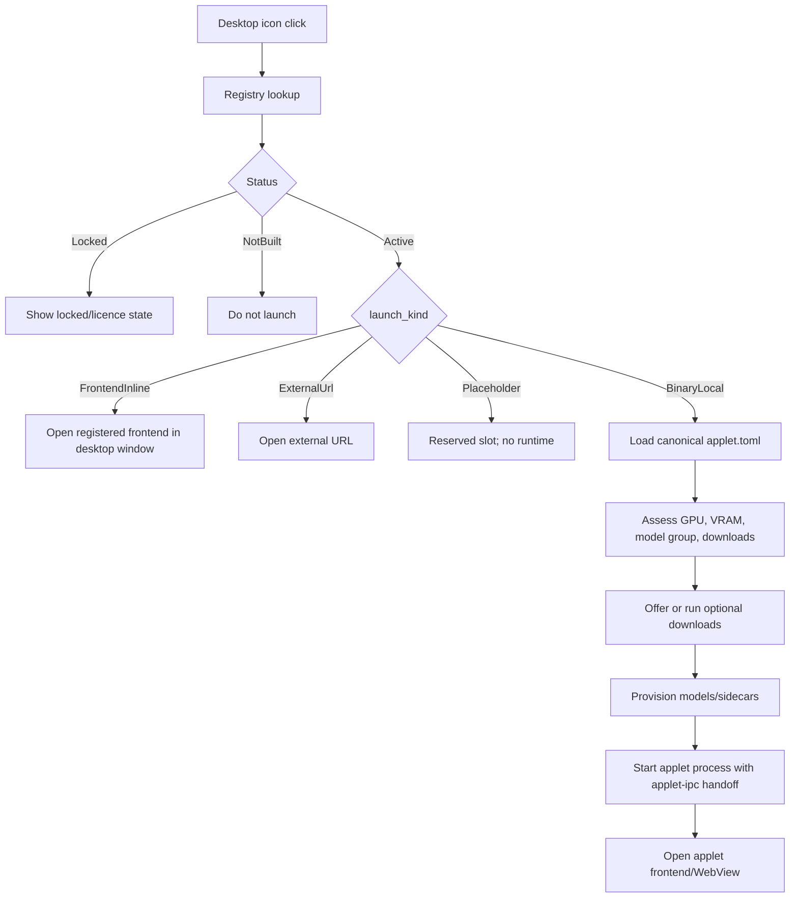

# Everywear Platform Launcher Architecture

**Status:** working contract, 2026-05-23  
**Scope:** free Everywear platform shell, before paid applet/tier surfaces.

## Superseding Naming Canon

User-facing Everywear surfaces should label the local MAIT/agent applet as **My Mait**.

- `kasai` remains the internal applet id, binary/runtime name, IPC source name, and historical code namespace.
- Kasai remains acceptable when referring to Sean's personal instance or the in-game identity.
- Launcher cards, desktop icons, settings, docs aimed at users, and applet titles should say **My Mait**.
- Technical docs may write `My Mait (kasai runtime)` where the distinction matters.

## Platform Position

Everywear's base platform is the free local desktop shell. It owns identity, hardware awareness, app discovery, shared storage, social surfaces, and the launch runtime. Paid applets and paid tiers should sit on top of that foundation; they should not redefine how the desktop, manifest schema, storage, themes, or VRAM assessment work.

The base platform includes:

- Rust-backed GPU and VRAM assessment.
- Desktop creation and launcher registry.
- Vault infrastructure and file registration.
- User profile and auth hydration.
- Platform settings for app/download/model locations.
- File footprint reporting for installed and optional app assets.
- Projected storage/VRAM footprint based on selected model group and hardware capabilities.
- EWDS themes, wallpapers, desktop clock, and shell chrome.
- Tauri desktop/browser runtime ready to open inline applets, WebViews, and external social links.
- Social interface surfaces, including Discourse/community integration.
- Free built-in applets/surfaces: Layer U OSINT powered by Project SON, educational Loom, a local music player, a full browser, and optional downloads.

## Applet Categories

The launcher treats applet category separately from availability.

| Category | Registry `launch_kind` | Behavior |
|---|---|---|
| Local binary applet | `BinaryLocal` | Shell runs a backend binary, assesses models/VRAM, provisions assets, then hands off through IPC/WebView. |
| Inline frontend applet | `FrontendInline` | Shell opens a registered React/Vite frontend inside the desktop. No applet backend process is required. |
| External URL applet | `ExternalUrl` | Shell opens a web destination such as S3 Studio or Strands Nation. |
| Placeholder | `Placeholder` | Reserved product slot; hidden/not built until real content and metadata exist. |

`status` answers "is this available/licensed/built?" while `launch_kind` answers "which route does the shell take?"

## Manifest Contract

`model_manager::AppletManifest` is the canonical `applet.toml` schema. A real applet manifest should parse through that type, even when the applet is frontend-only and has no local models.

Because applets can download very large artifacts, the manifest is also a verification boundary. Production remote downloads must be pinned to an expected artifact and integrity checked before the shell trusts them. This is especially important for:

- Loom educational/RAG packs, which may download hundreds of gigabytes of ZIM files.
- My Mait local agent packs, powered by the internal `kasai` runtime, which may download up to roughly 30 GB of GGUFs.
- 1magen image packs, which may download up to roughly 12 GB of GGUFs.
- Gener8 and future applet upgrade packs, where paid tiers may unlock additional model files.

The canonical download path is: manifest declares `hf_repo`, `hf_file`, local `filename`, `size_bytes`, and `sha256`; the launcher converts that into `ModelInfo`; `model-manager` downloads to a partial file, verifies SHA256, then renames the artifact into place.

The canonical "use this path" path follows the same trust boundary. If a user points Everywear at an existing model location or adopts a model from another tool, `model-manager` must verify the source file against the pinned SHA256 before symlinking, copying, or moving it into the Everywear model vault. Pinned files already in the vault are re-verified when the resolver marks them available. Missing SHA256 should be treated as draft-only metadata, not production-ready download or adoption metadata.

Frontend-only applets use:

```toml
model_groups = []

[applet]
id = "example"
name = "Example"
version = "0.1.0"
description = "Frontend-only applet"
icon = "example"
transport = "web"
frontend_port = 3000

[engine]
type = "none"
backend = "none"
server_binary = ""

[requirements]
```

This keeps model assessment, model requirement discovery, and launch checks from treating free platform applets as malformed applets.

## Launch Pipeline



## Free Platform Surfaces

The following should remain platform-owned and free:

- Desktop shell, clock, wallpapers, and EWDS theme selection.
- Profile panel and base auth/session display.
- Vault panel and shared vault registration APIs.
- GPU/VRAM assessment panel.
- Platform settings for local folders and download locations.
- Applet/library footprint panel showing installed size and projected optional downloads.
- Community/social entry points and Discourse bridge.
- Built-in educational Loom surface.
- Layer U OSINT platform surface powered by the Project SON source service.
- Built-in music player for local/library playback.
- Full browser surface for the agentic OS runtime.

Applet pay tiers should unlock applet-specific engines, model packs, quality levels, quotas, and advanced workflows. They should not be required for the platform to explain the machine, show the desktop, manage files, or connect the user to the Everywear community.

## Next Architecture Work

1. Add a platform settings panel section for app/model/download directories and footprint totals.
2. Add projected footprint data to model assessment results.
3. Harden Layer U OSINT as a `FrontendInline` platform surface and decide whether Project SON becomes a managed sidecar.
4. Decide whether external web products remain `ExternalUrl` entries or become local wrappers with offline/cache behavior.
5. Add production manifest validation that rejects remote downloadable models without pinned SHA256 once exact artifacts are selected.
