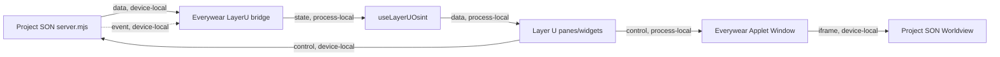

# Layer U OSINT Widget Architecture

**Status:** architecture pass, 2026-05-23  
**Source repo:** `C:\Users\MAG MSI\Project SON`  
**Target repo:** `C:\Users\MAG MSI\Project Everywear`  
**Purpose:** split S.O.N / Project SON capabilities into context-sized Everywear Layer U OSINT panes and windows.

## Codification Rule

Every Layer U OSINT module derived from Project SON must fit the context-bounded development protocol:

- One module unit must be understandable with its wiki entry, source, tests, and adjacent interfaces loaded together.
- Target source size: under 400 lines per TS/JS module where practical.
- Hard warning threshold: 1,000 lines for UI modules, because widgets require visual QA and state reasoning.
- Hard failure threshold: 4,000 lines or any file that mixes fetch, transform, render, DOM wiring, and lifecycle control.
- Every cross-module connection must declare pipe category and locality.

Project SON currently has one oversized multipurpose client module:

| File | Lines | Problem |
|---|---:|---|
| `dashboard/public/worldview/app.js` | 2091 | Owns Cesium boot, layers, local geolocation, posture, bands, feeds, SSE, controls, clock, inspector, and render recovery. |
| `server.mjs` | 694 | Still reasonable by line count, but owns server boot, routes, LLM chat, sweep lifecycle, SSE, alerts, and synthesis handoff. |
| `dashboard/public/worldview/chat.js` | 233 | Good widget-sized module. |
| `dashboard/public/worldview/layers.js` | 131 | Good widget-sized module. |

The Everywear integration should not port `app.js` as one large React module. It should host the existing worldview as a compact applet window first, then break the surrounding frame functionality into small panes/widgets.

## Product Shape

Layer U OSINT becomes a free platform surface inside Everywear, powered by the Project SON source service:

- **Compact applet window** hosts the worldview map, flights, and map layers.
- **Companion panes** inside that window show RSS/news, served YouTube/video links, source posture, and sweep controls.
- **Desktop widgets** may show only ambient status/brief slices; the main globe is not a wallpaper widget.
- **Full S.O.N Globe** can still open as a larger operator window for Cesium-heavy operation.
- **Layer U public primitives** stay behind the same source contract, but their identity and visibility rules remain separate from the operator-only S.O.N console.

Layer U panes should be small, skinnable, and EWDS-native. The map itself can be an iframe/app-window host because Cesium remains owned by Project SON until it is refactored.

## Applet Window And Pane Contract

Every Layer U pane uses one shell-owned frame/window surface, not a custom frame per source.

```ts
export type LayerUSurfaceSize = 'tile' | 'wide' | 'tall' | 'large';
export type LayerUSurfaceMode = 'desktop' | 'applet' | 'expanded' | 'full';

export interface LayerUSurfaceDefinition {
  id: string;
  title: string;
  source: LayerUDataSlice;
  defaultSize: LayerUSurfaceSize;
  minRefreshSeconds: number;
  capabilities: LayerUSurfaceCapability[];
}
```

Required frame behavior:

- Pin/unpin only for ambient desktop summaries.
- Collapse to header.
- Expand into Everywear window.
- Open source details in full S.O.N Globe window.
- Surface state option uses the existing widget surface setting: `cut`, `soft`, or `glass`.
- Oblique cut-corner style remains the EWDS default.

## Source Contract

Everywear should talk to Project SON through a stable local bridge first, not by scraping existing DOM.

```ts
export interface LayerUSnapshot {
  health: LayerURuntimeHealth;
  posture: LayerUPosture;
  feeds: LayerUFeedItem[];
  sourceRollup: LayerUSourceRollup;
  data: Record<string, unknown> | null;
  updatedAt: string;
}
```

Initial bridge can call:

- `GET http://127.0.0.1:3117/api/health`
- `GET http://127.0.0.1:3117/api/data`
- `POST http://127.0.0.1:3117/api/sweep`
- `POST http://127.0.0.1:3117/api/chat`
- `GET http://127.0.0.1:3117/events`

Later, SON should expose a widget-specific endpoint:

- `GET /api/widgets/summary`
- `GET /api/widgets/:id`
- `POST /api/widgets/:id/action`

That avoids shipping large sweep payloads to every small pane.

## Pipe Diagram



Online dependencies remain inside Project SON source adapters. Everywear panes should see them only as source-health states: `ok`, `key-gated`, `degraded`, or `failed`.

## Surface Split

| SON pane/function | Everywear surface | Desktop size | Window behavior | Keep worldview dependency? |
|---|---|---:|---|---|
| Posture strip: direction, delta, VIX, Brent, WTI | `LayerUPosturePane` | optional summary | Shows posture/delta explanation | No |
| Brief band | `LayerUBriefPane` | optional summary | Shows full briefing with source links | No |
| News/RSS band | `LayerUFeedsPane` | no | Feed list, filters by region/source | Optional |
| Served YouTube/videos | `LayerUFeedsPane` | no | Video/link list beside feeds | Optional |
| Local Context band | `LayerULocalContextPane` | no | Requests location, shows nearby items | Optional |
| Source Health band | `LayerUSourceHealthPane` | optional tile | Per-source timing/key/error matrix | No |
| Markets band | `LayerUMarketsPane` | optional tile | Commodity, crypto, macro table | No |
| Satellites band | `LayerUSatellitesPane` | no | Pass schedule and ground station selection | Optional |
| Alerts band | `LayerUAlertsPane` | optional tile | Critical list and alert history | Optional |
| CCTV band | `LayerUCctvPane` | no | Camera inspector and playable source | Optional |
| Layer list | `LayerULayersPane` | no | Toggles layers in the active worldview window | Yes |
| Consigliere chat | `LayerUConsiglierePane` | no | Chat window, shares history with Project SON | No |
| Shader/basemap controls | `LayerUGlobeControlsPane` | no | Controls active worldview window only | Yes |
| Cesium Globe, flights, map layers | `LayerUWorldviewWindow` | no | Compact applet window first, full operator window later | Yes |

## Proposed Module Layout

Keep the first Everywear implementation small and local to the shell:

```text
platform/everywear-os/src/son/
  README.md
  types.ts
  sonBridge.ts
  useLayerUOsint.ts
  LayerUOsintApplet.tsx
  panes/
    LayerUPosturePane.tsx
    LayerUFeedsPane.tsx
    LayerUSourceHealthPane.tsx
    LayerUConsiglierePane.tsx
  styles/
    layer-u-osint.css
```

Context-sized responsibilities:

| Module | Target lines | Purpose |
|---|---:|---|
| `types.ts` | 150 | Data contracts only. No fetch, no React. |
| `sonBridge.ts` | 250 | Device-local HTTP/SSE bridge to Project SON. |
| `useLayerUOsint.ts` | 250 | Snapshot cache, status, polling, and derived slices. |
| `LayerUOsintApplet.tsx` | 300 | Hosts worldview iframe plus compact panes; no raw fetch. |
| Each pane `.tsx` | 150-250 | One data slice, one render path, no fetch. |
| `layer-u-osint.css` | 350 | Window and pane layout using EWDS tokens. |

Do not let a pane import `fetch`, parse the whole `/api/data` payload itself, or know about unrelated panes. It receives a typed slice from the Layer U hook/store.

## Project SON Refactor Targets

The source repo should also be decomposed before deeper integration:

```text
dashboard/public/worldview/
  app.js                    # boot only, target under 350 lines
  state.js                  # shared runtime state
  globe/
    viewer.js               # Cesium boot
    basemaps.js
    geolocation.js
    occlusion.js
    search.js
  layers/
    registry.js
    renderAir.js
    renderMaritime.js
    renderNews.js
    renderCctv.js
    renderChokepoints.js
  bands/
    bandRenderer.js
    briefBand.js
    newsBand.js
    localContextBand.js
    sourceHealthBand.js
    marketsBand.js
    satellitesBand.js
    alertsBand.js
    cctvBand.js
  panels/
    inspector.js
    feedRail.js
    postureStrip.js
  chat.js
  layers.js
```

The first refactor should extract the pure render helpers before moving Cesium code. That is lower risk because band rendering already reads a single `d` snapshot and writes to known DOM ids.

## First Implementation Order

1. **Create `sonBridge`, `LayerUSnapshot` types, and `useLayerUOsint` in Everywear.** Read `/api/health` and `/api/data`; tolerate service offline.
2. **Add `LayerUOsintApplet`.** Host the existing Project SON worldview as a compact applet window.
3. **Add source-health, posture, and feeds panes.** These make the window useful without moving Cesium.
4. **Add `LayerUConsiglierePane`.** Start with chat health and one prompt box, then wire `/api/chat`.
5. **Split panes out of `LayerUOsintApplet` as they grow.** Keep each pane context-window-sized.
6. **Only then add CCTV, local context, and layer controls.** Those have permissions, media, or coupled Globe behavior.

## Architectural Decision

Project SON should enter Everywear as **Layer U OSINT: a compact applet window plus optional ambient desktop summaries**, not as one monolithic applet and not as a map wallpaper widget. The Cesium worldview, flights, and map layers remain inside the Layer U OSINT window. RSS/news and served video feeds become companion panes.

This preserves the functionality of SON window frames while making the pieces maintainable by local agents and small context windows.
