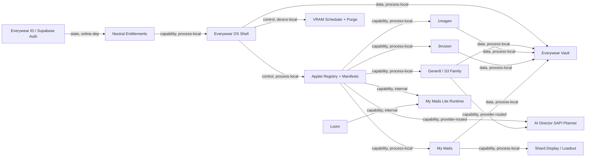

# Everywear Identity, Vault, Entitlement, and Engine Migration Map

Timestamp: 2026-05-28 19:45 SGT  
Location: C:\Users\MAG MSI\Project Everywear

## Required Sources Read

- `C:\Users\MAG MSI\Project Everywear\WIKI.md`
- `C:\Users\MAG MSI\Project Mymory\everywear\2026-05-28_ewds_v2_applet_surface_pass.md`
- `C:\Users\MAG MSI\Project Mymory\mymaits\_moc_mymaits.md`
- `C:\Users\MAG MSI\Project Mymory\mymaits\shards\2026-05-27_my_maits_look_shards_naming_canon.md`
- `C:\Users\MAG MSI\Project S3StudioGener8\S3 STUDIO\supabase\migrations`
- `C:\Users\MAG MSI\Project S3StudioGener8\S3 STUDIO\supabase\functions`

Supabase implementation file:

- `C:\Users\MAG MSI\Project Everywear\supabase\migrations\20260528140643_everywear_identity_entitlement_vault_contract.sql`
- Live remote project: `ykqdsihnzroglepoxwcj` (`Everywear`, Tokyo / `ap-northeast-1`).

## Neutral Supabase Schema

The schema is product-neutral. S3 Studio / Gener8 remains the first paid production line, but it no longer owns the account root.

Core tables:

- `profiles`: canonical `everywear.id` profile anchored to `auth.users`.
- `external_identities`: linked providers such as Steam, Lemon Squeezy, Xendit, wallet, Discord, Google, GitHub.
- `products`: product catalog for platform, applets, bundles, add-ons, games, capabilities.
- `plans`: billing plans, including free, one-time, subscription, add-on, microtransaction.
- `plan_entitlements`: plan-to-capability map.
- `provider_subscriptions`: provider commerce records from Lemon Squeezy, Xendit, Steam, demo, admin override.
- `user_entitlements`: resolved grants used by shell/app/applet gates.
- `devices`: signed-in device records for local install binding and revocation.
- `webhook_events`: provider event dedupe, ported from the S3 proven pattern.
- `steam_link_events`: audit trail for Steam link, license, refund, revocation, and conflicts.
- `vaults`: user-owned vault installations.
- `vault_records`: owner-bound asset records with provenance and SHA-256 identity.
- `vault_acl`: future share grants; owner-only today.

Security contract:

- Every exposed table has RLS enabled.
- Client-readable catalog tables have explicit grants.
- Owner data tables use `auth.uid()` against `user_id`, `owner_user_id`, or owned vault joins.
- Authorization never depends on `raw_user_meta_data`.
- SHA-256 never grants access. It is only dedupe, identity, and tamper evidence.
- Webhooks and admin tools write entitlements through service-role paths, not user-mutable metadata.
- Everywear's 30-day signed-in-device window is shell/client cookie policy
  (`REMEMBER_AUTH_DAYS = 30`). Supabase stays responsible for auth, JWT
  refresh, profiles, and entitlements.

## S3 Supabase Migration Map

Migrate as neutral Everywear contracts:

- `0001_profiles.sql`: keep profile shape, handle discipline, signup trigger, `auth.users` FK.
- `0002_subscriptions.sql`: migrate the idea of provider-written commerce rows and an `active_tier` compatibility RPC, but convert durable authority to `products`, `plans`, `provider_subscriptions`, and `user_entitlements`.
- `0003_reserved_usernames.sql`, `0005_handle_min_length.sql`, `0006_substring_gate.sql`, `0007_placeholder_handle_fix.sql`, `0008_trigger_search_path_fix.sql`: keep handle safety as identity namespace hardening.
- `0014_avatars_storage.sql`: keep avatar bucket path pattern and own-folder storage RLS.
- `0015_admin_override_provider.sql`, `0016_subscriptions_provider_sub_id_unique.sql`, `0017_webhook_events_dedupe.sql`: keep provider override/dedupe/idempotency pattern.
- `lemon-squeezy-webhook`: migrate HMAC verification, event dispatch, dedupe-first behavior, provider row upsert, and session refresh invalidation.

Do not migrate directly:

- `0009_songs.sql`, `0010_playlists.sql`: recast as `vault_records` and local Vault graph, not global identity schema.
- `0011_bug_reports.sql`: the table is superseded by email relay and should stay product-specific.
- `tauri-updater`: useful pattern, but a shared Everywear updater contract is separate from identity/vault/entitlement.
- S3 plan labels as global truth: `gener8`, `gener8_pro`, and `creator_studio` remain compatibility tier outputs, not the final entitlement model.

## Entitlement Taxonomy

Product catalog seeded by the migration. Each row carries `tier_floor`,
`runtime_class`, `sku_policy`, and `catalog_status` so applets, bundles,
hidden runtimes, add-ons, and platform-launched games are classified
explicitly rather than inferred from the old S3 tier ladder:

- `everywear_base`: platform, free.
- `gener8`: applet, included from Gener8 4ever onwards.
- `gener8_4ever`: S3 family bundle, paid one-time.
- `gener8_pro`: S3 family bundle, paid subscription.
- `creator_studio`: S3 family bundle, deferred paid subscription.
- `1magen`: applet, bundle-included, not a separate launch SKU.
- `3nvizen`: applet, bundle-included, not a separate launch SKU.
- `vid`: applet, included from Gener8 4ever onwards. Basic Vid Studio launch
  is the single applet target; `vid_pro` is an internal feature entitlement
  unlocked at Gener8 Pro and inherited by Creator Studio.
- `ai_director`: Creator Studio capability using provider-routed SAPI.
- `daw_pro`: Creator Studio capability inside Gener8.
- `loom`: free Everywear applet.
- `character_studio`: free Everywear applet.
- `mymaits_lite_runtime`: hidden internal runtime used by Loom Teacher Agent. It is not a standalone launcher, not a chat surface, and not a separate SKU.
- `mymaits_full`: paid My Maits standalone hub/add-on with microtransaction support.
- `strands_game`: platform-launched game, not a near-term applet port.
- `mymaids_game`: platform-launched future game, naming still needs final public lock.

Naming correction, 2026-05-28 SGT: product-facing language is `My Maits` and
`My Maits Lite`. Do not use `Kasai` in product copy. `My Maits Lite` is a
headless thinking layer embedded by Loom as the free teacher agent. It cannot
be launched or chatted with by itself. AI Director uses a provider-routed SAPI
adapter for planner reasoning through LM Studio, Ollama, or external
OpenAI-compatible API providers. The shim reports whether a plan came from
`sapi` or `fallback`; fallback remains available when no provider is reachable.
The internal My Maits link is a planned provider and must stay marked
unplumbed until that runtime bridge exists.

Plan grants:

- `free_everywear`: grants Loom, Loom Teacher Agent, Character Studio, and the hidden My Maits Lite runtime needed by Loom.
- `gener8_4ever`: grants Gener8, 1magen, and basic Vid Studio (`vid`).
- `gener8_pro`: grants Gener8, Gener8 pro model pack, 1magen, and Vid Pro
  internal features (`vid_pro`).
- `creator_studio`: inherits lower-tier Gener8/Vid capability and adds 3nvizen,
  AI Director, the SAPI-targeted planner entitlement, and DAW Pro.
- `mymaits_full_addon`: grants the standalone My Maits hub and microtransaction support.

Compatibility:

- Existing shell/frontend can keep calling `active_tier(user_id)` temporarily.
- New work should consume `user_entitlements` / `entitlement_flags()` and feature keys.
- `LicenceTier` remains a compatibility ladder until shell/app/applet code is moved to capability checks.

## Steam Link and Revocation Flow

Steam is a linked provider, not the root account.

Flow:

1. User signs into Everywear with `everywear.id`.
2. User starts Steam link in shell.
3. Steam identity proof is verified server-side.
4. `external_identities(provider='steam')` is inserted or moved from `pending` to `linked`.
5. Steam licenses are resolved into `provider_subscriptions(provider='steam')`.
6. Commerce state writes resolved grants to `user_entitlements`.
7. Shell refreshes entitlements and sends signed tier/capability sync to applets.

Revocation:

- User unlink sets `external_identities.status='revoked_by_user'`, stamps `revoked_at`, and records `steam_link_events.event_type='user_unlinked'`.
- Steam refund/revocation sets provider subscription `status='refunded'` or `revoked`, stamps `revoked_at`, writes `steam_link_events`, and moves derived `user_entitlements` to `revoked` or `refunded`.
- If a Steam license appears before `everywear.id` linking, hold it as pending provider commerce. Do not create a canonical account from Steam alone.

## Vault Bootstrap and Record Security

First-run bootstrap:

- Create one `vaults` row for the signed-in user and installation.
- Create local folders from Project Mymory-compatible taxonomy only.
- Seed schema, default folder names, applet manifests, and explicit sample content only.
- Never seed Sean's current Project Mymory dogfood entries.

Record contract:

- `owner_user_id`: signed-in Everywear user.
- `vault_id`: specific vault installation.
- `source_app_id`: applet or platform source, for example `gener8`, `1magen`, `mymaits`.
- `asset_kind`: typed taxonomy, for example `gener8_song`, `style_patch`, `visual_patch`, `look_shard`, `skill_shard`, `knowledge_shard`, `conversation`.
- `storage_mode`: `linked_original`, `symlink`, `junction`, `vault_copy`, `vault_move`, or `remote_reference`.
- `original_path`: source path for linked/reference imports.
- `vault_path`: owned path when the vault copied or moved the asset.
- `sha256`: content identity/dedupe/tamper evidence.
- `acl_scope`: owner now, future household/team/public sample.
- `provenance` and `metadata`: generation parameters, model IDs, import source, source app, and taxonomy data.

RLS:

- `vaults` and `vault_records` are owner-only.
- Insert/update requires the row owner and referenced vault owner to match `auth.uid()`.
- Hash collisions do not authorize reads. Only owner/ACL policies do.

## Applet Engine-Port Dependency Graph



Engine-port order:

1. Identity/entitlement schema.
2. Vault bootstrap and owner-bound record schema.
3. S3 family engine wiring.
4. 1magen and 3nvizen bundle entitlement gates.
5. My Maits standalone hub, My Maits Lite embedded runtime contract, and shard display contract.
6. Live platform QA.

## Worker-Agent Split

Recommended lanes:

- Agent A, Supabase donor and schema: owns S3 migration/function map, neutral schema, local Supabase checks.
- Agent B, Everywear shell contracts: owns `AuthContext`, `auth.rs`, `engine_router`, `registry`, entitlement compatibility.
- Agent C, Vault and My Maits contract: owns Vault schema/types, My Maits standalone hub, My Maits Lite embedded runtime naming, and shard display contract.
- Agent D, build/QA matrix: owns package metadata map, valid build commands, blocked applets, live platform QA script.

Write boundaries for implementation:

- Supabase schema: `supabase/`, applied live to project `ykqdsihnzroglepoxwcj`
  via the Supabase connector. Local Docker reset remains optional and blocked
  on this host because Docker is unavailable.
- Shell entitlement wiring: `platform/everywear-os/src/shell/AuthContext.tsx`, `platform/everywear-os/src-tauri/src/auth.rs`, `engine_router.rs`, `registry.rs`.
- Vault wiring: `packages/transport/src/vault.ts`, `crates/vault/src/schema.rs`, `platform/everywear-os/src-tauri/src/vault_commands.rs`.
- My Maits / My Maits Lite contract: `applets/kasai/applet.toml`, `platform/everywear-os/src-tauri/src/registry.rs`, My Maits UI files, Loom teacher-agent hooks, and shard display files.
- AI Director planner contract: SAPI provider routing for LM Studio, Ollama, and external API providers is wired in the Gener8 shim with explicit fallback reporting. Internal My Maits provider link remains planned and unplumbed.

## Verification Commands

Supabase:

```powershell
supabase migration list --linked --workdir "C:\Users\MAG MSI\Project Everywear"
supabase db lint --linked --workdir "C:\Users\MAG MSI\Project Everywear"
supabase db push --dry-run --linked --workdir "C:\Users\MAG MSI\Project Everywear"
supabase db lint --db-url "<percent-encoded-postgres-url>" --workdir "C:\Users\MAG MSI\Project Everywear"
```

Local Docker-only checks, optional on this host:

```powershell
supabase db reset --workdir "C:\Users\MAG MSI\Project Everywear"
supabase migration list --local --workdir "C:\Users\MAG MSI\Project Everywear"
```

Required shell build:

```powershell
npm run build --workspace everywear-os
```

Valid applet builds:

```powershell
npm run build --workspace onemagen
npm run build --workspace @everywear/gener8-web
npm run build --workspace kasai-applet
npm run build --workspace @everywear/loom
npm run build --workspace @everywear/character-studio
npm run build --workspace @everywear/vid-web
```

Valid Rust checks:

```powershell
cargo check -p everywear-os
cargo check -p onemagen
cargo check -p gener8
cargo check -p everywear-3nvizen
cargo check -p everywear-kasai
```

Release binary build:

```powershell
cargo build --release -p everywear-os -p gener8 -p onemagen -p everywear-3nvizen -p everywear-kasai
```

2026-05-28 SGT receipt: the release binary build passed with existing warning
debt only. Outputs verified under
`C:\Users\MAG MSI\Project Everywear\target\release`: `everywear-os.exe`,
`gener8.exe`, `onemagen.exe`, `everywear-3nvizen.exe`, and
`everywear-kasai.exe`. No installer bundle directory was produced by this
command, and no live sidecar/model/visual QA was run.

Known applet build gaps:

- `applets/3nvizen`: frontend package metadata now exists and
  `npm run build --workspace @everywear/3nvizen` passes. Live sidecar boot,
  video generation, and Vault registration are still unproven.
- `applets/s3studio`: placeholder, no package metadata.
- `applets/mymories`: placeholder, no package metadata.
- `applets/strands-game`: placeholder, no package metadata.
