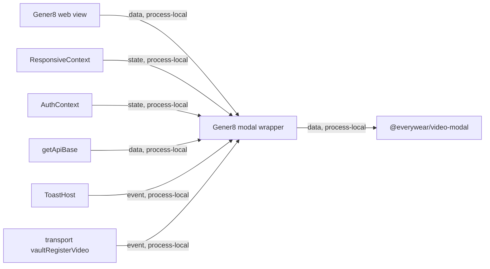

# Gener8 Video Modal Module Contract

### gener8-web-modal (`applets/gener8/web/src/components/VideoGeneratorModal.tsx`)

**Purpose**: Thin Gener8 wrapper around `@everywear/video-modal` that injects Gener8 app context without forking modal behavior.

**Budget**: 68 lines. Under the code ceiling.

**Pipes in**:

- Gener8 `VidView` or other web surfaces -> `VideoGeneratorModal` component (`data, process-local`)
- Gener8 responsive context -> `isMobile` (`state, process-local`)
- Gener8 auth context -> `tier`, `hasTier('vid_pro')`, trial state, watermark state (`state, process-local`)
- Gener8 API service -> `apiBase` (`data, process-local`)
- Gener8 toast host -> `onToast` bridge (`event, process-local`)
- Gener8 transport -> `registerVideo` callback (`event, process-local`)

**Pipes out**:

- Wrapper -> `@everywear/video-modal` shared modal (`data, process-local`)
- Shared modal -> Gener8 vault registration callback when export completes (`event, process-local`)
- Shared modal -> Gener8 toast host through `onToast` (`event, process-local`)

**Public API**:

- `VideoGeneratorModal: React.FC<VideoGeneratorModalProps>`

**State**: Does not own local React state beyond hooks. It adapts Gener8 providers and passes them into the package modal.

**Behavior contract**: Wrapper preserves the old Gener8 modal semantics by passing `proEnabled={hasTier('vid_pro')}`, `isTrialActive`, `canRemoveWatermark`, `apiBase={getApiBase()}`, `gpuSaveMode="save-from-encoder"`, `registerCpuExport={false}`, `vaultTag="gener8"`, and rich Vault registration metadata with `sourceAppId/appletScope="gener8"` and `libraryScope="videos"`.

**Tests**: No dedicated tests. Verified by `npm run build --workspace @everywear/gener8-web` during the 2026-06-05 Phase B parity pass.

**Pipe diagram**:

**Last verified**: 2026-06-05, Codex VideoGeneratorModal Phase B package parity pass.
