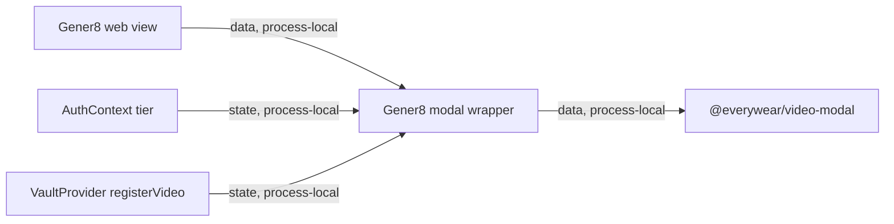

# Gener8 Video Modal Module Contract

### gener8-web-modal (`applets/gener8/web/src/components/VideoGeneratorModal.tsx`)

**Purpose**: Thin Gener8 wrapper around `@everywear/video-modal` that injects auth tier and vault video registration behaviour.

**Budget**: 25 lines. Under the code ceiling.

**Pipes in**:

- Gener8 `VidView` or other web surfaces -> `VideoGeneratorModal` component (`data, process-local`)
- Gener8 auth context -> `tier` (`state, process-local`)
- Gener8 vault context -> `registerVideo` callback (`state, process-local`)

**Pipes out**:

- Wrapper -> `@everywear/video-modal` shared modal (`data, process-local`)
- Shared modal -> Gener8 vault registration callback when export completes (`event, process-local`)

**Public API**:

- `VideoGeneratorModal: React.FC<VideoGeneratorModalProps>`

**State**: Does not own local React state beyond hooks. It reads auth/vault providers and passes their outputs into the package modal.

**Tests**: No dedicated tests. Verified by `npm run build --workspace applets/gener8/web` during the modularisation pass per `CONTEXT.md`.

**Pipe diagram**:

**Last verified**: 2026-05-22, Codex post-modularisation repair pass.
