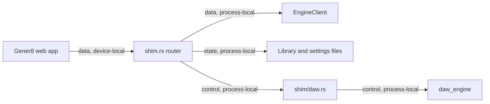

# Gener8 Shim Module Contract

### gener8-shim (`applets/gener8/src-tauri/src/shim.rs`, `shim/daw.rs`)

**Purpose**: Serve the local HTTP compatibility API used by the Gener8 web app, including engine, inference, audio, library, playlist, settings, shell, director, video, diagnostics, and DAW routes.

**Budget**: `shim.rs` 1,009 lines, `shim/daw.rs` 754 lines. The current split is under the code ceiling, but `shim.rs` still contains several route groups planned for later extraction.

**Pipes in**:

- Gener8 web app -> local shim HTTP routes (`data, device-local`)
- Shell/app process launch -> `boot()` (`control, device-local`)

**Pipes out**:

- Shim routes -> `EngineClient`, `DawEngine`, library storage, settings storage, AI director, whisper alignment, video save/list files (`data, process-local`)
- DAW routes -> `daw_engine` project, playback, mixer, waveform modules (`control, process-local`)
- Shell-open/reveal compatibility routes -> shell-facing payloads or local no-op responses (`control, device-local`)

**Public API**:

- `ShimState`
- `boot(port, state) -> Result<(), Box<dyn std::error::Error + Send + Sync>>`

`shim/daw.rs` exports its route group to `shim.rs` via `daw::routes()`; individual DAW handlers remain private to the module.

**State**:

- `ShimState` owns applet-local engine client, DAW state, storage roots, and shared services needed by the HTTP API.
- DAW state is guarded through shared `Arc<ShimState>` route state.

**Tests**: No dedicated unit tests. Verified by `cargo check -p gener8` during the modularisation pass per `CONTEXT.md`. HTTP route behaviour still needs targeted integration tests.

**Pipe diagram**:

**Last verified**: 2026-05-22, Codex post-modularisation repair pass.

**Backlog**: Extract remaining route groups from `shim.rs`: engine, inference, audio, library, playlists, director, video, settings, shell, and diagnostics.
