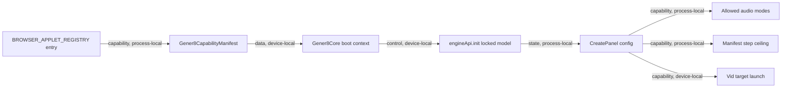

# Gener8 Split Architecture Module Contract

### gener8-split-launch-contract (`platform/everywear-os/src/lib/transport.ts`, `applets/gener8/web/src/shell/applets/Gener8Core.tsx`, `applets/gener8/web/src/components/CreatePanel.tsx`)

**Purpose**: Split Gener8 into two launcher applets, `gener8-4ever` and
`gener8-pro`, while keeping one shared Gener8 web bundle and one live create
surface.

**Budget**: Architecture page only. The affected live modules are known soft
target breaches. `CreatePanel.tsx` must be edited in focused passes after this
contract, never forked into two large copies.

**Pipes in**:

- Shell launcher registry -> Gener8 capability manifest (`capability, process-local`)
- Shell launch payload -> Gener8 bundle boot (`data, device-local`)
- Shell auth context -> settled entitlement state (`state, process-local`)
- Gener8 bundle boot -> engine model initialisation (`control, device-local`)

**Pipes out**:

- Manifest `lockedModel` -> boot-time forced model load (`control, device-local`)
- Manifest `allowedAudioModes` -> CreatePanel audio-mode rail (`capability, process-local`)
- Manifest `stepCeiling` -> Advanced inference-step clamp (`capability, process-local`)
- Manifest `vaultScope` -> Vault access policy (`capability, process-local`)
- Manifest `vidTarget` -> Create to Vid handoff (`capability, device-local`)

**Public API**:

```ts
type Gener8LockedModel = 'song' | 'pro';
type Gener8AudioMode = 'song' | 'reference' | 'cover';

interface Gener8CapabilityManifest {
  lockedModel: Gener8LockedModel;
  allowedAudioModes: Gener8AudioMode[];
  stepCeiling: number;
  vaultScope: 'full';
  vidTarget: 'vid';
}
```

Shell registry entries must provide the manifest fields for:

| Applet id | Product role | lockedModel | allowedAudioModes | stepCeiling | vaultScope | vidTarget |
|---|---|---|---|---:|---|---|
| `gener8-4ever` | Text-to-song | `song` | `['song']` | `12` | `full` | `vid` |
| `gener8-pro` | Reference and Cover | `pro` | `['reference', 'cover']` | `75` | `full` | `vid` |

Keep a legacy `gener8` launch alias to `gener8-4ever` so old launch paths do
not fall through to 404 or a missing applet.

**State**:

- The shell owns launcher applet identity and entitlement resolution.
- The Gener8 bundle owns the live React tree but must treat the launch manifest
  as the source of allowed behaviour.
- Rust-to-TypeScript Tauri invoke structs must use one casing convention.
  Preferred rule: Rust structs that cross to TS carry
  `#[serde(rename_all = "camelCase")]`; TS reads camelCase. If the browser
  fallback is handwritten, it must use the same camelCase field names.
- Casing mismatch failure is silent. TS reads such as `allowedAudioModes`,
  `lockedModel`, and `vidTarget` return `undefined` rather than throwing. If
  code falls back to permissive defaults, a launcher-locked applet can degrade
  into legacy behaviour. This is how `gener8-4ever` showed Reference/Cover:
  the manifest object arrived, but its fields were unreadable by the TS side.
- Tell: browser works but desktop/Tauri does not, or vice versa, suspect the
  serde casing boundary first. The browser registry uses hand-authored JS
  fields; the Rust registry only diverges at serialization.
- Fail closed: a launcher-locked applet with a null, empty, or unreadable
  manifest must surface a visible bug state. It must not fall back to
  `['song', 'reference', 'cover']` or any other permissive legacy default.
- `CreatePanel.tsx` remains the live create surface. It must read applet config
  from boot context instead of reading hardcoded product identity from local
  tier checks.
- `applets/gener8/web/src/pro/` remains the Pro-only internal capability module.
  It must not expose a `song` mode once `gener8-pro` is manifest-gated.

**Target launcher applets**:

`gener8-4ever`:

- Locked to the song model path.
- Does not render any model selector or model switch button.
- Renders Song only; Reference and Cover buttons do not exist in this applet.
- Full Vault access.
- Create handoff opens standard Vid Studio through `vidTarget = 'vid'`.
- Does not mount `ProAudioModePanel`.

`gener8-pro`:

- Locked to the Pro capability model path.
- Does not render any model selector or model switch button.
- Mounts `ProAudioModePanel` after shell and applet entitlements are settled.
- Renders Reference and Cover only.
- Removes the Pro module's dead `song` state path.
- Create handoff opens the single Vid Studio applet through `vidTarget = 'vid'`.
  Vid Pro is an internal feature entitlement of that applet, unlocked at
  Gener8 Pro and inherited by Creator Studio.

**Clamp rule**:

The advanced Inference Steps ceiling must be declarative:

```text
ceiling = launchManifest.stepCeiling for launchManifest.lockedModel
```

The clamp must not read from the old model toggle, and it must not infer Pro
capability from `mode === 'reference' || mode === 'cover'`. Audio mode can
choose payload shape, but it is not the source of the model ceiling.

**Pipe diagram**:



**Dead-code quarantine**:

`applets/gener8/web/src/views/CreateView.tsx` is not imported by the active
Gener8 applet path. It still contains a static step clamp and must be moved to
`docs/_archive/_pending_delete_<date>/` in P7 instead of reused for either
launcher applet.

**Prerequisites**:

- Shell `platform/everywear-os/src/shell/AuthContext.tsx` has a shell-wide
  `entitlementResolved` flag as of P1 on 2026-05-30. The shell keeps a
  provisional signed-in user behind loading state until `active_tier()`,
  `entitlement_flags()`, local compatibility expansion, owner bypass, and
  `push_auth_state` have completed or failed closed to a resolved fallback.
- The existing applet-local `entitlementResolved` in Gener8 only fixes the
  in-tree Pro panel bounce. It does not settle shell launcher gates.

**Tests**:

- P0 is docs only. No build expected.
- P1 passed `npm run build --workspace everywear-os`,
  `npm run build --workspace @everywear/transport`,
  `npm run build --workspace @everywear/gener8-web`, and
  `cargo check -p everywear-os`.
- P2 registered `gener8-4ever` and `gener8-pro` in both the browser fallback
  registry and the Rust shell registry, added manifest fields, added the
  legacy `gener8` -> `gener8-4ever` alias, and wired launcher icon/router
  surfaces. Verified 2026-05-30 with `npm run build --workspace everywear-os`
  and `cargo check -p everywear-os`.
- P3 wired the launch manifest into the shared Gener8 bundle through
  `AppletViewRouter` -> `Gener8ShellApp` -> `LaunchManifestProvider` ->
  `Gener8Core` -> `CreatePanel`. Launcher-locked applets now force-load the
  resolved model at boot and hide the in-frame selector/swap controls. Verified
  2026-05-30 with `npm run build --workspace everywear-os` and
  `npm run build --workspace @everywear/gener8-web`.
- P3i repaired the shared-player regression after the Pro extraction. The
  active Vault Library route (`views/LibraryView.tsx`) now consumes
  `useShellAudio()` directly and converts Vault audio rows into `Song` queue
  entries with `vaultFileUrl()`. The fix is isolated to the Library invocation
  boundary; no asset-protocol or Vault scope change was required.
- P4 wired `CreatePanel.tsx` Pro audio module mounting to
  `launchManifest.allowedAudioModes`, so `gener8-4ever` stays Song-only even
  for a Pro user, and kept the song-to-Vid intent pointed at the single `vid`
  applet target. Verified
  2026-05-30 with `npm run build --workspace @everywear/gener8-web` and
  `npm run build --workspace everywear-os`. Runtime shell launch succeeded;
  Sean's manual smoke then found Reference/Cover still visible in
  `gener8-4ever`. Root cause: the first P4 pass only read camelCase manifest
  fields, but the Tauri registry supplies snake_case. Follow-up patch normalized
  both field shapes in `AppletViewRouter.tsx`, made `CreatePanel` fail closed
  for launcher-locked applets with unreadable manifests, and put
  `#[serde(rename_all = "camelCase")]` on the Rust `AppletEntry` boundary.
  Rebuilt with
  `npm run build --workspace everywear-os` and
  `npm run build --workspace @everywear/gener8-web`; Sean runtime-smoked
  2026-05-30: `gener8-4ever` no longer shows Reference/Cover, while
  `gener8-pro` still does.
- P5 removed the internal `song` state from the Pro audio module. The
  `ProAudioMode` reducer now only accepts `reference` and `cover`, the
  Pro panel remains mounted only through `launchManifest.allowedAudioModes`,
  and the Create -> Vid handoff continues to use the single Vid Studio applet
  target (`vid`) for both Gener8 applets.
  Vid Pro capabilities are internal to Vid Studio and unlock at Gener8 Pro.
  Verified 2026-05-30 with
  `npm run build --workspace @everywear/gener8-web` and
  `npm run build --workspace everywear-os`; runtime Pro Vid handoff smoke
  still owed.
- P6 made the advanced Inference Steps ceiling declarative. `CreatePanel`
  clamps both UI state and generated payload steps through
  `launchManifest.stepCeiling` when `launchManifest.lockedModel` is present;
  the capability preset now comes from the loaded model kind, not from
  `mode === 'reference' || mode === 'cover'`. Verified 2026-05-30 with
  `npm run build --workspace @everywear/gener8-web` and
  `npm run build --workspace everywear-os`; Sean runtime-smoked
  `gener8-4ever` and confirmed the 12-step ceiling holds. `gener8-pro`
  75-step ceiling smoke is still owed. Same smoke surfaced an intermittent
  generated-track playback bug: the third generated 4ever track did not play;
  parked for a later player investigation, not part of P6/P7.
- P7 fixed Gener8-to-Vid handoff without introducing a `vid_pro` applet.
  `Gener8Core` now queues the `open-with-song` intent, emits
  `everywear:launch-applet` for the single `vid` applet, and `ShellLayout`
  mounts that applet while only renaming its launcher label to `Vid Studio Pro`
  when the user has `vid_pro`. `VidApp` keeps a pending song id until the song
  store hydrates, so the visualizer selects the source song after launch.
  Verified 2026-05-30 with `npm run build --workspace @everywear/gener8-web`,
  `npm run build --workspace everywear-os`, `cargo build -p everywear-os`,
  and runtime smoke from `gener8-4ever` camera handoff into Vid Studio Pro.
  Screenshot proof:
  `C:\Users\MAG MSI\Project Everywear\screenshots\p7-vid-tier-smoke-final-gener8-handoff-selected-2026-05-30.png`.
- P7 dead-code quarantine also landed. `views/CreateView.tsx` was confirmed
  import-free, moved to
  `docs/_archive/_pending_delete_2026-05-30/applets_gener8_web_src_views_CreateView.tsx`,
  and the stale `SongStoreContext` consumer comment now names the live
  `CreatePanel`, `LibraryView`, and `VidApp` consumers.
- P8 Vid Pro capability smoke landed under the corrected single-`vid` canon.
  The live shell-mounted Vid path gates watermark removal through
  `canRemoveWatermark` / `hasTier('vid_pro')` and gates export presets through
  `isVidPro`. Owner runtime smoke opened `Vid Studio Pro`, selected a song,
  and showed Pro-tagged multi-resolution export presets in the Render tab.
  Standard Vid base-state smoke still requires a real `gener8` / Gener8 4ever
  account because the owner account inherits `vid_pro`, and fresh signups
  currently receive demo access that behaves like a Gener8 Pro-level test
  grant. Older lower-tier accounts cannot be reused safely without their
  password or a password-reset flow; Supabase Auth stores password hashes, not
  recoverable plaintext.
- P9 fixed S3 folder-panel occlusion. The expanded folder tray now has an
  explicit stacking layer, near-opaque raised background, backdrop blur, and
  isolated stacking context. Runtime window capture verified the left desktop
  icon column no longer bleeds through the tray. Screenshot proof:
  `C:\Users\MAG MSI\Project Everywear\screenshots\p9-folder-occlusion-window-smoke-child-2026-05-30.png`.
- DAW follow-up note, 2026-05-30: Sean observed DAW stem extraction blocking on
  "Pro Model required/not recognised" while logged in as Creator Pro / Creator
  Studio level. Creator inherits Gener8 Pro, so the session should satisfy
  `hasTier('gener8_pro')`. Initial source read says DAW launch is Creator
  Studio-gated in `DawCore`, but stem extraction separately depends on
  `StemStudio` recognising the Pro model pack via
  `/api/engine/pack-status?pack_id=pro_base`. The Gener8 shim route list in
  this pass did not show `pack-status` or `install-pack`, and the manifest
  upgrade pack id is `better_models`. Next fix should verify the route/alias
  contract before changing auth gates.

**Last verified**: 2026-05-30, Codex P7 runtime smoke against the Everywear OS
desktop build, live Vid handoff path, Vid Studio Pro Render tab, and S3 folder
tray window capture.
