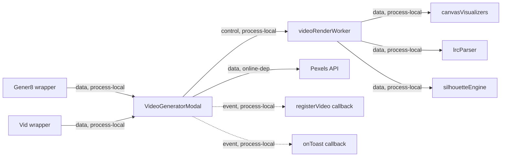

# Video Modal Package Module Contract

### pkg-video-modal (`packages/video-modal/`)

**Purpose**: Provide the shared Gener8/Vid video generation modal, render worker, lyric parsing utilities, silhouette renderer, and canvas visualizer primitives.

**Budget**: Key files: `components/VideoGeneratorModal.tsx` 3,115 lines, `components/videoModalTypes.ts` 117 lines, `components/videoModalDefaults.ts` 66 lines, `components/videoModalPresets.tsx` 58 lines, `workers/videoRenderWorker.ts` 973 lines, `render/canvasVisualizers.ts` 814 lines, `lib/silhouetteEngine.ts` 372 lines, `lib/lrcParser.ts` 128 lines. The package is under the module-unit budget when loaded as the shared video surface, but `VideoGeneratorModal.tsx` remains the watch-list file and render/export plus panel extraction should continue before major feature additions.

**Pipes in**:

- Gener8 modal wrapper -> shared `VideoGeneratorModal` (`data, process-local`)
- Vid modal wrapper -> shared `VideoGeneratorModal` (`data, process-local`)
- Browser worker messages -> `videoRenderWorker.ts` (`data, process-local`)

**Pipes out**:

- Shared modal -> render worker for export rendering (`control, process-local`)
- Shared modal -> Pexels media search/download APIs when used (`data, online-dep`)
- Shared modal -> applet-provided `registerVideo` callback when supplied (`event, process-local`)
- Shared modal -> applet-provided toast callback when supplied (`event, process-local`)
- Render worker -> canvas visualizers, lyric parser, silhouette engine (`data, process-local`)

**Public API**:

- `VideoGeneratorModal`
- `VideoModalSong`
- `VideoModalTier`
- `VaultVideoRegistration`
- `videoModalTypes.ts` owns shared public types and internal modal state shapes
- `videoModalDefaults.ts` owns fallback app services, render presets, and default state config
- `videoModalPresets.tsx` owns visualizer preset card metadata/icons
- `parseLrc(raw) -> LrcLine[]`
- `getCurrentLine(parsed, currentTime) -> string`
- `srtToLrc(srt) -> string`
- `naiveLrcFromLyrics(lyrics, durationSec) -> string`
- `drawS3Hero(...)`
- `drawDJAtWork(...)`

Additional internal render exports live in `render/canvasVisualizers.ts` and are used by the modal/worker.

`VideoGeneratorModal` also accepts applet-parity hooks for `isMobile`, `proEnabled`, `isTrialActive`, `canRemoveWatermark`, `apiBase`, `gpuSaveMode`, `registerCpuExport`, and `onToast`. Defaults preserve the existing package/Vid path when wrappers do not pass them.

**State**:

- The React modal owns video configuration UI state and export state.
- `silhouetteEngine.ts` owns module-level silhouette smoothing/cache state, resettable through `resetSilhouetteEngine()`.
- Render worker owns per-render job state while active.

**Tests**: No dedicated unit tests. Verified by `npm run build` for the affected workspaces during the modularisation pass per `CONTEXT.md`.

**Pipe diagram**:

**Last verified**: 2026-06-06, Codex partial modal split and worker dedup audit pass.

**Backlog**: Continue splitting `components/VideoGeneratorModal.tsx` before adding more S3-derived modal features. Completed first seam: pure types, presets, and default config. Remaining seams: render/export hooks, media controls, text/subtitle controls, settings panels, and worker protocol helpers.

**Worker dedup note 2026-06-06**: `packages/video-modal/src/components/VideoGeneratorModal.tsx` imports the package worker through `../workers/videoRenderWorker.ts?worker`; no Gener8 applet import references `applets/gener8/web/src/workers/videoRenderWorker.ts`. The applet-local worker copy differs only by its old `// @ts-nocheck` line and is now marked deprecated in place. Do not delete it until a shell-launched video export parity smoke proves the package worker path end-to-end.
