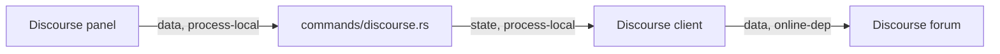

# Shell Discourse Commands Module Contract

### shell-commands-discourse (`platform/everywear-os/src-tauri/src/commands/discourse.rs`)

**Purpose**: Bridge shell frontend forum features to the Discourse client while keeping OAuth/session state inside `AppState`.

**Budget**: 131 lines. Under the code ceiling.

**Pipes in**:

- Discourse panel invokes -> Discourse command handlers (`data, process-local`)

**Pipes out**:

- Commands -> `AppState.discourse` client (`state, process-local`)
- Discourse client -> configured forum HTTP endpoints (`data, online-dep`)

**Public API**:

- `discourse_oauth_url(state) -> Result<String, String>`
- `discourse_complete_oauth(code, state) -> Result<discourse::DiscourseUser, String>`
- `discourse_user(state) -> Result<Option<discourse::DiscourseUser>, String>`
- `discourse_latest(limit, state) -> Result<Vec<discourse::DiscoursePost>, String>`
- `discourse_get_topics(category_id, state) -> Result<Vec<discourse::DiscourseTopic>, String>`
- `discourse_read_post(post_id, state) -> Result<discourse::DiscoursePost, String>`
- `discourse_create_post(topic_id, raw, state) -> Result<discourse::DiscoursePost, String>`
- `discourse_refresh_token(state) -> Result<(), String>`
- `discourse_disconnect(state) -> Result<(), String>`

**State**: Reads and mutates Discourse session/token state through `AppState.discourse`.

**Tests**: No dedicated unit tests. Covered by `cargo check -p everywear-os` during modularisation verification. Online endpoint behaviour still needs real forum verification.

**Pipe diagram**:

**Last verified**: 2026-05-22, Codex post-modularisation repair pass.
