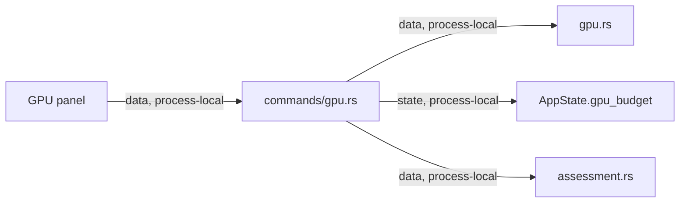

# Shell GPU Commands Module Contract

### shell-commands-gpu (`platform/everywear-os/src-tauri/src/commands/gpu.rs`)

**Purpose**: Expose GPU status, VRAM polling, backend selection, VRAM tier, and model assessment data to the shell frontend.

**Budget**: 46 lines. Under the code ceiling.

**Pipes in**:

- Frontend Tauri invokes from GPU/status panels -> GPU command handlers (`data, process-local`)

**Pipes out**:

- Commands -> `gpu.rs` GPU detection and VRAM sampling (`data, process-local`)
- Commands -> `assessment.rs` model assessment list (`data, process-local`)
- Commands -> `AppState.gpu_budget` for VRAM tier (`state, process-local`)

**Public API**:

- `get_gpu_status(state) -> Result<gpu::GpuStatus, String>`
- `poll_vram(state) -> Result<gpu::VramSample, String>`
- `get_compute_backend(state) -> Result<gpu::ComputeBackend, String>`
- `get_vram_tier(state) -> Result<gpu::VramTier, String>`
- `list_model_assessments() -> Result<Vec<assessment::ModelAssessment>, String>`

**State**: Reads the shell `AppState.gpu_budget`; GPU polling refreshes hardware status through the shell GPU module.

**Tests**: No dedicated unit tests. Covered by `cargo check -p everywear-os` during modularisation verification.

**Pipe diagram**:

**Last verified**: 2026-05-22, Codex post-modularisation repair pass.
