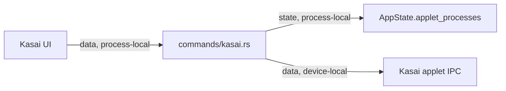

# Shell Kasai Commands Module Contract

### shell-commands-kasai (`platform/everywear-os/src-tauri/src/commands/kasai.rs`)

**Purpose**: Bridge shell chat/status/tool-call UI to the Kasai applet process and expose slot health.

**Budget**: 408 lines. Under the code ceiling.

**Pipes in**:

- Shell Kasai UI invokes -> Kasai command handlers (`data, process-local`)

**Pipes out**:

- Commands -> `AppState.applet_processes["kasai"]` (`control, device-local`)
- Commands -> Kasai applet IPC client (`data, device-local`)
- Commands -> `AppState.gpu_budget` and loaded process map for status (`state, process-local`)

**Public API**:

- `KasaiChatResponse`
- `ChatStatus`
- `KasaiSlotInfo`
- `KasaiStatusResponse`
- `kasai_forward_chat(message, state) -> Result<KasaiChatResponse, String>`
- `kasai_get_status(state) -> Result<KasaiStatusResponse, String>`
- `kasai_get_tool_calls(state) -> Result<Vec<serde_json::Value>, String>`

**State**: Reads shell active applet/process state and forwards chat/tool requests to the Kasai applet when running.

**Tests**: No dedicated unit tests. Covered by `cargo check -p everywear-os` during modularisation verification. End-to-end chat forwarding still requires a running Kasai applet.

**Pipe diagram**:

**Last verified**: 2026-05-22, Codex post-modularisation repair pass.
