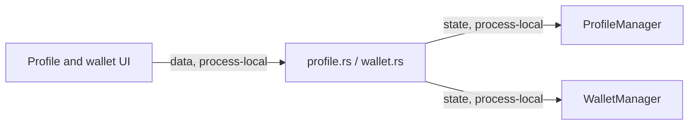

# Shell Profile And Wallet Commands Module Contract

### shell-commands-profile-wallet (`platform/everywear-os/src-tauri/src/commands/profile.rs`, `wallet.rs`)

**Purpose**: Expose shell profile preferences and local wallet/session identity commands to the frontend.

**Budget**: `profile.rs` 37 lines, `wallet.rs` 33 lines. Under the code ceiling.

**Pipes in**:

- Frontend profile/settings invokes -> profile command handlers (`data, process-local`)
- Frontend wallet/auth invokes -> wallet command handlers (`data, process-local`)

**Pipes out**:

- `profile.rs` commands -> `AppState.profile` (`state, process-local`)
- `wallet.rs` commands -> `AppState.wallet` (`state, process-local`)

**Public API**:

- `get_profile(state) -> Result<profile::UserProfile, String>`
- `update_profile(profile, state) -> Result<profile::UserProfile, String>`
- `set_preference(key, value, state) -> Result<(), String>`
- `get_preference(key, state) -> Result<Option<String>, String>`
- `wallet_generate(state) -> Result<wallet::WalletInfo, String>`
- `wallet_info(state) -> Result<Option<wallet::WalletInfo>, String>`
- `wallet_transactions(state) -> Result<Vec<wallet::WalletTransaction>, String>`
- `wallet_disconnect(state) -> Result<(), String>`

**State**: Mutates profile preferences and wallet identity through `AppState` mutex-owned managers.

**Tests**: No dedicated unit tests. Covered by `cargo check -p everywear-os` during modularisation verification.

**Pipe diagram**:

**Last verified**: 2026-05-22, Codex post-modularisation repair pass.
