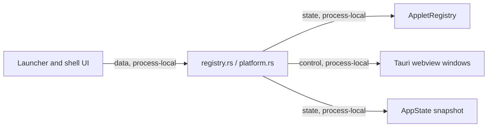

# Shell Registry And Platform Commands Module Contract

### shell-commands-registry-platform (`platform/everywear-os/src-tauri/src/commands/registry.rs`, `platform.rs`)

**Purpose**: Expose applet registry lookup/window focus helpers and a platform status snapshot to the frontend.

**Budget**: `registry.rs` 49 lines, `platform.rs` 68 lines. Under the code ceiling.

**Pipes in**:

- Launcher and desktop invokes -> registry command handlers (`data, process-local`)
- Shell diagnostics/status UI -> `platform_status` (`data, process-local`)

**Pipes out**:

- Registry commands -> `AppState.registry` and Tauri webview window handles (`state, process-local`)
- Platform command -> `AppState` summary fields (`state, process-local`)

**Public API**:

- `list_applets(state) -> Result<Vec<registry::AppletManifest>, String>`
- `get_applet(applet_id, state) -> Result<Option<registry::AppletManifest>, String>`
- `focus_applet_window(label, app) -> Result<bool, String>`
- `is_applet_window_open(label, app) -> Result<bool, String>`
- `platform_status(state) -> Result<serde_json::Value, String>`

**State**: Reads registry manifests, active applet state, GPU budget, and currently managed applet processes.

**Tests**: No dedicated unit tests. Covered by `cargo check -p everywear-os` during modularisation verification.

**Pipe diagram**:

**Last verified**: 2026-05-22, Codex post-modularisation repair pass.
