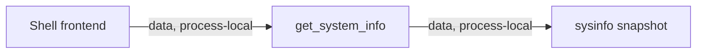

# Shell System Commands Module Contract

### shell-commands-system (`platform/everywear-os/src-tauri/src/commands/system.rs`)

**Purpose**: Expose host system metadata to the shell frontend.

**Budget**: 47 lines. Under the code ceiling.

**Pipes in**:

- Frontend Tauri invoke -> `get_system_info` (`data, process-local`)

**Pipes out**:

- Command handler -> `sysinfo::System` and OS constants (`data, process-local`)

**Public API**:

- `SystemInfoReport`
- `get_system_info() -> Result<SystemInfoReport, String>`

**State**: None. The command reads a fresh `sysinfo::System` snapshot.

**Tests**: No dedicated unit tests. Covered by `cargo check -p everywear-os` during modularisation verification.

**Pipe diagram**:

**Last verified**: 2026-05-22, Codex post-modularisation repair pass.
