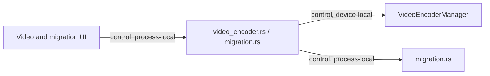

# Shell Video Encoder And Migration Commands Module Contract

### shell-commands-video-migration (`platform/everywear-os/src-tauri/src/commands/video_encoder.rs`, `migration.rs`)

**Purpose**: Expose shared video encoder sidecar leasing and phase 5 migration helpers to the frontend.

**Budget**: `video_encoder.rs` 30 lines, `migration.rs` 13 lines. Under the code ceiling.

**Pipes in**:

- Video-capable applet/frontend invokes -> video encoder commands (`control, process-local`)
- Migration tooling invokes -> migration command handlers (`control, process-local`)

**Pipes out**:

- Video encoder commands -> `AppState.video_encoder` manager (`control, device-local`)
- Migration commands -> `migration.rs` planning/execution helpers (`control, process-local`)

**Public API**:

- `request_video_encoder(state) -> Result<u16, String>`
- `release_video_encoder(state) -> Result<(), String>`
- `video_encoder_health() -> Result<video_encoder::EncoderHealth, String>`
- `get_phase5_migration_plan() -> Result<migration::MigrationPlan, String>`
- `run_phase5_migration(dry_run) -> Result<migration::MigrationReport, String>`

**State**: Video encoder command state lives in `AppState.video_encoder`. Migration commands are stateless apart from filesystem effects in the migration helper.

**Tests**: No dedicated unit tests. Covered by `cargo check -p everywear-os` during modularisation verification.

**Pipe diagram**:

**Last verified**: 2026-05-22, Codex post-modularisation repair pass.
