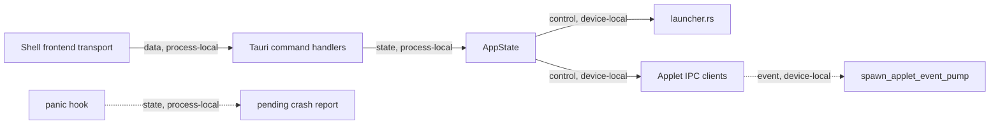

# Shell Core Module Contract

### shell-core (`platform/everywear-os/src-tauri/src/lib.rs`, `state.rs`, `crash.rs`)

**Purpose**: Own the Tauri shell bootstrap, shared `AppState`, applet lifecycle orchestration, engine routing, vault auto-registration, and pending crash report handling.

**Budget**: `lib.rs` 1,358 lines, `state.rs` 28 lines, `crash.rs` 78 lines. Post-split code is under the 16k-token code ceiling.

**Pipes in**:

- `ShellLayout.tsx` and frontend transport -> shell Tauri commands (`data, process-local`)
- Applet manifests -> shell applet resolver and launch path (`capability, process-local`)
- Applet IPC event receivers -> `spawn_applet_event_pump` (`event, device-local`)

**Pipes out**:

- Shell commands -> `profile`, `wallet`, `gpu`, `registry`, `migration`, `video_encoder`, `discourse`, `vault_commands`, `model_commands` (`data, process-local`)
- Applet launch path -> `launcher::launch_binary_applet` and webview creation (`control, device-local`)
- Engine routing -> applet IPC clients and registry payloads (`control, device-local`)
- Panic hook -> pending crash report JSON under app data (`state, process-local`)

**Public API**:

- `state::AppState`
- `crash::PendingCrashReport`
- `crash::install_panic_crash_report_hook()`
- `crash::take_pending_crash_report() -> Result<Option<PendingCrashReport>, String>`
- `run()`

**State**:

- `AppState` owns profile, wallet, applet registry, active applet id, GPU budget, applet processes, loaded engine registry, video encoder manager, Discourse client, and migrated data root.
- `crash.rs` owns the pending crash report file and installs the process panic hook.

**Tests**: No dedicated unit tests. Verified by `cargo check -p everywear-os` during the modularisation pass per `CONTEXT.md`.

**Pipe diagram**:

**Last verified**: 2026-05-22, Codex post-modularisation repair pass.
