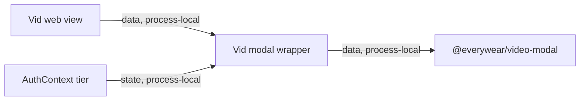

# Vid Video Modal Module Contract

### vid-web-modal (`applets/vid/web/src/components/VideoGeneratorModal.tsx`)

**Purpose**: Thin Vid wrapper around `@everywear/video-modal` that injects auth tier while leaving vault registration disabled.

**Budget**: 23 lines. Under the code ceiling.

**Pipes in**:

- Vid web surfaces -> `VideoGeneratorModal` component (`data, process-local`)
- Vid auth context -> `tier` (`state, process-local`)

**Pipes out**:

- Wrapper -> `@everywear/video-modal` shared modal (`data, process-local`)

**Public API**:

- `VideoGeneratorModal: React.FC<VideoGeneratorModalProps>`

**State**: Does not own local React state beyond reading auth tier.

**Tests**: No dedicated tests. Verified by `npm run build --workspace applets/vid/web` during the modularisation pass per `CONTEXT.md`.

**Pipe diagram**:

**Last verified**: 2026-05-22, Codex post-modularisation repair pass.
