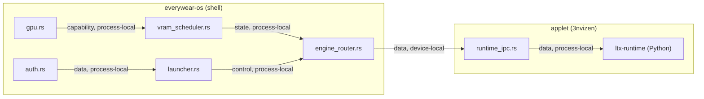
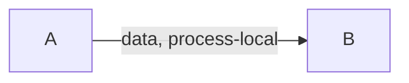
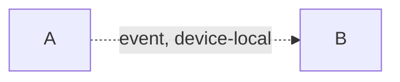
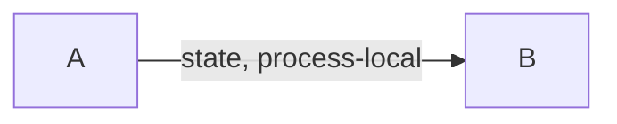
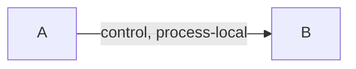
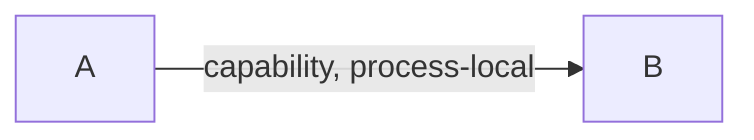
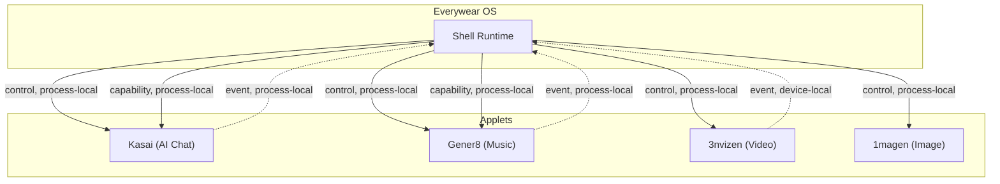

# Pipe Diagram Examples

Reference examples for Mermaid pipe diagrams following the context-protocol conventions.

## Basic Flow (Single Product)

## Pipe Category Quick Reference

### Data pipe (stateless transform)

Test at boundaries. Input X always produces output Y.

### Event pipe (fire-and-forget)

Dashed = async. Emitter doesn't wait. Verify listener is registered.

### State pipe (shared mutable)

Most dangerous. No silent mutation. Changes require audit trail.

### Control pipe (lifecycle/orchestration)

Order matters. Sequence violations cause hard failures.

### Capability pipe (negotiation)

Declare need, declare ability, resolve at runtime. Test all resolution paths.

## Multi-Product Flow

## Annotation Conventions

- **Solid line** (`-->`): synchronous, caller blocks
- **Dashed line** (`-.->` or `-.->`): asynchronous, fire-and-forget
- **Edge label**: always `"category, locality"`
- **Subgraphs**: group by crate, applet, or deployment boundary
- **Online dependencies**: use red or bold styling to flag: `A -- "data, online-dep" --> B`
